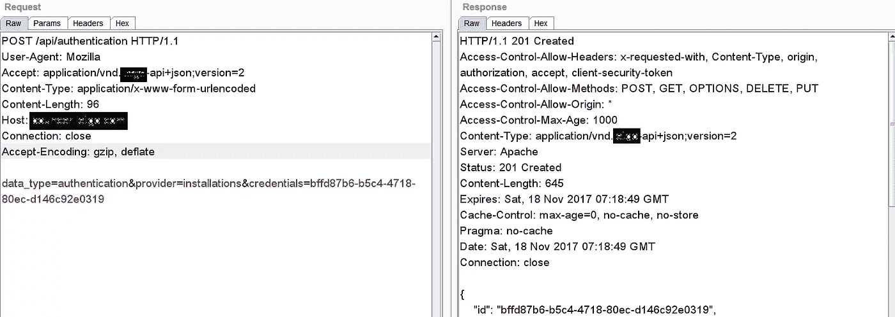
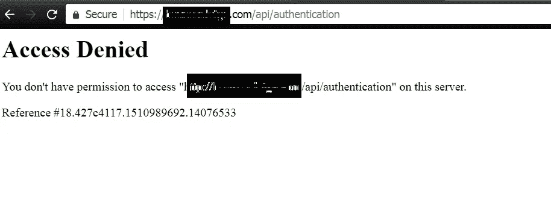
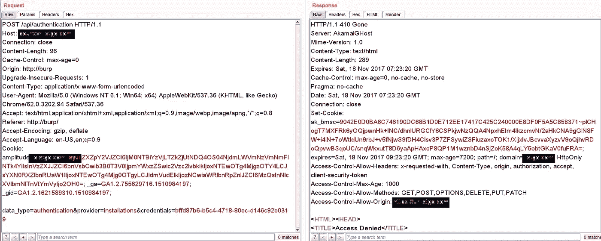
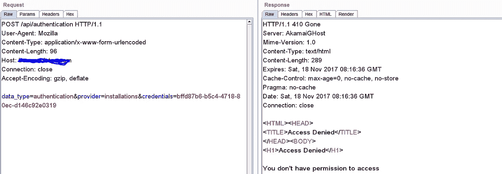
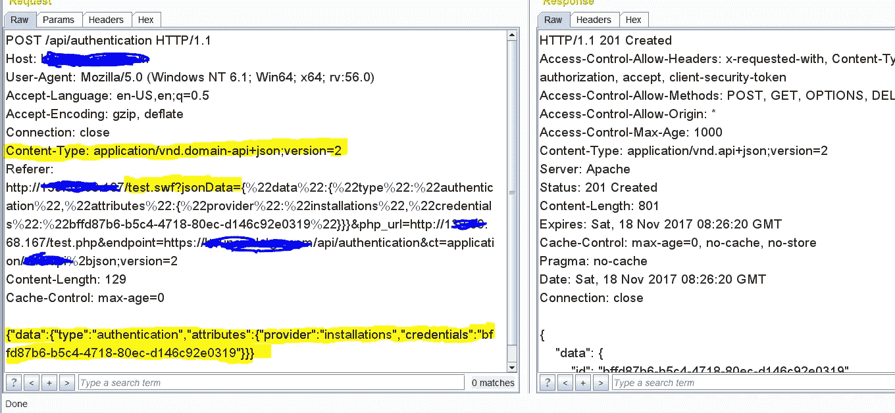

# 与 CSRF 进行内容协商

> 原文：<https://infosecwriteups.com/content-negotiation-with-csrf-969e639d6a1a?source=collection_archive---------0----------------------->

在这篇博文中，我想分享一些执行 CSRF 请求时的内容协商行为。

*在对应用 API 进行渗透测试时，我遇到了* ***内容协商行为。*** *用我遇到的一个活生生的例子来讨论一下吧。*

*以下是服务器使用 ClientID 发出的请求，以便生成身份验证令牌。因为它无法抵御 CSRF 攻击。*

来源请求

*   我一看到上面的请求，就赶紧试了试 CSRF。

应最初要求，CSRF

*   *~下面是回应~。哎呀*

CSRF 最初的要求没有奏效

*   ***我们来检查一下打嗝代理历史有什么问题！！！！***

*   *请求看起来不错，应该在服务器端执行，在尝试改变参数和一些事情后，我知道他们只接受* ***有限类型的内容。***
*   *我们先看* ***原要求再看*** *。通过看* ***接受:application/vnd . domain-API+JSON；很明显*** *服务器期待来自客户端的 JSON 数据以便验证。*

***~让我们制作案例以便检查是否绕过:***

1.  ***尝试通过删除请求头:***

*接受:application/vnd . domain-API+JSON；版本=2*

*   *在用****application/x-www-form-urlencoded****内容强制服务器上，我们可以看到 Application 正在严格验证内容为 JSON。*

*因此，很明显，除了请求头(Accept: JSON)给出的内容之外，我们不能尝试任何其他内容*

*   *我们也可以使用* ***基于 SWF 的 JSON CSRF 漏洞(又名。307 绝招)*** *这里恶搞一下* ***内容类型:application/vnd . domain-API+JSON；版本=2，*** *但是* *在这种情况下就不起作用了。因为我们的请求数据不在 JSON 中。*

**2。*将请求数据转换为 JSON 数据:***

*   *现在我们可以选择将请求数据转换成 JSON，以便与* ***基于 SWF 的 JSON CSRF 利用一起使用。***

*所以我需要把下面的请求数据转换成 JSON :*

***data _ type = authentic ation&provider = installations&credentials = bffd 87 b 6-b5 C4–4718–80ec-d 146 c 92 e 0319***

到

***{ "数据":{ "类型":"认证"，"属性":{ "提供者":"安装"，"凭证":" bffd 87 b 6-b5 C4–4718–80ec-d 146 c92e 0319 " } }***

成功！

*~继续努力*