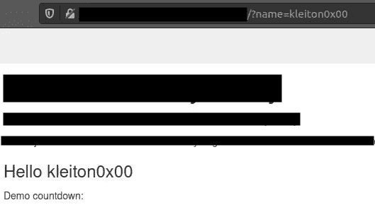
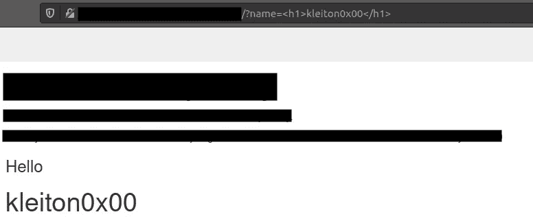
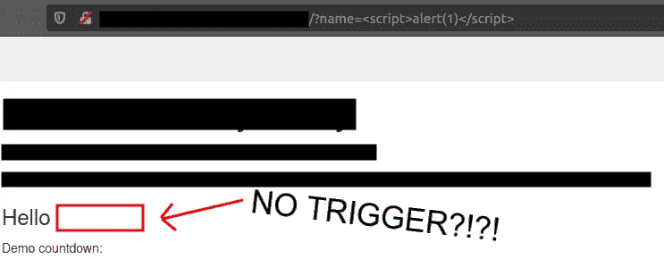
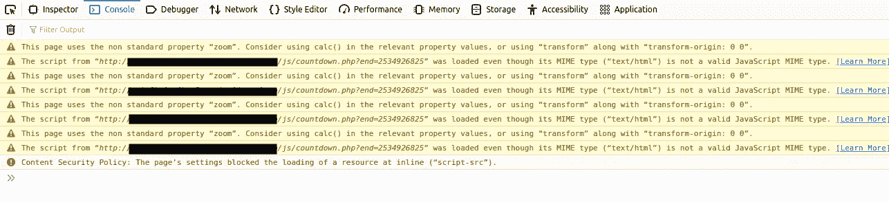
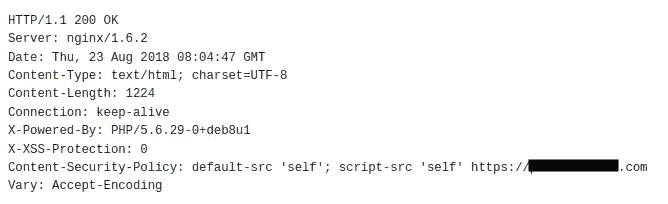
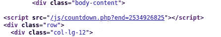
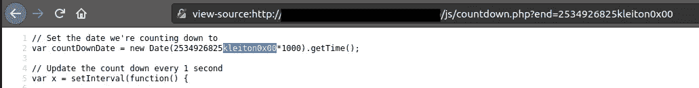
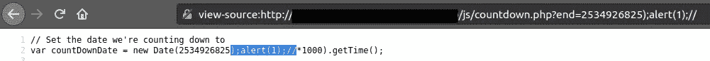
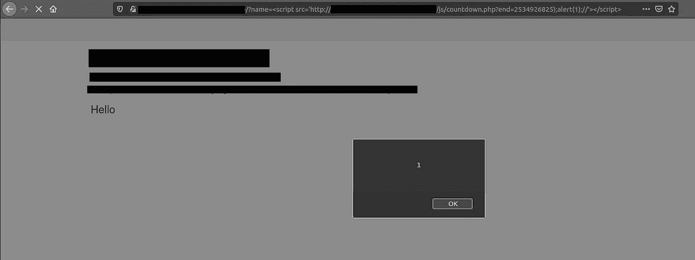

# 使用 MIME 嗅探绕过内容安全策略来执行 XSS

> 原文：<https://infosecwriteups.com/content-security-policy-bypass-to-perform-xss-3c8dd0d40c2e?source=collection_archive---------0----------------------->

# 摘要

最近，我执行了一个跨站点脚本漏洞，但是一个正常的 XSS 有效载荷没有被触发，因为 CSP 阻止了外部 Javascript 代码(XSS)的执行。通过在另一个端点发现另一个 XSS 漏洞(再次被 CSP 阻止)，我设法将它们结合在一起，导致绕过 CSP，并使用 MIME 嗅探触发 XSS

# 寻找第一个 XSS

下图显示了位于索引中的端点，其参数值被反映到网站正文中。

让我们尝试输入一个简单的 HTML 有效载荷，而不是给出一个字符串值。我输入了**<h1>kleiton 0x 00</h1>**，希望有效载荷能够反映并显示为一个 HTML 内容。

酷，我们有 HTML 注入，所以让我们尝试利用它到 XSS。这次我进入了有史以来最简单的 XSS 有效载荷: **<脚本>警戒(1)</脚本>**

如果 WAF 没有过滤或阻止任何东西，我们将能够触发 Javascript 负载。

等等？！它被成功地注入了网站，但没有警报 1？！？！？查看页面源代码，没有过滤或删除任何内容。

# 检测 CSP

在浏览浏览器(控制台)的开发工具时，我意识到这个脚本被**内容安全政策**屏蔽了。

这是什么意思？内容安全策略(CSP)是一个附加的安全层，特别是阻止外部代码注入网站的 HTTP 头。通常，一个实现良好的 CSP 只允许内部实体(域本身)编写脚本。

首先，我们必须检测 CSP 是如何工作的，以及它允许从哪个来源将脚本加载到网站中。

查看 HTTP 头，特别是 **Content-Security-Policy:** 我们可以看到，CSP 有一个规则来接受来自网站本身及其目录和子域的脚本。看起来我们非常有限，因为我们不能注入我们自己的恶意 Javascript。

# 找到 XSS 的另一个易受攻击的终点

既然我们无法绕过它，我决定四处看看，试图找到更多的 XSS。我打开了索引的页面源代码，在滚动时，我注意到一个 php 代码有一个参数。有意思！

没有耽误时间，马上上了 **/js/countdown.php**

在 **end** 参数中，我放了一个简单的字符串值来查看网站的行为。

我们看到我们的字符串(kleiton0x00)被反映到源代码中。超级！我们可以开始注入 javascript 代码。

# 中断 Javascript 字符串以执行第二个 XSS

我们不要输入简单的字符串，而是尝试断开 js 字符串。如何做到这一点？根据代码，我们的反射输入被添加在数字之后。

添加**)；**关闭第 2 行当前 Javascript 代码。括号内的 **)** 将关闭变量值和**；**将关闭当前第 2 行 javascript 代码。因为代码是封闭的，所以我们可以添加一个新的 Javascript 代码，这当然是我们的恶意代码，在我们的例子中是**alert(1)；**

不幸的是，同一行还有代码: ***1000)。getTime()；**

如何摆脱那些？简单，简单地通过评论。因此，在我们输入的末尾，我们添加了 **//**

我们最终的有效载荷是:

> ***)；警报(1)；//***

很好，根据源代码，我们已经成功地将 Javascript 代码注入到目录中。我们得到了第二个 XSS！

所以完整的网址应该是:[**http://website.com/js/countdown.php?end = 2534926825)；警报(1)；//**](http://website.com/js/countdown.php?end=2534926825);alert(1);//)

当去给定的网址，没有 XSS 被反映。为什么？因为我们的 XSS 又被 CSP 封杀了。

# 使用 MIME 嗅探绕过带有 2 个 XSS 的 CSP

是时候将我们在索引页上找到的第一个 XSS 和在**countdown.php 上找到的第二个 XSS 结合起来了。**

让我们看看 MIME 嗅探如何导致 XSS 漏洞。对于利用 MIME 嗅探执行 XSS 攻击的攻击者，必须满足某些前提条件。请注意，前提条件都在客户端:

*   攻击者应该能够控制服务器响应中的内容，以便注入恶意的 JavaScript(我们发现的第二个 XSS)
*   攻击者应该能够通过 HTML 注入或 Javascript 注入(我们发现的第一个 XSS)引入可执行上下文

我们的 XSS 有效载荷将基于我们在第一个 XSS 上发现的( **<脚本>警报(1)</脚本>** )。我们将加载 countdown.php 的 URL，即[**http://website.com/js/countdown.php?，而不是执行 Javascriptend = 2534926825)；警报(1)；//**](http://website.com/js/countdown.php?end=2534926825);alert(1);//)

因此，结合第一个文件的 XSS 有效载荷和易受攻击的 php 文件的 URL，我们最终的有效载荷将是:

> ***<脚本 src = ' http://website . com/js/count down . PHP？end = 2534926825)；警报(1)；//></脚本>***

会导致 XSS 漏洞。攻击者通过以下方式执行 XSS 攻击

我们绕过 CSP，使用 MIME 嗅探成功执行了我们的 **alert(1)** 代码。