# Conti 勒索软件—使用 Splunk 搜索威胁

> 原文：<https://infosecwriteups.com/conti-ransomware-threat-hunting-with-splunk-5dfe72635dbe?source=collection_archive---------0----------------------->

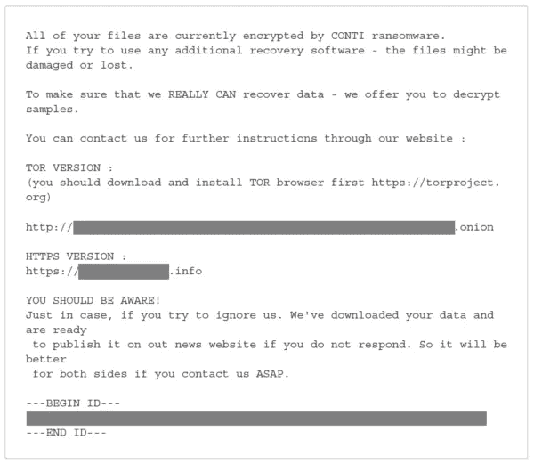

[康迪勒索软件笔记](https://www.google.com/url?sa=i&url=https%3A%2F%2Fblog.malwarebytes.com%2Fthreat-spotlight%2F2021%2F05%2Fthreat-spotlight-conti-the-ransomware-used-in-the-hse-healthcare-attack%2F&psig=AOvVaw3tGzY5fUvjXIrFzyd1iWPB&ust=1642342583187000&source=images&cd=vfe&ved=0CAsQjRxqFwoTCPCn5IX5s_UCFQAAAAAdAAAAABAI)

这篇文章提供了我解决由 *heavenraiza* 创建的标题为“**孔蒂***”*的 TryHackMe 房间的方法。一台 Exchange 服务器被勒索软件攻破，我们必须使用 Splunk 来调查攻击者是如何攻破服务器的。我还在最后提供了一个 TryHackMe 的链接，供有兴趣尝试这个房间的人使用。

# 放弃

我喜欢在一篇文章之前添加一个简短的免责声明，以鼓励人们在阅读本文之前尝试 CTF，因为在这篇文章中显然会有**剧透****。我相信，如果你先自己尝试，然后在遇到困难或需要提示时再来写这篇文章，你会更喜欢 CTF。因此，没有任何进一步的拖延，让我们开始吧！**

# **挑战场景**

> **贵公司的一些员工报告他们无法登录 Outlook。Exchange 系统管理员还报告说，他无法登录到 Exchange 管理中心。经过初步分类后，他们发现 Exchange 服务器上有一些奇怪的自述文件。下面是勒索短信的复印件。**

****

**挑战勒索笔记。**

> **你被指派调查这个情况。使用 Splunk 回答以下关于 Conti 勒索软件的问题。**

# **初始设置**

**登录 Splunk 后，我决定从“**设置→索引**”开始。在这里，我可以看到正在使用的索引是" **main** "，Splunk 的默认索引，其中存储了所有已处理的数据。**

**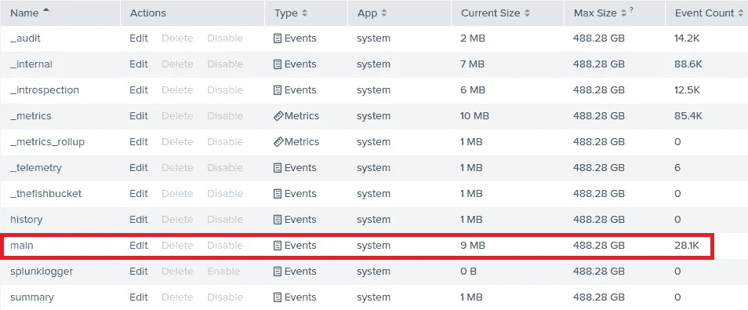**

**Splunk 指数**

**接下来，我检查了 Splunk 是否可以成功访问接收/加载的数据。我将时间范围更改为“**所有时间**”，然后提交以下搜索:**

```
index="main" earliest=0
```

**我可以看到有 **28，145**事件，并且我确认 Splunk 可以成功访问摄取/加载的数据:**

**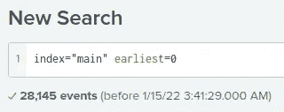**

**Splunk 中的事件总数。**

**最后，我使用下面的搜索按照事件数量从高到低的顺序确定了所有的**源类型**(即数据类别):**

```
index="main" earliest=0 | stats count by sourcetype | sort -count
```

**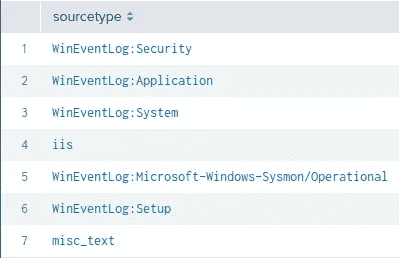**

**Splunk 中可用的源类型**

**源类型决定了 Splunk Enterprise 在索引过程中如何格式化数据。我们可以看到上面列出了七种可用的事件源类型:**

1.  ****"WinEventLog:Security"** :包含与 Windows 身份验证和安全进程相关的事件。**
2.  ****" WinEventLog:Application "**:包含由各种应用程序和/或用户程序记录的事件，包括应用程序被指定报告的任何错误或信息。**
3.  ****“WinEventLog:System”:**包含各种 Windows 系统组件记录的事件。**
4.  ****“iis”**:包含来自互联网信息服务(IIS)、网页和应用的数据。它包括基本项目，如 IP 和用户名、请求日期和时间、服务状态和接收的字节数，以及目标文件的详细项目。**
5.  ****" WinEventLog:Mircrosoft-Windows-Sysmon/Operational ":**Windows 日志常用插件。使用 Sysmon 日志，您可以通过跟踪代码行为和网络流量来检测恶意活动，并根据恶意活动创建检测。**
6.  ****"WinEventLog:Setup":** 包含 Windows 安装程序性能事件。**
7.  ****"misc_text"** :包含与 Splunk 中任何预定义的源类型都不匹配的杂项文本。**

# **挑战问题**

> **1.你能确定勒索软件的位置吗？**

**我首先使用 SourceType **Sysmon** 并确定在字段“ **EventCode** ”下有哪些事件代码:**

```
index=main sourcetype="WinEventLog:Microsoft-Windows-Sysmon/Operational"
```

**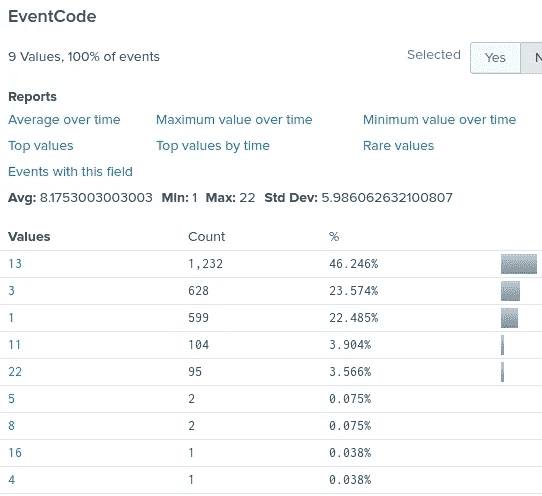**

**Sysmon 事件 ID。**

**您可以使用下面的链接了解有关 Sysmon ID 的更多信息:**

**[](https://docs.microsoft.com/en-us/sysinternals/downloads/sysmon) [## Sysmon - Windows 系统内部

### 发布时间:2021 年 12 月 16 日下载 Sysmon (3.1 MB)系统监视器(Sysmon)是一个 Windows 系统服务和设备…

docs.microsoft.com](https://docs.microsoft.com/en-us/sysinternals/downloads/sysmon) 

我可以看到 **Event ID 11 FileCreate** ，它在文件被创建或覆盖时被记录，可以用来识别是否创建了任何可疑文件。我使用下面的搜索来过滤这种类型的事件:

```
index=main sourcetype="WinEventLog:Microsoft-Windows-Sysmon/Operational" EventCode=11
```

查看有趣的字段，我们看到在**图像**字段下，**cmd.exe**可执行文件存储在一个奇怪的位置:

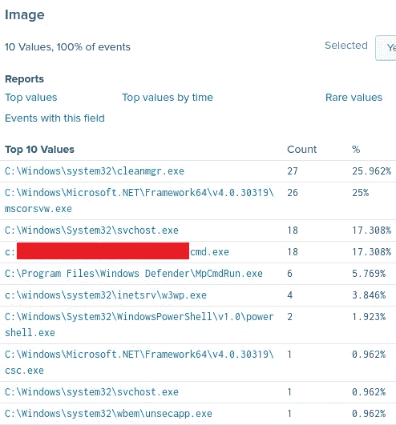

勒索软件的位置。

> 2.相关文件创建事件的 Sysmon 事件 ID 是什么？

参考上述问题 1 的解决方案。

> 3.能找到勒索软件的 MD5 哈希吗？

为了找到勒索软件的 md5 散列，我在前面的问题 1 中包含了“ **Image** ”值，并键入“MD5”来标识任何具有 MD5 散列值的字段:

```
index=main sourcetype="WinEventLog:Microsoft-Windows-Sysmon/Operational" Image="c:\\****\\***\\cmd.exe" md5
```

返回一个包含勒索软件 MD5 哈希的事件:

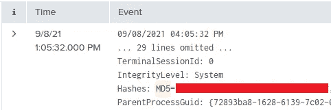

勒索软件 MD5 哈希

> 4.什么文件被保存到多个文件夹位置？

仍然使用 Sysmon 事件 ID 11，我发现了一个有趣的字段，名为“TargetFilename”。使用下面的搜索，我能够识别存储在多个位置的同一个文件名:

```
index=main sourcetype="WinEventLog:Microsoft-Windows-Sysmon/Operational" EventCode=11 
| stats count by TargetFilename
```

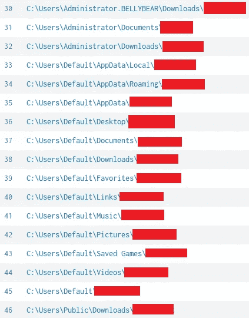

文件保存到多个文件夹位置。

> 5.攻击者使用什么命令向受损系统添加新用户？

在线执行快速搜索，我们看到 windows **net** 命令用于向系统添加用户:

```
net user username password /add
```

使用 Sysmon，可以使用字段**命令行**来过滤命令。我在搜索查询中对命令行字段值使用了通配符，以查找包含“ **/add** ”的任何命令:

```
index=main sourcetype="WinEventLog:Microsoft-Windows-Sysmon/Operational" CommandLine="*/add*"
```

查看有趣的字段，我可以在“CommandLine”字段下看到用于向受损系统添加新用户的命令:

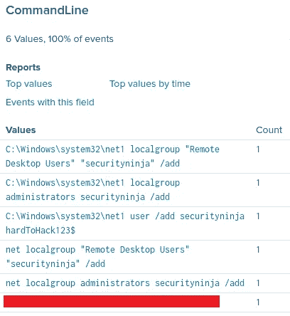

攻击者用来向受损系统添加新用户的命令。

> 6.攻击者为了更好的持久性迁移了流程。迁移后的进程镜像(可执行文件)是什么，攻击者上系统时的原始进程镜像(可执行文件)是什么？

要回答这个问题，我们可以使用 Sysmon **事件 ID 8 创建远程线程**，它检测一个进程何时在另一个进程中创建一个线程。这种技术被恶意软件用来注入代码并隐藏在其他进程中。我使用下面的搜索来过滤事件 ID 8:

```
index=main sourcetype="WinEventLog:Microsoft-Windows-Sysmon/Operational" EventCode=8
```

只返回两个事件。我使用下面的搜索查询进一步细化了我的搜索，以确定源和目标流程:

```
index=main sourcetype="WinEventLog:Microsoft-Windows-Sysmon/Operational" EventCode=8
| table SourceImage, TargetImage
```

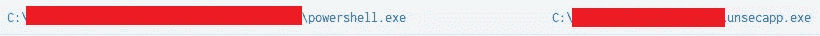

迁移的流程映像(可执行文件)和原始流程映像(可执行文件)。

看上面的图片，我们看到**powershell.exe**被发射，然后我们被转移到**unsecapp.exe**。

> 7.攻击者还获取了系统哈希。用于获取系统哈希的进程映像是什么？

如果我们参考前面问题 6 中使用的搜索的输出，我们可以看到第二个流程迁移发生在**unsecapp.exe**和**lsass.exe**之间:

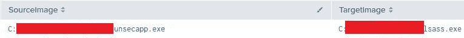

迁移的流程映像(可执行文件)和原始流程映像(可执行文件)。

本地安全机构子系统(LSASS)负责用户身份验证，并生成访问令牌，为用户和用户会话中产生的进程指定安全策略和/或限制。这个过程通常会受到黑客和恶意软件的攻击。它的目标是转储密码哈希，通常用于隐藏在众目睽睽之下。

> 8.漏洞利用部署到系统的 web shell 是什么？

我发现以下资源有助于识别 web shells:

[](https://github.com/ThreatHuntingProject/ThreatHunting/blob/master/hunts/webshells.md) [## threahunting/web shell . MD 位于主 threahunting project/threahunting

### 确定 web 外壳(独立|注入)数据所需的 Web 服务器日志(apache、IIS 等)。)收藏注意事项…

github.com](https://github.com/ThreatHuntingProject/ThreatHunting/blob/master/hunts/webshells.md) 

为了回答这个问题，我首先将我的 SourceType 从 Sysmon 改为 **IIS** **events** ，因为它收集与网页相关的事件。接下来，我过滤了针对 **POST** 请求和常见 web shell 文件类型的 IIS 事件。php，。asp，。aspx，。jsp):

```
index=main sourcetype=iis cs_method=POST 
| search *.php* OR *.asp* OR *.aspx* OR *.jsp*
```

在“cs_uri_stem”字段下，我可以看到一个带有“**的可疑文件名。aspx** 文件扩展名:

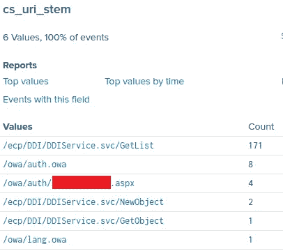

Web 外壳漏洞利用

> 9.执行这个 web shell 的命令行是什么？

我将 SourceType 改回 Sysmon，并过滤掉。aspx web shell

```
index=main i3gfPctK1c2x.aspx sourcetype="WinEventLog:Microsoft-Windows-Sysmon/Operational"
```

在 CommandLine 字段下，我可以看到用于执行 web shell 的命令:

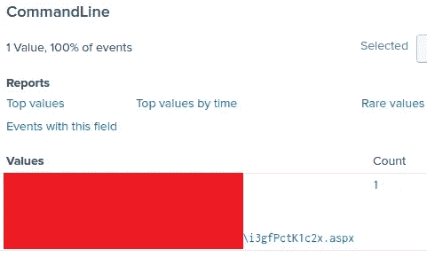

用于执行 webshell 的命令行。

> 10.该漏洞利用了哪三份简历？

我花了一些时间才找到，但在谷歌搜索引擎中搜索了 *conti 勒索软件“CVE”列表*后，我找到了以下文章，其中包含了一些与 conti 勒索软件相关的 CVE:

[](https://cybersecurityworks.com/blog/ransomware/is-conti-ransomware-on-a-roll.html) [## 康迪勒索软件势如破竹吗？

### 2021 年 9 月更新}:今年早些时候开始流行的康迪集团仍然保持强劲势头。在一个新的…

cybersecurityworks.com](https://cybersecurityworks.com/blog/ransomware/is-conti-ransomware-on-a-roll.html) 

# 结束语

我真的很喜欢在这个房间工作，并有机会了解更多关于使用 Splunk 搜索 Conti 勒索软件的信息。谢谢你一直读到最后，继续黑下去😄！

[](https://tryhackme.com/) [## 网络安全培训

### TryHackMe 是一个免费的学习网络安全的在线平台，使用动手练习和实验室，通过您的…

tryhackme.com](https://tryhackme.com/)**