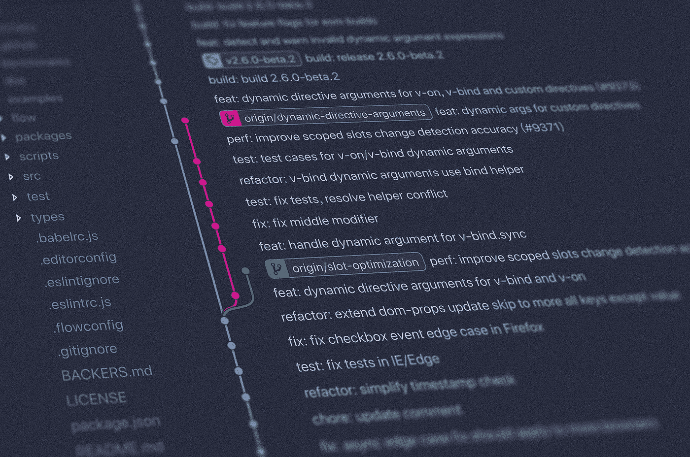
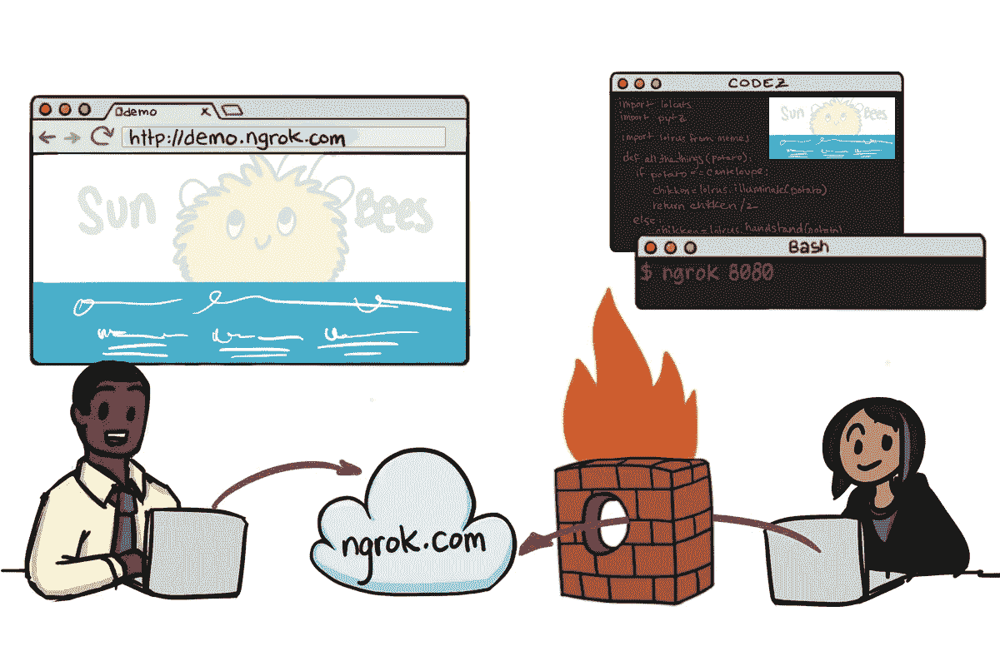
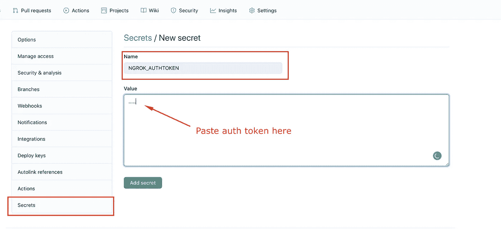
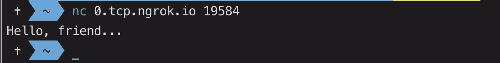

# 使用 Github 工作流的持续 CTF 挑战部署

> 原文：<https://infosecwriteups.com/continuous-ctf-challenge-deployments-using-github-workflows-aa8306fd58b6?source=collection_archive---------2----------------------->

照片由[扬西·敏](https://unsplash.com/@yancymin?utm_source=unsplash&utm_medium=referral&utm_content=creditCopyText)在 [Unsplash](https://unsplash.com/?utm_source=unsplash&utm_medium=referral&utm_content=creditCopyText) 上拍摄

D evOps 是任何软件工程项目的重要方面。在这一点上，CTF 挑战赛设计也不例外。能够在 CTF 挑战赛中持续推送更新，同时临时部署以供测试，这不仅可以实现更好的质量保证实践，而且还可以让作者在将更新发送给其他黑客进行测试时获得满足感(和吹嘘的权利)!

在这种情况下，这篇文章提供了一个教程，介绍如何使用 Github Workflows 环境通过(ab)持续部署您的挑战。Github 的*工作流*功能允许开发人员使用 *Github 动作*作为构建模块，在受控环境中定义和运行工作流管道。实际上，GitHub 免费提供了一个短暂的虚拟机来运行你的工作流。有趣的是，Github(或者我应该说……微软)已经慷慨地提供了 6 小时的工作流调用超时！现在，用于打包、部署和测试的大多数更常见的工作流的运行时间都不超过一小时。但是如果……我们充分利用这一工作流程时间来主持几个小时的挑战？然而，问题是，工作流环境不允许任何进入流量，所以即使我们在那里举办，人们如何访问挑战？嗯…可能有解决的办法…继续读下去。

# 挑战设置

首先，你得创造一个挑战，对吗？希望您已经经历了挑战设计和实施的麻烦，因此您应该已经准备好了要部署的挑战！但如果不是，也没什么好担心的！您可以使用我为测试目的创建的[虚拟 pwn 挑战](https://github.com/apogiatzis/pwn_test_chall)来跟进。这是一个容器化的 pwn 挑战，它只是在任何成功的 TCP 连接上打印回“你好，朋友…”。

在任何情况下，我都非常鼓励你总是用 Docker 来容器化你的挑战，这样你就可以完全控制你的代码运行的环境。关于如何做到这一点的细节超出了这篇文章的范围，因此，我相信你这样做是合适的。请随意调整挑战的代码，将您的挑战嵌入到 dockerized 环境中。

# 使用 Ngrok 的 TCP 隧道

还记得上面说的问题吗？为了便于外部访问我们的工作流环境，我们可以使用一个极其方便的工具，叫做 [**ngrok**](https://ngrok.com/) ！通过 Ngrok，我们可以绕过防火墙/NAT 规则，将本地主机暴露给互联网，如下图所示:

来源:[https://medium . com/better-programming/ngrok-make-your-localhost-accessible-to-any one-333 b 99 e 44 b 07](https://medium.com/better-programming/ngrok-make-your-localhost-accessible-to-anyone-333b99e44b07)

如果这听起来很有趣，我会鼓励你通过访问标题中给出的上述图像的原始帖子来探索进一步的细节。

由于 Ngrok 只允许注册会员免费使用 TCP 隧道(当然有一些限制),请点击这里[https://ngrok.com/](https://ngrok.com/)注册一个 Ngrok 账户。登录后，您应该能够在 Ngrok 仪表板中找到授权令牌。

请注意 down，因为它将在接下来的步骤中使用。

# 部署工作流程

现在我们有了一个工作容器化的挑战，需要通过在`.github/workflows/` 目录中创建一个新的 YAML 文件来定义 Github 工作流。在`.github/workflows/`中创建一个名为`deploy.yaml`的新文件，并粘贴以下工作流定义:

在上面的工作流定义中，我们定义了两个作业，每当在存储库中执行新的推送时，这两个作业将按顺序运行。`cancel`作业是一个可选步骤，用于确保取消任何仍在运行的先前工作流，以避免同时运行多个工作流。更重要的是，`deploy`的工作是所有奇迹发生的地方:

1.  **仓库已签出**
2.  **通过运行** `**docker-compose up -d**` **部署挑战。**请注意，这里可以使用任何其他命令来部署您的挑战，但我总是尝试使用单个命令部署，因为这使过程变得容易得多。
3.  **运行一个定制的 Github 动作，该动作运行 ngrok 并通过隧道传输来自/去往端口 4000 的任何 TCP 流量。**这是我最近发布的一个 Github 动作，抽象出了一些实现细节，但是如果你感兴趣，你可以在这里看到动作[的完整源代码。](https://github.com/apogiatzis/ngrok-tunneling-action)

你可能已经注意到了**ngrok-tunneling-action**中提供的参数，所以让我们花些时间来解释这些参数:

**超时:**记住`deploy`作业的隧道挖掘步骤被阻塞，这意味着如果不取消，工作流程将继续运行，直到超时 6 小时。当不需要全部 6 小时时，此参数允许您指定较短的超时时间。它接受许多时间单位，如秒或小时，即`100s`、`2h`

**端口:**这指定了流量将通过隧道传输到/来自的端口。这应该是您的挑战通过 docker 容器公开的端口。

**ngrok_authtoken:** 这只是从前面的步骤中获得的 ngrok 授权令牌。当然，由于令牌不应该以纯文本形式显示，因此请通过导航到您的存储库设置- >机密- >新存储库机密，确保在您的存储库机密中定义了令牌

我们快完成了！现在，每当一个新的推送到达存储库时，这个工作流就应该被触发！如果一切按计划进行，你应该能够导航到你的 Ngrok 仪表板，并找到你的隧道的 URL，可用于访问你的挑战！

Ngrok tcp 隧道

让我们来测试一下吧！

厉害！作品如魅！您可以在这个资源库中找到这篇文章的完整代码:

 [## apogiatzis/pwn-chall-自动部署

### 在 GitHub 工作流环境中部署的测试 pwn 挑战 Github 是超过 5000 万开发人员的家园…

github.com](https://github.com/apogiatzis/pwn-chall-auto-deployment) 

肯定还有很大的改进空间，所以你可以随意调整/扩展你喜欢的任何东西。请记住，工作流定义可以被修改，以便只有当一个新的发布被创建时才被触发，如果那更适合您的用例的话。

任何反馈总是非常感谢！