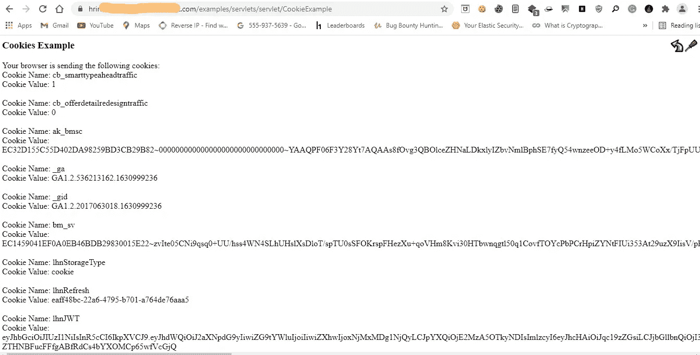
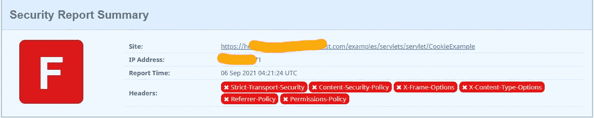
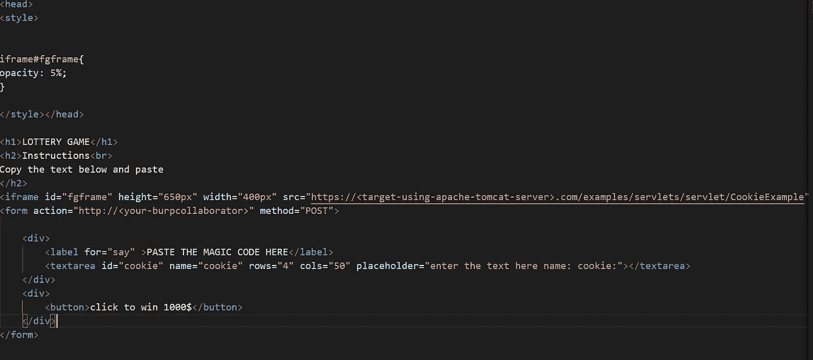
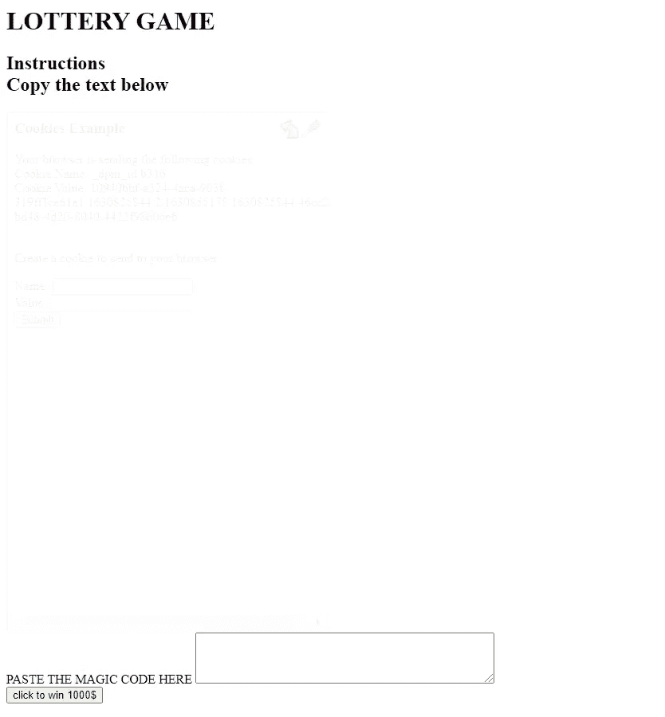
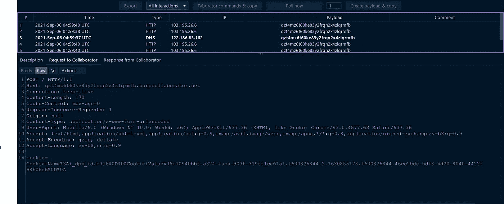

# 使用 Burp 协作者通过 Clickjacking 窃取 Cookie

> 原文：<https://infosecwriteups.com/cookie-stealing-via-clickjacking-using-burp-collaborator-ff6f4ac1c18b?source=collection_archive---------1----------------------->

你好👋信息安全极客👨‍💻这是我的第四篇博文，

本博客内容有关通过 **使用**打嗝协作者**在目标上使用 Apache Tomcat 服务器点击劫持**cookie。

让我们将该目标视为**redacted.com，**该目标具有公开暴露的*servlet*，并且您可以在路径***/examples/servlet/servlet/CookieExample***中看到当前用户 cookie

所以为了利用用户，我想做 clickjacking 来增加影响。

现在我检查了 **X 框**表头，以便在点击顶进时使用 ***iframe*** 标签。

顺便说一下，他们没有使用任何 x 帧头，所以我为 clickjacking 构建了一个有效负载，看起来很像。

在“表单操作”属性中输入“burp 协作者”链接。

代码在浏览器中查找，

最后，当任何受害者输入 cookie 时，它将显示在 burp 协作者中，如下所示。

在我的 youtube 频道上看到完整的视频 POC 如下: [**视频 ___poc**](https://youtu.be/CFbHX4_9ctU)

在这里订阅我的 youtube 频道: [**在这里订阅 _ 频道 _ 在这里**](https://www.youtube.com/channel/UCq7-Qf45etdk0qc35I_n7PQ?sub_confirmation=1)

通过 LinkedIn 与我联系:https://www.linkedin.com/in/anurag-verma-650b771a2

请在 Instagram: varmaanu001 上与我联系