# 每个黑客都错过的酷侦察技术！🔥🔥

> 原文：<https://infosecwriteups.com/cool-recon-techniques-every-hacker-misses-1c5e0e294e89?source=collection_archive---------0----------------------->

欢迎阅读本文！这篇文章是关于每个黑客都错过的一些很酷的侦查技术！当我们带你通过这些美丽的技术时，请系紧你的安全带。

> ***技巧 1:活动子域枚举***

一个非常普通的技术，但是很多研究者依赖被动子域枚举而不是主动子域枚举。让我们讨论一下活动子域枚举:

使用活动子域枚举有两种方法

***a .使用单词表强制子域:*** 在这种技术中，我们使用 DNS 单词表来强制特定的子域。这可以使用 [FFuF](https://github.com/ffuf/ffuf) 和[最佳 DNS 词表](https://wordlists-cdn.assetnote.io/data/manual/best-dns-wordlist.txt)轻松完成。

***命令:ffuf-u "***[***https://FUZZ.target.com***](https://FUZZ.target.com)***-w<path _ to _ word list>-MC 200，301，302，403***

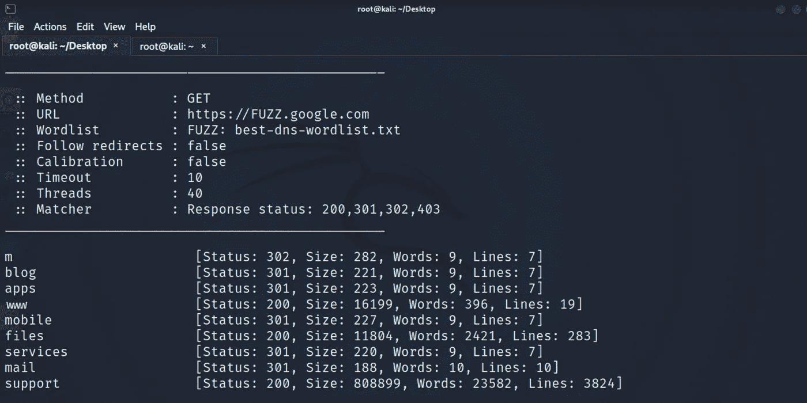

***b .排列力:*** 在这种技术中，我们通过使用单词表的排列、突变和改变，从已知子域/域中创建新的解析子域列表。这可以使用[替代域名](https://github.com/infosec-au/altdns)轻松完成

***命令:alt DNS-I hacker one . txt-o data _ output-r-s final . txt-w words . txt***

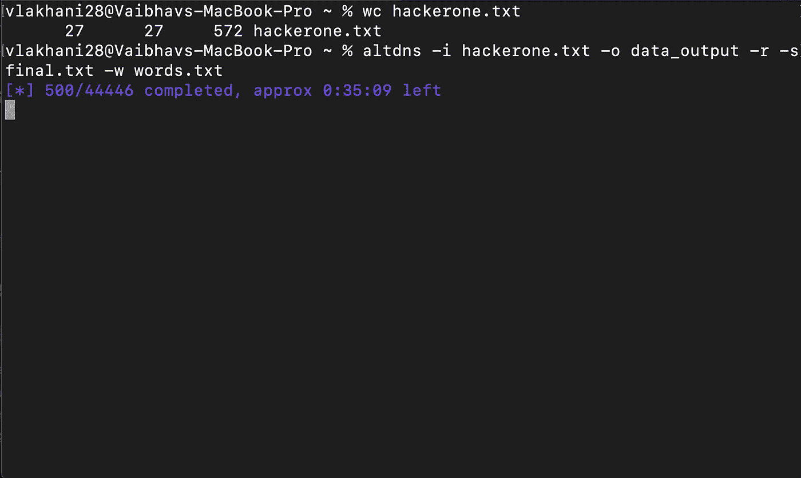

> ***手法二:法图标杂凑***

网站图标是作为你的网站品牌的图标。每个 Favicon 都有一些独特的哈希值，可以用来收集具有相同哈希函数的域。图标散列很容易计算。FavFreak 是为我们做这项工作的最好工具之一。

***命令:cat URLs . txt | python 3 fav freak . py***

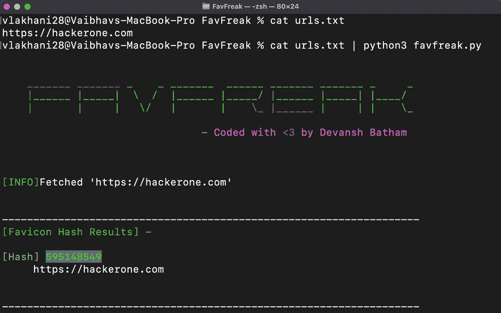

一旦计算出散列值，你就可以在互联网搜索引擎上使用相同的方法，如 [shodan](https://www.shodan.io/dashboard) 来获得大众网站。

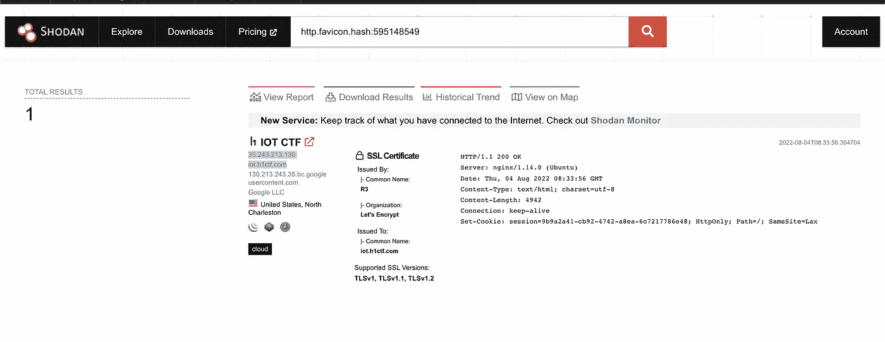

你可以在这里阅读更多关于 FavFreak [的内容](https://medium.com/@Asm0d3us/weaponizing-favicon-ico-for-bugbounties-osint-and-what-not-ace3c214e139)

> ***手法三:Nrich***

一个出色的命令行工具， [Nrich](https://gitlab.com/shodan-public/nrich) ，可以用来分析一个文件中的 IP，查找 CVEs 和开放端口及漏洞。

(注意:Nrich 只接受 IP 地址作为输入，不接受域名。因此，使用名为 [dnsx](https://github.com/projectdiscovery/dnsx) 的工具可以很容易地解决找到主机名的 IP 地址的问题。)

***命令:cat subdomains . txt | dnsx-a-resp-only | nrich-***

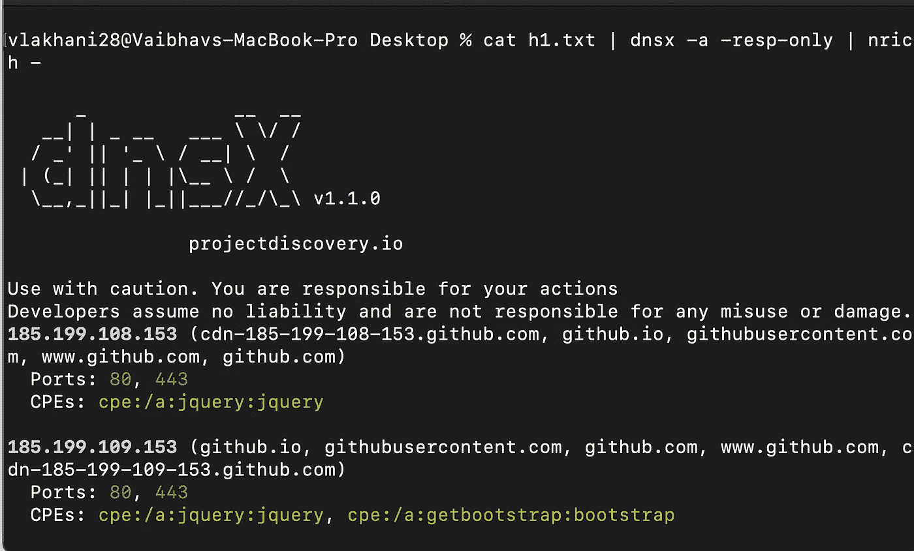

> ***技巧四:选择合适的目标***

假设您有一个中等规模的应用程序，有许多子域。选择一个子域并在此基础上开始搜寻很有挑战性。别担心，我们会保护你的。你可以使用[感兴趣的子域名](https://github.com/1ndianl33t/Gf-Patterns/blob/master/interestingsubs.json) [gf](https://github.com/tomnomnom/gf) 模式列表来寻找你感兴趣的子域名。

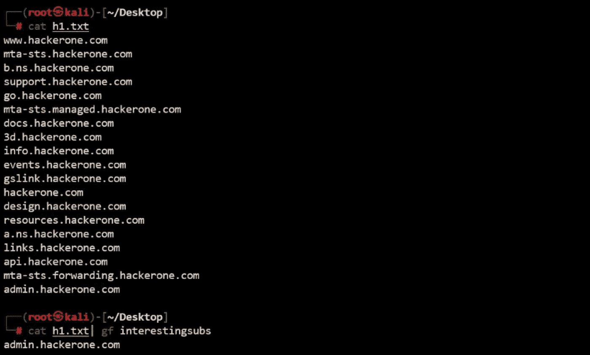

***命令:cat URLs . txt | gf interesting subs***

> ***手法五:反向 Whoislookup***

该测试将返回域名的 WHOIS 注册结果，该结果可用于收集属于某个组织的所有资产。

***步骤:***

1.  在目标域上执行 [whoislookup](https://www.whois.com/) 并查找技术电子邮件。

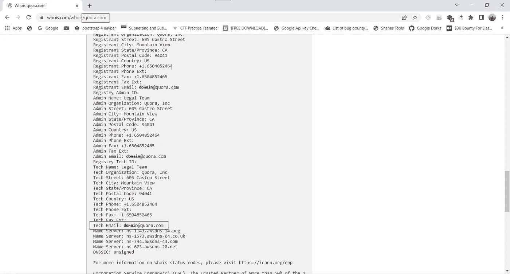

whoislookup

2.访问[drs.whoisxmlapi.com](http://drs.whoisxmlapi.com)并注册/登录(最初你将获得 500 免费积分)

现在，使用技术电子邮件进行搜索，以发现属于目标组织的所有资产

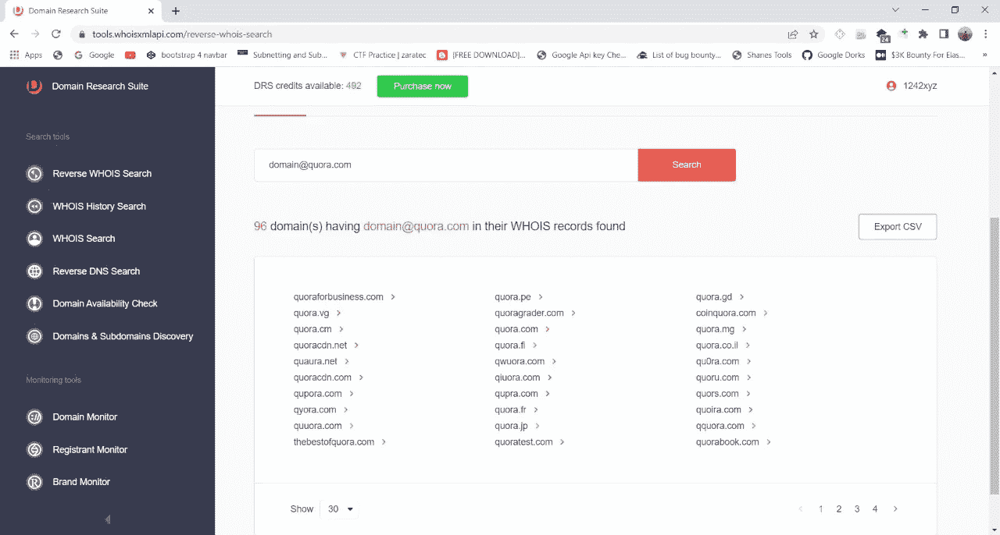

通过 whoislookup 的所有域

您也可以使用导出 CSV 选项导出上述所有结果。

> ***手法六:揭开***

[揭开](https://github.com/projectdiscovery/uncover)是团队[project discovery](https://projectdiscovery.io/)开发的一款精美工具。Uncover 允许您快速发现互联网上暴露的主机。它使用 shodan、censys 和 fofa 查找主机。您所需要的只是要配置的 API 键。

那么能做些什么呢？？找到子域名并把它们交给 nuclei 来自动处理漏洞，找到暴露的面板，大量搜索简历，并找到服务。基本上，自动化一切与互联网搜索引擎有关的事情。

为了有效地利用这一点，创建一个呆子名单，如下图所示，并提供给发现。

***命令:cat dorks.txt |揭开***

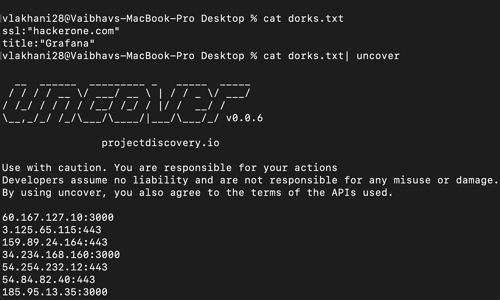

> ***技巧 7:使用 meg*** 寻找隐藏路径

隐藏路径或目录破坏是一种重要的侦察技术。Meg 是一个强大的工具，可以让你快速找到隐藏的路径/目录，而不会造成流量泛滥。

***命令:meg paths.txt hosts.txt 输出***

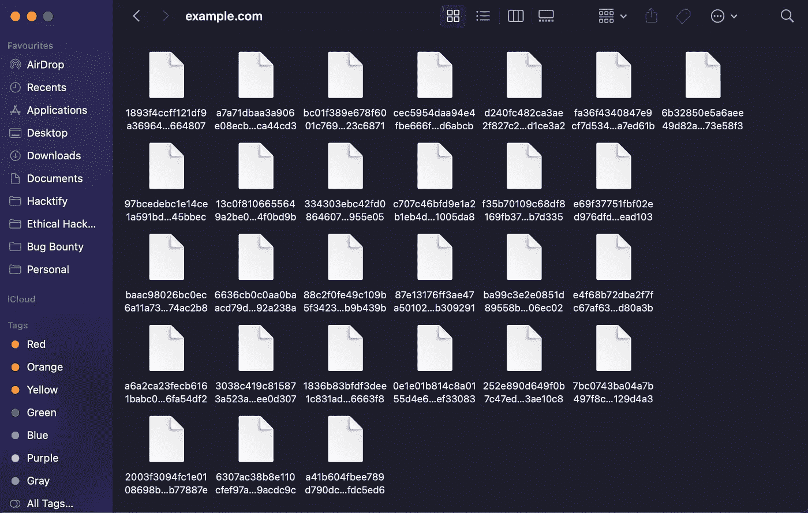

为主机 example.com 创建的包含请求和响应的文件列表

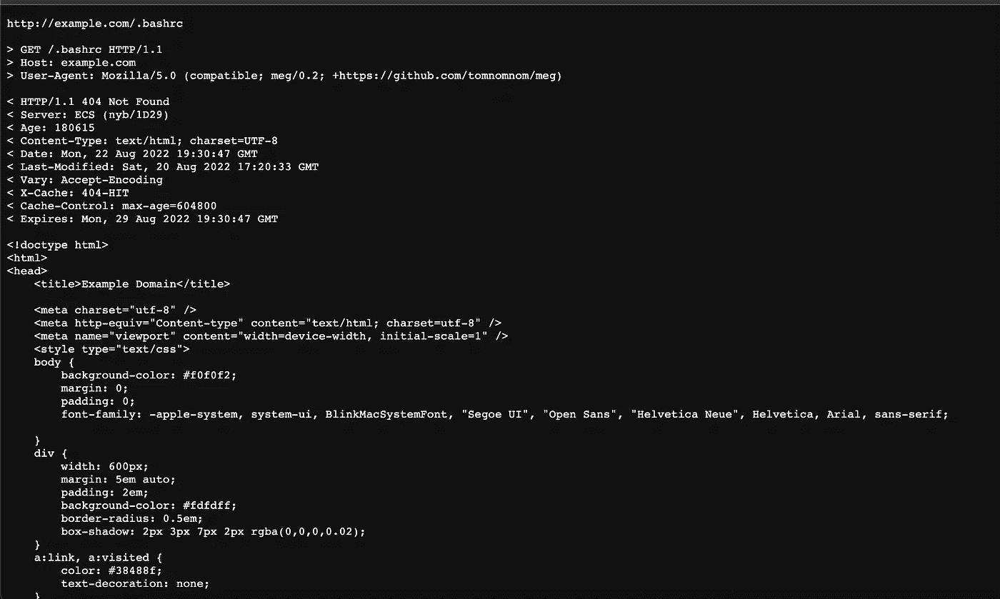

已发送请求的示例

您还可以向请求添加自定义标头。Meg 也支持 RawHTTP。

> ***技术 8:寻找开放的端口和服务***

每个 web 应用程序可能都有一些开放的其他端口，这些端口上的服务可能容易受到攻击。人们应该总是寻找这些开放的端口和在其上运行的服务。但是这可能很费时间。Naabu 是一个快速端口扫描器，可以帮助你找到这些端口和服务。最好的事情是使用 naabu，你也可以运行 nmap 扫描。

***命令:纳布——主持人***

我们希望这些侦察技术可以帮助你增加和更新你的方法。请在评论区告诉我们你的侦查方法。

狩猎愉快！

**作者:**

瓦伊巴夫·拉哈尼:[https://www.linkedin.com/in/vaibhav-lakhani](https://www.linkedin.com/in/vaibhav-lakhani)

[迪尔·帕尔马](https://www.linkedin.com/in/dhir-parmar-925b171a4):[https://www.linkedin.com/in/dhir-parmar-925b171a4](https://www.linkedin.com/in/dhir-parmar-925b171a4)

*来自 Infosec 的报道:Infosec 上每天都会出现很多难以跟上的内容。* [***加入我们的每周简讯***](https://weekly.infosecwriteups.com/) *以 5 篇文章、4 个线程、3 个视频、2 个 Github Repos 和工具以及 1 个工作提醒的形式免费获取所有最新的 Infosec 趋势！*