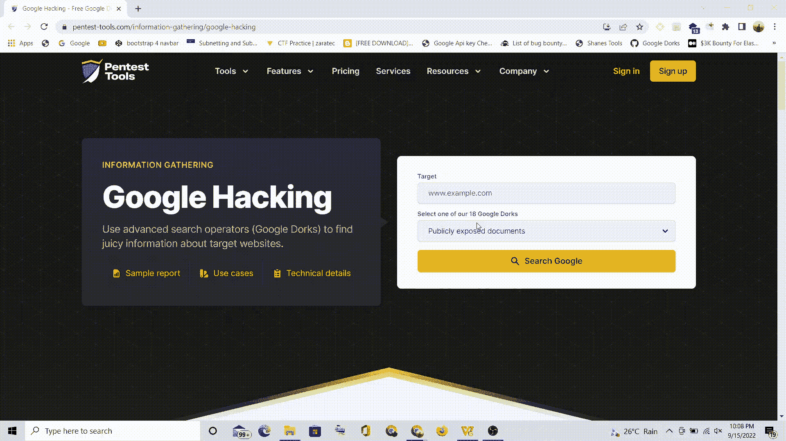
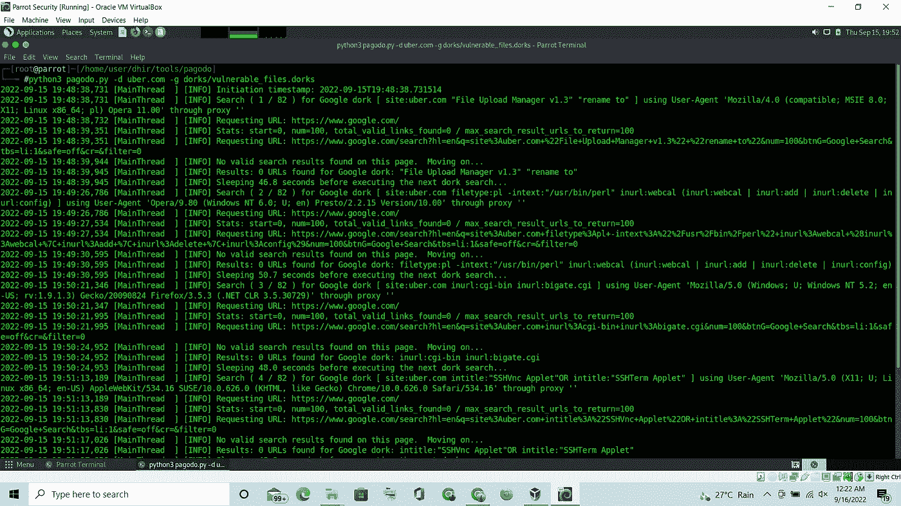
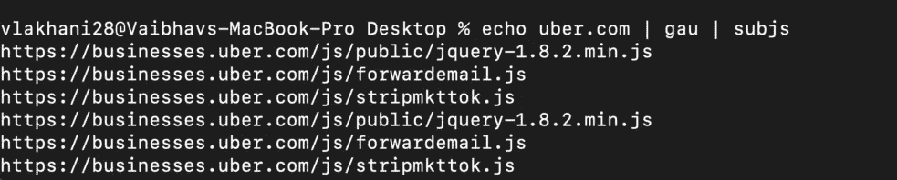
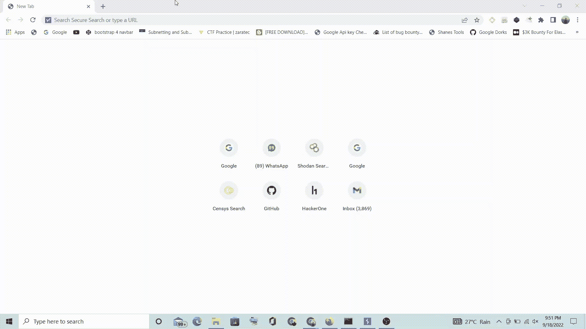
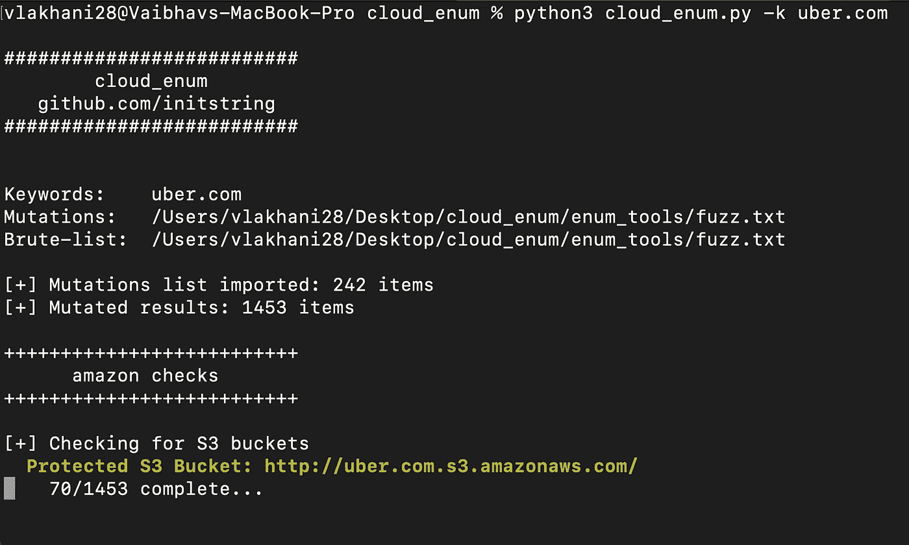
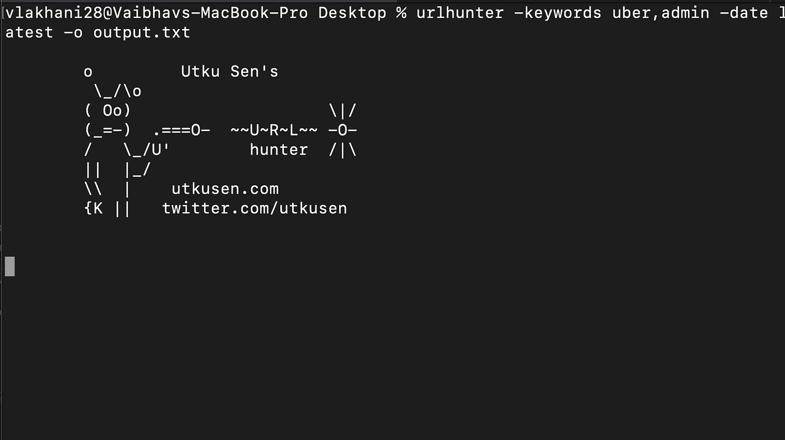
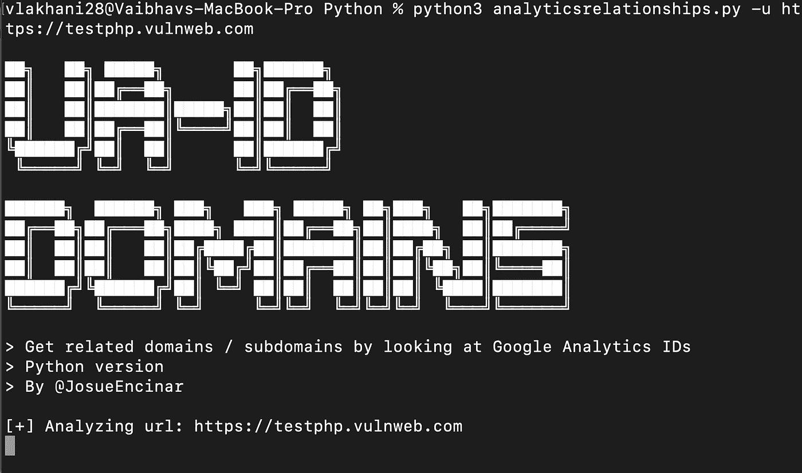

# 每个黑客都错过的酷侦察技术！第二集🔥🔥

> 原文：<https://infosecwriteups.com/cool-recon-techniques-every-hacker-misses-episode-2-8024e8338756?source=collection_archive---------0----------------------->

欢迎来到《酷侦察技术》第二集。我们带来了一些更酷的侦查技术，我们认为黑客们通常会忽略这些技术！如果你没有看过第一集[，这里有链接！](/cool-recon-techniques-every-hacker-misses-1c5e0e294e89)

所以我们开始吧！！

> **技巧 9:有效的谷歌欺骗**

我们所有人都在谷歌上寻找敏感的秘密。但是这里有一个有效的方法可以减少你的手工劳动。Pentest Tools 开发的一款名为 [Google-Hacking](https://pentest-tools.com/information-gathering/google-hacking) 的漂亮工具将在这方面帮助我们。

只需提供目标名称并选择您要搜索的内容，它就会为您创建 Google Dorks。

你可以修改这些呆瓜来创造和获得更有趣和更敏感的东西。例如: ***网站:target.com ext:txt***让我们接触到了一些组织的内部邮件。

上面的工具只有 18 个呆子，所以为了更好的侦察，你可以使用另一个很棒的工具，比如[帕果多](https://github.com/opsdisk/pagodo)

Pagodo 有大量的呆瓜，你也可以添加一个定制呆瓜的列表:

小贴士:试着在不同的搜索引擎上呆一会儿，比如必应。有时，bing dorking 会给出有效的结果，例如“site:firebaseio.com”会通过 bing Dorking 给出更好的 O/P

> **技术 10:虚拟主机扫描**

虚拟主机基本上是一台机器，其行为就像多个系统托管多个域一样。举个例子，想象一下一个银行网站，它只有一个 IP 地址 200.12.45.34，托管着两个子域名 subdomain1.bank.com 和 subdomain2.bank.com。

枚举此类虚拟主机可以增加攻击表面积，并有助于找到隐藏的端点。这可以通过一个叫做 [Vhosts-Sieve](https://github.com/dariusztytko/vhosts-sieve) 的漂亮工具轻松完成。

步骤如下:

步骤 1:使用各种工具找到所有的子域(例如: [subfinder](https://github.com/projectdiscovery/subfinder)

步骤 2:使用以下命令查找子域的虚拟主机:

**python 3 vhosts-sieve . py-d subdomain . txt-o vhosts . txt**

> **技巧 11:有效的 JavaScript 分析**

我们都知道整个 web 应用程序的功能都是建立在 JavaScript 之上的。有效的 JavaScript 分析可以帮助您找到并发现隐藏的内容。有很多工具可以帮助你做到这一点。您还可以创建自己的正则表达式模式，并从 JS 文件中对它们进行 grep。

您可以首先通过使用下面的命令使用名为 [subjs](https://github.com/lc/subjs) 的工具来获取 JS 文件

**猫 urls.txt | gau | subjs**

**cat URLs . txt | wayback URLs | subjs**

一旦你收集了所有的 JS 文件，你就可以使用 [LinkFinder](https://github.com/GerbenJavado/LinkFinder) 来分析它们。

还有一个执行 JS 分析的著名扩展— Burp JS Miner。你可以在这里阅读更多相关信息[。](https://portswigger.net/bappstore/0ab7a94d8e11449daaf0fb387431225b)

另一个伟大的扫描 JS 文件的扩展是 chrome 扩展[truffhog](https://chrome.google.com/webstore/detail/trufflehog/bafhdnhjnlcdbjcdcnafhdcphhnfnhjc)。当您访问网站时，TruffleHog 会在网站上查找 API 密钥、秘密和凭证，如果发现任何敏感信息，会向您发出警报。它扫描网页以及 JS 文件。

> **技巧 12:有效的云检查器**

每个公司都可能使用一些或其他的云服务，或者供内部使用(内部网)，或者供外部使用。收集这些数据并找到隐藏的端点是这里的目标。 [cloud_enum](https://github.com/initstring/cloud_enum) 是一项令人惊叹的服务，有助于找到所有这些端点以及存储 URL。它试图在隐藏的端点上执行未经验证的黑盒测试。

同样的命令如下:

**python 3 cloud _ enum . py-k uber.com**

您可以通过附加 *-k* 标志来添加多个关键字，以增加命中更多服务的机会。

> 技术 13:使用 URLHunter 找到管理面板

想象一下，如果我们同时拥有所有的管理面板，生活会变得多么简单？URLHunter 可以帮你做到这一点。URLHunter 是一个神奇的服务，它可以帮助你根据你指定的关键字找到所有隐藏的端点。这里是捕捉，给关键字像管理，并允许网址猎人找到你所有隐藏的管理仪表板。

以下命令是:

**urlhunter -keywords uber.com，admin-date latest-o output . txt**

> **技术 14:使用分析关系找到不常见的子域**

我们使用这个叫做[分析关系](https://github.com/Josue87/AnalyticsRelationships)的工具发现了这个非常有趣和不常见的子域枚举技术。这个工具基本上通过从一个 URL 查看谷歌分析 id 来检查域/子域。谷歌分析的跟踪代码(或 ID)是一个唯一的标识符，允许谷歌分析在插入网站时收集数据。

命令非常简单:

【https://www.domain.com】python 3 analytics relationships . py-u

****

**我们希望这些侦察技术可以帮助你增加和更新你的方法。请在评论区分享你的侦查方法。**

**狩猎愉快！**

****作者:****

**瓦伊巴夫·拉哈尼:[https://www.linkedin.com/in/vaibhav-lakhani](https://www.linkedin.com/in/vaibhav-lakhani)**

**[迪尔·帕尔马](https://www.linkedin.com/in/dhir-parmar-925b171a4):[https://www.linkedin.com/in/dhir-parmar-925b171a4](https://www.linkedin.com/in/dhir-parmar-925b171a4)**

## **来自 Infosec 的报道:Infosec 每天都有很多内容，很难跟上。[加入我们的每周简讯](https://weekly.infosecwriteups.com/)，以 5 篇文章、4 个线程、3 个视频、2 个 Github Repos 和工具以及 1 个工作提醒的形式免费获取所有最新的 Infosec 趋势！**