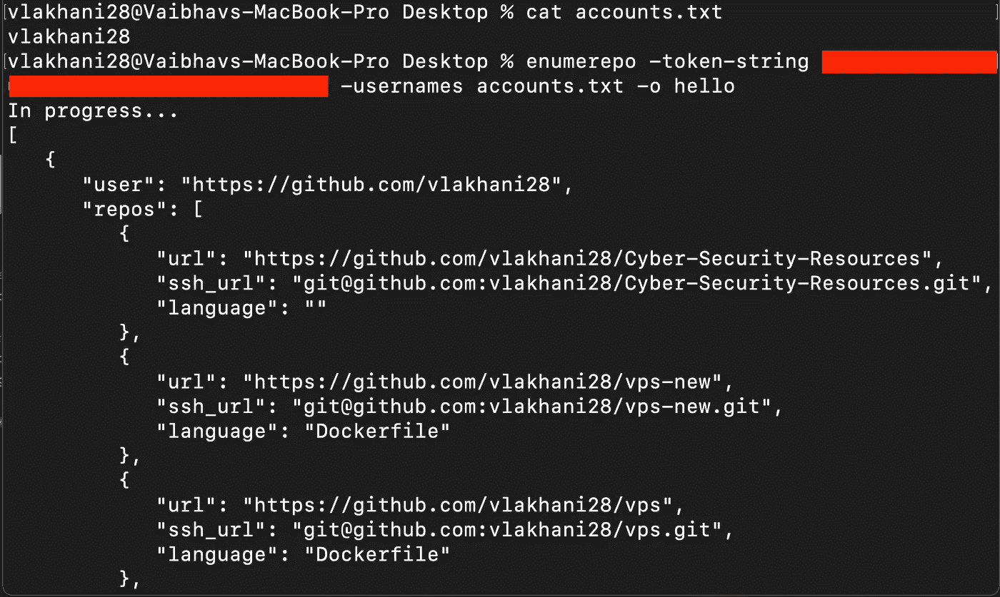
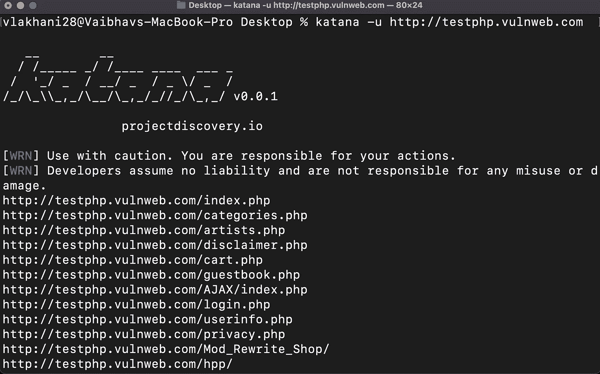
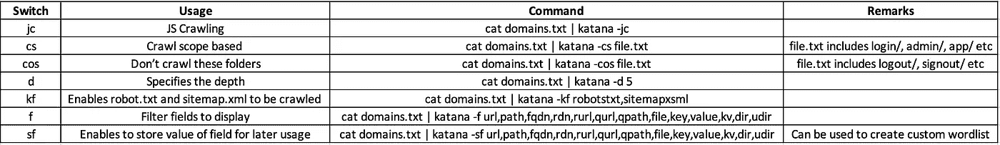
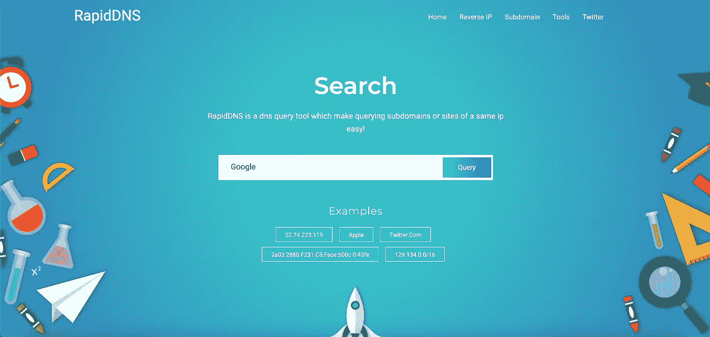
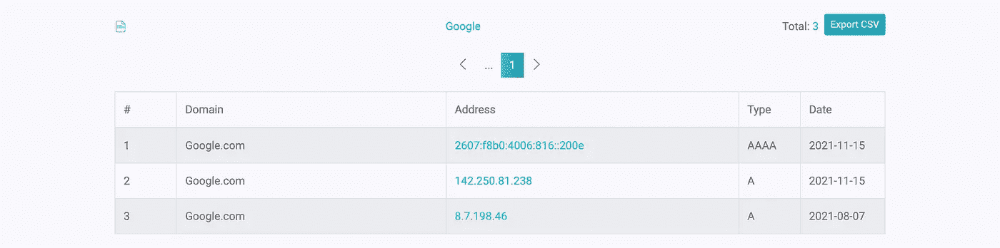
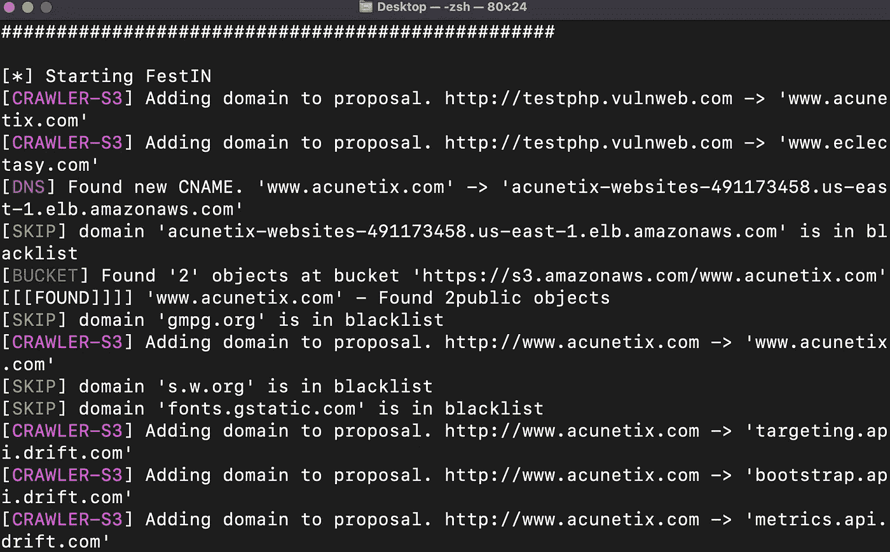
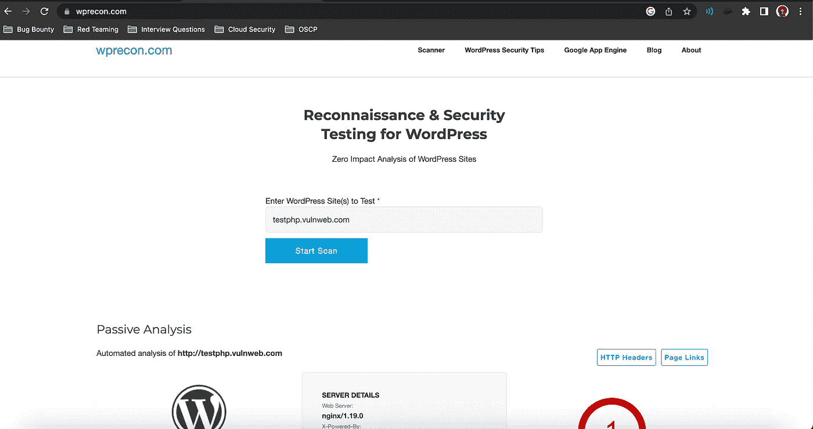

# 每个黑客都错过的酷侦察技术！第三集🔥🔥

> 原文：<https://infosecwriteups.com/cool-recon-techniques-every-hacker-misses-episode-3-3812e7da3425?source=collection_archive---------1----------------------->

欢迎来到《酷侦察技术》第三集。我们带来了一些更酷的侦查技术，我们认为黑客们通常会忽略这些技术！如果你没有看过第一集[，这里有链接！这是第二集](/cool-recon-techniques-every-hacker-misses-1c5e0e294e89)[的链接](https://medium.com/bugbountywriteup/cool-recon-techniques-every-hacker-misses-episode-2-8024e8338756)

开始了。！

> **技术 15:枚举特定用户名的 GitHub 库**

在进行 GitHub Recon 时，很难找到准确的组织名称及其存储库来查找敏感数据。enumerepo 将帮助你列出一个有效的 GitHub 帐号的所有库。你所要做的只是简单地提交帐户名称，看看神奇！

> **命令:**enumere po-TOKEN-string GITHUB _ TOKEN-usernames accounts . txt-o 输出文件

> **技巧 16:向武士刀问好**

哇哦。哇哦。项目发现的新工具在这里！告别所有不同的工具，如 waybackurls、gau、subjs 和 hi to [Katana](https://github.com/projectdiscovery/katana)

武士刀是一个先进的网络爬虫爬所有的端点。它提供了各种不同的过滤器，如 JavaScript 解析/抓取、字段范围、抓取范围、抓取已知文件、自动表单填充。它还提供各种显示选项来过滤输出。不仅如此，您还可以实际存储字段值，这些值对以后构建单词表很有用。

下表描述了武士刀的所有功能和命令。

**武士刀对核子——一条线**

cat subdomains . txt | httpx––silent > > alive . txt & & cat alive . txt | katana––silent > > endpoints . txt & & cat endpoints . txt | nucleus-t<your_templates></your_templates>

> **技术 17:使用 RapidDNS 查询 DNS 以获取 IP 和子域名**

通过使用 [RapidDNS](https://rapiddns.io/) 查询 DNS 来查找 IP 地址，增加您的攻击面。RapidDNS 是一个 DNS 查询工具，拥有超过 30 亿的数据，并且每天都在增加。

> **技巧 18:大范围应用程序侦察问题？**

有没有发现一个范围很大的域，其中包含大量资产，但不知道如何找到全部信息？别担心，3klCon 会来救你。 [3klCon](https://github.com/eslam3kl/3klCon) 是一款自动化侦察工具，可与大型&中型瞄准镜配合使用。它执行 20 多项任务，并在单独的文件中返回所有结果。

> **手法十九:**发现 S3 斗宗弱点

想从一个领域找到 S3 桶，并发现他们的弱点。然后和 [Festin](http://github.com/cr0hn/festin) 打个招呼。该工具使用各种技术(如爬行、DNS 爬行、S3 响应分析等)来查找 S3 存储桶。最好的部分是你不需要任何 AWS 证书。它还允许下载桶对象。

> 技术 20: Wordpress Recon

有没有遇到过 Wordpress 网站，却不知道如何开始调查？别担心！WPRecon 为你而来。WPRecon 是一个识别 wordpress 漏洞和黑盒信息的工具。

只需在[https://wprecon.com/](https://wprecon.com/)上添加你的域名，就能获得所有不同的信息。

我们希望这些侦察技术可以帮助你增加和更新你的方法。请在评论区分享你的侦查方法。

狩猎愉快！

**作者:**

瓦伊巴夫·拉哈尼:[https://www.linkedin.com/in/vaibhav-lakhani](https://www.linkedin.com/in/vaibhav-lakhani)

迪尔·帕尔马:[https://www.linkedin.com/in/dhir-parmar-925b171a4](https://www.linkedin.com/in/dhir-parmar-925b171a4)

## 来自 Infosec 的报道:Infosec 每天都有很多内容，很难跟上。[加入我们的每周简讯](https://weekly.infosecwriteups.com/)以 5 篇文章、4 个线程、3 个视频、2 个 GitHub Repos 和工具以及 1 个工作提醒的形式免费获取所有最新的 Infosec 趋势！