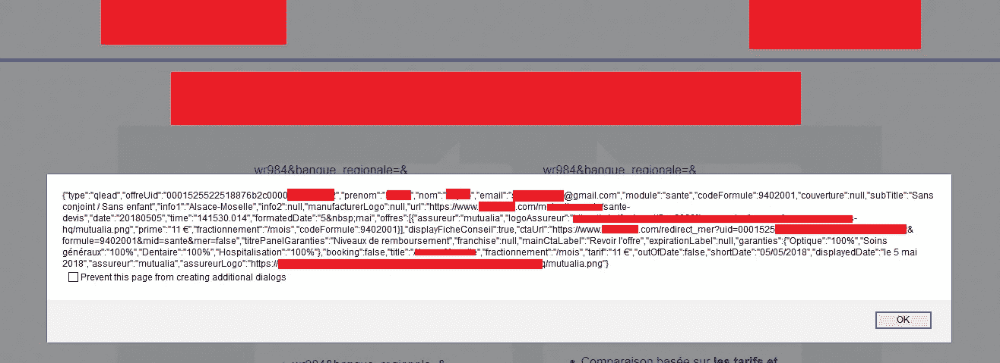

# CORS 一号班轮司令部剥削者号

> 原文：<https://infosecwriteups.com/cors-one-liner-command-exploiter-88c06903cca0?source=collection_archive---------1----------------------->

对于 Bug 猎人来说，这是一个非常有用和实用的备忘单，它可以帮助你用各种可能的方法找到 CORS 的错误配置。只需用你想要的网址替换掉 https://example.com 的网址。这将帮助您扫描 CORS 漏洞，而不需要外部工具。你要做的就是把命令复制粘贴到你的终端上，然后手指交叉寻找任何可能的 CORS。

CORS 开发 PoC

# 1 个基本原点反射有效负载—(自动)向网站的每个已爬网端点发送请求

`site="https://example.com"; gau "$site" | while read url;do target=$(curl -s -I -H "Origin: https://evil.com" -X GET $url) | if grep 'https://evil.com'; then [Potentional CORS Found]echo $url;else echo Nothing on "$url";fi;done`

# 1.2 基本原点反射有效负载—(手动)仅在一个端点发送请求

`site="https://example.com";curl -s -I -H "Origin: https://evil.com" -X GET "$site" | if grep 'https://evil.com'; then echo [Potentional CORS Found]; else echo Nothing found;fi`

# 2 受信任的空来源有效负载—(自动)向网站的每个已爬网端点发送请求

`site="https://example.com"; gau "$site" | while read url;do target=$(curl -s -I -H "Origin: null" -X GET $url) | if grep 'Access-Control-Allow-Origin: null'; then echo [Potentional CORS Found] "$url"; else echo Nothing on: "$url";fi;done`

# 2.2 受信任的空原始有效负载—(手动)仅在一个端点中发送请求

`site="https://example.com";curl -s -I -H "Origin: null" -X GET "$site" | if grep 'Access-Control-Allow-Origin: null'; then echo [Potentional CORS Found]; else echo Nothing found;fi`

# 3 白名单中的空原始值有效负载—(自动)向网站的每个已爬网端点发送请求

`site="https://example.com" ; gau "$site" | while read url;do target=$(curl -s -I -X GET "$url") | if grep 'Access-Control-Allow-Origin: null'; then echo [Potentional CORS Found] "$url"; else echo Nothing on: "$url";fi;done`

# 3.2 列入白名单的空原始值有效负载—(手动)仅在一个端点中发送请求

`site="https://example.com";curl -I -X GET "$site" | if grep 'Access-Control-Allow-Origin: null';then echo [Potential CORS Found];else echo Nothing found;fi`

# 4 原始负载中的受信任子域[ *.example.com ] —(手动)仅在一个端点中发送请求

`url="https://example.com" ; curl -s -I -H "Origin: evil.$url" -X GET "$url" | if grep "Access-Control-Allow-Origin: evil.$url"; then echo [Potential CORS Found]; else echo [No CORS found]; fi`

# 4.2 原始有效负载[ *.example.com ]中的受信任子域—(自动)向网站的每个已爬网端点发送请求

`site="https://example.com" ; gau "$site" | while read url;do target=$(curl -s -I -H "Origin: evil.$url" -X GET "$url") | if grep 'Access-Control-Allow-Origin: null'; then echo [Potentional CORS Found] "$url"; else echo Nothing on: "$url";fi;done`

# 5 滥用不正确的域验证—(注意:仅用域替换 URL 没有 http(s)协议)—(手动)

`site="example.com";curl -s -I -H "Origin: https://not$site" -X GET "$site"| if grep "Access-Control-Allow-Origin: https://not$site"; then echo [Potentional CORS Found]; else echo Nothing found;fi`

# 5.2 滥用不正确的域验证—(注意:仅用域替换 URL 没有 http(s)协议)—(自动)向网站的每个已爬网端点发送请求

`site="https://example.com" ; gau "$site" | while read url;do target=$(curl -s -I -H "Origin: https://not$site" -X GET "$url") | if grep 'Access-Control-Allow-Origin: https://not$site'; then echo [Potentional CORS Found] "$url"; else echo Nothing on: "$url";fi;done`

# 6 源域扩展未验证漏洞—(手动)仅在一个端点中发送请求

`site="https://example.com";curl -s -I -H "Origin: $site.evil.com" -X GET "$site" | if grep "Origin: Access-Control-Allow-Origin: $site.evil.com"; then echo [Potentional CORS Found]; else echo Nothing found;fi`

# 6.2 源域扩展未验证漏洞—(自动)向网站的每个已爬网端点发送请求

`site="https://example.com" ; gau "$site" | while read url;do target=$(curl -s -I -H "Origin: $site.evil.com" -X GET "$url") | if grep "Origin: Access-Control-Allow-Origin: $site.evil.com"; then echo [Potentional CORS Found] "$url"; else echo Nothing on: "$url";fi;done`

# 7 高级绕过使用特殊字符+编码—(手动)仅在一个端点发送请求

`site="https://example.com";payloads=("!" "(" ")" "'" ";" "=" "^" "{" "}" "|" "~" '"' '`' "," "%60" "%0b") ; for payload in ${payloads[*]}; do target=$(curl -s -I -H "Origin: $site$payload.evil.com" -X GET "$site") | if grep '$site$payload.evil.com'; then echo [+] Payload Reflected: $site$payload.evil.com; else echo Nothing found with: $site$payload.evil.com;fi;done`

## 工作流程

如果一行 bash 命令显示输出，这意味着网站容易受到相应的 CORS 错误配置的攻击。如果执行时没有显示输出，则没有检测到漏洞。

> 更多信息可以在我的 Github 库
> [https://github.com/kleiton0x00/CORS-one-liner](https://github.com/kleiton0x00/CORS-one-liner)上找到

狩猎愉快！