# 用 HashCat 破解散列

> 原文：<https://infosecwriteups.com/cracking-hashes-with-hashcat-2b21c01c18ec?source=collection_archive---------0----------------------->

H ashcat 是世界上最快、最先进的密码恢复工具，支持五种独特的攻击模式，适用于 300 多种高度优化的哈希算法。hashcat 目前支持 Linux、Windows 和 macOS 上的 CPU、GPU 和其他硬件加速器，并且具有帮助实现分布式密码破解的工具。

哈希卡特

在这里，我们将研究如何通过 HashCat 破解下面提到的通用哈希类型的密码:

> 1.MD5 哈希
> 2。加盐 MD5 哈希
> 3。MD5Crypt 摘要
> 4。a) HMAC-SHA1 键
> 4。b) SHA-1 消化
> 5。SHA-2 消化
> 6。SHA-3 消化
> 7。NTLM 哈希
> 8。CRC32 哈希

 [## 哈希卡特/哈希卡特

### hashcat 是世界上最快和最先进的密码恢复工具，支持五种独特的攻击模式…

github.com](https://github.com/hashcat/hashcat) 

HashCat 支持以下攻击模式:

> 1.直*
> 2。组合
> 3。蛮力
> 4。混合字典+面具
> 5。混合遮罩+字典

*接受规则

使用以下命令检查所有可用选项:
`hashcat -h`

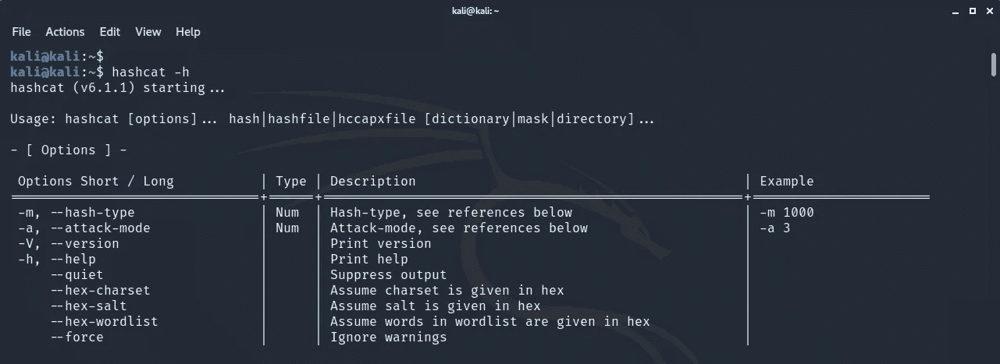

Hashcat 帮助

在本模块中，我们将尝试基于**字典的** & **蛮力**攻击。

## 1.MD5 哈希

确保输入散列采用符合 hashcat 的格式，如示例所示。

例如:8743 b 52063 CD 84097 a65d 1633 f 5 c 74 f 5 > hash . txt

使用命令:
`hashcat -m 0 -a 0 hash.txt passwordlist.txt`

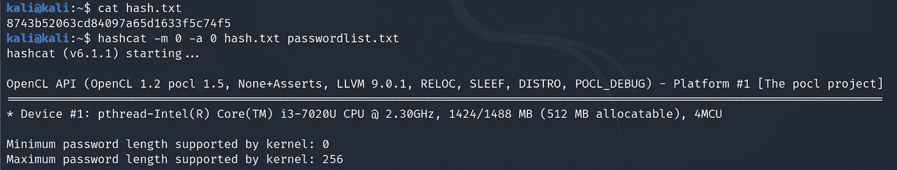

破解 MD5 哈希

其中，
-m 0: MD5 哈希模式
-a 0:字典攻击模式
hash.txt:包含兼容格式哈希的 txt 文件
passwordlist.txt:包含明文密码的字典文件

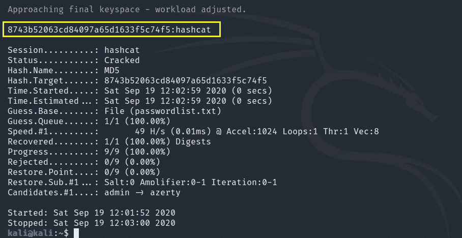

破解散列

破解哈希:8743 b 52063 CD 84097 a65d 1633 f 5 c 74 f 5 = Hash cat

## 2.加盐 MD5 哈希

确保输入散列采用符合 hashcat 的格式，如示例所示。

例如:MD5(＄pass。$ salt):01 dfae 6 e5d 4d 90d 9892622325959 afbe:7050461 > hash . txt

使用
命令:`hashcat -m10 -a0 hash.txt passwordlist.txt`

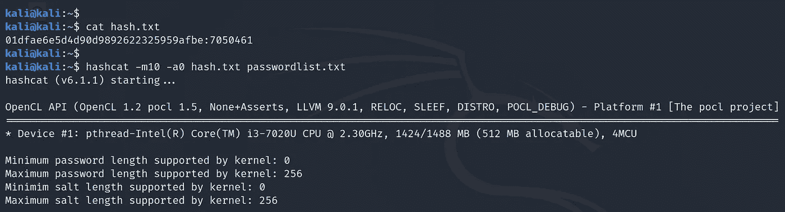

加盐 MD5 哈希

其中，
-m 10: Salted MD5 哈希模式
-a 0:字典攻击模式
hash.txt:包含兼容格式哈希的 txt 文件
passwordlist.txt:包含明文密码的字典文件

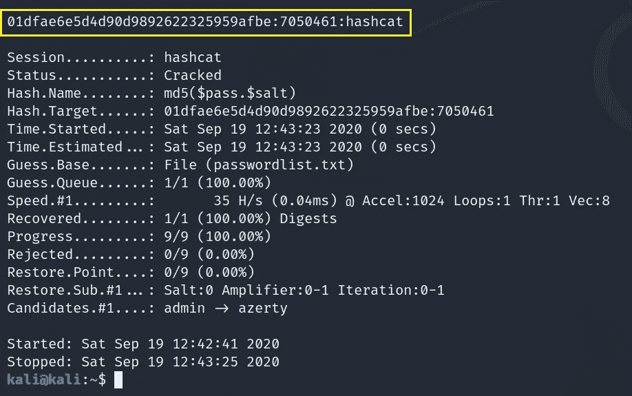

破解散列

破解哈希:01 dfae 6 e 5d 4d 90d 9892622325959 afbe:7050461 = hashcat

## 3.MD5Crypt 摘要

确保输入散列采用符合 hashcat 的格式，如示例所示。

示例:md5crypt，MD5 (Unix)，Cisco-IOS $ 1 $(MD5)$ 1 $ 28772684 $ iewnoggugqo 9 . biz 5 sk 8k/> hash . txt

使用命令:

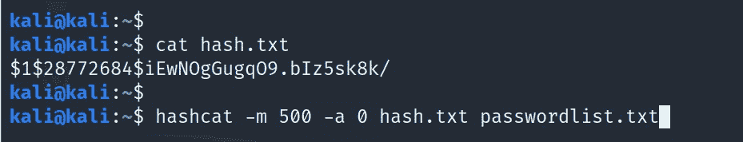

MD5Crypt 摘要

其中，
-m 500: MD5Crypt 摘要哈希模式
-a 0:字典攻击模式
hash.txt:包含符合格式的哈希的 txt 文件
passwordlist.txt:包含明文密码的字典文件

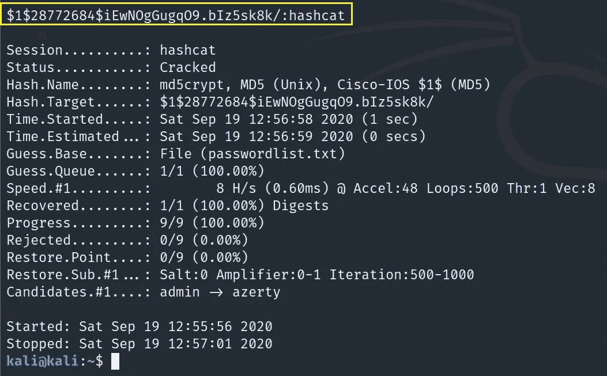

破解散列

破解哈希:$ 1 $ 28772684 $ iewnoggugqo 9 . biz 5s k8k/= hashcat

## 4.a) HMAC-SHA1 键

确保输入散列采用符合 hashcat 的格式，如示例所示。

例如:HMAC-SHA1(key = $ pass)c 898896 F3 f 70 f 61 BC 3 FB 19 bef 222 aa 860 e 5 ea 717:1234 > hash . txt

使用命令:
`hashcat -m150 -a 0 hash.txt passwordlist.txt`

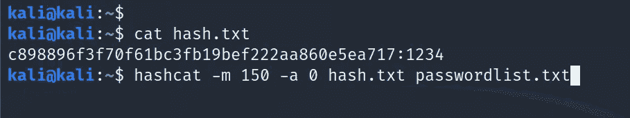

HMAC-SHA1 密钥哈希

其中，
-m 150: HMAC-SHA1 密钥哈希模式
-a 0:字典攻击模式
hash.txt:包含兼容格式哈希的 txt 文件
passwordlist.txt:包含明文密码的字典文件

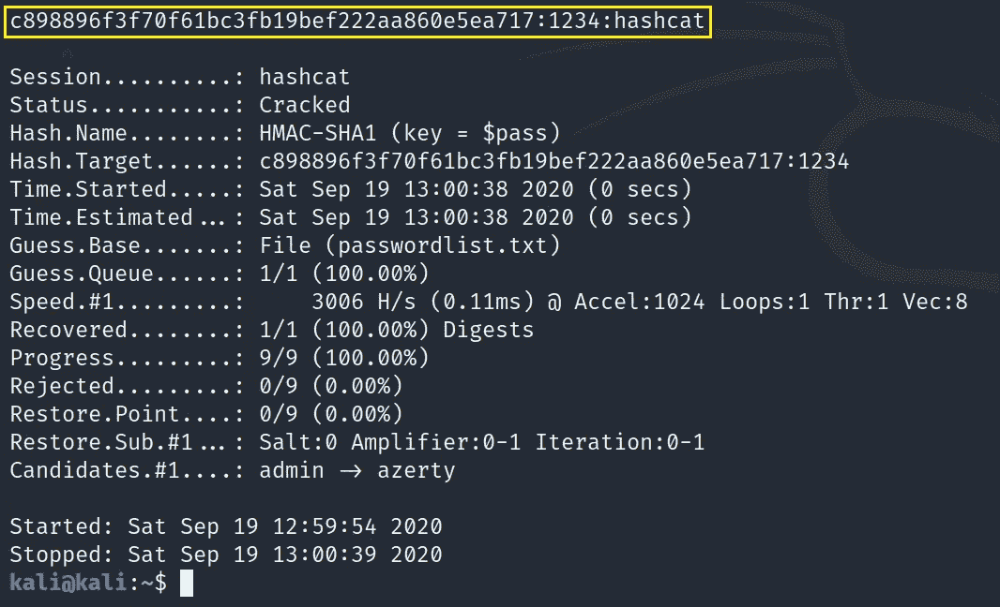

破解散列

破解哈希:c 898896 F3 f 70 f 61 BC 3 FB 19 bef 222 aa 860 e 5 ea 717:1234 = Hash cat

## **b) SHA-1 消化**

确保输入散列采用符合 hashcat 的格式，如示例所示。

示例:b 89 eaac 7 e 61417341 b 710 b 727768294d 0e 6 a 277 b > hash . txt

使用命令:
`hashcat -m100 -a 0 hash.txt passwordlist.txt`

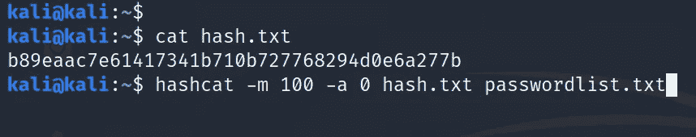

SHA-1 杂碎

其中，
-m 100: SHA1 摘要哈希模式
-a 0:字典攻击模式
hash.txt:包含符合格式的哈希的 txt 文件
passwordlist.txt:包含明文密码的字典文件

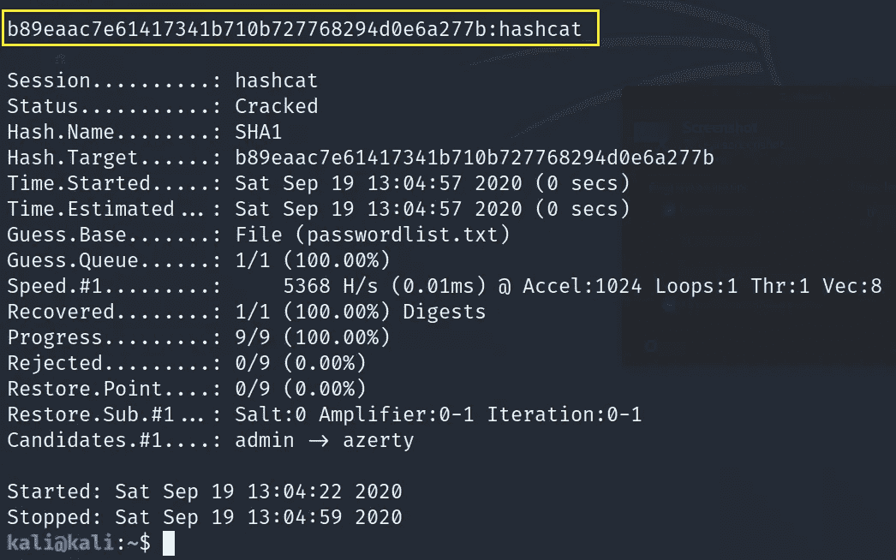

破解散列

破解哈希:b 89 eaac 7 e 61417341 b 710 b 727768294d 0 E6 a 277 b = Hash cat

## 5.SHA2–384 哈希

确保输入散列采用符合 hashcat 的格式，如示例所示。

例:SHA2-384 07371 a f1 ca 1c a7 c 6941d 2399 f 3610 f1 e 392 c 56 c6d 73 fddffe 38 f 18 c 430 a 2817028 da E1 ef 09 AC 683 b 62148 a2 c 8757 f 42 > hash . txt

使用
命令:`hashcat -m 10800 -a 0 hash.txt passwordlist.txt`

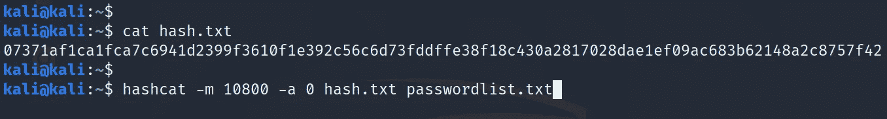

SHA-2 杂碎

其中，
-m 10800: SHA-2 摘要哈希模式
-a 0:字典攻击模式
hash.txt:包含兼容格式哈希的 txt 文件
passwordlist.txt:包含明文密码的字典文件

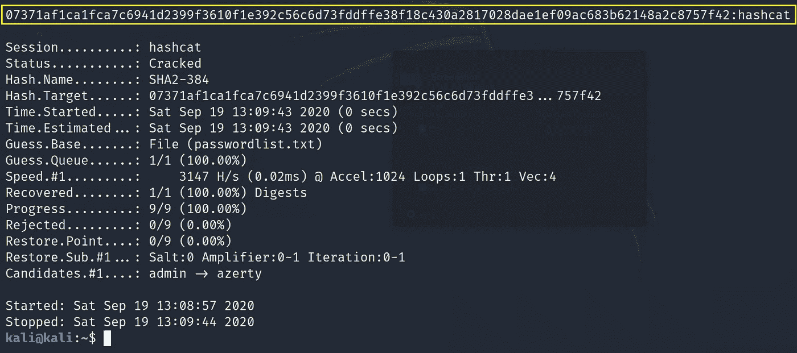

破解散列

破解哈希:07371 a1 ca 1 FCA 7 c 6941d 2399 f 3610 f1 e 392 c 56 c6d 73 fddffe 38 f 18 c 430 a 2817028 da E1 ef 09 AC 683 b 62148 a2 c 8757 f 42 = Hash cat

## 6.SHA3–512 哈希

确保输入散列采用符合 hashcat 的格式，如示例所示。

示例:SHA3–512 7 C2 DC 1d 743735 D4 e 069 F3 BDA 85 B1 b 7 e 9172033 dfdd 8 CD 599 ca 094 ef 8570 f 3930 c 3 f 2c 0 b 7 AFC 8d 6152 ce 4 ea ad 6057 a2 ff 22 e 71934 B3 a3 DD 0 FB 55 a 7 fc 84 a 53144 e > hash . txt

使用命令:

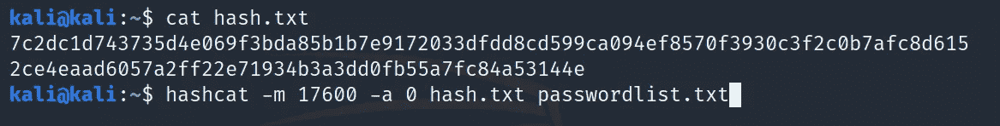

SHA3–512 哈希

其中，
-m 17600:SHA3–512 哈希模式
-a 0:字典攻击模式
hash.txt:包含兼容格式哈希的 txt 文件
passwordlist.txt:包含明文密码的字典文件

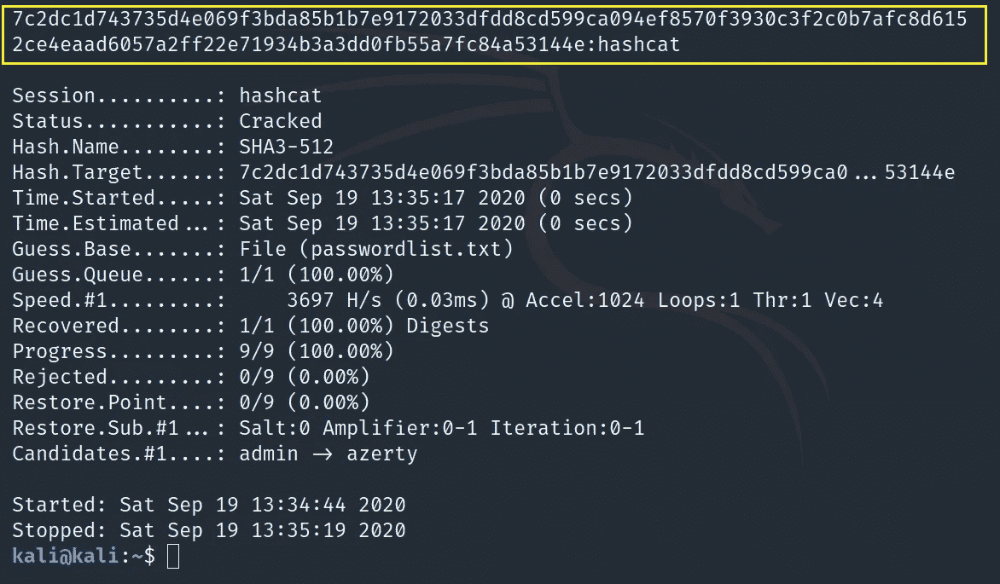

破解散列

破解哈希:7 C2 DC 1d 743735 d4e 069 F3 BDA 85 B1 b 7 e 9172033 dfdd 8 CD 599 ca 094 ef 8570 f 3930 c 3f 2c 0 b 7 AFC 8d 6152 ce 4 ea ad 6057 a2 ff 22e 71934 B3 a3 DD 0 FB 55 a7 fc 84 a 53144 e = Hash cat

## 7.NTLM·哈希

确保输入散列采用符合 hashcat 的格式，如示例所示。

示例:b4b 9 b 02 e 6 f 09 a9 BD 760 f 388 b 67351 e 2b > hash . txt

使用
命令:`hashcat -m 1000 -a 0 hash.txt passwordlist.txt`

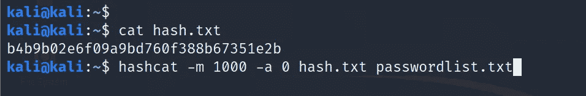

NTLM 杂碎

其中，
-m 1000: NTLM 摘要哈希模式
-a 0:字典攻击模式
hash.txt:包含符合格式的哈希的 txt 文件
passwordlist.txt:明文包含密码的字典文件

破解散列

破解哈希:b4b 9 b 02 e 6 f 09 a9 BD 760 f 388 b 67351 e 2b = Hash cat

## 8.CRC32 哈希

确保输入散列采用符合 hashcat 的格式，如示例所示。

示例:c 762 de4a:0000000 > hash . txt

使用命令:
`hashcat -m 11500 -a 0 hash.txt passwordlist.txt`

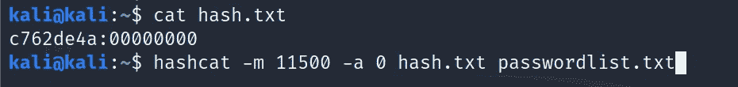

CRC32 哈希

其中，
-m 11500: CRC32 哈希模式
-a 0:字典攻击模式
hash.txt:包含兼容格式哈希的 txt 文件
passwordlist.txt:包含纯文本密码的字典文件

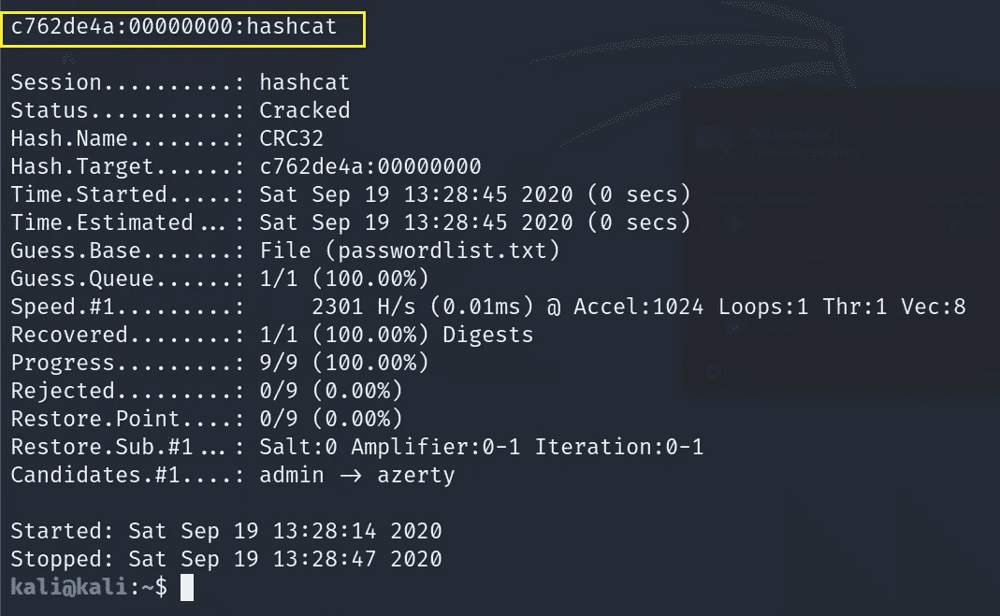

破解散列

破解哈希:c 762 de4a:0000000 = hashcat

*未完待续……*