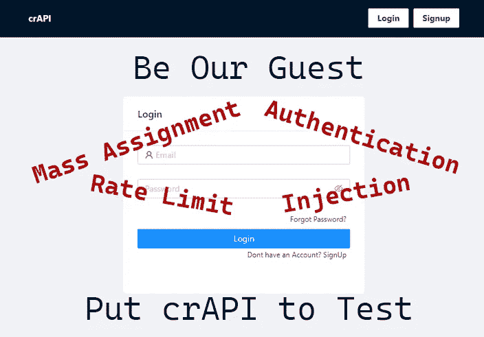

# Owasp crAPI:以黑客的方式介绍 API 安全性

> 原文：<https://infosecwriteups.com/crapi-api-security-the-hacker-way-7f8402bb6e65?source=collection_archive---------0----------------------->

## 存在真实漏洞的完全荒谬的 API！！

# 你的团队对你的 API 了解多少？

含糊的回答？很多情况下的理解也是如此。理解 API 及其攻击媒介是复杂的。最重要的是，没有标准的方法来提供导致漏洞的企业 API 设计谬误和错误的实践经验。许多安全工程师、开发人员和研究人员非常赞同这一点。

在以 API 为中心的应用程序的开发生命周期中有一些假设，很多时候会采取捷径来在短时间内提供更多的功能。这些假设可能是:

*   我所有的内部 API 都是安全的，因为它们不直接与外部用户交互，而是供其他面向外部的服务使用。
*   我不需要处理 RBAC 控制。相反，身份团队应该在 API 网关中实现它。

脱节、缺点和误解共同导致零日漏洞的产生，这可能会严重影响收入并损害品牌形象。

***“左移不仅仅是转移你的工具和流程，还有知识。”***

迈出第一步，我们构建了一个纯 API 驱动的易受攻击的应用程序，模拟了一个基于微服务的企业架构，通过它我们可以 ***【左移】*** 我们在旅途中获得的知识和经验。而 [**crAPI(“完全荒谬的 API”)**](https://github.com/owasp/crapi)就是这样诞生的。

# 那么，什么是 crAPI？

[**crAPI**](https://github.com/owasp/crapi) 是车主注册管理车辆的平台。紧随 Webgoat 和 JuiceShop 的脚步，crAPI 是一个故意易受攻击的应用程序。然而，crAPI 主要填充了用于教学、学习和实践 API 安全性的 API 漏洞。

## 开源和社区驱动！

工具就像秘制调料的日子已经一去不复返了。我们构建了 crAPI，将安全工程师和开发人员考虑在内，并将其开源，以便每个人都可以贡献他们在安全斗争中的知识和经验。

## crAPI 提供什么？(它是另一个漏洞模拟工具吗？不要！)

真实体验单个漏洞或一系列漏洞如何迅速升级，使您的应用程序/服务受到威胁。

*   crAPI 专门研究现代基于 API 的应用程序中的常见漏洞，包括 [**OWASP 十大 API**](https://owasp.org/www-project-api-security/)中的漏洞。
*   crAPI 中所有的 [**挑战**](https://owasp.org/crAPI/docs/challenges.html) 都是基于现实生活中在脸书、优步、Shopify 等大公司的 API 中发现的漏洞。
*   crAPI 暴露了许多不同的漏洞，其中一些很容易发现，另一些需要多个步骤和一些创造力来利用。截至目前，你不会在 crAPI 中找到平凡的 XSS 和 SQLi 挑战。

## 我能帮上什么忙？

*   ***开发者/安全冠军*** 可以了解 API 漏洞产生的原因，并练习技能进行修复。
*   ***安全爱好者*** 获得 API 攻击的练习场地和真实企业应用的实际操作经验。
*   ***API 防护工具*** 可以评估其质量，以演示对 API 攻击的检测和防护。

## Traceable 对 crAPI 项目的支持

[**可追溯**](https://www.traceable.ai/) 为了更广泛的安全社区的利益，对 **crAPI** 进行了开源，我们致力于支持该项目并与社区紧密合作！

## 共同建设

我们将不断增加新的漏洞和来自所有领域的挑战，影响 API 驱动的开发，使 crAPI 更加荒谬。同时，我们希望听到您的想法、反馈和建议。在这里 跟随指南 [**就可以轻松上手。如果您面临任何问题，我们可以在**](https://github.com/owasp/crapi#quickstart-guide)**[**【OWASP slack】**](https://owasp.org/slack/invite)的 [**#crapi**](https://owasp.slack.com/archives/C03EYNEM2TV) 频道上找到您，并且一直在寻找像您这样出色的社区贡献者！**