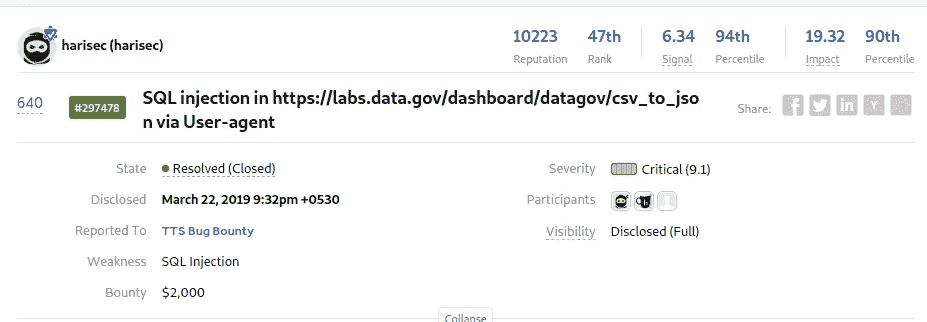
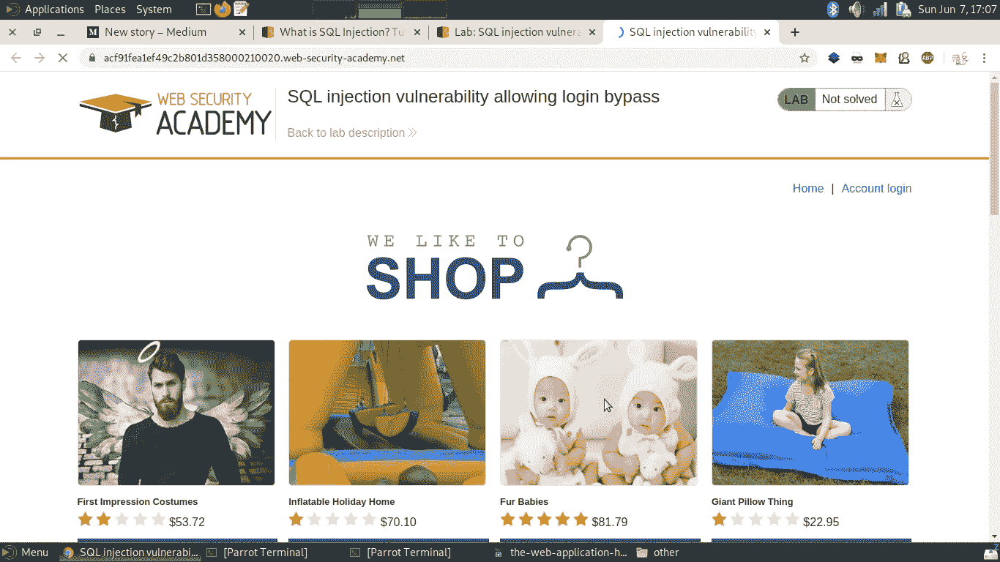
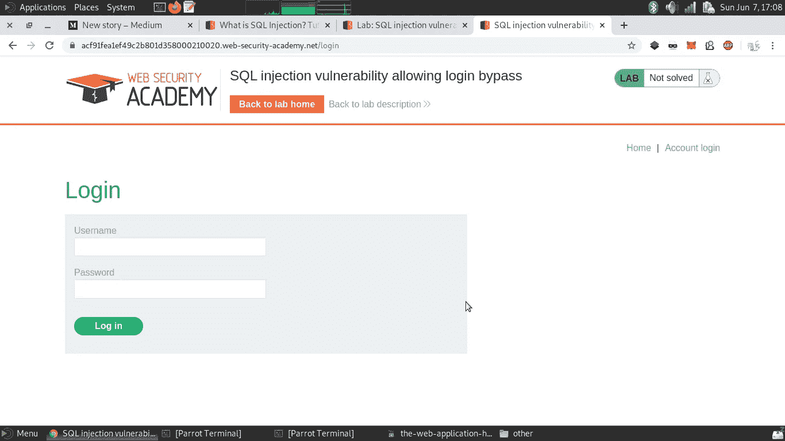
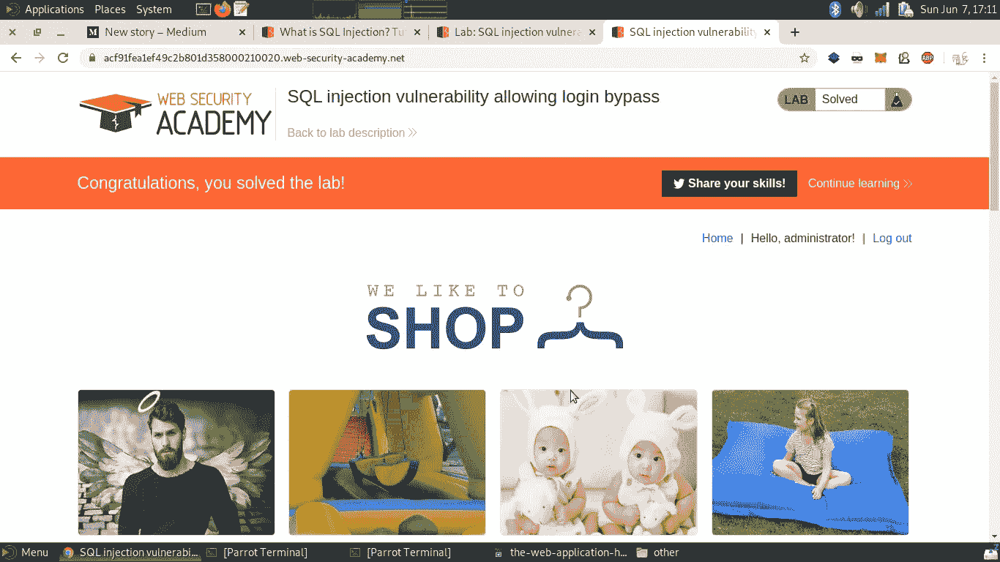
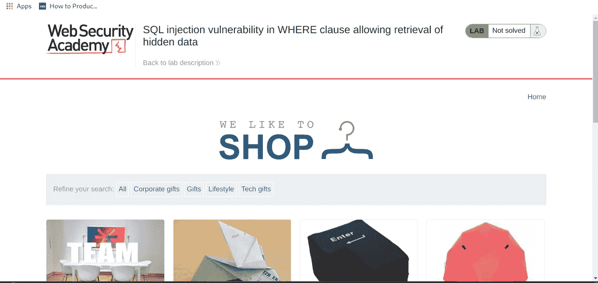
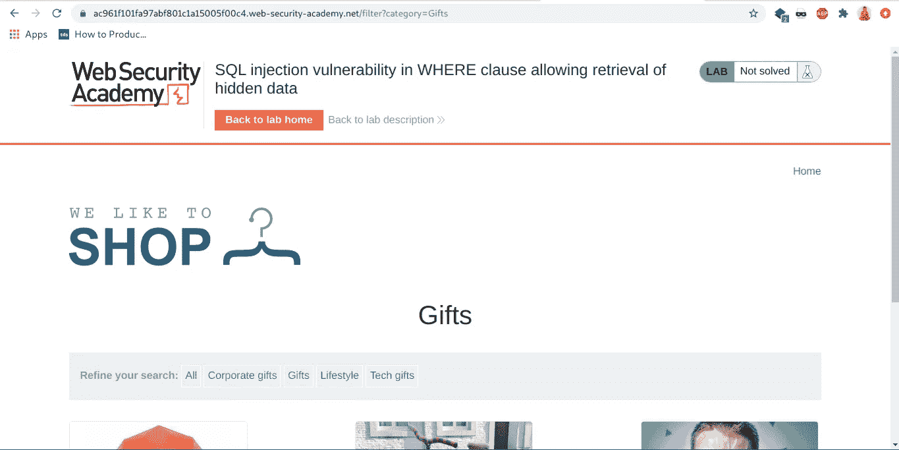
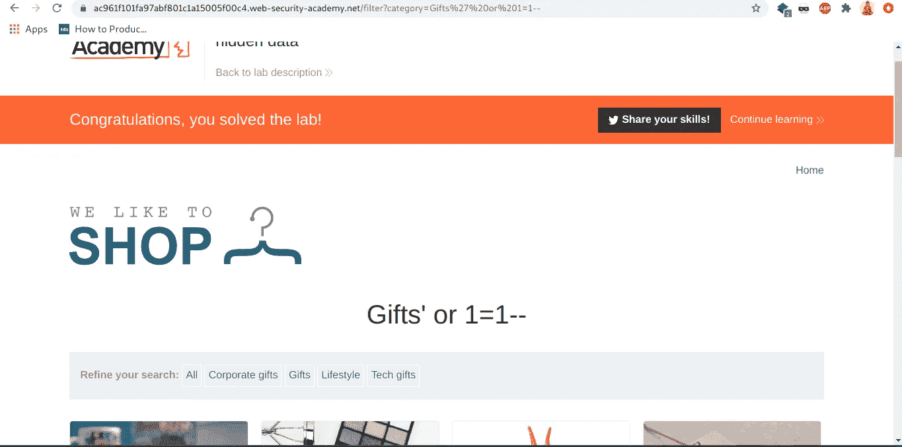
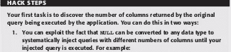
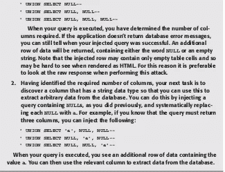

# 在 WEB 应用程序中寻找 SQL 注入的速成班:第 1 部分

> 原文：<https://infosecwriteups.com/crash-course-for-finding-sql-injection-in-webapps-part-1-99ede5c15a05?source=collection_archive---------1----------------------->

我同意在 web 应用程序中手动查找 SQL 注入是困难的事情，并且不容易找到。如果影响很大，它通常被认为是 bug bounty 中的 P1 bug，并且在 OWASP 十大注入中也名列前茅。

这篇博客文章将帮助任何人完全理解如何在 web 应用程序中找到 SQLi bugs，因为这个主题非常广泛，所以博客将包含大量的信息。

SQL 注入攻击包括通过从客户端到应用程序的输入数据插入或“注入”SQL 查询。成功的 SQL 注入攻击可以读取数据库中的敏感数据、修改数据库数据(插入/更新/删除)、对数据库执行管理操作(如关闭 DBMS)、恢复 DBMS 文件系统中给定文件的内容，在某些情况下还会向操作系统发出命令。SQL 注入攻击是一种注入攻击，在这种攻击中，SQL 命令被注入到数据平面输入中，以影响预定义 SQL 命令的执行。

几乎所有的应用程序都依赖数据存储来管理在应用程序中处理的数据。在许多情况下，这些数据驱动核心应用程序逻辑，包含用户帐户、权限、应用程序配置设置等等。数据存储库已经远远不仅仅是被动的数据容器。大多数以结构化格式保存数据，使用预定义的查询格式或语言进行访问，并包含内部逻辑来帮助管理数据。通常，当处理属于不同应用程序用户的数据时，应用程序对数据存储的所有类型的访问使用通用的特权级别。如果攻击者可以干扰应用程序与数据存储的交互，使其检索或修改不同的数据，他通常可以绕过应用程序层对数据访问的任何控制。

成功的 SQL 注入攻击可能会导致非常严重的后果。

*   攻击者可以使用 SQL 注入来查找数据库中其他用户的凭据。然后他们可以模拟这些用户。被模拟的用户可以是具有所有数据库特权的数据库管理员。
*   SQL 允许您从数据库中选择和输出数据。SQL 注入漏洞可能允许攻击者完全访问数据库服务器中的所有数据。
*   SQL 还允许您更改数据库中的数据并添加新数据。例如，在一个金融应用程序中，攻击者可以使用 SQL 注入来更改余额、取消交易或将资金转移到他们的帐户。
*   您可以使用 SQL 从数据库中删除记录，甚至删除表。即使管理员备份了数据库，删除数据也会影响应用程序的可用性，直到数据库恢复。此外，备份可能不会覆盖最新的数据。
*   在某些数据库服务器中，您可以使用数据库服务器访问操作系统。这可能是有意的，也可能是偶然的。在这种情况下，攻击者可以使用 SQL 注入作为初始媒介，然后攻击防火墙后面的内部网络。

SQL 注入攻击有几种类型:带内 SQLi(使用数据库错误或联合命令)、盲 SQLi 和带外 SQLi。

# SQL 注入的类型

SQL 注入通常分为三类:带内 SQLi(经典)、推理 SQLi(盲)和带外 SQLi。您可以根据 SQL 注入用于访问后端数据的方法及其潜在破坏程度对其进行分类。

# 带内 SQLi

攻击者使用相同的通信渠道发起攻击并收集结果。带内 SQLi 的简单性和高效性使其成为最常见的 SQLi 攻击类型之一。这种方法有两个分支:

*   基于错误的 SQLi —攻击者执行导致数据库产生错误消息的操作。攻击者可能会使用这些错误消息提供的数据来收集有关数据库结构的信息。
*   基于 Union 的 SQLi —这种技术利用了 UNION SQL 操作符，它融合了数据库生成的多个 select 语句，以获得单个 HTTP 响应。该响应可能包含可被攻击者利用的数据。

# 推理(盲)SQLi

攻击者向服务器发送数据负载，并观察服务器的响应和行为，以了解更多有关其结构的信息。这种方法称为盲 SQLi，因为数据不会从网站数据库传输到攻击者，因此攻击者无法看到有关带内攻击的信息。

盲目的 SQL 注入依赖于服务器的响应和行为模式，因此它们通常执行起来较慢，但可能同样有害。盲目的 SQL 注入可以分类如下:

*   布尔型—攻击者向数据库发送 SQL 查询，提示应用程序返回结果。根据查询是真还是假，结果会有所不同。根据结果，HTTP 响应中的信息将修改或保持不变。然后，攻击者可以计算出消息生成的结果是真还是假。
*   基于时间的攻击者向数据库发送一个 SQL 查询，让数据库等待(以秒为单位)一段时间才能做出反应。攻击者可以从数据库的响应时间看出查询是真还是假。根据结果，将立即或等待一段时间后生成 HTTP 响应。因此，攻击者无需依赖数据库中的数据，就可以判断出他们使用的消息返回的是真还是假。

# 带外 SQLi

只有在 web 应用程序使用的数据库服务器上启用了某些功能时，攻击者才能实施这种形式的攻击。这种形式的攻击主要用作带内和推理 SQLi 技术的替代方法。

当攻击者无法使用同一通道发起攻击和收集信息时，或者当服务器太慢或不稳定而无法执行这些操作时，就会执行带外 SQLi。这些技术依靠服务器的能力来创建 DNS 或 HTTP 请求，以便将数据传输给攻击者。

**现在我们将通过例子**演示寻找 SQL 注入的方法

**我们将使用 portswigger 的网络安全学院**

 [## 什么是 SQL 注入？教程和示例|网络安全学院

### 在这一部分，我们将解释什么是 SQL 注入，描述一些常见的例子，解释如何找到和利用…

portswigger.net](https://portswigger.net/web-security/sql-injection) 

**绕过登录**
应用程序访问数据存储的过程通常是相同的，
不管该访问是由非特权用户还是应用程序管理员的动作触发的。web 应用充当对数据存储的
自主访问控制，基于用户的帐户和类型构造查询来检索、
添加或修改数据存储中的数据。
修改查询(而不仅仅是查询中的数据)的成功注入攻击可以绕过应用的自主访问控制
并获得未经授权的访问。

如果安全敏感的应用程序逻辑由查询结果控制，那么攻击者就有可能修改查询来改变应用程序的逻辑。让我们来看一个典型的例子，在这个例子中，向后端数据存储查询用户表中与用户提供的凭证相匹配的记录。许多实现基于表单的登录功能的应用程序使用数据库来存储用户凭证，并执行简单的 SQL 查询来验证每次登录尝试。**下面是一个典型的例子:**
SELECT * FROM users WHERE username = ' marcus ' and password = ' secret '
该查询使数据库检查 users 表
中的每一行，并提取 username 列的值为 Marcus 而 password 列的值为 secret 的每一条记录。如果用户的详细信息返回给应用程序，则登录尝试成功，应用程序为该用户创建一个经过身份验证的会话。在这种情况下，攻击者可以插入用户名或密码字段来修改应用程序执行的查询，从而破坏其逻辑。例如，如果攻击者知道应用程序管理员的用户名是 admin，他可以通过提供任何密码
和以下用户名以该用户身份登录:

`admin'--`

这将导致应用程序执行以下查询:

请注意，注释序列`--` 导致查询的剩余部分
被忽略，因此执行的查询相当于:
SELECT * FROM users WHERE username = ' admin '
因此绕过了密码检查。

这是我们的网络应用

让我们转到“帐户登录”页面

现在我们需要绕过登录页面登录到“管理员”帐户。

在这个灰色方框的测试场景中，我们得到了管理员帐户的用户名“administrator”

现在，我们尝试通过输入以下命令绕过登录页面

`administrator'--` 在用户名字段中，我们将在密码字段中键入任意内容。

我们绕过了登录功能。

假设攻击者不知道管理员的用户名。在大多数应用程序中，数据库中的第一个帐户是管理用户，
因为该帐户通常是手动创建的，然后用于通过应用程序生成所有其他帐户。此外，如果查询返回多个用户的详细信息，大多数应用程序将只处理返回详细信息的第一个用户。攻击者通常可以利用此行为，通过提供用户名以第一个用户的身份登录数据库:

`' or 1=1--`

这将导致应用程序执行查询:

`select * from users where username='' or 1=1--'AND PASSWORD='random value'`

由于注释符号，这相当于

`select * from users where username='' or 1=1`

在某些情况下，不使用注释符号来处理尾部引号
的另一种方法是“平衡引号”您用一项字符串数据结束注入的输入，这需要一个尾随引号
来封装它。例如，输入搜索词:
**用户名’或‘a’=‘a**

例如，使用它我们可以检索应用程序中的隐藏数据

看看这个网站

我们可以看到我们有分类选择，让我们只通过过滤“礼物”来检查功能

当我点击“优化你的搜索”面板中的“礼物”时，你会看到网址从

到

无论参数是 get 还是 POST，我们都可以看到 GET 参数类别现在作为提示添加到 URL 中，每当您在过滤器功能中看到类似的情况时，无论参数是 GET 还是 POST，都可以测试它以进行 SQL 注入，稍后在博客中，自动过程也将显示使用工具进行同样的操作。

现在让我们尝试添加

`' or 1=1--`看看会发生什么

它展示了两种尚未发布的产品。

**联合运算符**

UNION 运算符在 SQL 中用于将两个或多个 SELECT
语句的结果组合成一个结果集。当 web 应用程序包含出现在 SELECT 语句中的 SQL 注入漏洞时，您通常可以使用 UNION 运算符来执行第二个完全独立的查询，并将其结果与第一个查询的结果相结合。如果查询结果返回到您的浏览器，这种技术可以用来轻松地从数据库中提取任意数据。所有主要的 DBMS 产品都支持 UNION。在直接返回查询结果的情况下，这是从数据库中检索任意信息的最快方法。
回想一下让用户能够根据作者、
书名、出版商和其他标准搜索书籍的应用程序。搜索 Wiley 出版的书籍会导致应用程序执行以下查询:

`select author,title,year from books where publisher='sql-flaws'`

这个简单的例子展示了工会
在 SQL 注入袭击中的潜在巨大力量。然而，在以这种方式利用它之前，需要考虑两个重要的附带条件:

*   当使用 UNION 运算符组合两个查询的结果时，两个结果集必须具有相同的结构。换句话说，它们必须包含相同数量的列，这些列具有相同或兼容的数据类型，以相同的顺序出现。
*   为了注入将返回有趣结果的第二个查询，攻击者
    需要知道他想要作为目标的数据库表的名称，以及
    相关列的名称。

在许多实际情况下，显示的数据库错误消息被应用程序捕获
，不会返回给用户的浏览器。因此，似乎在试图发现第一个查询的结构时，您只能进行纯粹的猜测。然而，事实并非如此。三个要点意味着你的任务通常很简单:

*   对于能够与第一个组合的注入查询，并不严格要求它包含相同的数据类型。相反，它们必须是兼容的。换句话说，第二个查询中的每个数据类型要么必须与第一个查询中的相应类型相同，要么可以隐式转换为第一个查询中的相应类型。您已经看到数据库隐式地将数值转换为字符串值。事实上，NULL 值可以转换为任何数据类型。因此，如果您不知道特定字段的数据类型，您可以简单地为该字段选择 NULL。
*   在应用程序捕获数据库错误消息的情况下，您可以
    轻松地确定您注入的查询是否被执行。如果是，
    附加结果被添加到应用程序从其
    原始查询返回的结果中。这使您能够系统地工作，直到您发现需要注入的查询的结构。
*   在大多数情况下，您可以通过在原始查询中识别一个具有字符串数据类型的
    单个字段来实现您的目标。这
    足以让您注入返回基于字符串的数据
    的任意查询并检索结果，使您能够从数据库中系统地提取任何所需的
    数据。

现在我在这里附上网络应用黑客手册中的黑客步骤

 [## 网络应用黑客手册:寻找和利用安全漏洞，第二版

### 非常成功的安全书籍带着新版本回归，完全更新的 Web 应用程序是前门…

www.wiley.com](https://www.wiley.com/en-us/The+Web+Application+Hacker%27s+Handbook%3A+Finding+and+Exploiting+Security+Flaws%2C+2nd+Edition-p-9781118026472) 

当您确定了注入的
查询中所需的列数，并且找到了一个字符串数据类型的列时，您就可以提取任意数据了。一个简单的概念验证测试是提取数据库的版本字符串，这可以在任何 DBMS 上完成。不同的数据库管理系统有不同的内置函数来获取数据库的版本字符串

这是一张备忘单

**甲骨文:**

`SELECT version FROM v$instance`

**MSSQL:**

`SELECT @@version`

**PostgreSQL:**

`SELECT version()`

**MYSQL:**

`SELECT @@version`

备忘单:

[https://www . net sparker . com/blog/we b-security/SQL-injection-cheat-sheet/](https://www.netsparker.com/blog/web-security/sql-injection-cheat-sheet/)

让我们在本系列的下一部分继续我们的旅程

 [## 在 WEBAPPS 中寻找 SQL 注入的速成班:第 2 部分

### 当执行 SQL 注入联合攻击时，有两种有效的方法来确定有多少列被攻击…

cyberdefecers.medium.com](https://cyberdefecers.medium.com/crash-course-for-finding-sql-injection-in-webapps-part-2-9208c579a781) 

由...所写

[https://twitter.com/infosec_boy](https://twitter.com/infosec_boy)