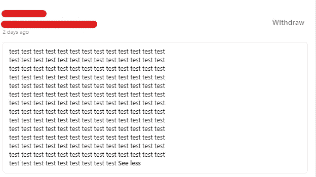
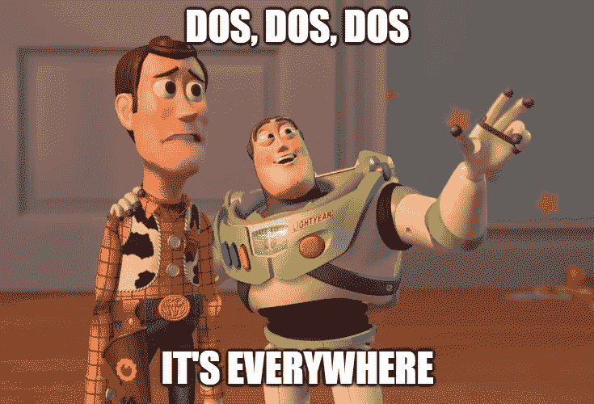
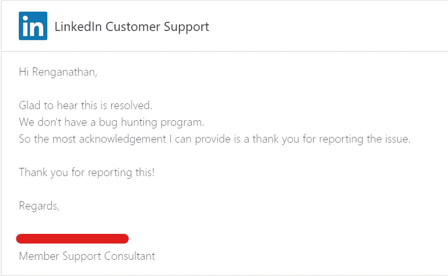

# 用一个连接请求让你的 LinkedIn 应用崩溃。

> 原文：<https://infosecwriteups.com/crashing-your-linkedin-app-with-a-connection-request-257f9b484550?source=collection_archive---------2----------------------->

你好，

我是伦加纳森。

这篇文章是关于我在 LinkedIn 上发现的一个意外错误。

那是我加入 LinkedIn 的早期，我不太了解它的工作功能。我这辈子只用过 insta gram * _ *

我试图给一个人发送一个连接请求，我注意到我可以给这个请求一个个性化的注释。我添加了一条大约 650 个字符的消息。

但是 LinkedIn 只允许 300 个字符。所以作为一个 noob，我所做的是，我使用 inspect 元素来更改 maxlength=300 值。然后我发了请求。

嘣！

没用，你还指望什么:/

然后我想到了用 Burp Suite 来增加更多的内容，也就是 POST 请求中的 300 多个字符。如下图所示

" message":{"values":[{"value ":"在 Instagram 上关注我" }]}

而我点击了转发，连接请求发送成功。然后我去我的网络/邀请管理器/发送/查看发送的连接请求。

嘣！

这奏效了:)

无线一键通

所以，我发送的字符显然超过了 300 个，并且发送成功。

因此，将此报告为业务逻辑错误是不好的。所以我试着给我的测试账户添加一个非常大的请求，大概有十万个字符。

我用安卓手机打开它，应用程序崩溃了。

我就想“这是 DOS 吗？脆弱性"

时间线:

2020 年 10 月 10 日-报道

2020 年 10 月 14 日-审判

2020 年 12 月 20 日-重新测试

2020 年 12 月 22 日-已修补并确认收到焊接确认

来自 LinkedIn 的致谢

感谢阅读:)
注意安全。

[https://www.instagram.com/renganathanofficial/](https://www.instagram.com/renganathanofficial/)