# 用洋葱路由器(TOR)创建一个隐藏的 IRC 服务器

> 原文：<https://infosecwriteups.com/create-a-hidden-irc-server-with-the-onion-router-tor-c839e3a81d78?source=collection_archive---------0----------------------->

## 与无法追踪的 IRC 服务器进行秘密通信的指南


克林特·帕特森在 [Unsplash](https://unsplash.com?utm_source=medium&utm_medium=referral) 上拍摄的照片

你想和你的匿名团队建立秘密联系吗？
或者，你和一个秘密团队成员有一个秘密项目？

在这篇文章中，我会支持你所需要的。

IRC 代表互联网中继聊天，是一个基于文本的聊天系统，用于[即时通讯](https://en.wikipedia.org/wiki/Instant_messaging)([https://en.wikipedia.org/wiki/Internet_Relay_Chat](https://en.wikipedia.org/wiki/Internet_Relay_Chat))。IRC 的过程是基于客户-服务器网络模型的。

所以，当你想和别人聊天时，你需要 IRC 服务器和 IRC 客户端。

## **洋葱路由器？**

TOR 或洋葱路由器是匿名的答案，这个协议帮助你进行秘密通信，而不知道你的 IP 地址或你的分析活动。

> 隐私是一项人权

上面的引用是我喜欢 TOR 的原因之一。我赞同 TOR Project 的说法，就是“每个人都值得拥有隐私”。

然后，正如我之前提到的，今天我们将为聊天系统与 IRC 进行秘密交流，为神奇的匿名与 TOR 进行秘密交流。

## 设置 IRC 服务器

在这个例子中，我使用 Ubuntu server 20.04 作为 IRC 服务器的虚拟机。

首先安装**检查器**和**转子**。

```
sudo apt install -y inspircd tor
```

在**/etc/inspircd/inspircd . motd**中更改你的标题，如果你这么懒，就从我的标题中复制。

```
-------------------------------------
Welcome to super secret chat
-------------------------------------
```

然后运行服务并检查状态，

```
sudo service inspircd start && sudo service inspircd status
```

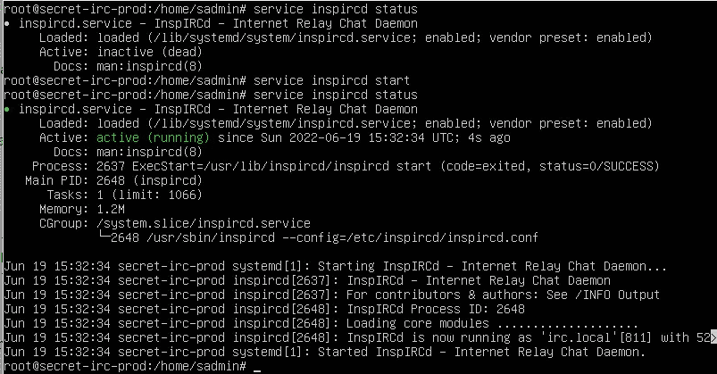

在**/etc/insp ircd/insp ircd . conf**更改配置，对于 IRC 服务器的概念验证，我将地址绑定到机器 IP，因为如果您使用默认的(127.0.0.1 ),您的 IRC 服务器将无法与其他机器通信。

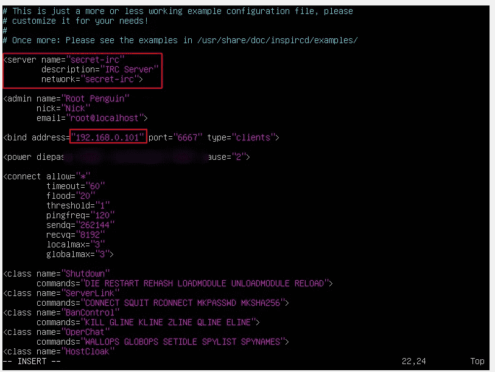

您的 IRC 服务器已经准备好进行下一步了。

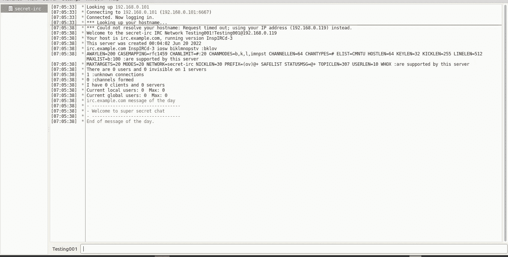

## 用 TOR 创建一个隐藏的服务

确保将绑定地址更改为 loopback (127.0.0.1 ),因为您必须将 tor 配置中的隐藏服务设置为 localhost:

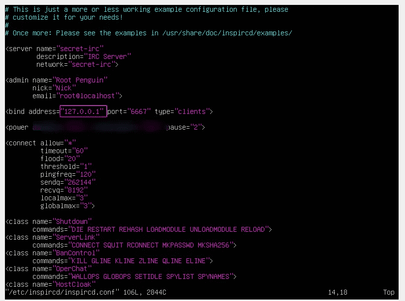

然后用下面的配置更改 **torrc** 文件( **/etc/tor/torrc** )

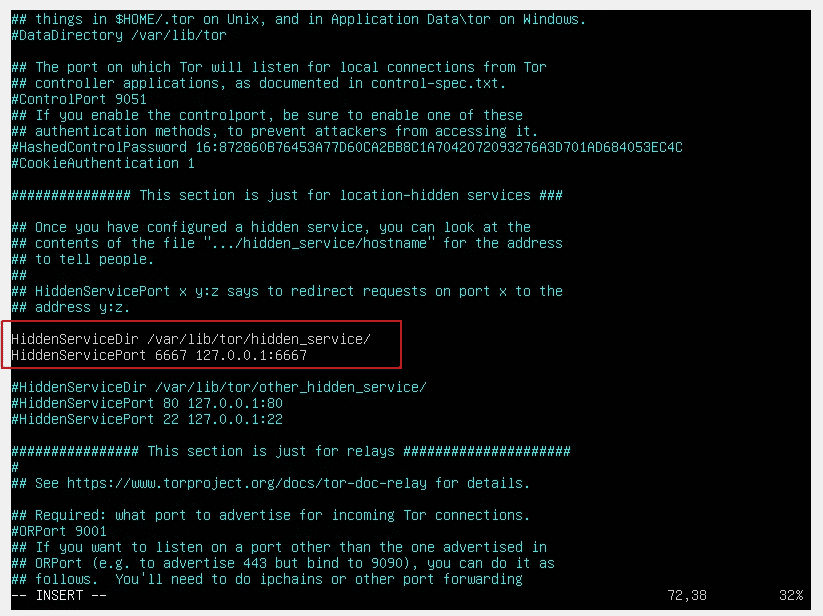

在 IRC 服务器后台运行 **tor** 并获得洋葱域名。

```
sudo tor &
```

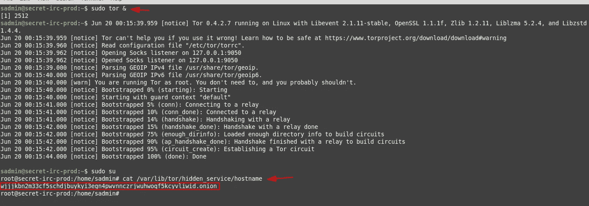

祝贺你，你的隐藏 IRC 服务器是活的。

## 加入 IRC 服务器

首先，你必须在你的电脑上运行 tor 网络，下面的命令让你加入 tor 中继。

```
sudo tor &
```

然后用下面的代理设置配置你的 IRC 客户端:

```
Hostname: 127.0.0.1
Port: 9050
Type: SOCKS5
```

因为我使用 HexChat，这是我的网络设置

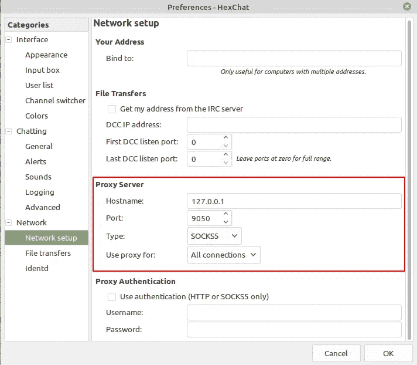

最后，你的服务器和你的电脑在同一个网络，tor。所以你可以用洋葱域名连接到**secret-IRT-or**。

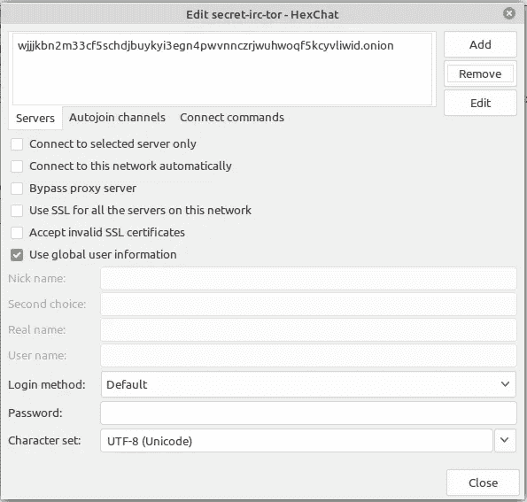

连接到网络，

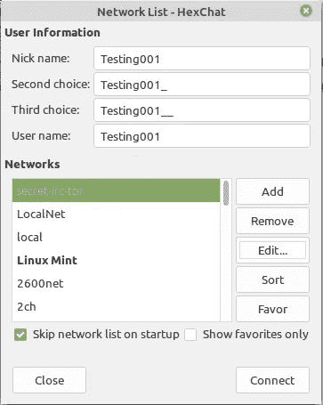

答对了……
你已经和隐藏的 IRC 服务器连接上了。

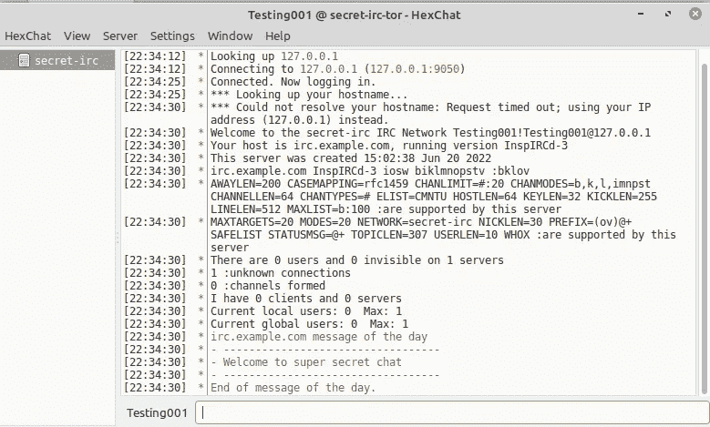

## 演示

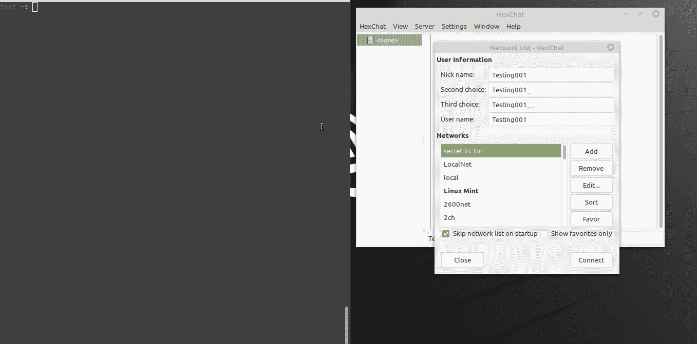

## 结论

TOR 网络保护您的隐私并保持匿名。上面的教程只是为了学习，我希望你明智地使用这些知识。

> 任何利用上述知识的犯罪都超出了我的责任范围。

感谢阅读。