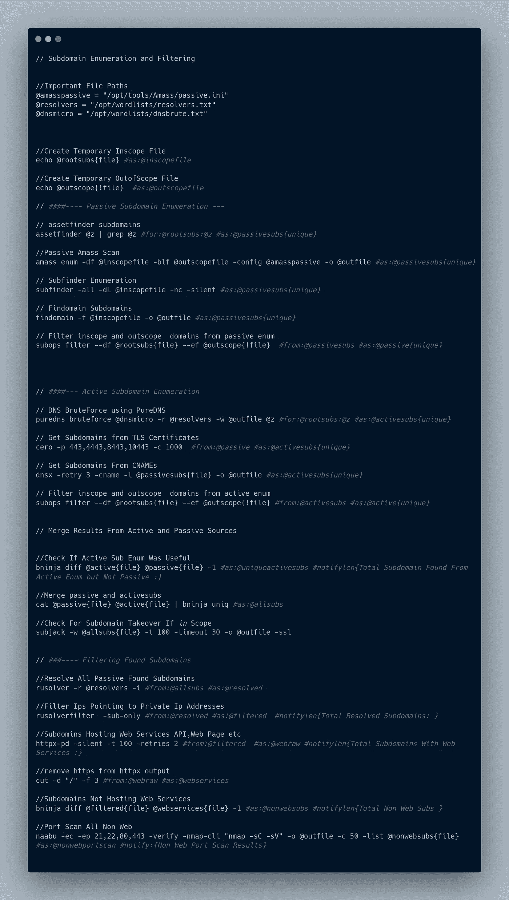
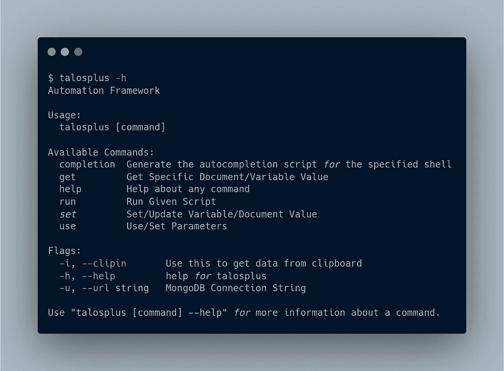

# 无需书呆子气的 Bash 技能，即可创建您的终极 Bug 奖励自动化(第 1 部分)

> 原文：<https://infosecwriteups.com/create-your-ultimate-bug-bounty-automation-without-nerdy-bash-skills-part-1-a78c2b109731?source=collection_archive---------0----------------------->

嘿大家，我希望你们都做得很好。我用多种语言编程已经有一段时间了，所以我认为编写 Bash 自动化脚本会相当简单，但是 Bash 太糟糕了！！。

所以我创建了一个新的工具[***【talosplus】***](http://github.com/tarunKoyalwar/talosplus)，它使得用最简单的方式编写和运行最复杂的 bash 脚本成为可能。这篇文章是关于理解和使用[***talosplus***](http://github.com/tarunKoyalwar/talosplus)。

 [## GitHub - tarunKoyalwar/talosplus:无需学习即可创建和运行智能自动化脚本…

### Talosplus 是一个以更快的速度运行 bash 脚本的工具，它使用 goroutines 和一些…

github.com](https://github.com/tarunKoyalwar/talosplus) 

距骨突

**关于我—**

我是 Tarun，来自印度的安全研究员和 bug 猎人。我每天都在寻找 bug 或者创造新的 bug 奖励工具。这是我的第一个博客，我希望它能传达我想要描述的东西。

资料来源:Giphy

**为什么要自动化内容发现？？**

如果你已经看过 [***赏金***](https://www.youtube.com/watch?v=nCHd2Ynmjq0) ***周四*** 的内容发现集，你就已经知道答案了。

内容发现是最关键的一步。您发现 bug 的几率很大程度上取决于您的内容发现方法。如果你在一个单独的领域工作，这很重要，但是当你在像 Grammarly，Tesla 等通配符领域工作时。自动化至关重要，可以节省大量时间和精力。

**智能自动化—**

简单地将所有使用过的命令保存在一个文本文件中并运行它是简单的，但却适得其反。如果您想了解 bash 脚本的复杂程度，看看****。****

*reconftw 只是标准，如果你只使用它，那么你会错过很多有趣的东西，比如 bash *一行程序*， *gf-patterns，*等等更有趣的东西。如果你想提高发现 bug 的几率，你必须有自己的个人自动化，而且是智能的。*

*资料来源:Giphy*

***并行执行命令&竞争条件—***

*并行执行命令是加速 bash 脚本的最佳方式。并行执行命令会产生许多问题，其中最糟糕的问题是向命令传递数据，并提取和保存命令的输出。当命令并行运行以避免竞争情况时，必须使用。锁定文件。*

*talosplus 管理所有这些问题，并将它们抽象化，如果可能的话，尝试并行运行每个命令。*

> *talosplus 包含了有效运行 bash 脚本的所有可能的好特性，这些特性要么是受启发的，要么是从流行的工具中获得的，比如*
> 
> ***xargs，并行，隔行，bbrf，通知***

***子域枚举自动化脚本***

**

*访问 [**此处**](https://raw.githubusercontent.com/tarunKoyalwar/talosplus/main/static/script.png) 查看/下载图片*

> *这是我在侦察过程中使用的一个子域枚举 Bash 脚本示例。如果你仔细观察，你会发现这个文件没有任何 for 循环、管道、环境变量、局部变量、函数等等，这只是普通的旧命令和注释。另一个有趣的事情是没有直接的结构，所以 talosplus 提供了文件系统抽象*

*这与 reconftw 或任何自动化脚本都不相似，但它是所有脚本中最快、最简单的。让我们更深入地研究 talosplus 的所有特性，并编写您自己的自动化脚本*

***语法—***

*除了命令和注释，您还可以找到两种不同的东西*

> *@variables =这些是这个 bash 脚本的变量，而不是以$开头的 bash 变量。这些由 talosplus 处理，并在运行时替换*
> 
> *#directives =我调用这些指令，它们处理最复杂的部分，也由 talosplus 管理。talosplus 支持的指令有#from、#as、#for、#notify、#notifylen、#dir。*

***数据存储—***

*我受到了 honoki 的[***bbrf***](https://github.com/honoki/bbrf-client)的很大启发。Talos 的最初版本只是用上述特性解析和执行命令，并将输出保存到一个文件中。在使用 bbrf 之后，我受到了启发，将它所有的优点与额外的特性整合在一起，这个项目变成了 talosplus。*

*Talosplus 使用 **MongoDB** 作为后端存储数据，不像 **bbrf** 使用 **CouchDB** 。它与 bbrf 非常相似，但是有更多的特点*

**

****bash 脚本中声明/存在的所有变量*** 都可以使用`get,set`子命令设置和检索，甚至在执行完成后也可以。它也可以使用剪贴板作为输入。在脚本中设置/获取任何变量的语法是*

> *talosplus get @resolvedsubs //从 mongodb 中检索变量*
> 
> *talosplus set—var @ resolvers 1.1.1.1//设置数据有 3 个可能的选项 1 .作为参数传递，2 .作为管道/标准输入传递，3 .从剪贴板传递*

*阅读 [***下一部分***](https://medium.com/@zealousme/create-your-ultimate-bug-bounty-automation-without-nerdy-bash-skills-part-2-c8cd72018922) 了解更多关于编写语法的知识。*