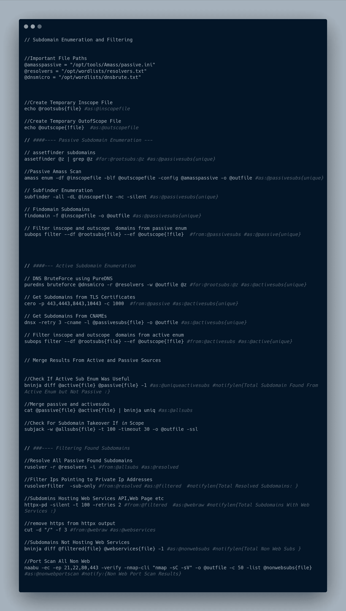

# 无需书呆子气的 Bash 技能，即可创建您的终极 Bug 奖励自动化(第 2 部分)

> 原文：<https://infosecwriteups.com/create-your-ultimate-bug-bounty-automation-without-nerdy-bash-skills-part-2-c8cd72018922?source=collection_archive---------3----------------------->

在最后 [***部分***](https://medium.com/@zealousme/create-your-ultimate-bug-bounty-automation-without-nerdy-bash-skills-part-1-a78c2b109731) 。我介绍了核心组件，在这一部分，我们将深入探讨语法及其用法。如果你还没有读过前一部分，我建议你读一读。

[](https://github.com/tarunKoyalwar/talosplus) [## GitHub - tarunKoyalwar/talosplus:无需学习即可创建和运行智能自动化脚本…

### Talosplus 是一个以更快的速度运行 bash 脚本的工具，它使用 goroutines 和一些…

github.com](https://github.com/tarunKoyalwar/talosplus) 

访问 [**此处**](https://raw.githubusercontent.com/tarunKoyalwar/talosplus/main/static/script.png) 查看/下载图片

**设置/全局变量**

在上面的脚本中，`Important File Paths`下面的变量是全局变量，类似于 bash 脚本的 env 变量，但是约束条件减少了。这些变量可以直接用于命令。当这个脚本第一次被解析时。它将提取所有全局变量并从中解析设置。以下脚本选项被视为设置，可以作为二进制文件的参数给出，也可以在脚本本身中声明

```
@pname = Project Name / Directory Name Where data is saved 
@purge = Use/ Purge Cached Output of Command (default : false)
@cachedir = CacheDIR (Default: os.TempDir())
@disablenotify = Disable All Alerts / Notifications (default: false)
@notifytitile = Discord Message Header
@limit = Max Concurrent Executions of CommandsThese variables are considered as settings
```

**通知**

Talosplus 只支持不和谐通知，以后可能还会支持其他的。不一致的 webhook 令牌和 id 可以作为参数传递给二进制或来自实际的环境变量。我通常把它们存起来。bashrc

```
DISCORD_WID, DISCORD_WTOKEN = Discord ID and Token
```

> 当解析上面的脚本注释时，命令被认为与该命令相关联，并且在输出中使用注释

**使用变量—**

命令中使用的变量名在命令执行前被替换，如果变量被声明，还检查静态错误。如果变量已声明但未使用，则跳过命令及其派生命令

```
//Passive Amass Scan
amass enum -df @inscopefile -blf @outscopefile -config @amasspassive -o @outfile #as:@passivesubs{unique}Before actual command is executed these variables @inscopefile,@outscopefile,@amasspassive,@outfile etc are replaced with its values. If any value is not found / empty command is skipped# Special Case
@outfile = This is a special variable , lot of commands save their actual data to a file and their terminal output contains banners etc and stuff . In such cases when @outfile is used a temporary file is created and Content of that file is considered as output instead of the actual terminal output.@tempfile = Create a temporary file and use filepath as its value
```

**变量运算—**

有些操作可以在变量上执行，这些变量在变量 ex: @passivesubs{unique}旁边的{}中指定。以下是当前可用的操作。这些变量也可以由多个输入/输出命令共享，并且是线程安全的。

```
@passivesubs{file} = Instead of using this string, value of this variable is saved to a file and filepath is passed .@passivesubs{!file} = Same as above but file can be empty@passivesubs{add} = Data is appended to this variable edges are trimmed@passivesubs{unique} = Data is appended to this variable but has unique lines
```

**指令—**

这些是 talosplus 的实际核心，并提供了惊人的功能。这些指令在命令执行前被省略，可以写在任何地方。在命令末尾使用这些指令是一个好习惯。

1.  **#导演**

#dir 是带有语法`#dir:/path/to/folder`的指令。使用时，在该目录而不是当前目录中运行此命令。由于显而易见的原因，我们通常不会将从 GitHub 下载的工具，尤其是 python 工具添加到 PATH 中，在这种情况下，这个指令是最有用的。

```
// list all files in logs
ls -la #dir:/var/log
```

2.**#通知**

#notify 是一个指令，它使用命令的输出和指定的消息，并将其发送到已配置的 discord 通道。它还会报告命令是否失败。如果命令没有产生任何输出，则不会发送通知。它的语法是`#notify{Text Message}`。

```
// notify
//Check For Subdomain Takeover If in Scope
subjack -w @allsubs{file} -t 100 -timeout 30 -o @outfile -ssl #notify{Found Possible Domains Vulnerable to Subdomain Takeover :}
```

3. **#notifylen**

#notifylen 类似于#notify，但有一个主要区别，它不是发送命令的输出，而是发送数组的长度。它的语法是# notifylen {文本消息}

```
// notifylen
//Subdomins Hosting Web Services API,Web Page etc
httpx-pd -silent -t 100 -retries 2 #from:@filtered  #as:@webraw #notifylen{Total Subdomains With Web Services :}// This will send a notification similar to
Total Subdomains With Web Services : 60
```

4.**#来自**

#from 是指令，语法为#from:@somevar。当一个命令有这个指令时，它从@somevar 获取输入，并使用它的值作为命令的标准输入

```
//Resolve All Passive Found Subdomains
rusolver -r @resolvers -i #from:@allsubs #as:@resolvedHere value present in @allsubs is used as stdin.
```

5.**#为**

#as 是带有语法 *#as:@resolved* 的指令。当一个命令有这个指令时，它将命令的输出作为@resolved 导出到缓冲区。与这些缓冲区/变量相关的所有操作都是线程安全的。

```
//Resolve All Passive Found Subdomains
rusolver -r @resolvers -i #from:@allsubs #as:@resolvedHere output of this command is saved to @resolved variable.
```

6. **#for**

#for 是指令，语法为 *#for:@array:@localvar* 这类似于 java etc 中的 for-each 循环。@localvar 仅限于命令。如果@array 的值为空，则跳过该命令。@array 是一个字符串，由换行符分隔

```
// DNS BruteForce using PureDNS
puredns bruteforce @dnsmicro -r @resolvers -w @outfile @z #for:@rootsubs:@z #as:@activesubs{unique}Here for each subdomain of @rootsubs . A new command is launched .
```

这总结了如何编写和使用特定的语法。接下来的 [***和最后的***](https://medium.com/@zealousme/create-your-ultimate-bug-bounty-automation-without-nerdy-bash-skills-part-3-7ee2b353a781) 部分将描述如何运行任何脚本、设置和用法。