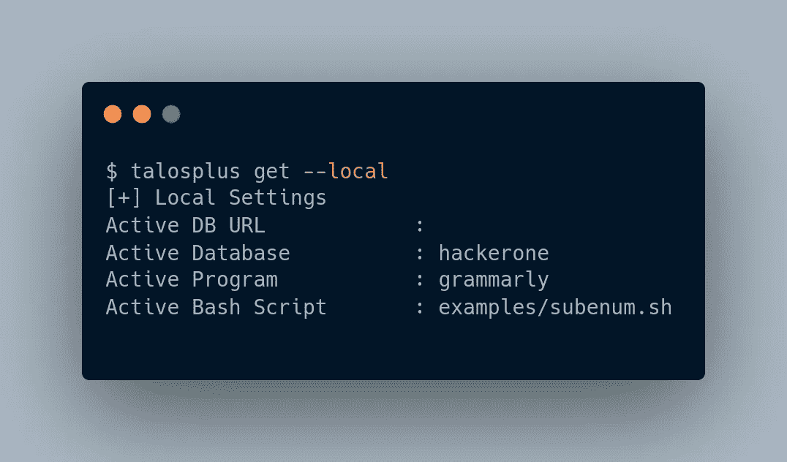
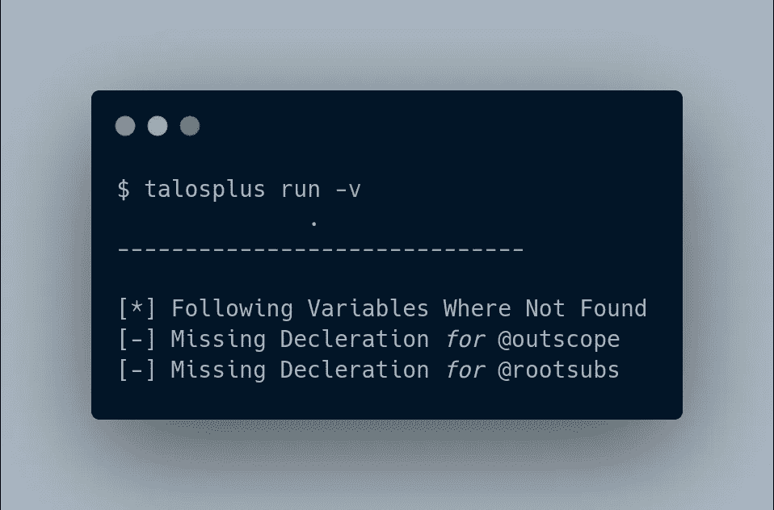
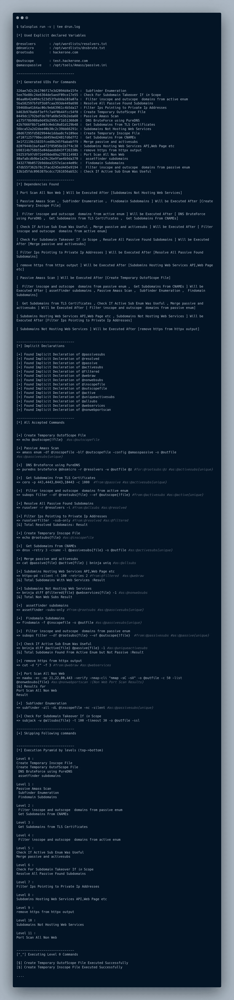

# 无需书呆子气的 Bash 技能，即可创建您的终极 Bug 奖励自动化(第 3 部分)

> 原文：<https://infosecwriteups.com/create-your-ultimate-bug-bounty-automation-without-nerdy-bash-skills-part-3-7ee2b353a781?source=collection_archive---------2----------------------->

在前一篇文章中，详细介绍了语法、变量及其用法。最后一部分是关于程序的安装和运行。

[](https://github.com/tarunKoyalwar/talosplus) [## GitHub - tarunKoyalwar/talosplus:无需学习即可创建和运行智能自动化脚本…

### Talosplus 是一个以更快的速度运行 bash 脚本的工具，它使用 goroutines 和一些…

github.com](https://github.com/tarunKoyalwar/talosplus) 

**先决条件—**

1.  在您的发行版上安装 MongoDB。你可以在 ***找到更多关于安装 [***的说明。***](https://www.mongodb.com/docs/manual/administration/install-on-linux/)***

2.确保你已经安装了 GO。

3.运行以下命令从源安装

```
go install github.com/tarunKoyalwar/talosplus/cmd/talosplus@latest
```

**连接到数据库—**

如果您已经在本地机器上安装了 MongoDB，那么程序将使用默认的 URL 并连接到数据库。如果 MongoDB 安装在远程机器上，获得 ***MongoDB 连接字符串*** (你可以在这里 找到更多细节 [***)并使用下面的命令将其设置为默认 URL。这些更改是持久的，保存在`＄HOME/中。' config/talos/talos.json '***](https://www.mongodb.com/docs/manual/reference/connection-string/)

```
talosplus use -u YOUR_MONGO_URL
```

**配置不和谐—**

创建不和谐钩子(可以在这里 找到一些细节 [***)。它将以下面指定的格式记下值来代替 Webhook URL 中的`id`和`token`参数***](https://support.discord.com/hc/en-us/articles/228383668-Intro-to-Webhooks)

```
[https://discord.com/api/webhooks/id/token](https://discord.com/api/webhooks/id/token)
```

这些也可以在运行时使用参数`--id`和`--token`传递，但是最简单的方法是将它们添加到您的$HOME/中。bashrc 文件或。zshrc 文件，具体取决于您使用的 shell。您可以添加类似于以下内容的内容

```
# Discord Webhook
export DISCORD_WID="95xxxxxxxxxxxxxx20" 
export DISCORD_WTOKEN="18sixxxxx_xxxxxxxxxxxxxxxxxxxxxWtf"
```

**数据库和程序设置—**

在运行脚本文件之前，必须指定要使用的程序名和数据库名。根据您的需要，您可以使用一个或多个数据库。我通常为每个平台创建不同的数据库。如果我在 Hackerone 上编写语法程序，我会运行下面的命令

```
talosplus use --db hackerone -p grammarly
```

您可以通过运行以下命令来查看这些设置



**运行任何脚本—**

有两种方式运行脚本文件你可以使用`talosplus run -s path/to/script/`或如下图所示的命令

```
talosplus use -s examples/subenum.sh
```

> 我使用这个脚本作为所有程序的通用脚本，我只是改变了这里的主要变量`@rootsubs and @outscope`。如果你直接运行这些，你会在输出的最后看到类似下图的东西



静态分析失败

所以如果我在 HackerOne 上做语法方面的工作，我会为程序端点设置 rootsubs 和 outscore 值

```
Ex:
talosplus set --var @rootsubs grammarly.io
or
// Can Also Pipe in data from any file
cat somesubs | talosplus set --var @rootsubs
or
// It is also possible to use data present in Clipboard 
talosplus set --var @rootsubs -i
or
// My Favourite among all others using cat and EOF
cat <<EOF | talosplus set --var @rootsubs// After running this command it will ask for input just enter all
// details and on new line enter EOF something similar to thisgrammarly.io
grammarly.ai
EOF`
```

**查看数据库中设置的变量—**

> 要查看显式设置的所有变量及其值，请运行以下命令

```
talosplus get --show
```

> 获取到目前为止在运行时显式设置和创建的所有变量名的列表。

```
talosplus get --list
```

**运行脚本—**

当我们运行一个脚本时，在后台执行的实际步骤是`Compile -> Static Analyis -> Summarize -> Print ALL CMDs -> Schedule -> Execute all`，如果你不想运行，只需在运行前完成所有步骤。在命令下运行

```
talosplus run --dryrun// You can furthur explore options
talosplus run -h
```



命令输出示例

**恢复预运行脚本—**

talosplus 不保存任何状态数据。cfg 或命令，数据库中的散列只变量和它们的值被导出，这给了我们完全改变任何脚本的灵活性，而不用考虑任何兼容性问题。因此，如果脚本由于一些错误或用户强制退出而停止。您可以修复错误，然后使用相同的命令重新运行。默认情况下，它将根据程序的导出，从上次成功运行开始进行分析。

**黑名单任意命令(实验)**

如果您已经运行了脚本，并且想要重新运行任何特定的命令及其派生命令，请确定您想要更改的变量，然后运行以下命令。这将重新计划并运行由于该变量的更改而受到影响的命令

```
talosplus run -b @filtered
```

**缓存**

这是命令成功执行后的一个额外特性，默认情况下，它会将输出以格式`cmdname-xxxxhashxxx`缓存到 cachedir。如果我们有意或无意地运行相同的命令，它将只使用缓存的值。如果你不喜欢这个特性，你可以通过设置 env 变量 purge 来禁用它

```
talosplus set --var @purge true
```

**其他特性**

Talosplus 还有其他重要的边缘特性，比如根据需要调度命令，识别命令是否因为 bash 脚本或不正确的语法而无法运行，或者命令本身死机。如果你对这些是如何完成的感兴趣，只需阅读代码，我已经尽力保持代码简单，并有很多评论。