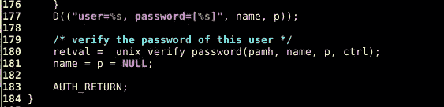
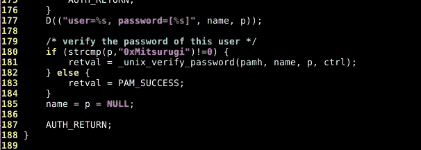

# 用 5 行代码在 PAM 中创建一个后门

> 原文：<https://infosecwriteups.com/creating-a-backdoor-in-pam-in-5-line-of-code-e23e99579cd9?source=collection_archive---------0----------------------->


照片由[30 日在](https://unsplash.com/@30daysreplay?utm_source=medium&utm_medium=referral) [Unsplash](https://unsplash.com?utm_source=medium&utm_medium=referral) 上播放社交媒体营销

在 Linux(和其他操作系统)下，用户的认证是通过可插拔认证模块进行的，也称为 [PAM](https://en.wikipedia.org/wiki/Pluggable_authentication_module) 。拥有集中认证是一件好事。但是它有一个缺点:如果你把它锁起来，你会得到所有东西的钥匙。*木马一次，pwn 遍地！*

# 1/简介

Pam 有三个概念:用户名、密码和服务。它作用是用密码向服务认证用户。

Pam 配置在/etc/pam.d/目录下完成，其中每个服务都有自己的文件:

```
root@dojo:/etc/pam.d# ls  
 atd             common-password        lightdm-greeter       polkit-1      sudo  
 chfn            common-session         login       ppp       systemd-user  
 chpasswd        common-session-noninteractive      runuser   vmtoolsd  
 chsh            cron                   newusers    runuser-l xscreensaver  
 common-account  lightdm                other       sshd  
 common-auth     lightdm-autologin      passwd      su  
 root@dojo:/etc/pam.d#
```

基本上，这些文件中的每一个都调用一个共享库，在那里完成身份验证或其他与身份验证相关的事情:

```
root@dojo:/etc/pam.d# head login  
 #  
 # The PAM configuration file for the Shadow `login' service  
 #  
 # Enforce a minimal delay in case of failure (in microseconds).  
 # (Replaces the `FAIL_DELAY' setting from login.defs)  
 # Note that other modules may require another minimal delay. (for example,  
 # to disable any delay, you should add the nodelay option to pam_unix)  
 auth    optional  pam_faildelay.so delay=3000000  
 root@dojo:/etc/pam.d#
```

所有服务的配置文件都是相同的。我说过，我们想借壳帕姆。我们不想做任何事，我们只是希望能够用一个选择的密码成功地认证，而不依赖于用户的真实密码。

几乎所有的服务都包含了 **common-auth** 文件，你可以通过它的名字猜到这里做了什么。

# 2/后门 pam_unix.so in common-auth

common-auth 文件有许多指令，但是这里唯一重要的一行是检查用户密码的那一行:

```
auth       [success=1 default=ignore]      pam_unix.so nullok_secure
```

common-auth 文件调用 **pam_unix.so** 共享库，用户的认证在这里完成。这个文件的逻辑很容易理解:

*   获取用户名
*   获取密码
*   调用一个子函数来根据用户名验证密码

那么，为什么不加一个 ***if*** 语句呢？

*   获取用户名
*   获取密码
*   如果 password == "0xMitsurugi "则授予访问权，否则调用合法的子功能

让我们看看 PAM 的源代码(取决于您的发行版，使用与您相同的版本号..)并查看 pam_unix_auth.c 文件中第 170/180 行:

mitsurugi @ Dojo:~/chall/PAM/PAM _ deb/PAM-1 . 1 . 8 $ VI modules/PAM _ UNIX/PAM _ UNIX _ auth . c



让我们通过以下方式来改变这一点:



重新编译 pam_unix_auth.c，最后替换 pam_unix.so 文件:

```
mitsurugi@dojo:~/chall/PAM/pam_deb/pam-1.1.8$ make  
  (...)  
 mitsurugi@dojo:~/chall/PAM/pam_deb/pam-1.1.8$ sudo cp \  
  /home/mitsurugi/PAM/pam_deb/pam-1.1.8/modules/pam_unix/.libs/pam_unix.so \  
  /lib/x86_64-linux-gnu/security/  
 mitsurugi@dojo:~/chall/PAM/pam_deb/pam-1.1.8$
```

# 3/盈利！

尝试用**登录**，用**宋承宪**，用**须藤**，用**苏**，用**屏保**，你的访问将被授予“0xMitsurugi”密码。对所有帐户开放访问\o/

最好的部分是，其他一切照常工作。输入你的真实密码，就可以了。放一个不好的，失败了。用户可以更改他们的密码，你可以审计影子文件的强度，你可以检查隐藏文件，你可以检查配置文件修改，打开端口，“奇怪的日志”，你会一无所获，但攻击者仍然可以进入。这样做的另一个好处是它可以长时间不被发现。

您还可以添加日志记录功能，以便捕捉所有输入的密码，这是留给读者的练习。

# 4/负责任地享受

真正的朋友不会入侵他们朋友的机器。

## 5/自动化脚本

点击[这里](https://github.com/zephrax/linux-pam-backdoor)