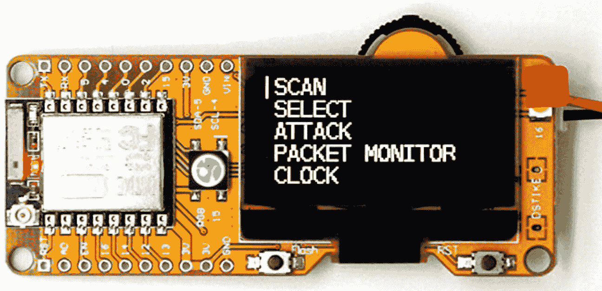
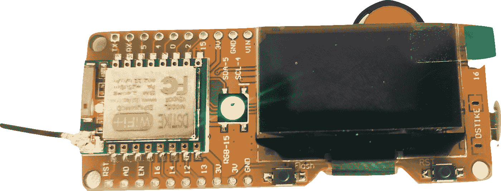
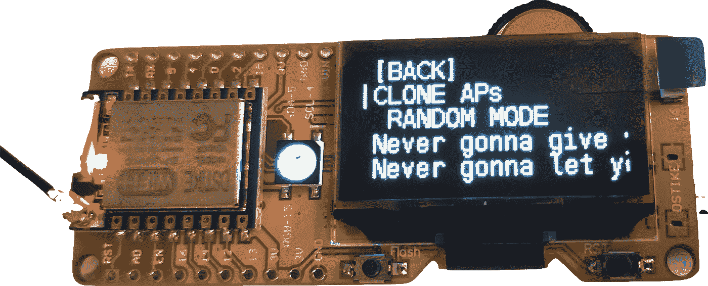
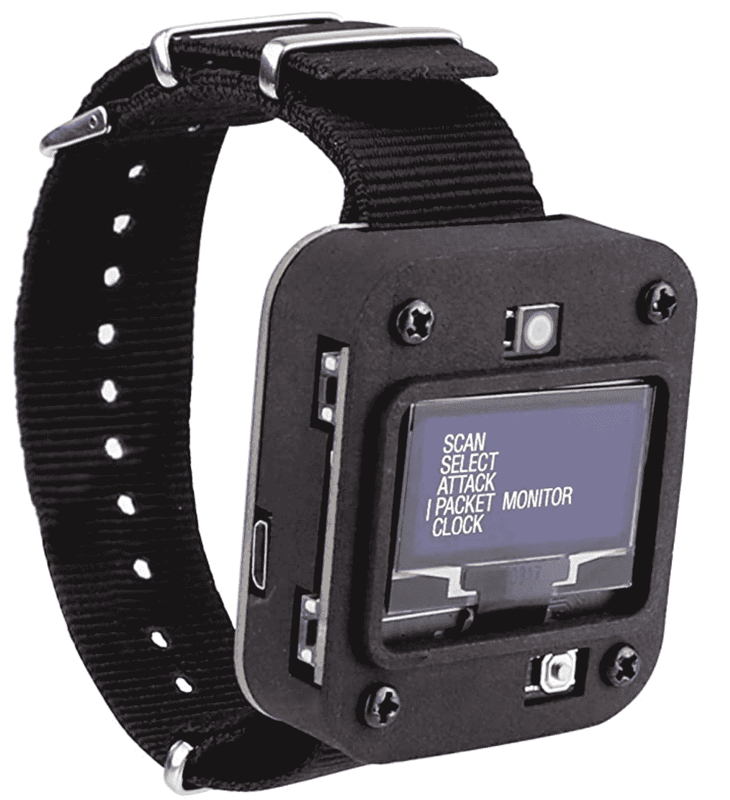
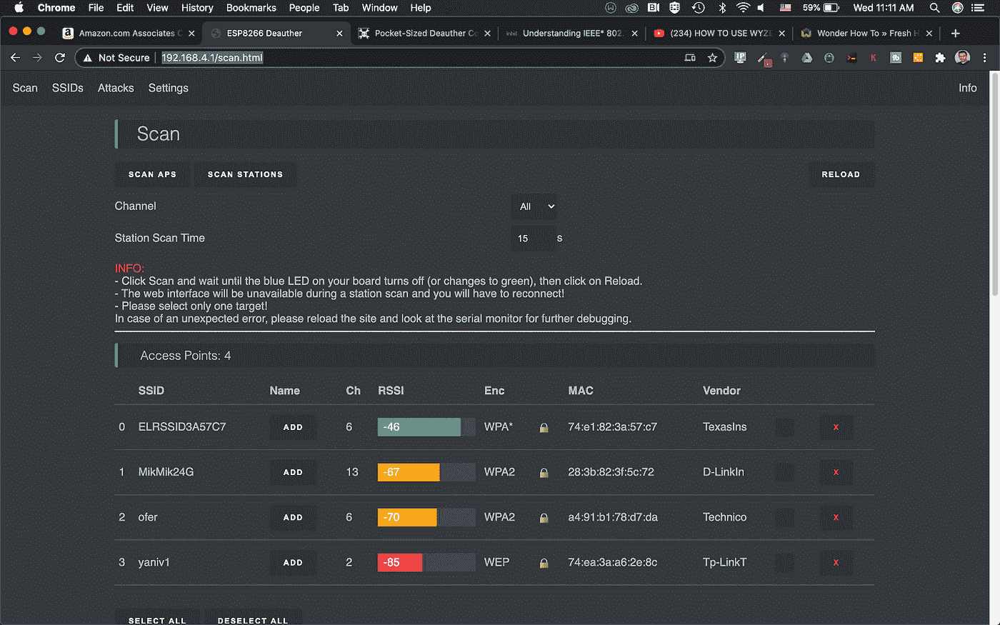
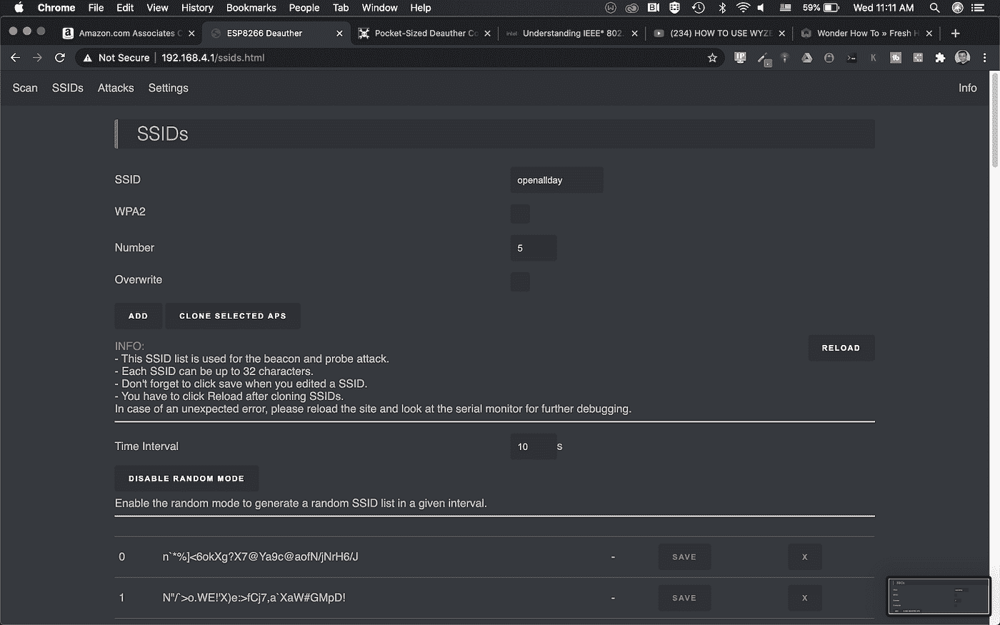
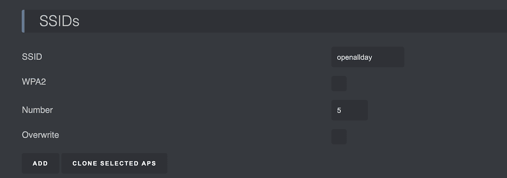
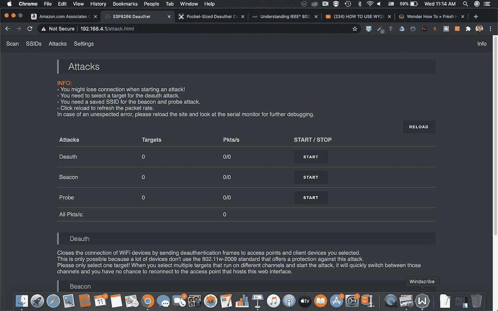
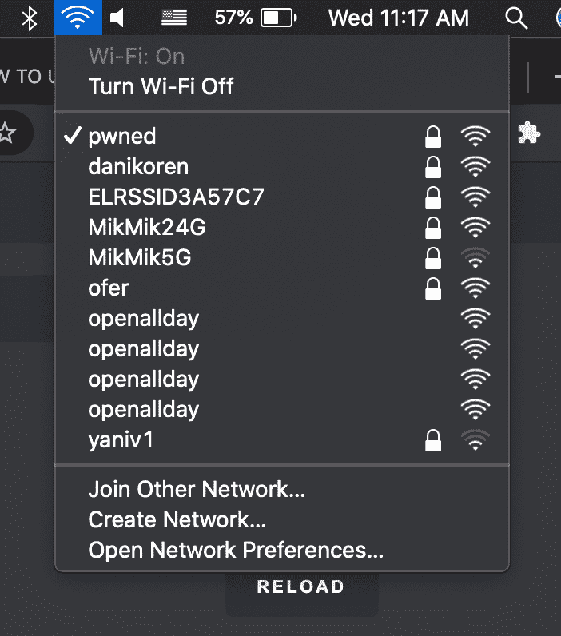

# 两分钟内创建一个假的无线接入点

> 原文：<https://infosecwriteups.com/creating-a-fake-wireless-acess-point-in-2-minutes-7ff3e8400658?source=collection_archive---------0----------------------->

**第一部分**

# 微控制器很棒，其中最受欢迎和最便宜的是 ESP8266，Wi-fi deauther 项目所基于的 Arduino 芯片。

我已经用这台 https://amzn.to/36kKSWa[和一台有机发光二极管显示器玩了一圈，创建了假的无线接入点，并解除了附近 wi-fi 网络的认证(另一种说法是禁用)。](https://amzn.to/36kKSWa)

发送身份验证帧(如无线黑客所用)的主要目的是迫使附近的客户端连接到一个恶意接入点，然后利用该接入点捕获用户数据包

# **制作小包**

Deauther 可以通过创建数据包并在空中发送它们来完成所有这些工作。那些数据包属于 **wi-fi 管理帧数据包**，在大多数出售的接入点和无线路由器中，这些数据包既没有被保护，也没有被加密。

我们将在下一篇文章中讨论 deauther 如何扫描和发送去认证和解离数据包，但现在让我们看看微控制器本身，我们可以轻松地创建一个虚拟无线接入点

# **模块本身**

Deauther 有不同的风格，有些包括**有机发光二极管显示器**，有些没有，它通常与偶极天线捆绑在一起，这将增加您捕捉更多附近接入点和站(客户端)的机会

一侧的微型 USB 端口可以让你使用电源为设备供电(便于携带)，如果你真的喜欢它，甚至还有一个手表版本[https://amzn.to/32u4GFx](https://amzn.to/32u4GFx)

# **基本操作**

一旦你给你的 deauther 加电，它将广播它的 SSID，这是 **pwned** ，只要连接到它，密码是(你已经猜到了)**“deauther”**

**现在前往 192.168.4.1(你也可以在智能手机上完成，但为了方便起见，我将使用我的 chrome 浏览器**

# **页面分为 4 个主要部分**

**扫描** -在这里你可以扫描你周围的接入点和站点(客户端)

您可以为以后的攻击选择不同的接入点或站点(我们将在下一篇文章中讨论)，或者移动到另一个部分，即 **SSIDs** ，在那里您可以创建一个假的接入点，并使用它们进行信标和探测攻击

**在 SSID 的页面上，只需说出你的假 wi-fi 网络名称(SSID )**

安全级别(你可以让它开着)和虚假网络数量。

一旦你这样做了，你的 deauther 实际上会发布一个信标帧。每个频带上的每个 SSID 广播它自己唯一的信标帧。这只不过是一个广告广播帧，告诉任何侦听设备这个 SSID 是可用的，并且具有特定的功能(安全级别、数据速率……)

# 我们家的 wifi 网络就是这么做的。每个 wifi 网络都在使用信标帧，通常间隔 1 到 100 毫秒

您需要熟悉的另一个术语是**探测请求**，它类似于信标帧，但这一次，它来自客户端，寻找可用的 wi-fi 网络进行连接

**按 Reload 保存 SSID 并移动到下一节，攻击**

在这里，您可以触发攻击不同的攻击，我们将使用信标攻击，在这种攻击中，我们实际上连续发出虚假的信标帧来宣布无线网络，请记住，我们已经选择发布不少于 5 个 wi-fi 网络

# **我们有了它**

这是我制作的完整过程的视频

**免责声明—该演示仅用于教育目的，请小心使用**

你可以订阅我在 youtube.com/fortitip 的频道或者参加我在 https://www.udemy.com/course/fortigate-admin-crash-course/?的 FortiGate 课程 referral code = 0b 534 DCF 7 a6 D8 BD 3417 e