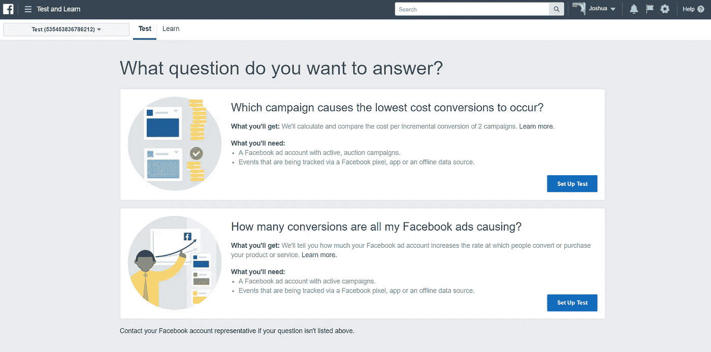

# 使用任何应用程序创建测试转换

> 原文：<https://infosecwriteups.com/creating-test-conversion-using-any-app-8b32ee0a735?source=collection_archive---------1----------------------->

脸书广告账户测试可以帮助你了解你的脸书、Instagram 和 Audience Network 广告带来了多少销售或转化。([来源](https://www.facebook.com/business/help/1575448755848995))

**描述:**恶意用户可以使用任何应用程序创建测试转化，这可能会泄露活动的销售和转化。

**影响:**在他们重新设计这个功能之前，用户可以选择测试应该将哪种类型的事件算作转换。其中一些事件类型包括购买、添加到愿望清单、首次结账、消费信贷等…

**再现步骤:** 1 .转到[facebook.com/test-and-learn/?act=A](https://facebook.com/test-and-learn/?act=XXX)D _ ACCOUNT _ ID
2。设置测试
3。填写必要的信息。
4。在创建测试之前拦截请求。
5。在/ad-studies 请求中，将应用程序 id 更改为受害者的应用程序 ID。
6。测试转换已创建。

时间表:
2018 年 2 月 10 日—问题报告
2018 年 2 月 16 日—报告审理
2018 年 3 月 22 日—问题修复
2018 年 3 月 26 日—奖金 3000 美元