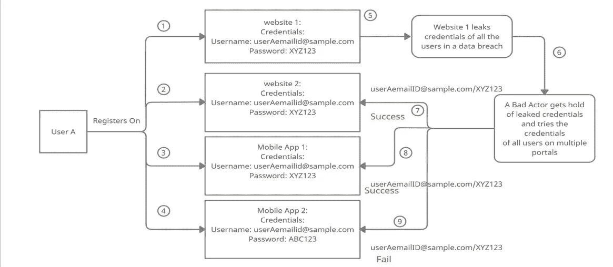
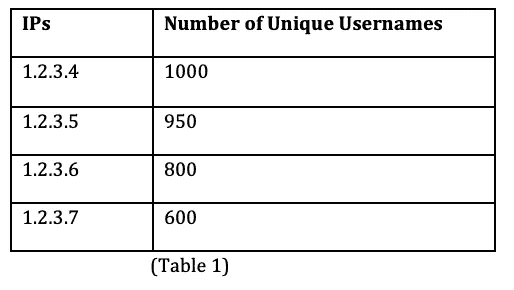
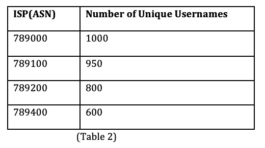
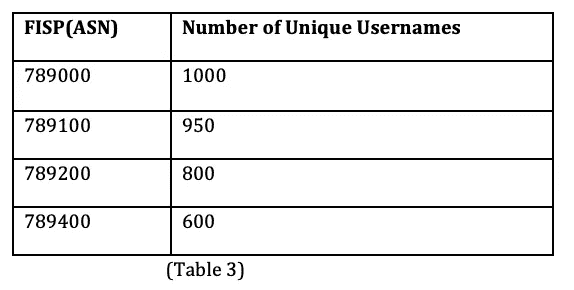
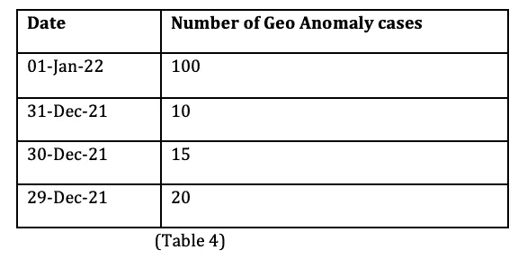
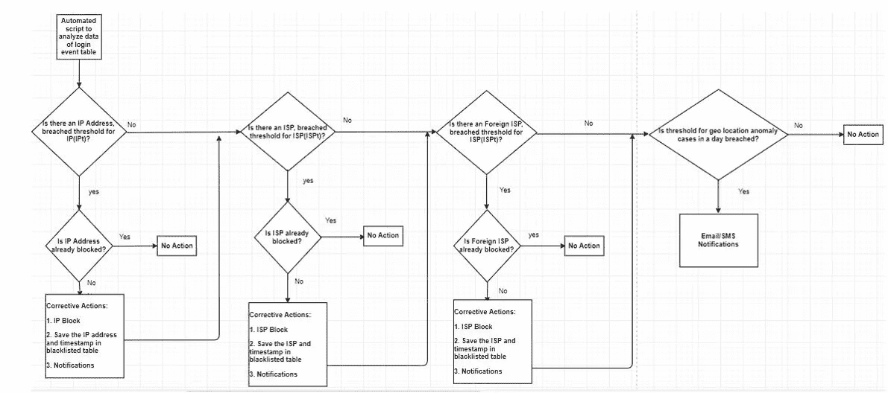
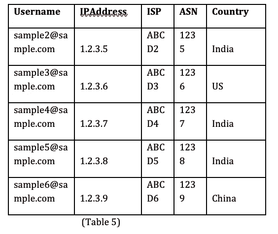
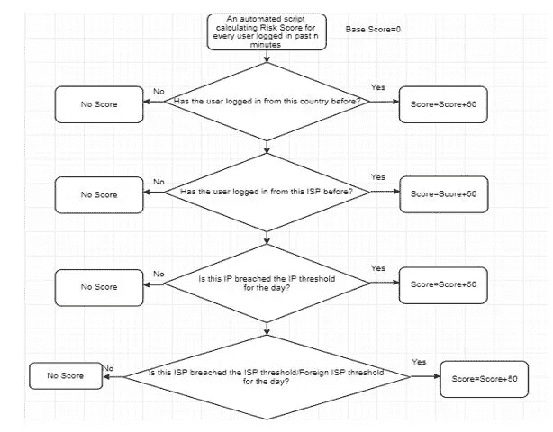
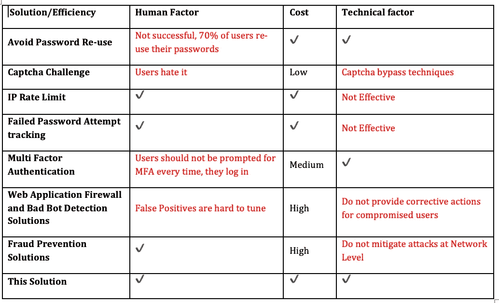

# 凭证填充攻击:使用模式和机器学习的对策

> 原文：<https://infosecwriteups.com/credential-stuffing-attack-countermeasures-using-patterns-and-machine-learning-4b356d6cb741?source=collection_archive---------1----------------------->

**摘要**—“*凭据填充攻击”是针对门户网站发起的一种鲜为人知但却非常成功的网络攻击。它利用了人类重复使用密码以方便记忆的行为以及防御技术中的弱点。不良行为者获得从网站泄露的用户凭证，并在不同的网站上尝试相同的凭证集，以进一步访问用户的数据。门户网站部署的传统防御机制无法抵御这种攻击，因为它是一种非常安静、缓慢且规避基于签名的规则的攻击。大多数中小型门户网站发现很难检测到攻击。由于抵御这种攻击的商业服务非常昂贵且难以调整，用户的敏感数据会被泄露。本文提出了一种基于模式和机器学习的方法，该方法易于部署，是一种有效的解决方案，可用于自动检测和防范这种攻击。*

1.  **简介:**凭证填充是一种网络攻击，其中不良行为者获得从在线门户(网站、移动应用)泄露的大量认证凭证(用户名/电子邮件 ID 和与之相关的密码)的数据库。如(展示 1)所示，泄露的凭据会针对多个其他在线门户进行尝试，以获得对用户数据的进一步访问

(证据 1)

如今，有效的黑客不仅瞄准技术，他们还瞄准“人类”，因为人类是安全链中最薄弱的一环。

人类行为的可预测性使我们容易受到社会工程攻击和像凭据填充这样的攻击。

**2。为什么这种攻击是在线门户的一个大问题？**

I .如果在线门户网站的许多用户的帐户使用凭据填充技术遭到破坏，这是门户网站的声誉损失。

二。在一些在线门户网站上，用户付费订阅有限数量的内容，即视频/图像/文档。如果他们的帐户受到凭据填充攻击，攻击者可以用尽他们的使用配额。

三。缓解技术不太成功。

四。防止这种攻击的商业软件/服务过于昂贵，并且不提供透明和完整的解决方案。

根据研究参考 1，这种攻击非常成功，因为超过 70%的用户重复使用他们的密码。

此外，下面提到的传统**缓解策略**对这种攻击不起作用。

a)教育用户不要重复使用他们的密码

b)验证码挑战

c)对 IP 地址进行速率控制检查

d)对失败的密码尝试进行速率控制检查

e)多因素认证

f)阻止自动请求的不良机器人检测系统

g)欺诈防范系统

**3。传统缓解策略的弱点**

**3.1** **教育用户不要重复使用他们的密码:**

这从未成功过，因为人类在选择密码时面临两个挑战:

a)人类无法记住复杂的密码，所以他们选择简单的密码。但是这使得它们容易受到密码猜测攻击。许多用户意识活动和技术控制在世界范围内被用来教育用户选择一个困难且不容易被猜到的密码。

b)当用户选择一个复杂的密码时，他/她希望重复使用它，因为很难记住这么多困难的密码。这有助于用户抵御密码猜测攻击，但使他们容易受到凭据填充攻击。

c)使用密码管理器是一个很好的选择，但是人们对它的了解非常有限。很少有门户网站支持与密码管理器集成。

**3.1** **对 IP 地址进行速率控制检查:**

这意味着当来自一个 IP 地址的登录请求数(通过或失败)超过一个定义的阈值时，该 IP 地址将被阻止。

**这种方法的问题** —在今天的场景中，随着每个/一些请求改变 IP 地址是如此容易。频繁更改 IP 地址的攻击者永远不会被检测到。

**3.2** **对失败密码尝试的速率控制检查:**

这意味着如果用户多次密码尝试失败，将采取预防措施。

**这种方法的问题** —当攻击者试图对一个用户使用如此多的密码时，这是一个很好的密码猜测攻击解决方案，但对于“凭据填充攻击”来说，这是一个糟糕的解决方案，因为攻击者只尝试了一个密码(在与特定用户名相关的数据泄露中泄露)。

**3.3** **验证码挑战:**

CAPTCHA(区分计算机和人类的全自动公共图灵测试)是一种挑战-响应测试，用于计算中确定用户是否是人类。

**挑战-**

使用验证码来防止此类攻击的一些挑战包括:

a)糟糕的用户体验:人类讨厌图像/音频识别挑战

b)使用验证码农场和先进的人工智能，网络罪犯甚至可以绕过最好的验证码解决方案

c)为高级验证码解决方案定义正确的阈值是一项非常困难的任务

d)监控假阳性和假阴性可能会很有挑战性且耗时。

**3.4**多因素认证:

这意味着除了密码之外，用户还需要提供额外的验证信息才能成功登录，例如电子邮件/手机号码上的一次性密码、硬件设备上的一次性密码、安全问题等。

**挑战-**

这确实是防止“凭证填充攻击”的好选择，但是存在一些问题，即

a)对于许多用户来说，每次用户尝试登录时发送 OTP 是一种糟糕的体验，甚至大多数银行网站都不支持它。

b)仅当存在可疑登录时才启用多因素身份认证是好的，但是大多数中小型组织没有识别可疑登录的机制。

2018 年的一项研究显示，只有 10%的 Gmail 用户选择了多因素身份认证参考 2。

d)根据一项参考研究，只有 26%的网站支持多因素身份认证 3。

**3.1** **Web 应用防火墙&不良 Bot 防范解决方案**

太贵了！

这种解决方案可以提供一种解决方案来识别登录请求是通过使用浏览器的人还是通过自动化脚本来进行的。

**挑战-**

这种解决方案的挑战是-

A)此类解决方案无法查看用户登录模式的历史数据，即，如果用户主要从国家 A 登录，而在短时间内从国家 B 登录，则不存在此类地理国家异常的规则。

b)这种解决方案在检测到请求是通过自动脚本发出时，可能会通过阻止 IP 和 ISP 来阻止后续请求，但是没有提供保护已经受损的用户的解决方案。

c)调整假阳性也是一项麻烦的任务。

d)此外，高级机器人可以绕过机器人检测系统

**3.2** **防欺诈系统**

太贵了！

这种解决方案代表了与不良 Bot 缓解解决方案相反的方法。

他们拥有用户登录模式的历史数据，并根据多个行为异常标准计算每个登录事件的风险。

因此，如果用户从印度登录，并且在短时间内从国外登录，这种异常将被检测到，并进一步采取预防措施，即锁定帐户或自动发送电子邮件通知。

虽然这是一个很好的方法来保护用户在一个关键的网络应用，即银行或门户网站时，订阅被支付和滥用。

**挑战-**

这种解决方案不是为了通过阻止 IP 或 ISP 来进一步阻止攻击。

**4。推荐的缓解算法**

针对此攻击的**预防策略**应该是:

a)处理所有不同类型的攻击执行

b)对用户的干扰较小

c)成本效益，以便中小型在线门户可以使用它

d)易于实施

e)当攻击发生时，向利益相关者发送通知

f)提供自动缓解

在本文中，将讨论一个算法，将满足上述标准

**先决条件:**将下述与每个登录事件(通过或失败)相关的信息存储在一个表中:

a) IP 地址

b) ISP(互联网服务提供商)

c) ASN(自治系统号)

d)触发登录请求的国家

e)用户名

**4.1 方法:**

要维护的登录事件的四个表:

表 1 将根据收到登录请求的唯一用户名的数量来存储排名靠前的 IP。脚本将每隔“n”分钟运行一次，并更新这些数据。

表 2 将根据收到登录请求的唯一用户名的数量来存储排名靠前的 ISP。脚本将每隔“n”分钟运行一次，并更新这些数据。

ASN:自治系统编号

表 3 将根据收到登录请求的唯一用户名的数量存储排名靠前的外国 ISP(fisp)。如果门户网站在 A 国注册，则 A 国以外的所有 ISP 都被称为外国 ISP。脚本将每隔“n”分钟运行一次，并更新这些数据。

表 4 将存储一天的地理异常情况的数量。脚本将每隔“n”分钟运行一次，并更新这些数据。

来自一个 IP 地址的唯一用户名的最大登录请求，称为**“IP 数据”**

来自一个 ISP 的唯一用户名的最大登录请求，称为**“ISP 数据”**

来自一个(外国 ISP) *的唯一用户名的最大登录请求，称为**“FISP 数据”**

(地理国家异常)*案例总数，称为**“地理数据”**

**(geo country anomaly 是一个术语，当用户从 A 国登录并在短时间内从 b 国登录时使用。在每个网站上，对于真实场景中的一些用户，存在 geo country 异常，因为很少有用户从本地 IP 地址登录，然后使用 VPN 连接进行匿名。)*

**(国外 ISP)表示每个在线门户都应该为每个国家的用户维护一个单独的登录事件表。如果 A 国的用户 A 从 B 国的 ISP 登录，它将被视为外国 ISP。*

**4.2 用于异常检测的机器学习算法**将分别应用于 IP 数据、ISP 数据、FISP 数据、地理数据。

异常检测是一种用于识别数据集中罕见事件的技术。这些罕见的事件在统计学上不同于其他数据。这将用于检测异常值，并识别攻击者的 IP、ISP、外国 IP 或一天内的地理异常情况。

有一个无监督的异常检测算法将在这个解决方案中应用。无监督异常检测方法不需要训练数据，其工作原理是非常小百分比的数据不同于其余数据，并且是异常值。

为 IP 数据找到的异常 IP 的唯一用户名的值将被称为 IPt (IP 阈值)

针对 ISP 数据发现的离群值 ISP 的唯一用户名的值将被称为 ISPt (ISP 阈值)

在 FISP 数据中发现的异常值外国 ISP 的唯一用户名的值将被称为 FISPt (FISP 阈值)

地理异常案例数据中发现的异常值数量将被称为地理位置异常阈值。

在运行该机器学习算法几天之后，确定了一个事实，即一天中每个网站上的用户数量每天都在变化，但是这种变化通常并不显著，因此可以找到模式并且可以形成阈值。

基于这些阈值，我们将尝试解决两个问题:

a)减轻凭证填充攻击

b)保护攻击者已经登录的用户

**实时防止凭证填充攻击**

一个自动化脚本(用任何服务器端编程语言编写)将在下面提到的流程中每 5 分钟分析一次登录事件表的数据:

(证据 2)

使用该方法分析不同类型的凭证填充攻击。

**5.1 一个 IP 多用户登录点击量**:

在这种情况下，来自一个 IP 地址的最大登录命中阈值将被突破。

可以通过将系统与任何基于主机的防火墙或网络防火墙集成来自动阻止攻击者的 IP，并且可以将被阻止的 IP 保存在数据库表中。

**5.2 拥有多个 IP 但同一 ISP 的多个用户的登录点击量**:

在这种情况下，来自 ISP 的最大登录点击数的阈值将被突破。

通过将系统与任何基于主机的防火墙或网络防火墙集成，攻击者 ISP 可以被自动阻止，并且被阻止的 ISP 可以被保存在数据库表中。

建议在这种模式中排除常见的电信 ISP，因为攻击者很难在电信 ISP 内部切换 IP。他们使用 VPN 或云服务提供商 ISP 来切换 IP。

**5.3 具有多个 IP、多个 ISP 的多个用户的登录点击量**:

在这种情况下，攻击者使用多个外国 ISP，包括 VPN 和云提供商。

在这种情况下，外国 ISP 的阈值总是小于 ISP 的总阈值，即，在样本数据集上形成的阈值中，来自 ISP 的最大命中是 6450，但对于外国 ISP，如附件 2 所示，阈值是 3070。

通过将系统与任何基于主机的防火墙或网络防火墙集成，攻击者 ISP 可以被自动阻止，并且被阻止的 ISP 可以被保存在数据库表中。

**5.4 最大规模攻击:**

攻击者可以如此频繁地更换全球的 ISP，以至于外国 ISP 的阈值可能无法突破。

但是在这种情况下，将会有许多用户发生地理国家异常，并且地理位置异常情况的阈值将被突破。

每个组织在检测到此类攻击后的预防措施可能会有所不同，例如，组织可以暂时自动阻止一些国家/地区的流量，或者加强身份验证并引入 MFA。

**5.4 保护攻击者已经成功登录的用户**

对于网站上的每个登录事件，都会在一个表中保留一个条目，该表应该类似于表 2:

自动化脚本将每隔“n”分钟运行一次，分析过去“n”分钟的登录事件表行，并根据行为异常因素计算风险分值:

基本分数= 0

a)如果用户从未从发起该登录请求的国家/地区登录，则得分=得分+50

b)如果用户从未从发起该登录请求的 ISP 登录，则得分=得分+50

c)如果该登录请求是成功的，并且是通过突破了当天的 IP 阈值(如上所述)的 IP 发出的，则得分=得分+50

d)如果该登录请求成功，并且是通过当天突破 ISP 阈值(如上所述)的 ISP 发出的，则得分=得分+50

(证据 3)

如果总分等于/大于 100，可以对用户帐户采取纠正措施，下面提到了一些纠正措施:

A)可以向用户发送关于可疑登录事件的通信电子邮件以及更改密码的建议

b)用户的密码已过期；注销所有活动会话，并向用户发送有关该活动的通信电子邮件

c)注销所有活动会话后，启用多因素身份认证

d)在有限的时间内锁定账户。

e)通知信息安全团队进行人工干预

**5.5 追溯行动:**

一个 IP 只有在一天内超过 IPt(IP 阈值)时才会被阻止。一旦一个 IP 被阻止，一个自动脚本应该对从该 IP 记录登录请求的所有用户采取预防措施。

ISP 仅在一天内违反 ISPt/FISPt(ISP 或外国 ISP 阈值)时被阻止。一旦一个 IP 被阻止，一个自动脚本应该对从该 IP 记录登录请求的所有用户采取预防措施。

**6。结论:**

传统方法和建议方法的比较:

(证据 4)

该系统将结合多重检查，并在很大程度上防止凭证填充攻击。

此外，将对已经受损的用户帐户采取自动纠正措施。

## 来自 Infosec 的报道:Infosec 每天都有很多内容，很难跟上。[加入我们的每周简讯](https://weekly.infosecwriteups.com/)以 5 篇文章、4 个线程、3 个视频、2 个 GitHub Repos 和工具以及 1 个工作提醒的形式免费获取所有最新的 Infosec 趋势！