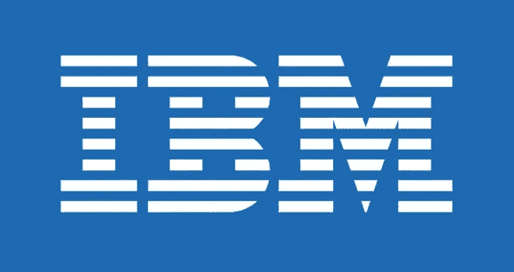

# [关键]绕过 IBM 上的 CSRF 保护

> 原文：<https://infosecwriteups.com/critical-bypass-csrf-protection-on-ibm-313ffb68dd0c?source=collection_archive---------0----------------------->

国际商用机器公司

**什么是 CSRF 攻击？**
CSRF 是一种欺骗受害者发送恶意请求的攻击。这种请求可以改变受害者的电子邮件、用户名、密码等信息

**我在 IBM 上找到了什么？当我试图在我的测试帐户上更改我的电子邮件时，我注意到网站通过使用 GET 请求来更改它 locale=us-en & email**

但是我尝试了更多，几个小时后我发现当我更改 Referer 头值时，它返回一个错误，但当我使用这个值时，它返回 true
([**https://www.ibm.com/ibmweb/myibm/profile/profile-edit.jsp**](https://www.ibm.com/ibmweb/myibm/profile/profile-edit.jsp))
所以我试图欺骗这个保护，我发现通过使用这个 URL
([**http://my _ website/www . IBM . com/IBM web/my IBM/profile/profile-edit . JSP . PHP【T23
我所做的是将有效的 URL 作为我网站上的路径，所以现在请求将从(**profile-edit.jsp.php**)发送到 IBM 网站，以更改电子邮件。当我尝试这种方法时，我就像这样:**](http://my_website/www.ibm.com/ibmweb/myibm/profile/profile-edit.jsp.php)

所以现在我可以通过访问我的网站来窃取 IBM 用户的帐户。

概念验证视频:

报告发送日期:9 月 14 日
审理日期:9 月 28 日
解决日期:10 月 8 日

希望这个话题对某人有所帮助，想感谢[@**zseano**](https://twitter.com/zseano)**对我的帮助**。****