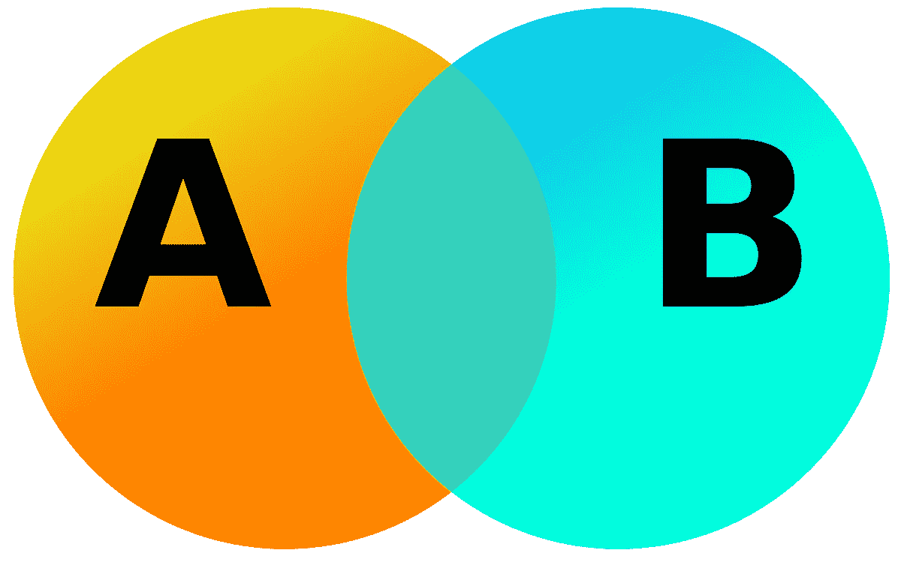
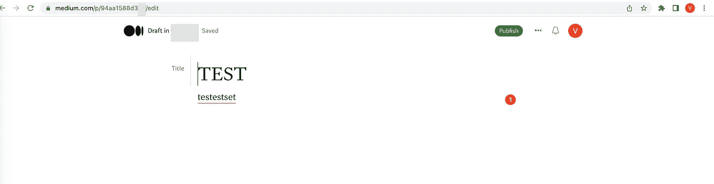
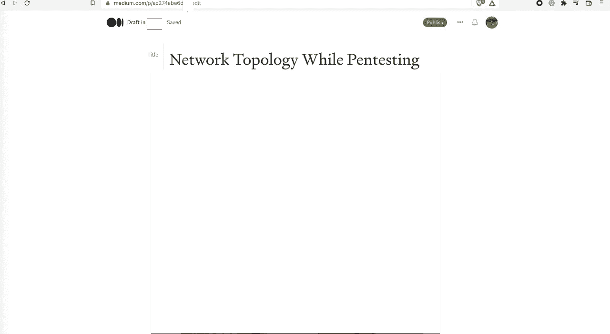
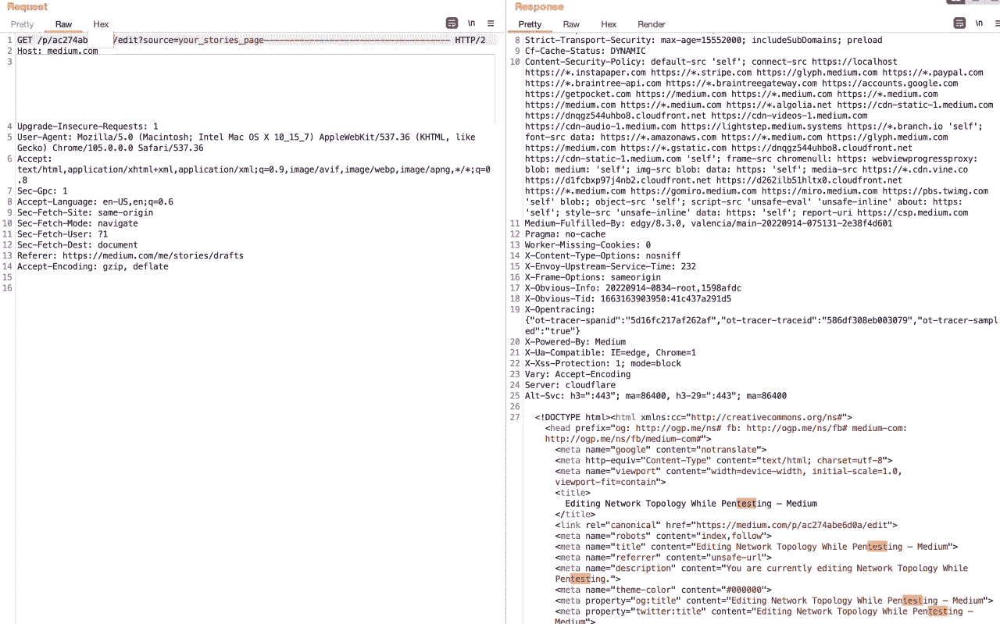
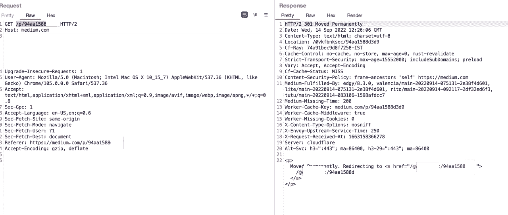
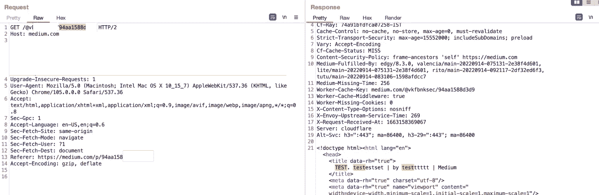
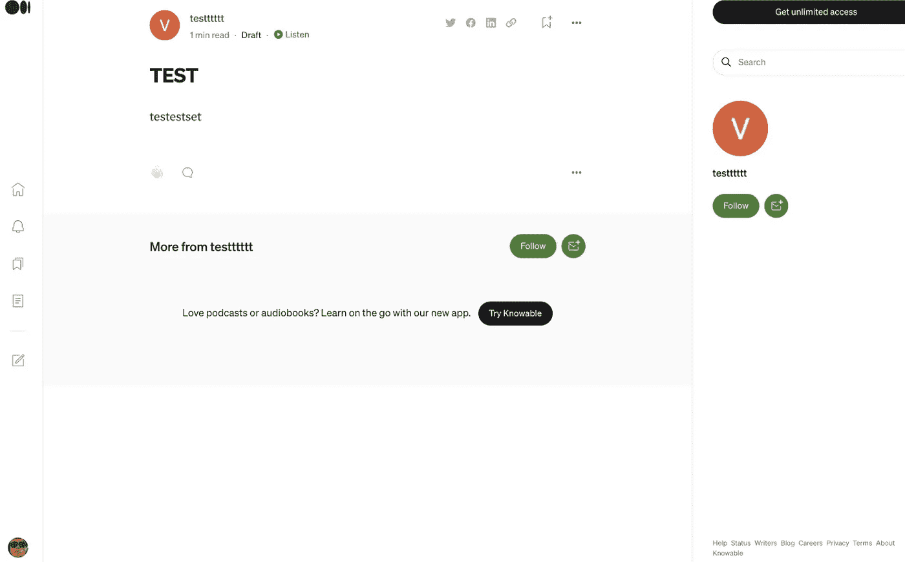
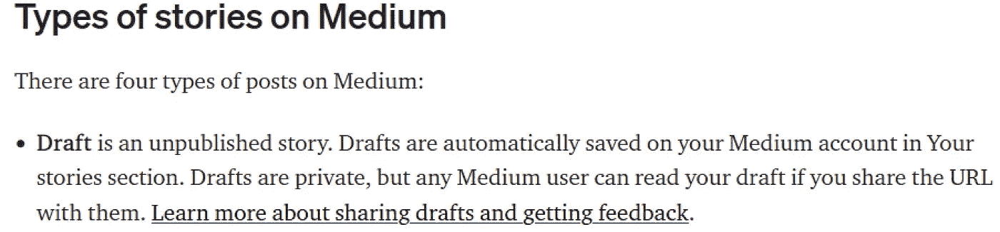
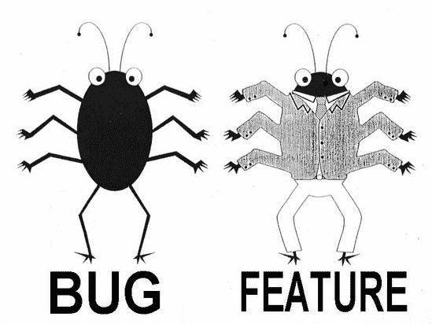

# 介质上严重的 IDOR 漏洞？

> 原文：<https://infosecwriteups.com/critical-idor-vulnerability-on-medium-f78346edbcb1?source=collection_archive---------1----------------------->

大家好，

希望你很好。我将告诉你一个我的午餐冒险小故事，希望它能启发你。当我在查看赏金服务时，我在 medium 上看到了下面的列表。

[-黑媒体的黑客](https://medium.com/humans.txt) -

我在吃午饭，我说为什么不在这个时候给一个机会。所以，我开始检查介质系统。

首先我了解到几乎所有的东西都有唯一的 id 和大量使用 graphql 的请求。

然后，我决定创建一个帐户，以检查我是否可以达到其他一些私人部分。

> 这是发现不安全的直接对象引用(IDOR)漏洞的最佳方式。

我发现了介质系统的访问控制漏洞。

我发现了访问控制中的一个漏洞，是吗？

假设我有 **A** 账户和 **B** 账户。正常情况下， **A** 账户不应该访问 **B** 账户的汇票，对吗？因为我的草稿应该是我的。

草稿故事的 id 是-> *ac274abe6d0*

所以如果我们看一下我们的草稿，媒体会把我们重定向到

https://medium.com/p/*AC 274 abe6d 0*/编辑？source=your_stories_page -

但是，可以找到 id。假设另一个草稿 id 是 94aa1588d3d9

> 它仅由 12 位数字组成。所以可以通过暴力找到它。

如果你去-> https://medium.com/p/*94aa 1588 d3d*它会自动把你重定向到

https://medium.com/{{@targetnickname}}/*94aa 1588 d3d*

同样，我们可以找到哪个 id 属于哪个用户。

至少我是这么认为的。

使用截屏作为 POC 的详细说明:

1.  测试账户 B 的未结汇票:

2.从测试帐户 A 打开汇票:

3.拦截来自测试帐户 A 的请求:

4.用另一个草稿 id 更改 URL，不进行编辑。我们试着看别人的草稿:

正如我所说的，它用昵称重定向链接。

5.当我们点击链接时，我们可以看到整个草稿。

6.有了浏览器，它显示所有的草稿。

我在想用一个小的 python 脚本，我将能够下载许多人的草稿和他们的昵称，而无需他们的允许，如果有人将他的草稿用作信用卡的笔记本，黑客可以窃取它们，而且，黑客可以为自己窃取起草的博客。但我没有检查它，因为中型 bug bounty 有以下规则:

**给你的规则**

*   不要试图访问其他用户的账户或数据。使用您自己的测试帐户进行跨帐户测试。

作为一个有道德的人和有道德的黑客，我总是在攻击前检查规则。所以，我用完全属于我的交叉用户测试了它。

所以我跑去把它寄给了中型昆虫赏金队。我已经开始等待他们的答复。但不幸的是，结果令我失望。:(因为我漏了一点。没有速率限制，因为上面的规则，我不能测试它。即使它是经典的，这是一个功能，而不是一个错误:D

> 我决定告诉你这个故事，昆虫赏金并不总是带你到好东西，有时你可能会错过一些点，你可以认为你发现了真正的大东西。然而，你知道他们说什么。让国王称王的不是他们如何跌倒，而是他们如何爬起来。第二天你应该继续努力。

感谢您的阅读。希望你喜欢它，也希望它能激励你..特别感谢 medium Bug bounty 和支持团队的友好和快速响应。💮

来自 zer0d 的和平。

## 来自 Infosec 的报道:Infosec 每天都有很多内容，很难跟上。[加入我们的每周简讯](https://weekly.infosecwriteups.com/)以 5 篇文章、4 条线索、3 个视频、2 个 GitHub Repos 和工具以及 1 个工作提醒的形式免费获取所有最新的 Infosec 趋势！