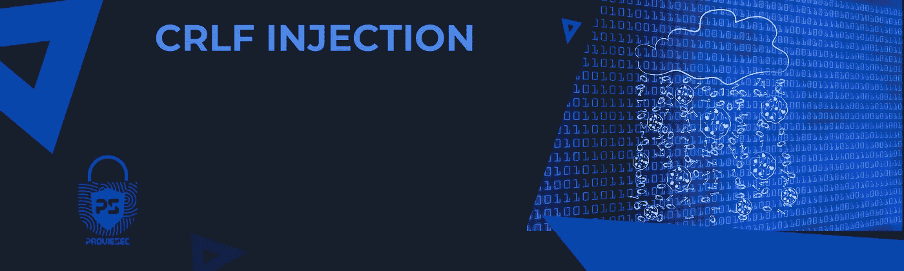
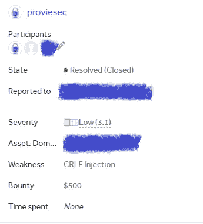

# CRLF 注射——XXX 美元——我怎么可能通过 Cloudflare WAF 获得奖金？

> 原文：<https://infosecwriteups.com/crlf-injection-xxx-how-was-it-possible-for-me-to-earn-a-bounty-with-the-cloudflare-waf-f581506f97f5?source=collection_archive---------1----------------------->

我最近在一个流行的网站上发现了一个 CRLF 注射漏洞。在这篇博文中，我将描述我能够演示的漏洞和攻击场景。我还将讨论 CRLF 注入漏洞的潜在影响。



## 什么是 CRLF？

CRLF(回车和换行)是由两个特殊字符组成的序列，在许多计算环境中用来表示一行文本的结束。在网络安全背景下，攻击者可以利用 CRLF 攻击向网站注入恶意内容。为了防范这些攻击，web 开发人员需要正确处理 CRLF 序列并净化用户生成的内容。

CRLF 注入攻击有两个最重要的用例:

*   **日志分割:**攻击者插入一个行尾字符和一个额外的行来伪造日志文件条目，以便通过隐藏其他攻击来欺骗系统管理员。
*   **HTTP 响应拆分:** CRLF 注入用于在 HTTP 响应中添加 HTTP 报头，例如执行导致信息泄露的 XSS 攻击。

# 该报告



## 我是如何找到 CRLF 的？

我使用 https://github.com/dwisiswant0/crlfuzz[的 crlfuzz 工具找到了网站上的 CRLF 注入漏洞。crlfuzz 工具是一个命令行工具，允许用户通过将 CRLF 序列注入 HTTP 头来测试 CRLF 注入漏洞。](https://github.com/dwisiswant0/crlfuzz)

要使用 crlfuzz 工具，我首先必须克隆存储库并安装必要的依赖项。然后，我使用目标 URL 和期望的有效负载作为参数运行该工具。该工具将有效负载注入 HTTP 报头，并将请求发送到目标网站。

```
▶ crlfuzz -u "http://target"
```


如果网站易受 CRLF 注入的攻击，该工具将收到一个响应，指示注入的有效负载已成功执行。

使用 crlfuzz 工具，我能够快速轻松地测试网站上的 CRLF 注入漏洞。这个工具对于寻找和报告 CRLF 注射漏洞的 bug 赏金猎人来说是一个有价值的资源。

# 攻击场景是什么？

## 饼干炸弹

在第一个攻击场景中，我在网站中注入了一个 cookie 炸弹。cookie 炸弹是一种攻击类型，旨在通过将大量 cookie 注入用户的浏览器来淹没网站的服务器。对于受影响的用户，这可能会导致网站速度变慢或无响应。

例如，以下有效负载可用于创建 cookie 炸弹:

```
Set-Cookie: bomb=1
Set-Cookie: bomb=2
Set-Cookie: bomb=3
…
Set-Cookie: bomb=10000
```

该有效负载会向用户的浏览器注入 10000 个 cookies，可能会导致网站变慢或无响应。网站开发人员采取措施防范 cookie 炸弹和其他类型的注入攻击是非常重要的。

## Cloudflare 晶片块

在第二个场景中，我设置了一个 cookie 并触发了一个 Cloudflare WAF 块。Cloudflare WAF (Web 应用防火墙)是一种安全措施，可以保护网站免受各种网络威胁，包括注入攻击。当 WAF 阻止被触发时，意味着网站的服务器检测到潜在的恶意活动，并阻止对网站的访问以保护它。

例如，以下有效负载可用于触发 Cloudflare WAF 块:

```
Set-Cookie: crlf=attack
```

此有效负载设置了一个值为“攻击”的 cookie，该 cookie 可能会被网站的服务器检测为恶意，并触发 Cloudflare WAF 阻止。对于网站开发者来说，确保他们的 WAF 配置正确并且能够有效抵御潜在的攻击是非常重要的。

# 时间线:

*提交*:2021 年 11 月 16 日

*受理*:2021 年 11 月 17 日

*审判*:2021 年 11 月 17 日

需要更多信息:2021 年 12 月 13 日->我提供了更多信息

*再次分类*:2022 年 8 月 19 日- >赏金 500 美元

*已解决/已关闭* : —

# 影响

CRLF 注入的影响是多方面的，也包括从跨站点脚本到信息披露的一切。它还可以禁用某些安全限制，如受害者浏览器中的 XSS 过滤器和同源策略，使他们容易受到恶意攻击。使用我描述的攻击场景，我能够展示如何快速地使站点对单个用户不可用。

## 工具/有效载荷:

[https://github.com/dwisiswant0/crlfuzz](https://github.com/dwisiswant0/crlfuzz)T12[https://github.com/Proviesec/crlf-payloads](https://github.com/Proviesec/crlf-payloads)

## 报告:

[https://hackerone.com/reports/1575912](https://hackerone.com/reports/1575912)—cloud flare—3100 美元

https://hackerone.com/reports/446271——推特——2940 美元

[https://hackerone.com/reports/197279](https://hackerone.com/reports/197279)——Airbnb——2500 美元

https://hackerone.com/reports/192667——星巴克

https://hackerone.com/reports/237357:Snapchat:500 美元

# 摘要

CRLF 注入漏洞可能会给网站运营商和用户带来严重后果，因此对于 bug 赏金猎人来说，警惕这些类型的漏洞非常重要。如果您对发现和报告 CRLF 注入漏洞感兴趣，请记住以下几个提示:

*   研究 CRLF 注入攻击，了解它们是如何工作的。这将帮助您识别潜在的漏洞，并提出有效的测试用例。
*   注意 HTTP 头和 cookies。CRLF 注入攻击通常涉及操纵这些元素，因此在测试漏洞时仔细检查它们非常重要。
*   测试不同的浏览器和应用程序。CRLF 注入漏洞可能会以不同的方式影响不同的浏览器和应用程序，因此测试尽可能多的组合非常重要。
*   负责任地报告漏洞。如果您确实发现了 CRLF 注入漏洞，请确保遵循负责任的披露准则，并尽快向受影响网站的安全团队报告该问题。

通过遵循这些提示，您可以帮助保护网站和用户免受 CRLF 注入漏洞的潜在影响。

这是我的个人资料:[https://hackerone.com/proviesec](https://hackerone.com/proviesec)

请随时问我，并建议我下次应该考虑的更改。不管怎样，谢谢你的阅读👋。

还需要一篇好文章吗？->[https://infosecwriteups . com/broken-link-jacking-404-Google-play-store-XXX-bounty-96e 79 A8 DFD 71](/broken-link-hijacking-404-google-play-store-xxx-bounty-96e79a8dfd71)

## 来自 Infosec 的报道:Infosec 每天都有很多内容，很难跟上。[加入我们的每周时事通讯](https://weekly.infosecwriteups.com/)以 5 篇文章、4 个线程、3 个视频、2 个 GitHub Repos 和工具以及 1 个工作提醒的形式免费获取所有最新的 Infosec 趋势！