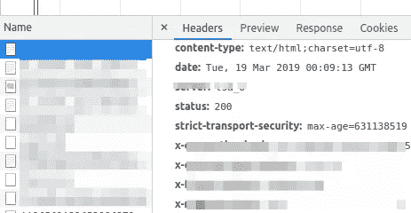

# 跨网站内容和状态类型泄漏

> 原文：<https://infosecwriteups.com/cross-site-content-and-status-types-leakage-ef2dab0a492?source=collection_archive---------0----------------------->

在做我通常的 Bug Bounty 研究程序时，我发现一个有趣的行为发生在一个流行的网站上，比如说 censored.com*。根据用户是否被授权显示网站，会显示两个完全不同的页面。一个是带有`*content-type:text/html;charset=utf-8*` [*HTTP 头*](https://developer.mozilla.org/en-US/docs/Web/HTTP/Headers) 的，第二个是完全没有 [*内容类型*](https://developer.mozilla.org/en-US/docs/Web/HTTP/Headers/Content-Type) *头*的，在这种情况下默认为`*text/plain*`。所以我问自己:*有没有一种聪明的方法来区分这两种反应？如果是的话，这能推广到所有的网站吗？它会带来什么威胁？**

**

*内容类型:文本/html*

*让我们从区分前面提到的响应所带来的威胁开始。这可能不明显，但这是一个严重的信息泄露，可能会在不同的网站上发生。在这个具体的例子中，恶意第三方可以获得关于访问者是否被授权在另一个网站，例如*Facebook.com*上显示给定的一组资源的信息，并且因此基于结果暴露他们的身份。*

*在某些情况下，这种影响可能比用户去匿名化更严重，因此尝试一下这个想法似乎是值得的。当时，我预感这是可能实现的，所以我开始研究 [MDN Web 文档](https://developer.mozilla.org/en-US/docs/Web/HTML)，希望能找到任何有帮助的有趣属性。没花太长时间，因为我很快就发现了值得的那个。*

> *`***HTMLObjectElement.typeMustMatch***`属性是一个`[*Boolean*](https://developer.mozilla.org/en-US/docs/Web/JavaScript/Reference/Global_Objects/Boolean)`，它反映了`[*<object>*](https://developer.mozilla.org/en-US/docs/Web/HTML/Element/object)`元素的`[*typemustmatch*](https://developer.mozilla.org/en-US/docs/Web/HTML/Element/object#attr-typemustmatch)`属性。它指示它所链接的资源是否必须匹配由`[*HTMLObjectElement.type*](https://developer.mozilla.org/en-US/docs/Web/API/HTMLObjectElement/type)`给出的 MIME 类型，以便使用这个资源。[【1】](https://developer.mozilla.org/en-US/docs/Web/API/HTMLObjectElement/typeMustMatch)*

*有了这个属性，我开始在 Chrome 上进行实验。然而，试了几次之后，我还是没有成功。浏览器似乎完全忽略了这个属性。事实上，我忽略了[浏览器兼容性](https://developer.mozilla.org/en-US/docs/Web/API/HTMLObjectElement/typeMustMatch#Browser_compatibility)部分。幸运的是，[爱德华多](https://twitter.com/sirdarckcat)启发了我，它应该可以在 Firefox 中工作。的确如此，就像一个魔咒。*

*更详细地说，如果`*content-type*`头与`*HTML <object>*`的`*type*`属性不匹配，资源将不会被加载。不幸的是，`*<object>*`元素既不触发`*onload*`也不触发`*onerror*`事件，所以检测对象是否已经加载是另一个难题。*

*[Eduardo](https://twitter.com/sirdarckcat) 提出了一个有趣的想法，通过使用`*<object>*`中的内联元素来检测状态。*

```
*<object type= data= typemustmatch> not_loaded </object>*
```

*基本上，这个想法是，如果呈现了`*not_loaded*`文本，要么是`*type*`属性与`*content-type*`头不匹配，要么是服务器以不同于`*HTTP 200 OK*`的状态响应。这看起来不太容易，所以我一直在调查。*

*在仔细查看了`*<object>*`属性之后，我注意到`*<object>.clientHeight*`和`*<object>.clientWidth*`在某些场景中会有所不同。这些属性不亚于渲染对象的`*width*`和`*height*`。如果对象还没有被渲染，那么它的尺寸是`*0*`，否则，很可能大于这个尺寸。像上一段一样，这里也一样，只有当服务器用`*HTTP 200 OK*`状态响应时，对象才会被呈现。我不确定这是对攻击的阻碍还是**通向另一个的桥梁，**非常有效的**，错误页面检测技术？**[*【2】*](https://portswigger.net/blog/exposing-intranets-with-reliable-browser-based-port-scanning)*

*攻击的最后一个缺失部分是检测`*<object>*`何时加载。*因为，* *如果我们不知道* `*<object>*` *什么时候已经加载了*，我们怎么知道什么时候应该读取它的 `*height*` *属性？一个简单的解决方案是在读取`*object.clientHeight*`之后使用计时。但是没有人喜欢计时，计时非常不稳定，对掉线非常敏感。**

*嗯，也许`*<object>*`本身不会触发`*onload*`事件，但是`*window*`物体肯定会。只有当包括`*iframes*`在内的所有组件都被加载时，才会触发*窗口*中的事件。因此，通过创建一个新的独立文档(例如 *iframe* )，很容易监听它的`*onload*`事件，然后读取放在那里的`*<object>*`的`*height*`。*

*至于结合模拟的`*<object>.onload*`事件和检测的`*<object>*`渲染的结果，我们得到了一个全新的**跨源** **内容和状态类型**检测的技术。有鉴于此，可以很有把握地说，这种方法自豪地加入了 [XS 泄漏](https://github.com/xsleaks/xsleaks/wiki/Browser-Side-Channels)家族。*

*我嵌入了一个奇特的概念证明，成功地泄露了资源的`*content-type*`。享受旅程吧！*

## *更新:*

*火狐团队已经修复了这个问题，所以这项技术不再有效。*

> *对 HTML `<object>`元素上的`typemustmatch`属性和`HTMLObjectElement` DOM 接口上对应的`[typeMustMatch](https://developer.mozilla.org/docs/Web/API/HTMLObjectElement/typeMustMatch)`属性的支持已经从最新的 HTML live Standard 和 Firefox 68 中移除。没有其他浏览器支持该属性，因此兼容性风险应该很低。*

*[https://bugzilla.mozilla.org/show_bug.cgi?id=1548773](https://bugzilla.mozilla.org/show_bug.cgi?id=1548773)*

**关注* [*Infosec 报道*](https://medium.com/bugbountywriteup) *获取更多此类精彩报道。**

*[](https://medium.com/bugbountywriteup) [## 信息安全报道

### 收集了世界上最好的黑客的文章，主题从 bug 奖金和 CTF 到 vulnhub…

medium.com](https://medium.com/bugbountywriteup)*