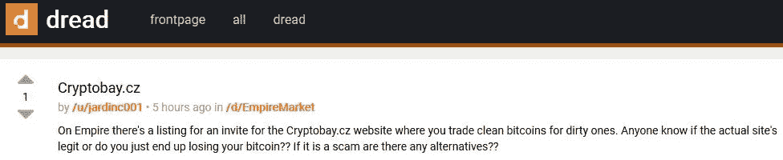
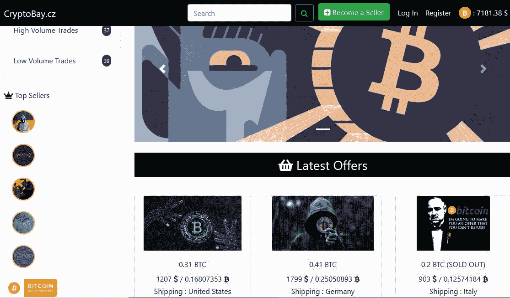
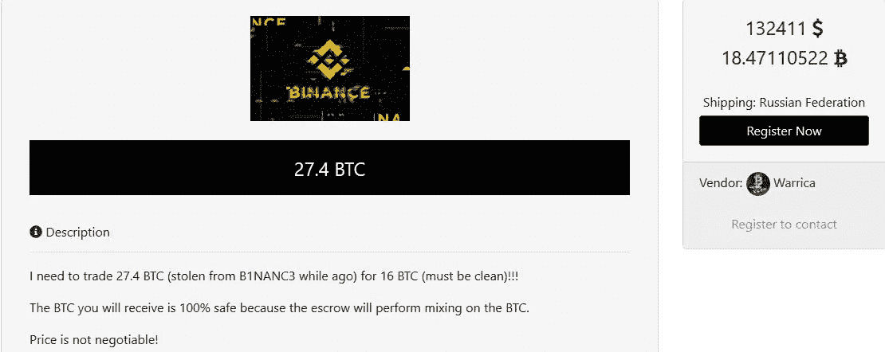
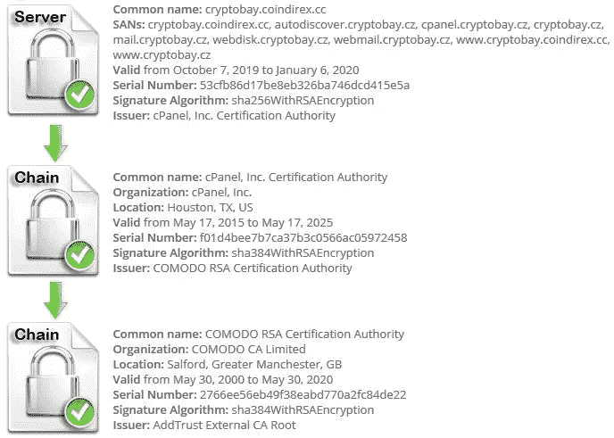
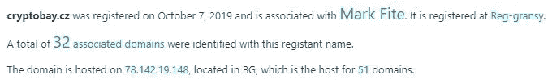
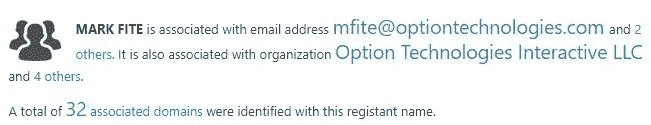

# CryptoBay.cz 分析:一系列其他托管在单一 IP 地址上的欺诈性服务被揭露

> 原文：<https://infosecwriteups.com/cryptobay-cz-analysis-a-bunch-of-other-fraudulent-services-hosted-on-a-single-ip-address-revealed-ffd8bf619357?source=collection_archive---------0----------------------->

> 注意:-这是一项以加密平台为目标的调查，并逐渐发现了一系列其他欺诈服务

作为我日常冲浪的一部分，我在**恐惧**中偶然发现了一个名为“ **Cryptobay.cz** 的帖子。从标题来看，我认为这是一种新的**洗钱服务**，就像市场上的**不倒翁**或**搅拌器**一样。

但是等等……这正好相反——用干净的比特币换脏的比特币！！！



恐惧邮报

OP 的问题暗示她(他)有兴趣用干净的比特币购买脏的比特币(风险包含！)，关于服务是否是真实的，引起了我的兴趣。

随着访问的进行，这个网站看起来是合法的，有一些供应商资料和其他列出的报价(有些被标记为“售罄”,以巩固新来者的信任——谁知道呢…)



网站概述

已经发现了一堆各种各样的供应商资料，其中某些比特币要求“**干净的”**钱；以逃避检测，因为这些是偷来的(称为“脏的”)或通过其他犯罪交易获得的。

这是一个来自俄国卖主简介处理者“Warrica”的例子，他声称从币安交易所偷了 27BTC(大约 193266 美元)。



供应商概况示例

因为评级高的供应商很少；我们无法断定这项服务是否合法，因为没有实质性的证据支持它(反馈页面是空的)。

分析证书和其他评论，发现该站点与 **CoinDirex** 有直接关联；这是一个位于加纳 T21 的数字资产交易所。

然而，CryptoBay 做了一些正确的事情，以吸引新客户来巩固他们的信任，例如:-

1.  **SSL 证书(合法)**

通过分析 SSL 证书，发现了以下情况:-

> cryptobay.cz 解析为 78.142.19.148
> 服务器类型:Apache
> 证书应该被所有主流的 web 浏览器信任(安装了所有正确的中间证书)。该证书由 Sectigo 签发。
> 证书将于 2020 年 1 月 6 日到期
> 证书中正确列出了主机名(cryptobay.cz)。



证书许可

2.**虚假客户评论**

尽管许多**供应商档案被评为正面**，但当导航到反馈页面时，大多数页面都是空白的。

3.**受 imunify360** 保护

在 cPanel 验证 SSL 时，发现 cPanel 提供了一个名为" **imunify360** "的附加程序，该附加程序是在 cPanel 批准 SSL 证书的同时安装的。

4.**互动网站设计**

获得信任，因为视觉上完美的东西更吸引人的心灵，带着做生意的希望继续前进。

深入分析发现:***crypto bay . cz 上发现的大部分厂商简介在 CoinDirex 上被封禁/暂停。***

[因此可以假设被禁止的供应商可能使用了他们过去的凭证(来自 CoinDirex)来为 CryptoBay 获得新的 SSL 证书……还是别的？]

让我们深入研究一下…

## **涉嫌 IP 地址:78.142.19.148**

===================

在简单的查找中，发现该网站由 **Beehosted-BeeBox-LTD** 托管在**保加利亚**

进一步查找后，发现了以下内容:-



Cryptobay.cz 上的快速查找

```
domain:       **cryptobay.cz**
registrant:   SUB-1148892
admin-c:      SUB-1148892
nsset:        SUB-20191007152007
registrar:    REG-GRANSY
registered:   **07.10.2019 15:20:07**
changed:      16.11.2019 02:13:04
expire:       **07.10.2020**

contact:      SUB-1148892
name:         **Mark Fite**
address:      1670 Upton Avenue
address:      Limtestone
address:      04750
address:      ME
address:      US
registrar:    **REG-GRANSY**
created:      07.10.2019 15:20:06

nsset:        SUB-20191007152007
nserver:      **lunar1.freednsdedi.com** 
nserver:     **lunar2.freednsdedi.com** 
tech-c:       SUB-1148892
registrar:  REG-GRANSY
created:      07.10.2019 15:20:07
```

## 78.142.19.148—托管了大量欺诈服务

当 CryptoBay 指向这个 IP 地址时，发现有其他网站托管在同一个 IP 地址上——这是恶意的！！！

**51 个域名**、 **327 个子域名**和 **477 个域名服务器**被发现使用相同的 IP 地址，其中大部分都是恶意域名。

以下是域名列表:-

***avastcustomer-service.com
citicapitalbank.com
contactbelgie.com
desixnxx . pro
dpexpress.co.uk
eutanasiacondignita.com
fast speed . host
golderson.com
gr8iptv.net
homzsecpl.com
kuncha 4 u . com
medizinishermbutal . com
microsigln . com
offer slash . com
online cshop . com
quality medsonline . com
rx best***

浏览上述列表后，值得注意的是，有许多流行服务的钓鱼网站，如 **Avast、AT & T、Microsign、Fast** 托管。

其余的都是(真实 CVV 网站的)假 CVV 店铺，域名拼写相似，如**Jstash-bazar.net**(这是“ **jstash.bazar** ”的假域名，而后者是一个真实的区块链网站)。

以下是一些被报告为恶意的网站(包括扫描报告)

> [花旗资本银行](https://www.hybrid-analysis.com/sample/034cf3072acebefb6eb73af95c8a069e4789e974fdfcc7ad67d3e9dc37d4fdb7)
> 
> [ATT 支持中心](https://www.hybrid-analysis.com/sample/3daf395b25e818bb6541d984ebe07edf35a376b4030ae85767c031d06f7e2048)
> 
> [Jstash Bazar](https://www.hybrid-analysis.com/sample/6335eaf3b9a1bfa5cadf71d599d0ff5d256ddabac84433a0f6e54297b9b01b8a)



与马克·费特有关的其他人有

> [mfite@optiontechnologies.com](mailto:mfite@optiontechnologies.com)T8[nocontactsfound@secureserver.net](mailto:nocontactsfound@secureserver.net)farkmite@gmail.com
> 
> option Technologies Interactive LLC
> 经办人 Optiontechnologies.net
> 经办人 Audienceresponsetools.com

(我们不会关注参与者特征分析，因为研究主要围绕单个 IP 地址上托管的恶意服务)

这再次表明 **CryptoBay.cz** 持有所有这些危险信号(为了避免，以防有人怀疑)，因为它是同一恶意网络中托管的域之一。

# 钥匙入口

从上述案例研究中，可以观察到以下情况

> **黑名单**IP 地址—如果它与 2 个以上的恶意服务相关联。
> 
> 被禁/被逐出教会的成员可能会走到一起，发起另一场恶意运动，这可能会形成一个有组织的数字犯罪。
> 
> 每一个真正的服务(包括攻击性的)**都在 Reddit、Dread 或任何其他社交媒体平台上提供支持**。如果没有，跳过它。
> 
> 热门网站的钓鱼网站通过简单的关键字进行优化，以获得较高的页面排名，从而在初始搜索时弹出。如有任何疑问，请始终**访问合法网站**(避免来自电子邮件/博客的链接)。
> 
> 留意托管服务提供商——他有托管恶意网站的前科——在这种情况下: **Beehosted-BeeBox-LTD**

**注:- *本文纯属个人研究，未经作者同意，不得在任何地方使用/发表。***

在 Twitter[上关注我](https://twitter.com/RakeshKrish12)，了解有趣的短信息安全/暗网发现！；-)