# CryptoWall 勒索软件—恶意软件流量分析

> 原文：<https://infosecwriteups.com/cryptowall-ransomware-malware-traffic-analysis-c2c1f5847b28?source=collection_archive---------2----------------------->

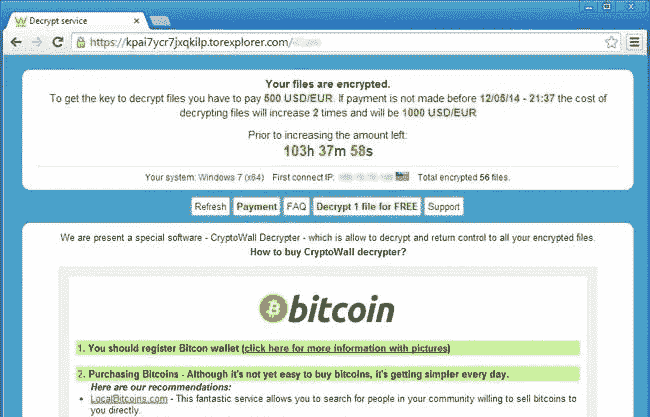

[CryptoWall 勒索短信。](https://www.computersquad.ca/CryptoWall_Ransomware_Removal.htm)

在本文中，我使用 NetworkMiner、Wireshark 和 OLETOOLS 来分析与 CrytoWall 勒索病毒感染相关的网络流量和钓鱼电子邮件。PCAP 和电子邮件文件属于蓝队专注挑战[网络卫士](https://cyberdefenders.org/blueteam-ctf-challenges/21)网站，名为“*恶意软件流量分析 6* ”，由 [Brad Duncan](https://twitter.com/malware_traffic) 创建。

# 放弃

我喜欢在文章之前添加一个简短的免责声明，以鼓励人们在阅读本文之前尝试挑战，因为在这篇文章中显然会有**剧透****。我相信，如果你先自己尝试，然后在遇到困难或需要提示时再回来写这篇文章，你会更喜欢这个挑战。因此，没有任何进一步的拖延，让我们开始吧！**

# **挑战场景**

> **你是一家加拿大公司的分析师，这家公司名为“桥太远企业”。在 2015 年 9 月 11 日星期五，您在公司的安全运营中心(SOC)工作时看到以下警报:**

**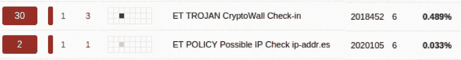**

**[警报](https://cyberdefenders.org/blueteam-ctf-challenges/59)**

> **您的 IDS 设备出现了一些问题，因此在这段时间内，网络上可能会发出其他警报。你只是看不到他们。警报出现后不久，您的帮助台就接到了一个投诉感染勒索软件的电话。打电话的人是格雷格里·弗兰克林(发音为“弗兰克·莱昂”)。**
> 
> **你的一个法医专家检查了 Greggory 被感染的 Windows 电脑。结果呢？Greggory 的电脑被 CryptoWall 3.0 感染了两次。两次感染相隔几分钟就发生了。取证人员从受感染的主机上恢复了两个 CryptoWall 3.0 恶意软件样本。**

**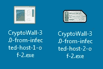**

**[密码墙](https://cyberdefenders.org/blueteam-ctf-challenges/59)**

**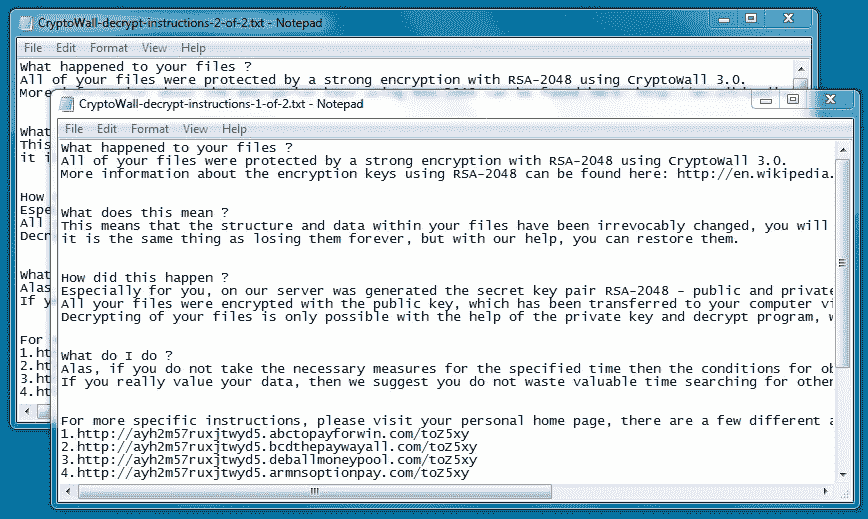**

**[密码墙注释](https://cyberdefenders.org/blueteam-ctf-challenges/59)**

> **您检索适当时间段的 pcap 流量。另一名分析师搜索了公司的邮件服务器，并检索出 Greggory 当天早些时候收到的四封恶意邮件。他们设法通过了垃圾邮件过滤器。**

# **挑战问题**

> **1.c42-mt a6–1022-UTC:附件文件名是什么？**

**为了找到附件文件名，我们可以从电子邮件“*c42-mt a6–1022-UTC*”中提取附件。**

**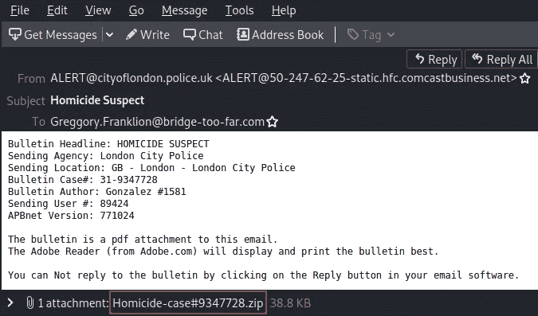**

**附件文件名。**

> **2.c42-mt a6–1022-UTC:附件包含恶意软件。恶意软件第一次提交给 virustotal 是什么时候？**

**如果我们上传 zip 文件，我们可以在 relations 选项卡下看到捆绑的恶意软件文件的名称。**

****

**病毒总压缩附件。**

**如果我们选择并查看捆绑的恶意软件文件的 VirusTotal 详细信息，我们可以看到恶意软件首次提交给 VirusTotal 的时间。**

**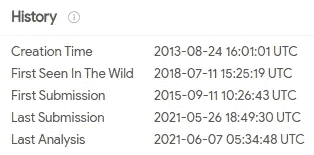**

**VirusTotal 恶意软件首次提交。**

> **3.c42-mt a6–1022-UTC:恶意软件正在与多个外部服务器通信。提供恶意软件联系的唯一 URL 的数量？(VirusTotal graph 是你的朋友)。**

**我们可以将附件中存储的可执行文件上传到 VirusTotal 并查看其详细信息。我可以看到它已经联系了五十个网址。**

**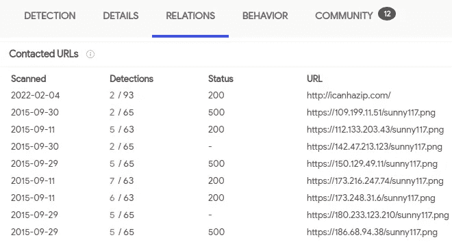**

**VirusTotal 联系了个 URL。**

**挑战的答案是 48，但我不确定这是否仍然准确，因为这个挑战是几年前创建的。即使使用了 VirusTotal Graphs，我也不确定如何得出答案 48。**

> **4.c42-mt a6–1022-UTC:提供恶意软件联系的 FQDN？**

**查看 VirusTotal 的详细信息，我们可以看到恶意软件联系的 FQDN。**

**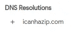**

**病毒总 FQDN。**

> **5.c42-mt a6–1422-UTC:恶意文档的创建时间是什么时候？(日期和时间之间有一个空格)。**

**我从电子邮件中提取了恶意文档，并将其上传到 VirusTotal，在那里我可以看到创建时间。**

**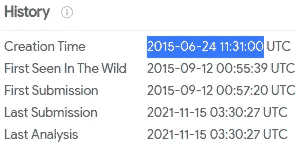**

**病毒总计恶意文档的创建时间。**

> **6.c42-mt a6–1422-UTC:哪个流包含宏？(提供流号)。**

**我用 [OLETOOLS](https://github.com/decalage2/oletools) 分析了恶意文档文件。如果你想了解更多关于 OLETOOLS 的知识，我发表了一篇文章，在这篇文章中我使用 OLETOOLS 分析了恶意的 Microsoft word 文档。**

**[](/maldoc101-malicious-macros-analysis-with-oletools-8be3cda84544) [## MalDoc101 —使用 OLETOOLS 进行恶意宏分析

### 这篇文章提供了我的方法来解决由 Josh Stroschein 在 CyberDefenders 上创建的 maldoc 101 CTF…

infosecwriteups.com](/maldoc101-malicious-macros-analysis-with-oletools-8be3cda84544) 

我开始使用 OLEID 来分析文件，我可以看到文件包含可疑的 VBA 宏。

```
oleid Patricia_Daniel_resume.doc
```

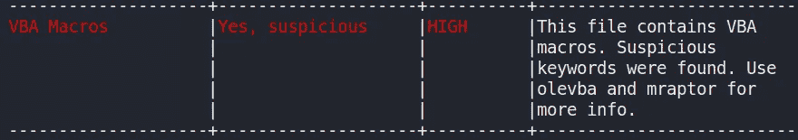

OLEID 识别可疑的 VBA 宏。

接下来，我使用 OLEDUMP 来分析流并识别包含宏的流(即流 3):

```
python oledump.py Patricia_Daniel_resume.doc
```

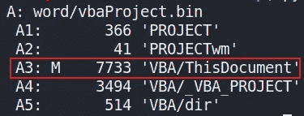

包含宏的流。

> 7.c42-mt a6–1422-UTC:隐藏实际 VBA 代码的技术是什么？(两个单词中间有一个空格)。

为了识别用于隐藏实际 VBA 代码的技术，我们可以使用 OLEVBA 来分析恶意文档中的 VBA 宏代码。我们可以在下表中看到，检测到了 [VBA 跺脚](https://dmcxblue.gitbook.io/red-team-notes-2-0/red-team-techniques/defense-evasion/t1564-hide-artifacts/vba-stomping)，这是一种通过用良性数据替换 VBA 源代码来隐藏嵌入 MS Office 文档中的恶意 VBA 有效载荷的技术。

```
olevba Patricia_Daniel_resume.doc
```

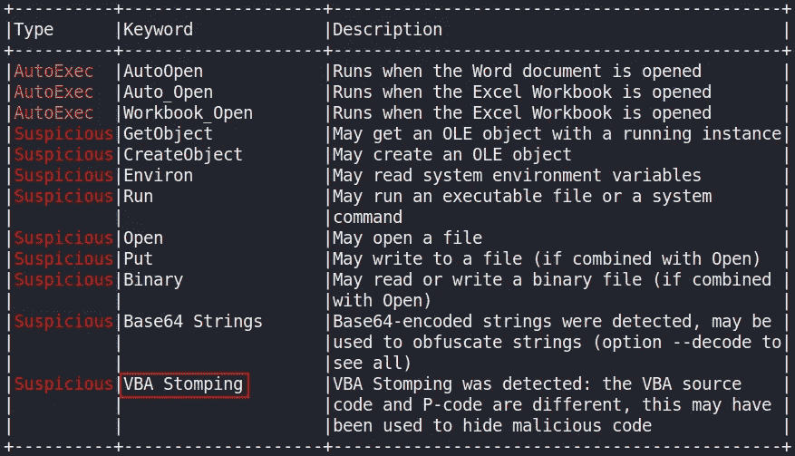

OLEVBA 分析确定 VBA 跺脚。

> 8.c42-mt a6–1422-UTC:可执行恶意软件的 sha256 哈希是什么？

作为挑战的一部分，我们提供了 CryptoWall 恶意软件可执行文件。如果我们上传“*CryptoWall-3.0-from-infected-host-2-of-2.exe*”到 VirusTotal，我们可以看到可执行文件的 sha256 哈希。

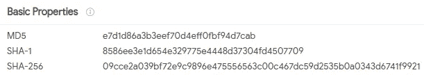

可执行恶意软件的哈希

> 9.c42-mt a6–1557-UTC:假登录页面的完整网址是什么？

如果我们查看电子邮件中的字符串，我们可以看到虚假登录页面的完整 URL。

```
strings c42-MTA6-1557-UTC.eml
```

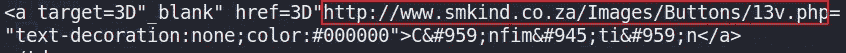

虚假登录页面的完整 URL。

> 10.c42-mt a6–1839-UTC:JS 文件中有多少个域？
> 
> 11.c42-mt a6–1839-UTC:JS 代码正在检查特定的 HTTP 响应代码。正在检查的响应代码是什么？

为了找到 JS 文件中的域名数量，我们可以从邮件中提取附件，然后将 JS 文件的内容上传到 [de4js](https://lelinhtinh.github.io/de4js/) 进行解码。查看输出，我可以看到三个 FQDN。

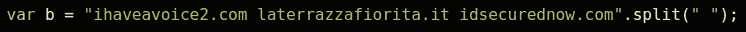

JS 文件中存在的域的数量。

在 JS 代码中，我们还可以看到代码正在检查 200 HTTP 响应代码。

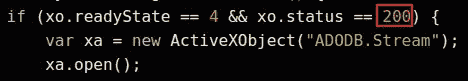

JS 代码检查 HTTP 响应代码 200。

> 12.受害者收到多封邮件，只打开了其中一封。他打开了哪一个？(提供完整的 eml 文件名)。

根据我们到目前为止的调查，我们注意到电子邮件“*c42-mt a6–1422-utc . EML*”包含一个恶意文档，该文档被用于下载和安装 CryptoWall 勒索软件(*请参考 Q 的 5、6、7 & 8 以上的*)。由于主机感染了这个勒索病毒，我们知道受害者打开了标题为“*c42-mt a6–1422-utc . EML*”的邮件。

> 13.受害机器的 IP 地址是什么？
> 
> 14.受害者机器的主机名是什么？

在 NetworkMiner 的“hosts”选项卡下，我可以看到组织的内部专用网络中有一台 Windows 计算机，根据目前从 PCAP 检索到的信息，这很可能是受感染的 Windows 虚拟机。

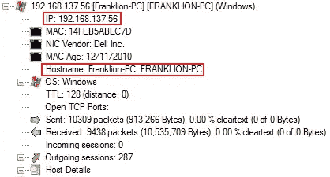

NetworkMiner 受害者计算机详细信息。

> 15.用于传播恶意软件的漏洞利用工具包的名称是什么？(一个字)。

我们可以将整个 PCAP 上传到 VirusTotal 并查看 snort/suricata 警报，从中可以看到检测到的漏洞利用工具包是 Angler EK。

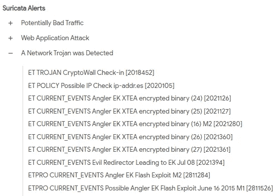

病毒总 Angler EK。

> 16.哪个 IP 地址利用了该漏洞？
> 
> 17.将受害者重定向到攻击者托管利用工具包的服务器的被入侵网站的 FQDN 是什么？

在 Wireshark 中，我导航到“*文件>导出对象> HTTP* ”并按内容类型排序。我可以看到有几个从下面突出显示的 FQDN 下载的 shockwave flash 文件。

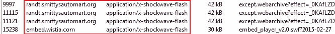

Wireshark HTTP 冲击波对象。

我将从“*smittysautomart*”FQDN 中检索到的第一个 flash 文件上传到 VirusTotal，该文件被标记为恶意文件。

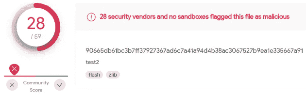

病毒总数闪存文件。

在 Wireshark 中，我过滤了与“*smittysautomart*”FQDN 相关的 HTTP 对象。

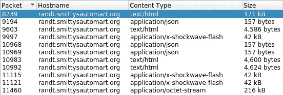

与“*smittysautomart*”FQDN 相关的 HTTP 对象。

上传大小为 171 kb 的 HTML 文件，我们还可以看到该文件包含嵌入的 JS。

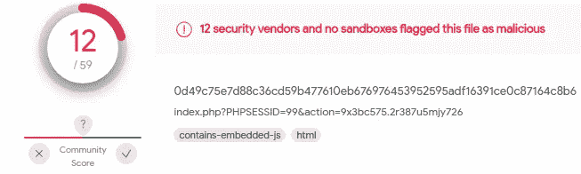

嵌入 JS 的 VirusTotal HTML 文件。

在 Wireshark 中查看数据包 8239 并跟踪 HTTP 流，我可以看到 referrer 包含被入侵网站的 FQDN，该网站将受害者重定向到攻击者托管利用工具包的服务器。

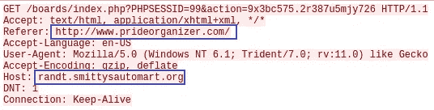

受损网站的 FQDN。** 

# **结束语**

**我发现这个挑战对于使用 NetworkMiner、Wireshark 和 OLETOOLS 来说非常棒。我也非常喜欢研究电子邮件和 PCAP 挑战，以了解 Windows 虚拟机是如何感染 CryptoWall 勒索软件的。谢谢你一直读到最后，继续黑下去😄！**

# **🔈 🔈Infosec Writeups 正在组织其首次虚拟会议和网络活动。如果你对信息安全感兴趣，这是最酷的地方，有 16 个令人难以置信的演讲者和 10 多个小时充满力量的讨论会议。[查看更多详情并在此注册。](https://iwcon.live/)**

**[](https://iwcon.live/) [## IWCon2022 - Infosec 书面报告虚拟会议

### 与世界上最优秀的信息安全专家建立联系。了解网络安全专家如何取得成功。将新技能添加到您的…

iwcon.live](https://iwcon.live/)**