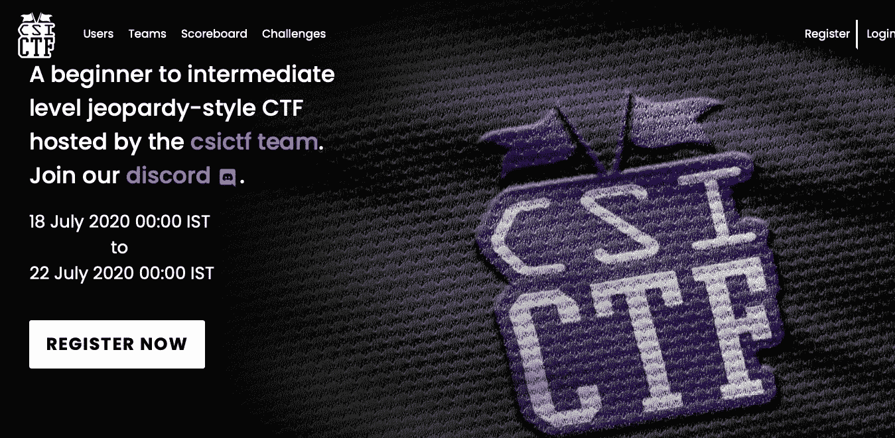
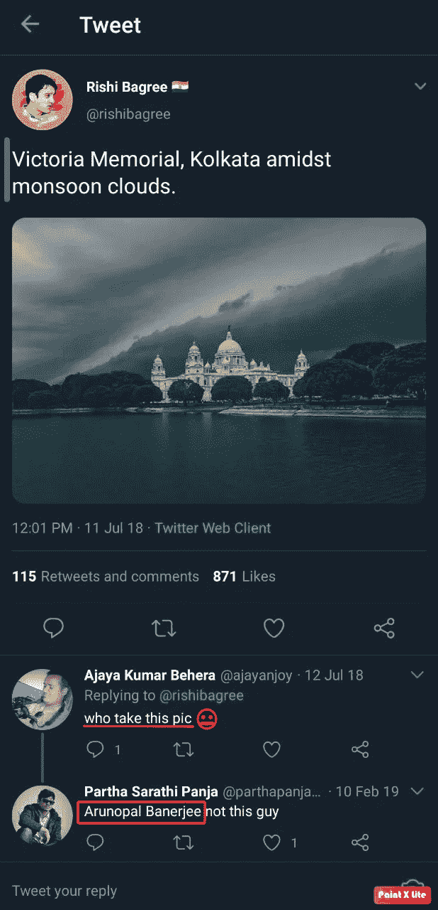
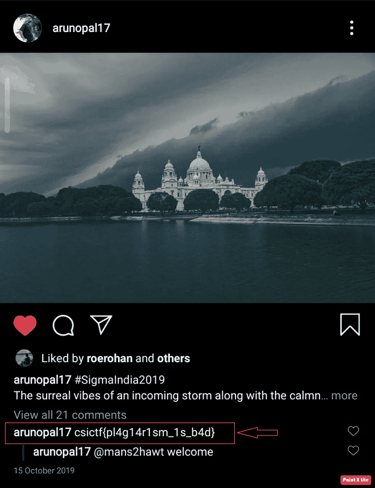
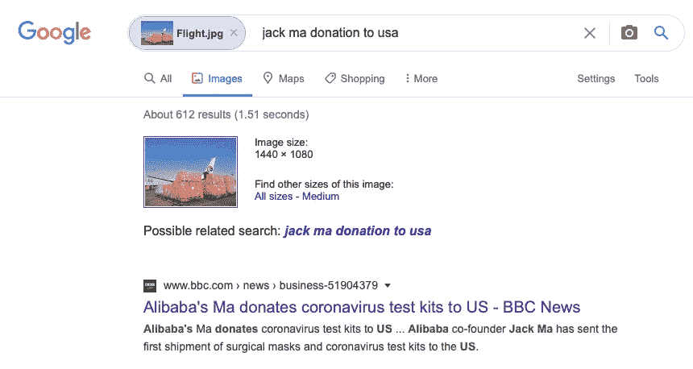
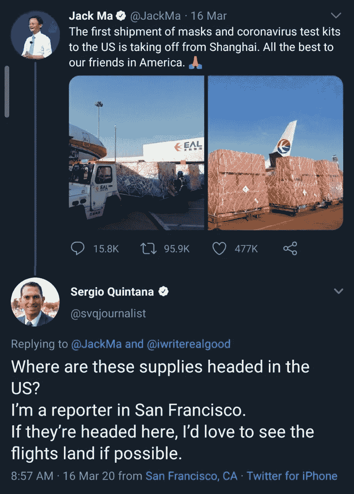
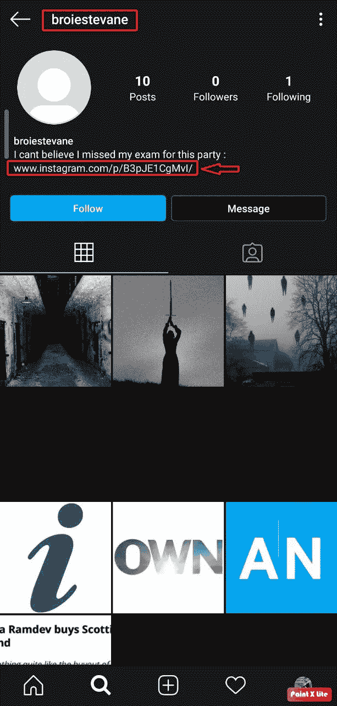
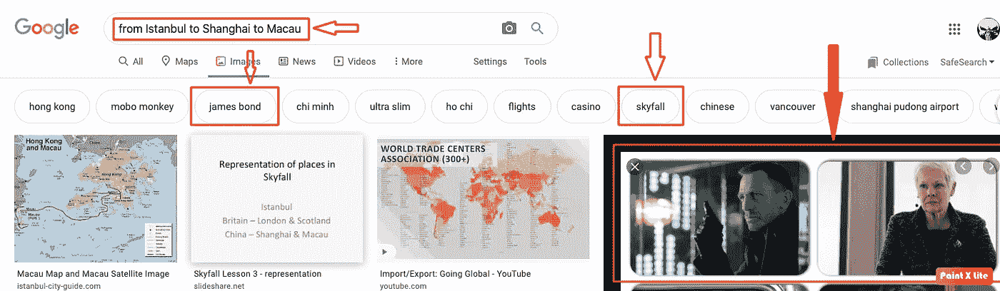
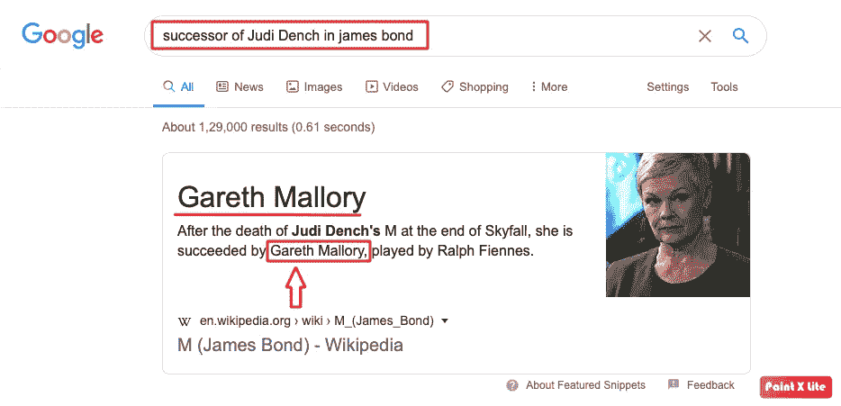
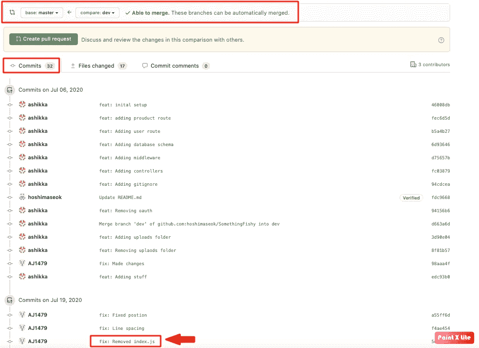
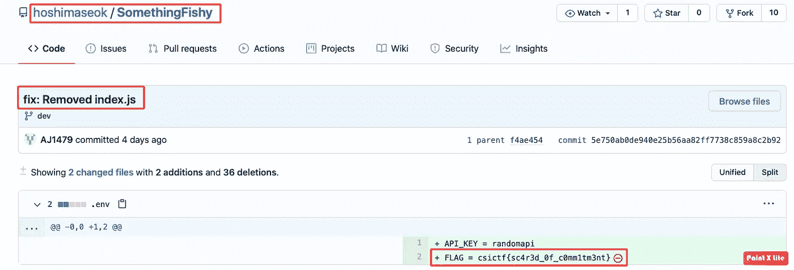

# csictf-2020 OSINT 报告

> 原文：<https://infosecwriteups.com/csictf-2020-osint-write-up-a1df5cd72a81?source=collection_archive---------0----------------------->

一个月前，2020 年 6 月我们一个团队([*fr 3 nzym 1 n3rs*](https://ctftime.org/team/126059))3 人组第一次开始做 CTFs。作为初学者，我们在不同的平台上练习。
经过几天的练习，我们开始认真参加 CTFs。几天前，我们开始了解由 csictf 团队主办的这次 CTF。

[https://ctf.csivit.com](https://ctf.csivit.com)

因此，在这篇文章中，我将介绍新的挑战。其中包含以下挑战名称:

1.  ***海盗纪念馆***
2.  ***飞行场所***
3.  ***LO SCAMPO***
4.  ***动摇了***
5.  ***承诺***

# **海盗纪念馆**

**挑战描述:** *本图原拍摄者在自己的帖子上评论国旗。找到旗子。*

**附件:**

storm.jpeg

在最左下角标记图标让我想到它可能是来自 Instagram 的截图。尽管如此，当每个人都开始使用 OSINT 时，我也是通过在 Google Image 上搜索图片来开始的。我发现这很有趣:

Google_Image 搜索结果

在访问了这个网址后，我知道了谁是这张美丽照片的主人。

推特

现在我在 Instagram 上搜索这个家伙，找到了 2019-10-15 发布的原图。旗子在外面被评论了。

原图由**阿鲁巴 17**([https://www.instagram.com/arunopal17/](https://www.instagram.com/arunopal17/))提供

**Flag:*csictf { pl 4g 14r 1 sm _ 1s _ b4d }***

# 飞行场所

挑战描述:一名记者想知道这架飞机将飞往何处。 ***他(记者)住在哪里*** *？*

附件:

Flight.jpg

同样的过程，从在谷歌图片上搜索图片开始。
在访问了几个网址后，我得知**阿里巴巴联合创始人马云已经向美国发送了第一批外科口罩和冠状病毒检测试剂盒。** 搜索结果中的第一个链接把我带到了这个链接[**https://www.bbc.com/news/business-51904379**](https://www.bbc.com/news/business-51904379)

谷歌图片搜索结果

通过访问 **BBC 新闻**链接，我了解到 ***马云*** 已经在他的*推特*手柄上正式发布了这个*。
那么，接下来可以做什么呢？我跟踪了原帖，分析了他帖子上的评论，发现了这个:*

根据挑战的描述，旗帜应该是**旧金山**。

**Flag:*csictf {旧金山}***

# LO SCAMPO

**挑战描述:** *马尔科姆·Ⅹ带着布罗伊斯特文去了一个亡灵节主题派对，但她再也没有回来。她唯一的朋友，憨豆先生和粉红豹意识到，当她没有参加考试时，她失踪了。Broiestevane 喜欢贴图片，* ***聚会在哪里举行*** *？(别忘了用 csictf{}把你的答案包起来)。*

这次没有附件。于是，我开始在不同的社交媒体平台上搜索“Broiestevane”这个用户名(在 https://instantusername.com/#/的帮助下)。在 Instagram 上，我发现了这样一个简介:

**broiestevane** 的 Insta 轮廓

你可以在简历中看到链接。我点击了链接，发现了这个帖子，其中包含了位置:

自由邮报酒店

根据挑战的描述，波士顿自由酒店应该是我们的旗帜。

**Flag:*csictf { liberty _ hotel _ Boston }***

# **摇动**

**挑战描述:** *我爱这只表。从伊斯坦布尔到上海，再到澳门，它一直伴随着我走遍世界。我经常穿西装。我的老板也喜欢它。我记得她死时戴着它。她的继任者叫什么名字？*

同样没有附件。如果看过《天降奇兵-军情六处》的电影，任何人都可以轻松完成这个挑战。要么是我在谷歌上搜索“从伊斯坦布尔到上海到澳门”得到的线索。在几个不相关的结果之后，我切换到谷歌图片搜索，发现这个很有趣:

***`从伊斯坦布尔到上海到澳门`*** 搜索结果

现在到了这个时候，我想你可能也找到了答案。自从 4-5 年前我看了这部电影。我再次浏览了一遍 xD 的概要。经过一番调查我了解到，挑战想知道朱迪·丹奇*(M)****在詹姆斯·邦德的 ***接班人。*** 现在呢，简单地在 Google 上搜索一下，发现了这个结果:***

**旗帜:*csictf { Gareth _ mallory }***

# **承诺**

**挑战描述:** *星石不怀好意。找到他。*

这次我又开始在 [***即时用户名***](https://instantusername.com/#/) ***上进行用户名搜索。*** 这个用户的 Github 简介引起了我的注意。：

【https://github.com/hoshimaseok/SomethingFishy】

这个配置文件有一个存储库*和**两个分支。我开始比较树枝。***

**

*[https://github.com/hoshimaseok/SomethingFishy/compare/dev](https://github.com/hoshimaseok/SomethingFishy/compare/dev)*

*这看起来很有趣。打开那个特别的描述找到了旗子。*

**

*旗帜！！*

****FLAG = CSI CTF { sc 4r 3d _ 0f _ c 0mm 1 tm3 nt }。****

*我会在你研究的时候推荐这个 OSINT 框架:
[**https://osintframework.com**](https://osintframework.com)*

*感谢阅读到目前为止。*

*要连接:*[*Twitter*](http://https//twitter.com/abhiunix)Web:*https://abhi UNIX . in***