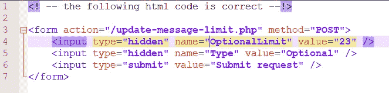
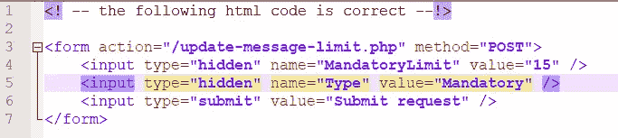
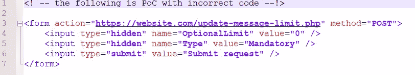

# CSRF PoC 错误破坏了最终用户/受害者的重要功能

> 原文：<https://infosecwriteups.com/csrf-poc-mistake-that-broke-crucial-functions-for-the-end-user-victim-ef4fa4584ca8?source=collection_archive---------1----------------------->

您听说过业务逻辑错误。滥用网站功能背后的逻辑，以获得你不应该获得的折扣或类似的东西，即[https://hackerone.com/reports/336131](https://hackerone.com/reports/336131)和类似的东西，这种想法并不新鲜。然后，还有其他我过去没有看到的逻辑错误。可能是我没有看我应该看的地方。

在我看来，这是一个非常奇怪的逻辑错误。这是一种全新的扰乱底层逻辑的方式，这取决于网站是如何编码的。在这种情况下，它“只”破坏了最终用户/受害者的一些网站功能，并且可以通过 csrf 触发。实际上，我是在编写 csrf PoC 代码时偶然发现的。

**CSRF 发现:**

对 csrf 最简单的测试是:跟踪 burp 的请求头，查看是否没有 x-csrf 或其他自定义头(如果有，删除它们，并验证请求是否仍能正常通过)，没有来源限制，没有引用限制，等等。最后，请求主体被验证为没有 csrf 令牌或者 csrf 令牌没有被正确验证。接下来是有趣的部分。

**CSRF PoC，还有一个错误:**

已经通过报头和参数验证了 csrf 没有限制/保护，我继续准备 PoC。这是一个简单的 html 表单，但是它有一个有趣的逻辑。我将尽我所能解释它，考虑到我不能太详细，因为它是私有的 bbp，而且最重要的是，param 名称可能很容易就能看出我在讨论哪个 bbp。

假设你是一个用户，你可以限制你每月可以发送多少个付费电子邮件，在那里你可以附加一个文件。这意味着，如果达到了限制，你只能发送不带附件的免费电子邮件(相信我，这只是一个最简单的例子，我可以将实际功能转化为真实的东西，真实的东西要有趣得多，但它的细节会很容易地揭示问题中的 bbp)。

你可以将这个限制设置为可选限制，也就是说，如果你需要的话，你可以在月底之前改变它。或者，您可以将它设置为 MandatoryLimit，这意味着必须遵守它，直到该月到期，在该月到期之前，您不能覆盖该限制。

OptionalLimit 的 html 表单代码如下所示:

MandatoryLimit 的代码是:

注意两幅图像中突出显示的行(分别是第 4 行和第 5 行)。

**CSRF PoC 犯了一个小错误:**

你能发现这个错误吗？

以防万一，这是第 4 行或第 5 行:类型的值应该对应于名称 OptionalLimit，这意味着在这种情况下，它应该是具有值 Optional 的类型，或者名称 OptionalLimit 应该是 MandatoryLimit。

影响:因为值设置为 0，这意味着用户/受害者只能发送免费电子邮件，直到该月结束，假设表单设计在下个月初重置。

影响的严重性进一步增加，因为用户/受害者无法通过网站表单重新调整任何与消息限制相关的内容，因为下拉框不显示任何选项，只有空白字段。因此，解决它的唯一方法是最终用户/受害者使用打嗝中继器或类似设备，并手动输入参数和值，以便将一切恢复正常。

注意 html 表单中的一切。这可能是有益的。除了显而易见的东西之外，参数名和值都可能有其底层逻辑背后的线索，以及参数名和值是如何相互关联的。我鼓励大家以后在寻找 bug 的时候注意这种类型的怪异行为。