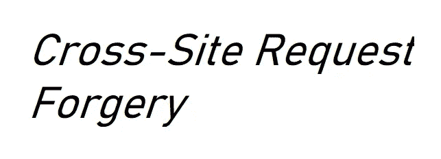

# CSRF:网络应用安全基础知识

> 原文：<https://infosecwriteups.com/csrf-web-app-security-basics-dd4628122fea?source=collection_archive---------2----------------------->

**跨站点请求伪造(CSRF/XSRF)** 也称为一次点击攻击或会话骑行，是一种最终用户在 web 上执行非故意操作的攻击。比如邮箱地址变更、密码变更、资金转账等。当用户当前已通过身份验证时，可以执行操作。攻击者可以完全控制应用程序，这取决于系统中的缺陷。

你有没有想过，当你往购物车里添加东西时，网站如何知道是不是你，或者它如何区分不同的用户，因为每个进入应用程序的请求都是一个新的请求。答案是***session cookie***。

会话 cookie 包含会话信息，并跟踪用户的输入和操作。它被临时存储，并在一段特定的时间后被删除。

但是，如果这些会话 cookies 帮助攻击者执行用户无意的操作呢？其中一个攻击场景是 CSRF。

***举例*** :

Susan(受害者)目前在她的银行网站上通过了身份验证，攻击者知道这些信息。攻击者通过邮件/消息“头奖彩票”向 Susan 发送恶意链接。苏珊很好奇，点击了链接。该链接在她登录银行网站的同一个浏览器中打开，恶意链接向应用程序发送请求，由于缺乏安全性，特定金额的钱被转移到攻击者的帐户。

***如何/执行*** :

实施这种攻击需要几个因素的共同作用。

*   服务器仅依靠会话 cookie 来识别发出请求的用户，而不检查请求的来源。
*   攻击者利用社会工程学的技巧，诱骗受害者在当前登录时点击恶意链接，并从同一浏览器发送链接/请求。
*   攻击者发送给受害者的恶意链接/请求必须是看起来合法的对服务器的请求。

受害者发送的任何带有 cookie/凭据的 HTTP 请求都将被视为合法，并会对应用程序采取行动，即使受害者代表攻击者发送请求。

尽管有其局限性，CSRF 是非常常见的攻击，应该认真对待。它在[OWASP 10 强–2013](https://owasp.org/www-pdf-archive/OWASP_Top_10_-_2013.pdf)中排名第八。

***制作 HTTP 攻击请求* :**

您可以手动创建用于攻击 HTTP 请求，但有时这很耗时。还有一些工具，如 CSRF 测试器或 CSRF 概念生成器。 [OWASP ZAP](https://owasp.org/www-project-zap/) 一个开源的 web 应用安全工具可以用来处理这个请求。

***预防*** :

以下是一些可用于预防的方法:

1.  不要对状态更改操作使用 GET 请求。
2.  框架内置 CSRF 保护的使用。
3.  反 CSRF 代币。
4.  双重提交技术。
5.  针对重要变更操作的多因素身份认证(例如 OTP 或安全问题)。
6.  对所有会话 cookie 使用“same site”cookie 属性。
7.  自定义请求标头。
8.  培训和意识。

***错误/绕过* :**

以下是 CSRF 防护实施中的一些错误，攻击者可能会绕过 CSRF 防护:

1.  每个会话的反 CSRF 令牌不是唯一的，或者令牌是可预测的。
2.  当 CSRF 令牌存在时，一些应用程序验证它，但是通过从请求中移除它，应用程序跳过验证。
3.  应用程序验证通过 POST 请求发送的 CSRF 令牌，但跳过 GET 请求。
4.  CSRF 令牌在“双重提交”技术中被复制。

***参考文献*** :

 [## 什么是 CSRF(跨站请求伪造)？教程和示例|网络安全学院

### 在本节中，我们将解释什么是跨站点请求伪造，描述一些常见 CSRF 的例子…

portswigger.net](https://portswigger.net/web-security/csrf)  [## 跨站点请求防伪- OWASP 备忘单系列

### 跨站点请求伪造(CSRF)是一种攻击类型，当恶意网站、电子邮件、博客、即时…

cheatsheetseries.owasp.org](https://cheatsheetseries.owasp.org/cheatsheets/Cross-Site_Request_Forgery_Prevention_Cheat_Sheet.html)  [## 跨站点请求伪造

### 跨站请求伪造，也称为一键攻击或会话骑和缩写为 CSRF(有时…

en.wikipedia.org](https://en.wikipedia.org/wiki/Cross-site_request_forgery)