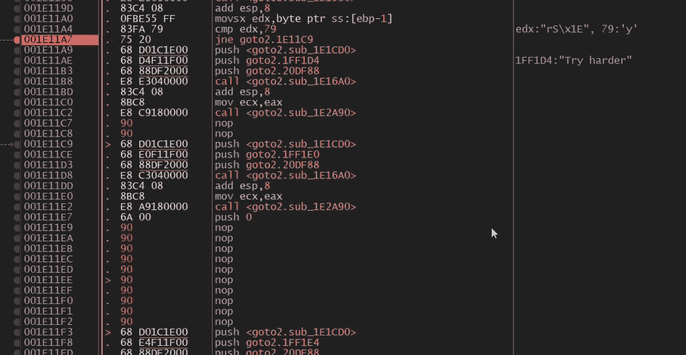
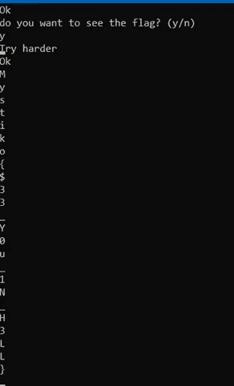

# CTF 报道:地狱耶！

> 原文：<https://infosecwriteups.com/ctf-creation-hell-yeah-6d774aecad8f?source=collection_archive---------2----------------------->

*   ctf-mystiko.com 有 CTF 挑战赛。
*   挑战名称:地狱耶！
*   类别:逆向工程
*   语言:C++

— — — — —

这个例子展示了一种防止 CTF 玩家通过使用“strings”命令将旗帜隐藏在二进制文件中的方法。我发现 strings 不能打印短于(至少)三个字符的字符串。因此，在这种情况下，标志被逐行打印到标准输出，而没有存储在变量中。

*   源代码:

hellyeah.cpp 的源代码

为了解决这一挑战，我们需要打破“while”循环，这个循环永远运行下去。以便能够前进到创建旗帜的地方。

用 nop 替换所有的跳转可以很容易地做到这一点(不需要太多的思考)。使用 x64 调试器(在这种情况下是 x32，32 位版本，因为 x64 抱怨错误的体系结构)，来替换我们所做的指令:右键单击 instruction> assemble > add nops

当程序加载到调试器中时，我们可以暂停程序，单步执行指令，当我们到达 jmp 时，不是单步执行，而是首先用 nop 替换它。

跳跃已经被 nop 取代

在某一点上，我们将修补返回到 while 循环开始处的跳转，因此我们可以进一步查看逐行打印的标志。

旗帜是逐行打印的

一般来说，在反转程序时，用 nop 替换 jmp 来访问程序中不符合正常逻辑的部分是很有趣的，但是这可能会导致意外的行为，并且可能需要大量的反复试验。