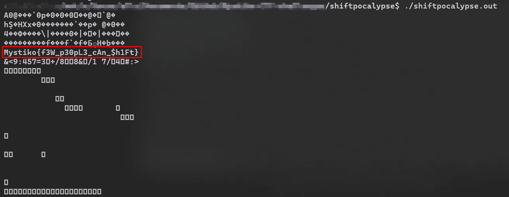

# CTF 报道:转移启示

> 原文：<https://infosecwriteups.com/ctf-creation-shiftpocalypse-579cb8d6c050?source=collection_archive---------0----------------------->

*   ctf-mystiko.com 有 CTF 挑战赛。
*   挑战名称:Shiftpocalypse
*   类别:密码术

— — — — —

我们得到了下面的数字序列:

1232 1936 1840 1856 1680 1712 1776 1968 1632 816 1392 1520 1792 816 768 1792 1216 816 1520 1584 1040 1760 1520 576 1664 784 1120 1856 2000

挑战的名字包含了两个暗示:“转变”和“天启”。移位表示移位操作已经被使用，或者需要被使用。天启与数字四(天启四骑士)有关。即使我们不把第二个提示与数字 4 联系起来，我们也可以认为移位操作被应用于标志，我们需要反转它来恢复明文。

移位操作基本上意味着向左移位(<>)。这样，当我们做 1<<2 时，1(二进制的 001)变成 4(二进制的 100)(这意味着我们将第一个操作数 1 的位向左移动两个位置，因此 001 变成 010，然后变成 100)。注意，由于我们处理的是二进制数，左移运算和乘以 2 是一回事，右移等于除以 2。

为了解决这个问题，我们将创建一个循环，对序列中的数字应用不同数量的位移，并打印输出，希望其中一行是明文标志:

顾名思义，向右移动四次将返回与明文标志的 char 值相对应的数字(注意与“%c”格式一起使用的 printf，因为我们需要将数字转换为 char:

在将数字移位 4 个位置并获得相应的字符后，找到明文标志

有人可能会说，我们本可以转向左边来解决这个挑战。除了尝试两个方向并找到正确的方向之外，请注意，这将意味着获取初始数字序列的原始操作将包含向右移位的情况(因此我们可以用向左移位来撤消这一操作)。但是向右移位是危险的，因为它会将最低有效位“推到”右边，使它们消失，并且以后通过向左移位也无法恢复。如果我们左移一个非常大的数，接近其类型最大允许值的极限，当然也会发生这种情况，但对于我们给定的这些小数字，这是不可预料的。