# CTF 报道:氪石

> 原文：<https://infosecwriteups.com/ctf-write-up-kryptonite-293f2f66c004?source=collection_archive---------3----------------------->

*   ctf-mystiko.com 有 CTF 挑战赛。
*   挑战名称:氪星石
*   类别:安卓
*   源代码:[https://github . com/dh0ck/Mystiko-CTF-挑战/tree/main/kryptonite](https://github.com/dh0ck/Mystiko-CTF-challenges/tree/main/kryptonite)

— — — — -

## **介绍和设置**

这项挑战旨在展示如何枚举 android 应用程序来搜索隐藏信息。

免责声明:这篇文章显示了专门用于测试 Android 应用程序的工具，这些工具需要单独安装。安装步骤因主机操作系统而异。网上解释的很清楚，如果没有安装这些工具就谷歌一下。
安装 apk 的方法是将它拖到 Genymotion 或其他模拟器上，或者使用以下命令将其安装到物理设备上:

设备上会出现一个新图标:

我们继续运行应用程序。文字写在 1337 额外的 haX0r 感觉。标题有 435 = 1337 年 AES 这个词。这给出了关于应用程序中使用的加密的提示。

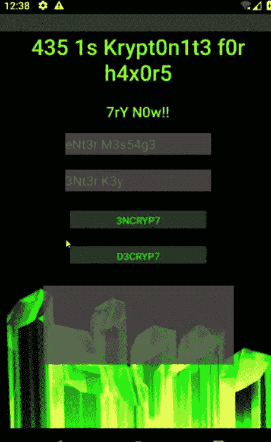

应用程序的主要活动

我们可以输入消息和密钥，并用 AES 加密消息。应用程序的 Java 代码中使用的函数是:

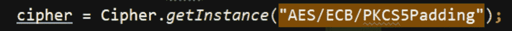

存在更强的密码，例如 CBC 模式。同样，用同样的算法输入一个加密的文本就可以解密它。在这两种情况下，结果都显示在下方的文本框中。AES 要求密钥长度为 16、24 或 32 字节。否则，我们会收到一条祝酒辞警告:

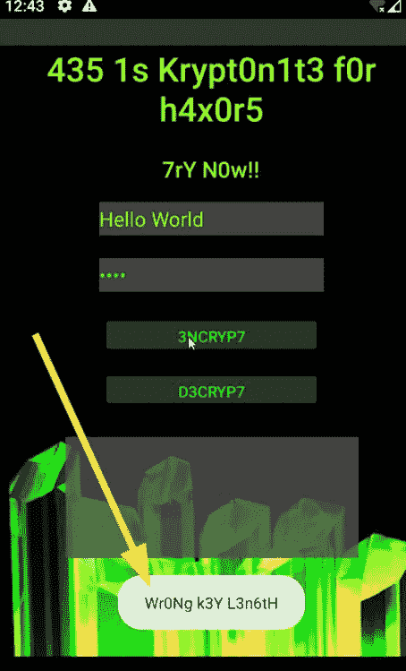

使用的密钥长度错误

在提供密钥的有效长度后，我们看到加密的消息:

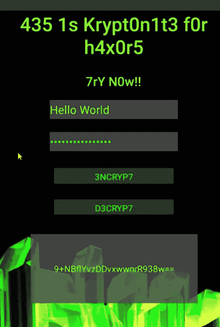

有效的密钥长度会产生加密的消息

## 列举

当测试移动应用程序时，在开始测试错误之前，像普通用户一样使用它们总是一个好主意。通常情况下，应用程序开始在本地存储数据，存储数据的方式可能会出现错误。如果我们不首先使用应用程序特性生成这些数据，我们可能会错过这些数据。

我们需要检查应用程序的内存。为此，我们需要使用 android 调试桥(ADB)通过 USB 访问手机。我们在手机里装了一个外壳:

Android 应用程序安装在/data/data 中。我们需要找到我们的目标应用程序，为此我们可以简单地将 ls 与 grep 结合起来，查找应用程序名称。
文件夹数据库已由应用程序创建，其中包含一个 sqlite 数据库。使用:

sqlite3 default.db

命令我们可以访问它。
。表显示数据库中可用的表。
我们看到表测试的所有记录

在新创建的记录之前，已经存在三个记录(在下一张图中用蓝色标记)，包含我们输入的加密消息(在下一张图中用红色标记)。请注意，default.db 在应用程序安装后并不存在。由此可见，在分析应用程序以查找漏洞之前，先使用它是多么重要:

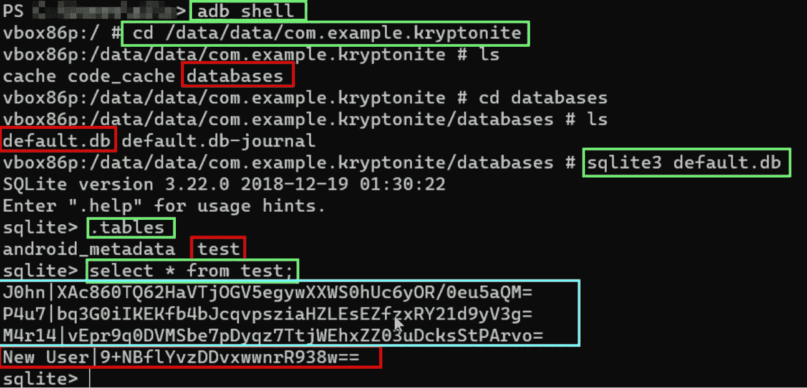

与 SQLite 数据库的交互

在该表中，在创建它的用户名的右侧，有以下三个可疑字符串:

*xac 860 TQ 62 havtjogv 5 egywxxws 0 huc 6 yor/0 eu 5 AQM =
bq 3g 0 iikekfb 4 bjcqvpsziahzlesezfxry 21d 9 yv3g =
vepr 9 q 0 dvmsb 7 pdyqz 7 ttjwehxzz 03 udcksstparvo =*

它们似乎被加密了，可能使用了应用程序使用的相同算法。它代表了懒惰的管理员可能留在那里进行测试的一些剩菜。或者，他们可能是因为该应用程序的测试版本在正式生产之前就已经发布了。

如果字符串真的是 AES 加密的，我们需要密钥来解密它。要找到它，需要更多的枚举。可以使用 apktool (apktool d kryptonite.apk)或 jadx-gui 之类的工具反编译该应用程序，并检查清单。
manifest . XML 文件包含关于应用程序的结构和配置的信息。如果。apk 文件被简单地提取，这个文件被编码并且不可见，但是前述的工具解码它。jadx-gui 中的清单文件如下所示:

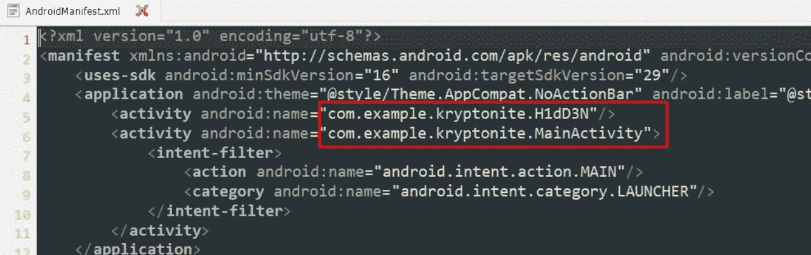

红色标记的是活动(即应用程序中包含的不同“窗口”)。MainActivity 是任何 app 的起点。有 H1dD3n 活性。应用程序已创建，因此不能通过任何方式从 MainActivity 窗口访问此活动。同样，这可能代表了在复杂的应用程序中被懒惰的管理员遗忘的一些剩余活动。如果我们知道任何活动的名称，我们就可以打开它，而不管如何以合法的方式访问它。为此，我们再次使用“adb shell”访问手机外壳

从那里，我们运行这个命令:

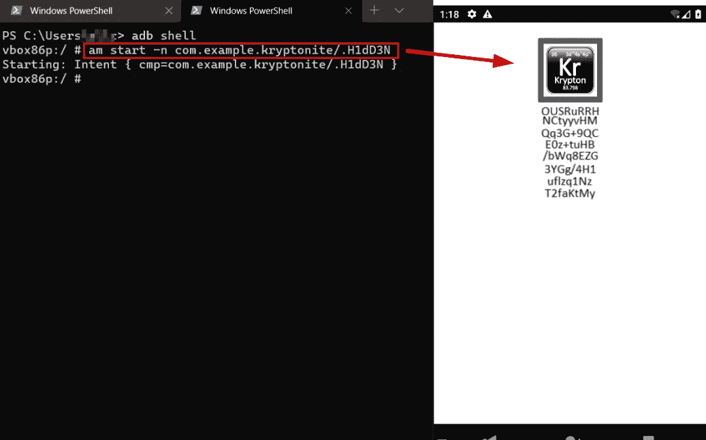

请注意，模拟器上已经打开了一个新的活动。am 命令是活动管理器，使用 am start，我们可以通过提供应用程序名称(如/data/data 目录中所示)和活动名称(注意“.”来打开活动在活动名称之前，它不是名称的一部分，必须在那里。

虽然看起来可能不像，但是活动顶部的图像实际上是一个按钮。不要忘记点击/轻击任何地方，这样你就不会错过任何东西。点击它会显示一条祝酒辞:

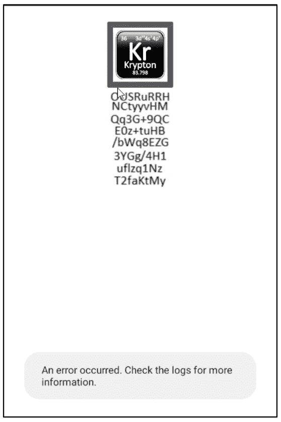

该消息提示检查日志。检查真实应用程序的日志也是一个好主意，在大量的消息中可以找到重要的调试信息。
在这种情况下，点击按钮时会显示这一信息(检查日志，并保持日志打开，以便从手机外壳外部使用 adb logcat 命令查看实时更新):

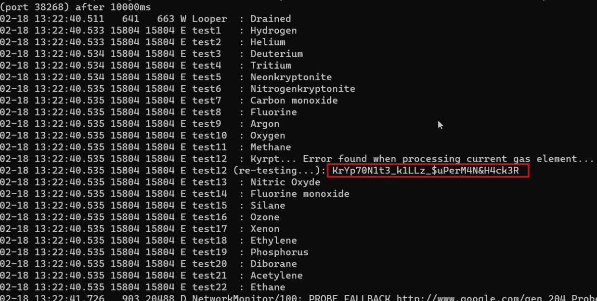

继续挑战的氪元素主题，当氪元素显示在气体列表中时，会出现错误(所有内容都是硬编码的，没有真正的错误发生)。显示一个可疑字符串:

*kryp 70 n1 T3 _ k1LLz _ $ uPerM4N&h4ck 3r*

利用这个字符串和一点想象力，我们可以想象它是先前在数据库中找到的三个字符串的解密密钥:

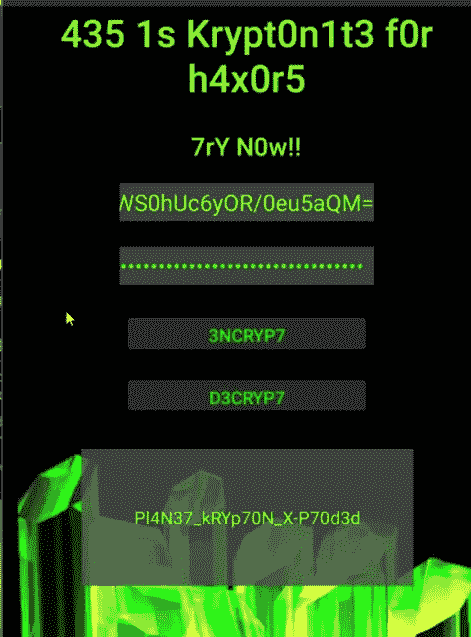

解密给出:

密文:xac 860 TQ 62 havtjogv 5 egywxxws 0 huc 6 yor/0 eu 5 AQM =

明文:Pl4N37_kRYp70N_X-P70d3d

……….

密文:bq 3g 0 iikekfb 4 bjcqvpsziahzlesezxry 21d 9 yv3g =

明文:(%)KrYpT0NyT3_4_L1F3~

………

密文:vepr 9 q 0 dvmsb 7 pdyqz 7 ttjwehxzz 03 udcksstparvo =

明文:# 36 氪 _ GaZ _ 4 _ 午餐？@

最后，H1dD3n 活动中的文本是加密标志。它被分割成块，并以图像的形式呈现，以阻止使用字符串和 grep 等命令，并迫使人们更深入地挖掘和理解 android 应用程序的结构。然而，仔细检查资源和源代码仍然可以检索图像，但这是预期的路径，用活动管理器生成隐藏的活动。在隐藏活动中键入消息后(注意在出现的一个事件中尝试小写“L”或大写“I”):

ousrurhh
NCtyyvHM
Qq3G+9QC
E0z+tuHB
/bwq 8 ezg
3 ygg/4 h1
uflzq 1nz
T2 faktmy

将它重写为一行，并使用在上一步中找到的第三个纯文本
密码对其进行解密，以检索该标志:

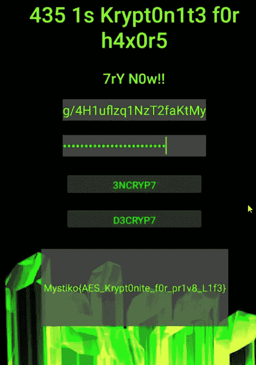

最终旗帜