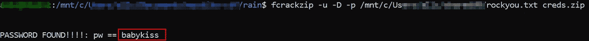
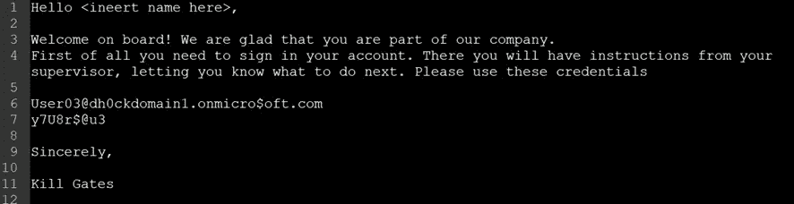
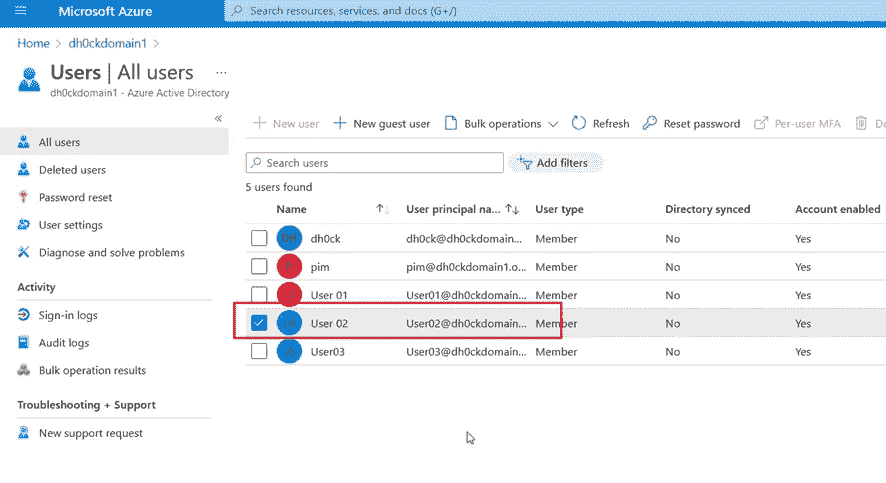
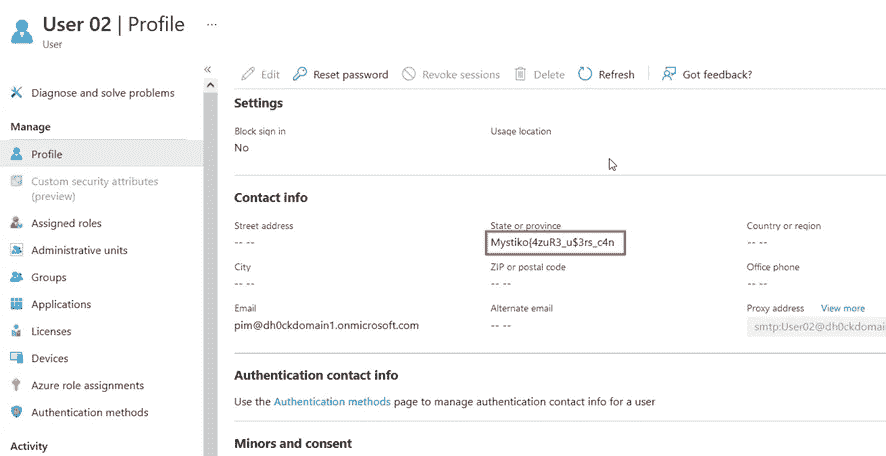
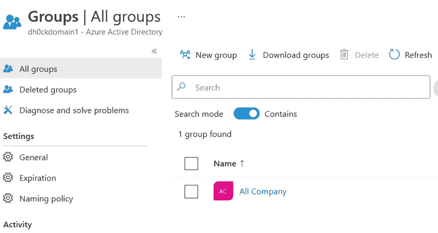
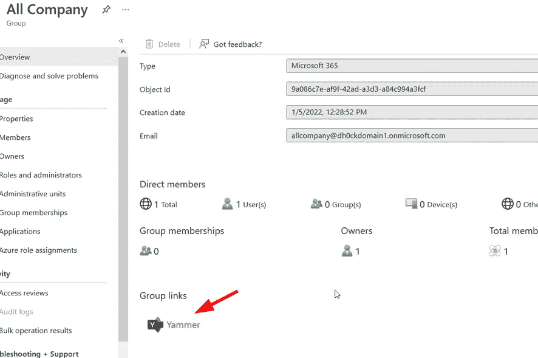
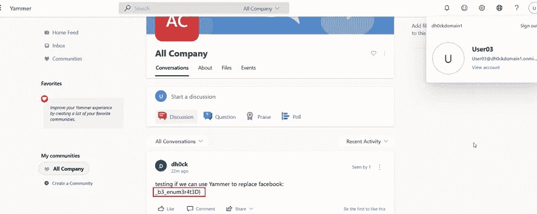
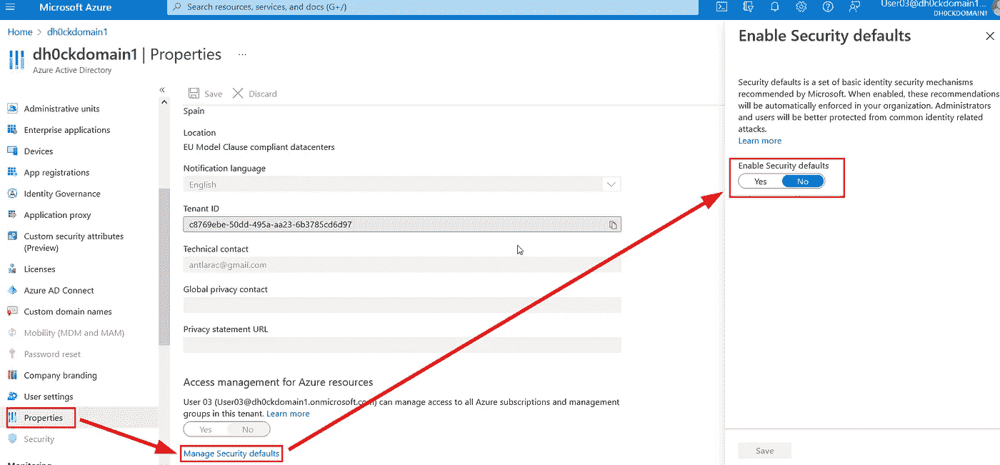

# CTF 报道:下雨了

> 原文：<https://infosecwriteups.com/ctf-write-up-rain-d7473e9ed46b?source=collection_archive---------2----------------------->

CTF 报道:下雨了

*   ctf-mystiko.com 有 CTF 挑战赛。
*   挑战名称:雨
*   类别:杂项

— — — —

这个挑战展示了一个关于 Azure Active Directory 和微软生态系统的非常入门的课程。我们从一个 zip 文件开始。可以用 rockyou 破解:

zip 文件的破解

在 zip 文件中，我们有一些凭证:

请注意，任何以. onmicrosoft.com 结尾的东西都属于某个 Azure 租户。“on microsoft”强调了这样一个事实，即它是一个存储在 Azure cloud 上的对象，而不是存储在本地数据中心。因此我们看不到通常的。本地作为顶级域。

登录到

> portal.azure.com

并使用凭证(确保将用户名中的＄替换为 s)

User03@dh0ckdomain1.onmicrosoft.com

y7U8r$@u3

我们在 dh0ckdomain1 域中为这个用户登录 Azure。

登录后的 Azure 门户

当你和你的用户一起登录 Azure 时，你将在一个专属于你的租户中，你将是全局管理员，做你想做的事情。然而，如果你没有订阅(不是免费的)，你就不能部署虚拟机、应用、存储帐户等，你只能在 Azure Active Directory 中创建一个目录(添加用户、组等)。

转到 Azure Active Directory(上图红色箭头)，转到所有用户。即使您是没有特殊权限的用户，您也可以看到租户中的所有其他用户和组。在这种情况下，检查用户 02

在他的个人资料中，我们可以看到国旗的一部分:

现在检查各组:

默认情况下，所有公司组都在那里。走进去，你可以看到谁属于这个组:

去 Yammer

现在点击 Yammer 链接。Yammer 是微软的一个社交网络。使用您拥有的凭据登录，您将会看到一个带有旗帜后半部分的帖子:

旗帜的后半部分。

如果您想要禁用用户的多因素身份认证(我是为了挑战而故意这样做的，因为(根据登录页面)14 天后将需要 MFA)，您需要在面板中禁用它(您需要权限才能这样做，不是每个用户都可以):

以所需用户的全局管理员身份执行此操作将使该用户无需在登录时使用 MFA

# 🔈 🔈Infosec Writeups 正在组织其首次虚拟会议和网络活动。如果你对信息安全感兴趣，这是最酷的地方，有 16 个令人难以置信的演讲者和 10 多个小时充满力量的讨论会议。[查看更多详情并在此注册。](https://iwcon.live/)

 [## IWCon2022 - Infosec 书面报告虚拟会议

### 与世界上最优秀的信息安全专家建立联系。了解网络安全专家如何取得成功。将新技能添加到您的…

iwcon.live](https://iwcon.live/)