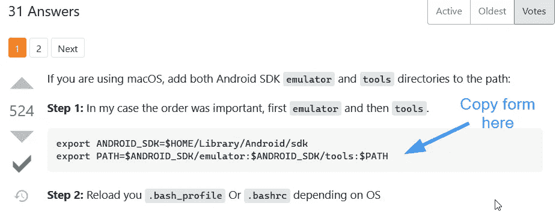

# CTF 报道:斯塔科弗洛

> 原文：<https://infosecwriteups.com/ctf-write-up-stackoverflow-e7146b8221c2?source=collection_archive---------4----------------------->

*   ctf-mystiko.com 有 CTF 挑战赛。
*   挑战名称:StackOverflow
*   类别:网络

— — —

我根据我从这篇文章中学到的东西创造了这个挑战(所有这些都归功于他！):

```
https://www.wizer-training.com/blog/copy-paste
```

当我们访问挑战描述中指示的页面时:

> [http://173.212.221.197:34024/overflow.html](http://173.212.221.197:34024/overflow.html)

我们看到一个典型的堆栈溢出页面，充满了信息。

这个挑战的重点是强调网站如何使用 javascript 在你的剪贴板上放置不同于你认为你复制的内容。这里就不赘述了，因为我只是修改了上面提到的帖子的作者所展示的内容。

像我们在 stackoverflow 上做的一样，从投票最多的答案中复制并粘贴代码:



我们看到粘贴了其他内容(我们可以从代码框中复制任意多或任意少的字符):

> 使用源，卢克。你要找的在这里:Th3F74g1$H3rE.fL4G

不出所料，旗帜就在这里:

【http://173.212.221.197:34024/Th3F74g1$H3rE.fL4G 号