# CTF 报道:空艾哈迈达巴德 2019 年 8 月 CTF

> 原文：<https://infosecwriteups.com/ctf-writeup-null-ahmedabad-august-2019-ctf-d468b3ceb281?source=collection_archive---------0----------------------->

大家好，欢迎来到在 [**空艾哈迈达**](https://null.co.in/chapters/17-ahmedabad) 举行的 CTF 演练，我们是 [**空艾哈迈达**](https://null.co.in/) 分会——印度最大的开放安全社区。

让我们开始第一个挑战。标志格式为 **nullctf{xxxxx}**

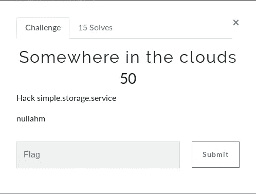

挑战题目说“云中的某个地方”，应该和云计算有关。描述说“简单。存储。服务”和 nullahm。

简单的谷歌搜索就会发现我们正在谈论 AWS cloud 的 [s3 服务。](https://docs.aws.amazon.com/AmazonS3/latest/dev/Welcome.html)

现在 s3 服务因其配置在黑客中非常有名。一辆 s3 斗式 URI 看起来像这样

**https://<bucket _ name>. S3 . Amazon AWS . com**

既然我们有“nullahm ”,让我们试着浏览一下[https://nullahm.s3.amazonaws.com](https://nullahm.s3.amazonaws.com)

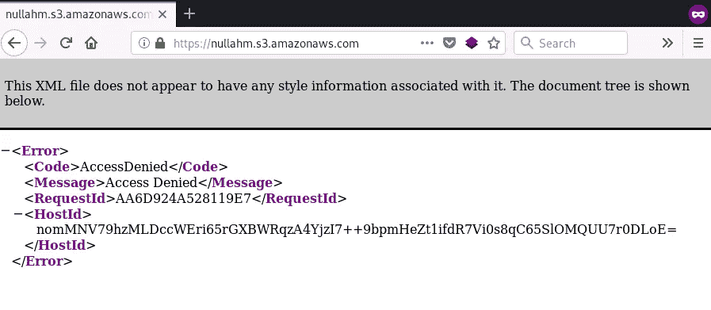

好消息是名为“nullahm”的 bucket 存在，坏消息是我们被拒绝访问。

事情可能有两种方式，要么我们在这里做一些暴力，要么设置 AWS CLI 并尝试列出文件和文件夹。

**尝试 1:【home.html】尝试明显的路径(automate)比如/index /index.html /home/**

哦！看来我们对 index.html 有所了解

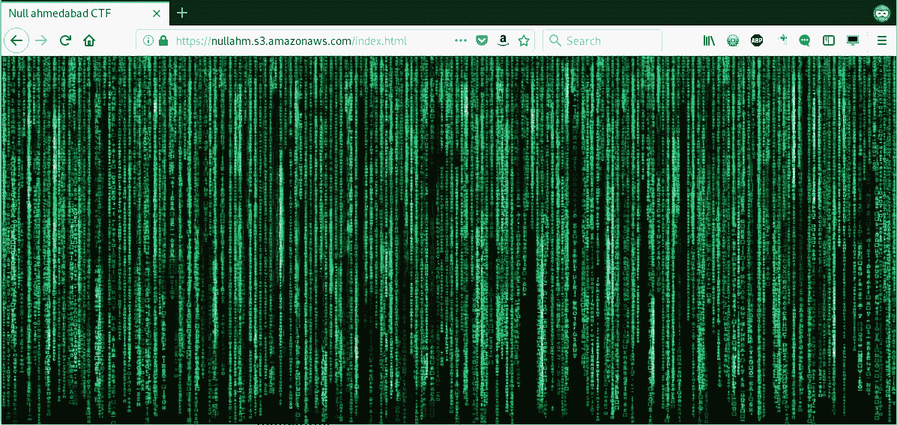

让我们试着查看这个页面的源代码。

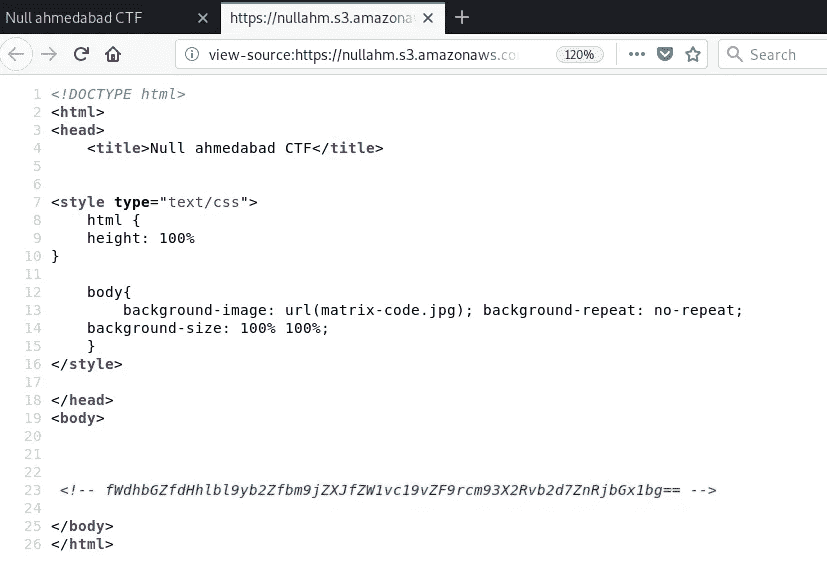

在 html 注释中，我们得到了一个类似 base64 编码的字符串。

解码后，我们得到了一个字符串，但它仍然不像一个标志。


哦，但是等等！如果我们把它倒过来读，它是有意义的，让我们把绳子倒过来，看看我们得到了第一面旗帜。

**nullctf { good _ work _ do _ some _ recon _ for _ next _ flag }**

好了，这很简单，让我们开始第二个挑战吧。

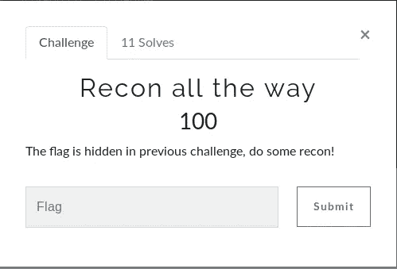

第二个挑战是在同一个 s3 桶上进行侦察，现在当我们被要求在一个 web 应用程序上进行侦察时，我们必须浏览 **robots.txt** 文件。

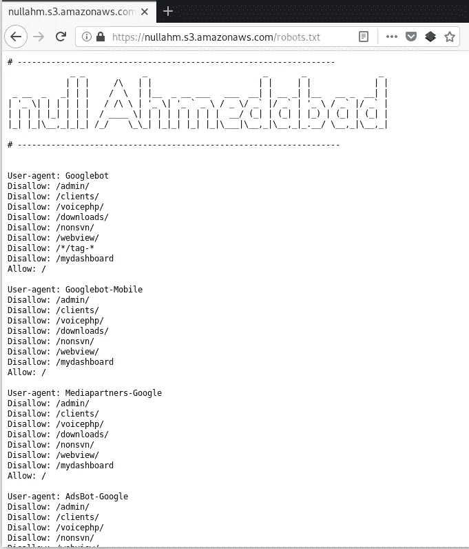

这个文件中有很多东西，为了使它更快，更明智的做法是从列表中创建一个字典，然后用蛮力。

或者，如果你仔细看，有一个可疑的端点！

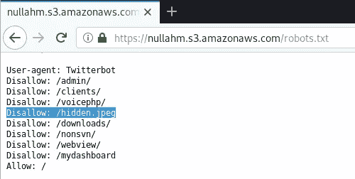

让我们打开它。

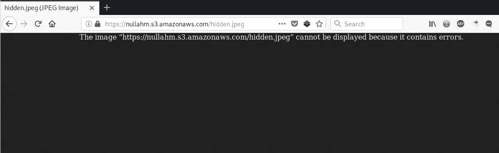

看起来图像坏了，一条建议:无论何时玩 CTF，不要停在这里，试着下载图像，看看它是否有什么有趣的东西。

运行命令:**文件 hidden.jpeg**

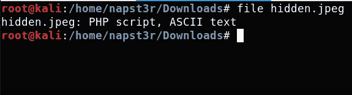

因为它是一个 PHP 脚本，用你最喜欢的文本编辑器打开它，我的是[sublime text](https://www.sublimetext.com/)；)


哦！wordpress 实例的 db-config 文件中有数据库凭证在等着我们。但是在我们开始之前，如果我们已经找到了这个文件，那么这个文件中必须有一个标志。让我们仔细看看。

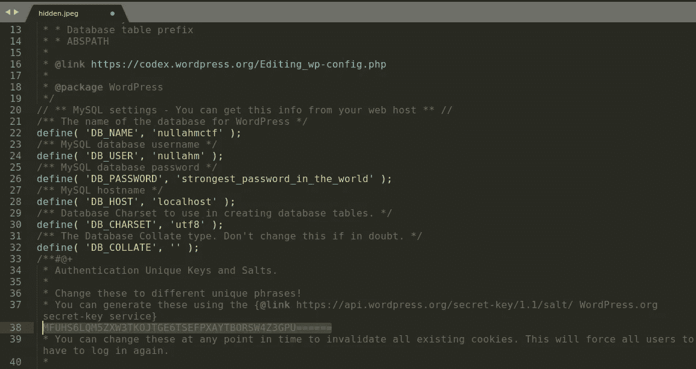

在注释部分高亮显示的文本看起来很奇怪。是 base64 吗？

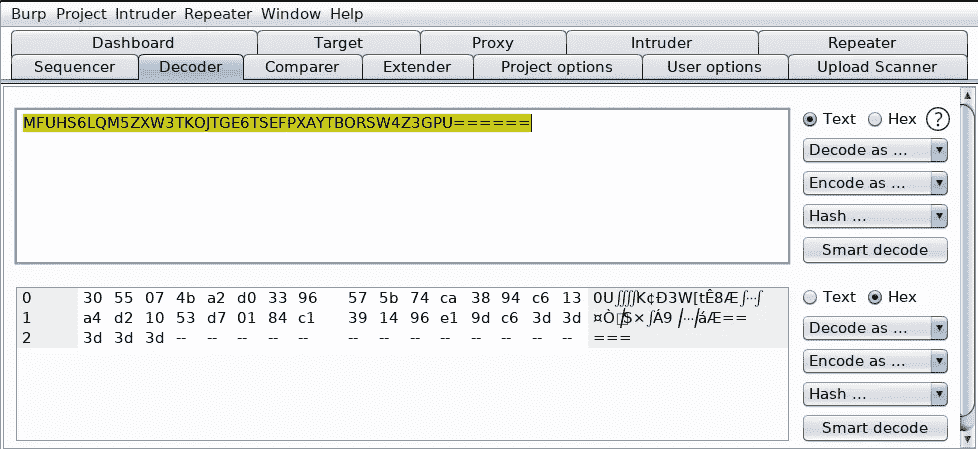

这次不行！！

哦，等等，它没有小字母，可能是 base32，让我们试一试。

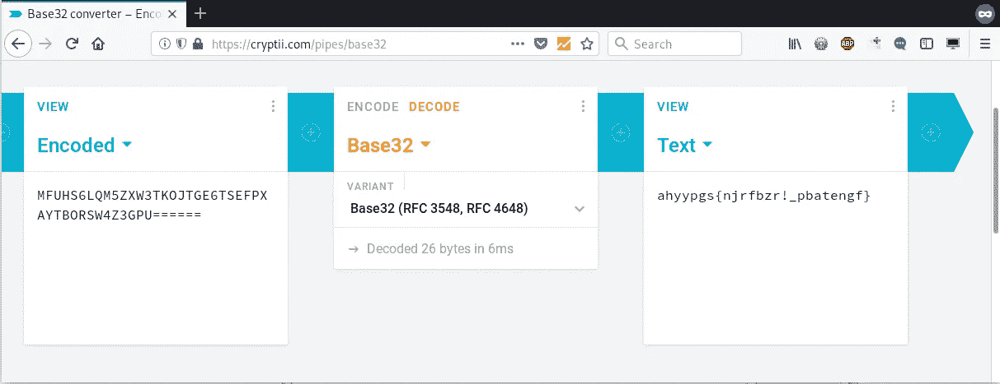

我们已经成功解码了 base32 字符串，但它仍然不是我们想要的格式。记得吗？ **nullctf{XXX}**

还有一个编码应用了 ROT13。

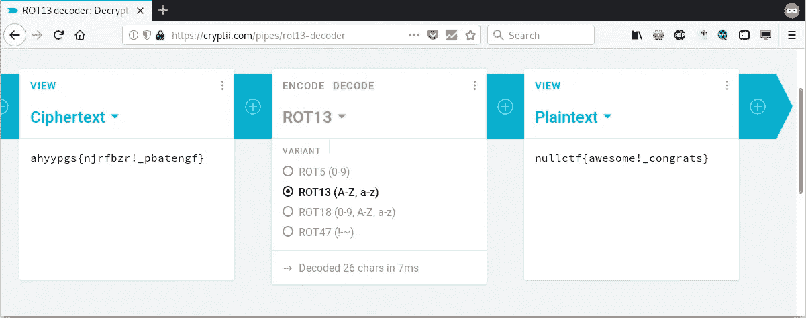

这是我们的第二面旗帜！

**nullctf {牛逼！_ 恭喜}**

现在是第三面也是最后一面旗帜的时候了！

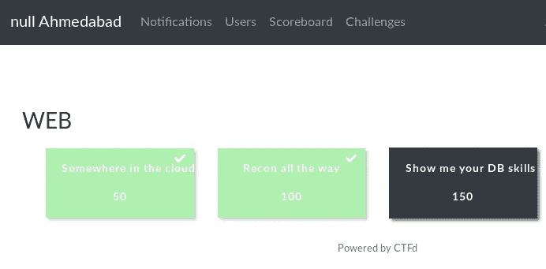

**挑战 3！**

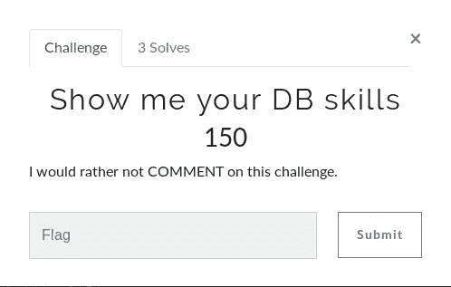

它说“让我看看你的数据库技能”，这是与数据库有关的东西。嗯，哦，有道理，我们从第二次挑战中得到了 DB 证书。

为了确认这一点，让我们对托管 CTF 的主机运行一次快速 NMAP 扫描。


NMAP 结果显示 mysql 服务正在主机上运行，并且我们有来自“hidden.jpeg”的 DB 凭证

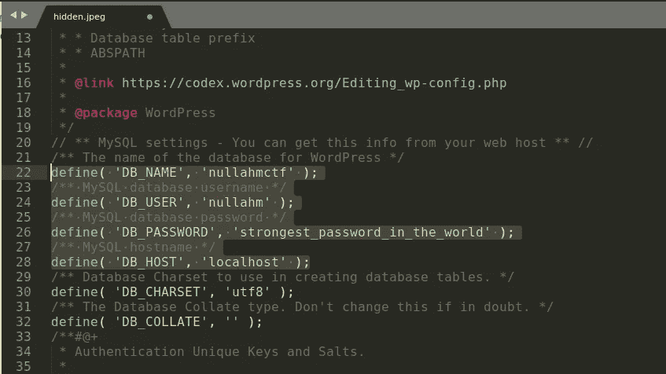

让我们用下面的命令连接到 MYSQL 服务

**mysql -u nullahm -h <主机> -p**

我们进去了。

**第三次挑战(方法 1):**

让我们转到有趣的部分

**显示数据库；**

我们有 nullahmctf

**使用 nullahmctf**

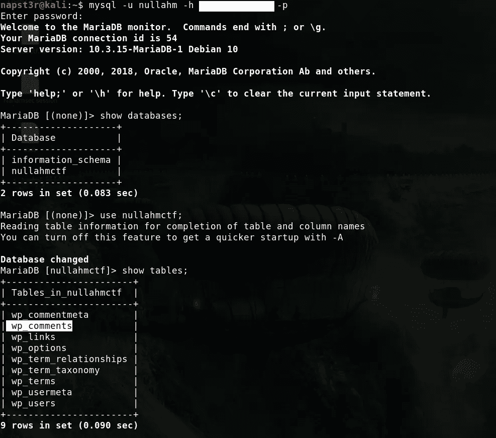

**显示表格；**

为了查看当前数据库中的所有表，现在“wp_comments”表应该引起我们的注意，因为挑战说“我宁愿不评论这个挑战”。

让我们全选。

**select * from WP _ comments；**

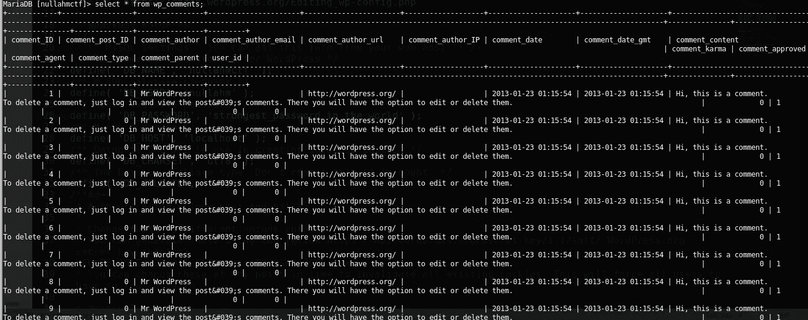

有很多重复的行，有什么更快的方法呢？

我们来看看 wordpress 的“wp_comments”表的结构。

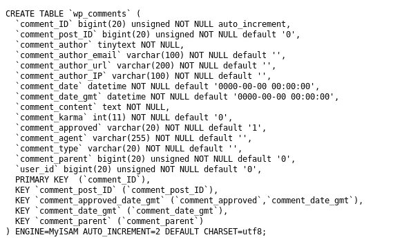

评论的主要内容存储在 **comment_content** 栏中。

但是现在呢？

你记得我们的标志格式是 **nullctf{XXX}**

让我们运行一个快速的 like 查询。

**select * from WP _ comment where comment _ content like“% nullctf %”；**

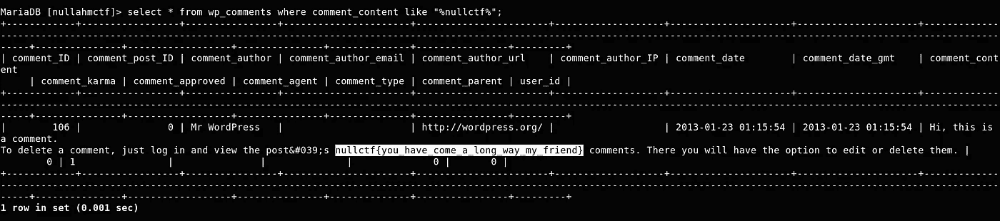

这是我们的第三面也是最后一面旗帜！

```
**nullctf{you_have_come_a_long_way_my_friend}**
```

**第三次挑战(方法 2):**

从整个数据库转储中获取标志格式。

```
**mysqldump -h <host_name> -u nullahm -p nullahmctf | grep -oh "nullctf{\w*}"**
```

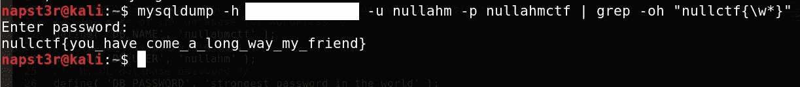

要获得更多此类能力建设和实践练习，请参加空艾哈迈达巴德会议和研讨会！

呀！！我忘记关闭自动气象站服务了。我得走了，再见。

# 让我们连接:

[推特](https://twitter.com/nullahm)

[脸书](https://facebook.com/nullahmofficial)

[网站](https://null.co.in/chapters/17-ahmedabad)