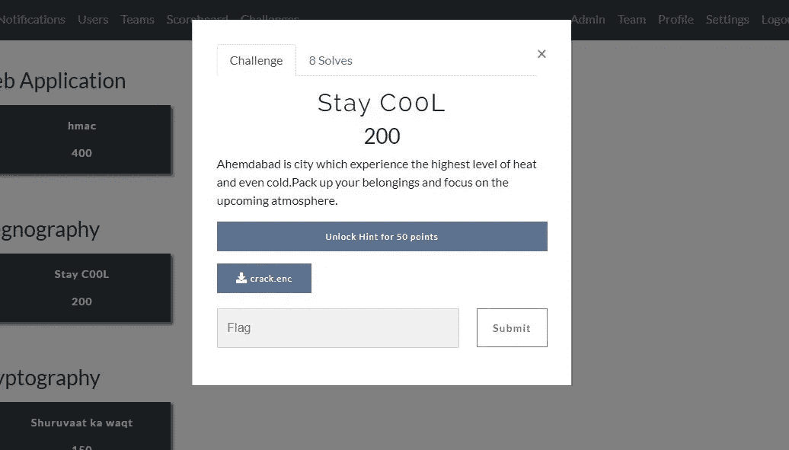
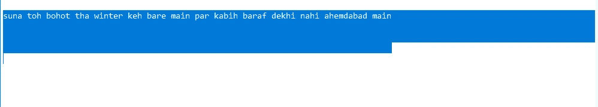
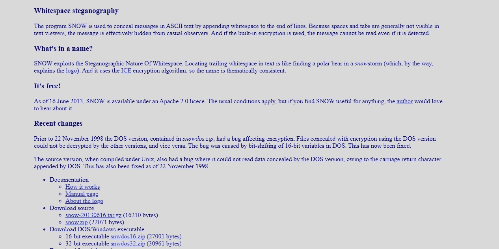
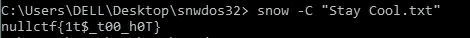

# CTF-书面报告无效月度会议 22/09/2019

> 原文：<https://infosecwriteups.com/ctf-writeup-null-monthly-meet-22-09-2019-46c240c96fc6?source=collection_archive---------1----------------------->

> **隐写术**

欢迎来到隐写术的挑战。给出的文本主要是基于氛围相关的。让我们下载挑战中提供的文件。

隐写术挑战的主要概念是隐藏文本。因此，下载文件后，让我们通过将文件转换为。txt 扩展名。

转换文件后。

我们观察到其中提供了一个文本。在根据文本进行分析后，因为这些词暗示“baraf dekhi nahi ”,我们可以得到一个罢工，可能有一些没有见过的文本。让我们选择文件中的所有文本，我们发现其中有一些空白。

象征着有些文字看不见但确实存在。该挑战基于白色隐写术。

通过搜索，我们发现只有一种方法可以做到这一点，那就是“空白隐写术”。

浏览完文档后，让我们下载根据笔记本电脑配置提供的可执行文件。

在那里找到了工具名称“雪”的文档。让我们使用文档中提供的命令指令来执行该工具。

宾果，在执行解密命令后，我们得到了解密文件的标志。

> **nullctf{1t$_t00_h0T}**

*关注* [*Infosec 报道*](https://medium.com/bugbountywriteup) *获取更多此类精彩报道。*

 [## 信息安全报道

### 收集了世界上最好的黑客的文章，主题从 bug 奖金和 CTF 到 vulnhub…

medium.com](https://medium.com/bugbountywriteup) 

[点击此处](https://www.buymeacoffee.com/Viston)