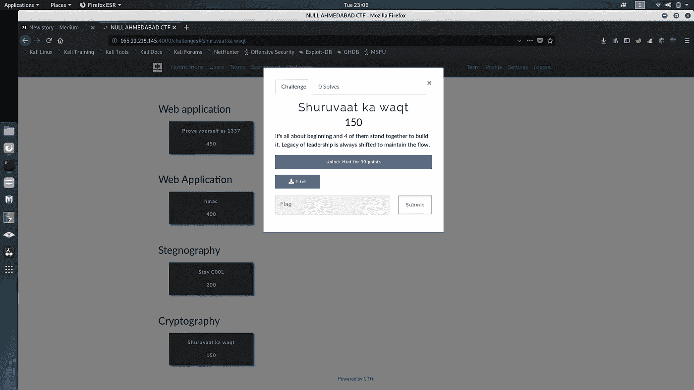
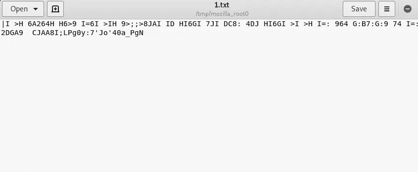
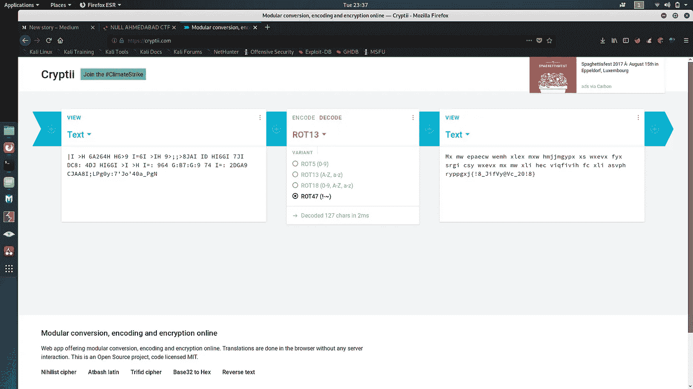
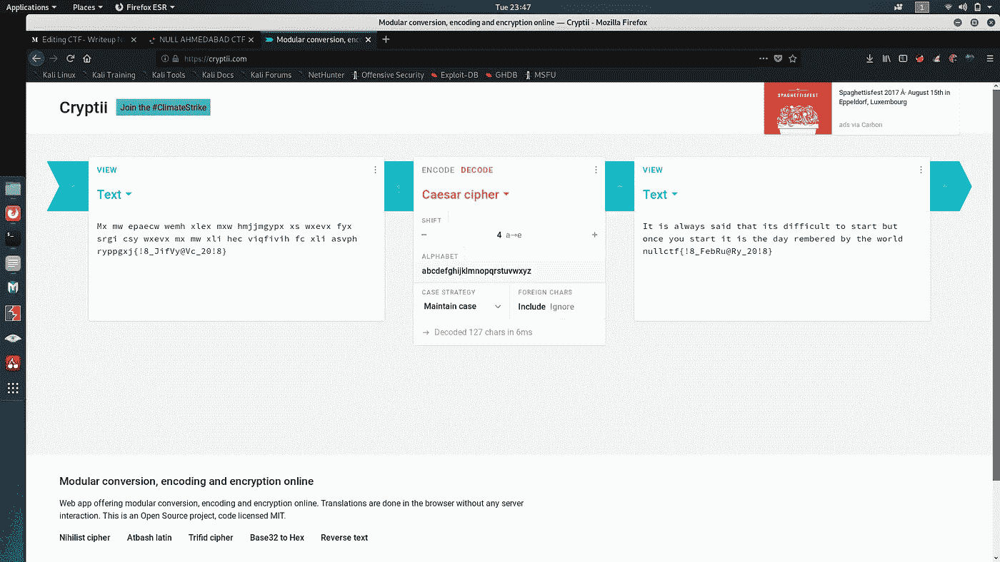

# CTF-书面报告无效月度会议 22/09/2019

> 原文：<https://infosecwriteups.com/ctf-writeup-null-monthly-meet-22-09-2019-e1ff27c63135?source=collection_archive---------0----------------------->

> **密码术**

因此，正如挑战名称所暗示的那样，Shuruvat Ka Waqt 可能会给你一个暗示，即挑战是基于开始的时间/日期。

让我们尝试下载提供的文件。

所以我们发现了一些写在。txt 文件。让我们尝试用所有可能的解密技术来解码给定的文本。我建议在 https://cryptii.com/的[上尝试解密，因为这可能会让你更接近旗帜](https://cryptii.com/)

在尝试了多种解密方法后，我们发现给定的文本可以被 ROT47 解密

解密后，我们找到了给定的文本

> **Mx MW EPA ecw wemh xlex mxw hmjjmgypx xs wxevx fyx srgi csy wxevx Mx MW xli HEC viqfivih fc xli asvph rypgxj {！8_JifVy@Vc_20！8}**

所以看完解密的文本后，我们发现我们离国旗只有几步之遥。

让我们更深入地挖掘，找到解密文本的第二种方法。让我们不要想得太多，保持简单。让我们尝试用凯撒密码，但我们需要再次尝试热和错误的方法，它可能有多少移位。

如果想采取简单的方法，想想开始空的一个章节的章节头的数量，其中“4”，所以让我们保持移位 4，看看被解密的消息。

> 人们总是说开始是困难的，但是一旦你开始了，这一天就会被世人铭记。8 _ 2 月@Ry_20！8}

酷！

我们发现了一面旗帜和一条鼓舞人心的信息。

*关注* [*Infosec 报道*](https://medium.com/bugbountywriteup) *获取更多此类精彩报道。*

 [## 信息安全报道

### 收集了世界上最好的黑客的文章，主题从 bug 奖金和 CTF 到 vulnhub…

medium.com](https://medium.com/bugbountywriteup) 

[点击这里](https://www.buymeacoffee.com/Viston)