# CTF 报道:卡巴斯基 CTF 的 PHP 对象注入

> 原文：<https://infosecwriteups.com/ctf-writeup-php-object-injection-in-kaspersky-ctf-28a68805610d?source=collection_archive---------0----------------------->

这是卡巴斯基实验室组织的卡巴斯基工业 the PHP 对象注入挑战赛的演练。

在这个挑战中，有一个表单根据用户提供的输入执行算术运算。

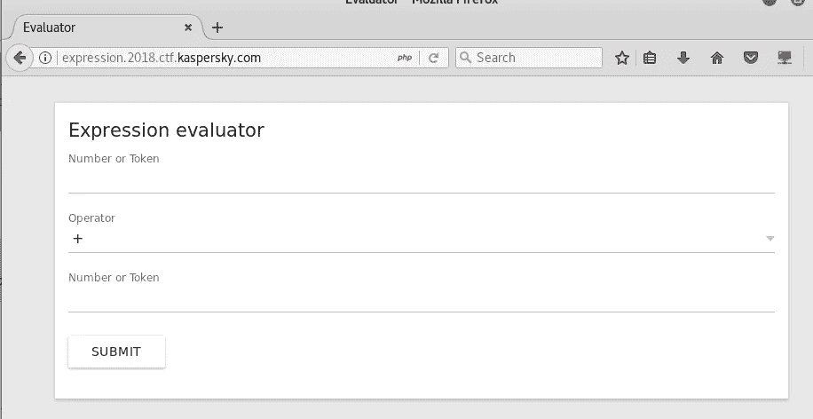

让我们首先执行正常的用例。我分别在第一个和第二个文本框中输入了 2 和 3。

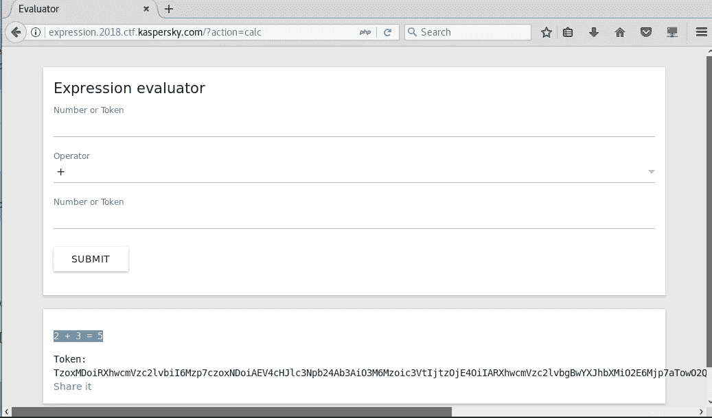

正如我们所看到的，我们得到了表达式 2 + 3 = 5 的结果。

简单明了，但有一件事引起了我的注意，那就是“令牌”。让我们试着点击“分享”按钮。

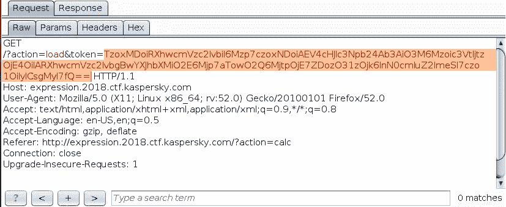

它发出一个带有“token”参数的 GET 请求。让我们看看回应。

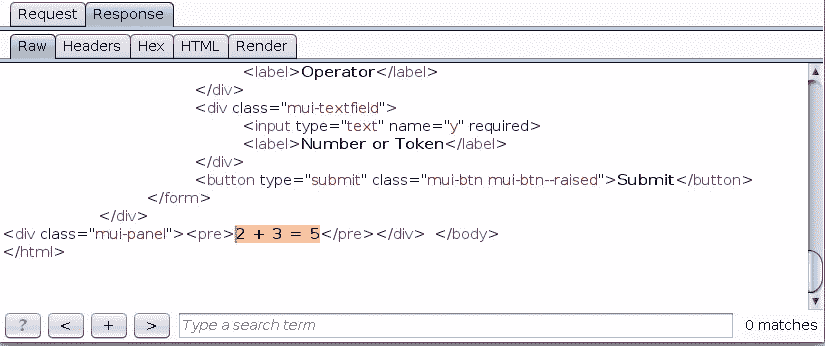

它与我们之前计算的 2 + 3 = 5 有相同的表达式。

在将令牌解码为 **base64** 之后，我得到了一个序列化的 PHP 对象。

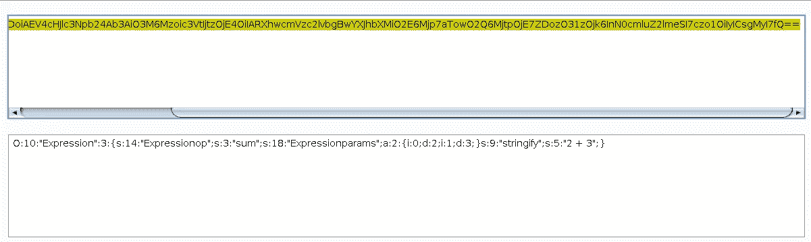

正如我们看到的，我们有一个 SUM 函数，参数(数组)是 2 和 3。现在网上有很多关于 PHP 对象注入的内容。我几乎都看完了。尽管你可以看着它。

 [## PHP 对象注入

### PHP 对象注入是一个应用程序级别的漏洞，可能允许攻击者执行不同种类的…

www.owasp.org](https://www.owasp.org/index.php/PHP_Object_Injection)  [## PHP 对象注入和序列化漏洞- Mukarram Khalid

### PHP 对象注入和序列化漏洞 PHP 对象注入漏洞很难被利用…

mukarramkhalid.com](https://mukarramkhalid.com/php-object-injection-serialization/)  [## 理解 PHP 对象注入

### PHP 对象注入不是一个很常见的漏洞，它可能很难被利用，但也可能真的…

安全咖啡. ro](https://securitycafe.ro/2015/01/05/understanding-php-object-injection/) 

现在我做了很多尝试和错误，为了这篇文章的长度，我没有把它们都放在这里。

让我们看看我们的序列化对象

o:10:“Expression”:3:{ s:14:“Expression op”； **s:3:《和》**；s:18:“expression params”；答:2:**{ I:0；d:2；I:1；d:3；}** s:9:“纤弱”；s:5:“2+3”；}

您可以玩这个序列化的对象，看看它的行为。

我怀疑**“sum”**是一个用户定义的函数，而**“expression params”**是一个数组，其第一个值为 **2** ，第二个值为 **3** 。

你可以调用任何 PHP 函数来代替 **sum** 函数。

我把 **sum** 函数改成了 [**system()**](http://php.net/manual/en/function.system.php) 这是一个 PHP 函数，执行给定的`**command**`并输出结果。

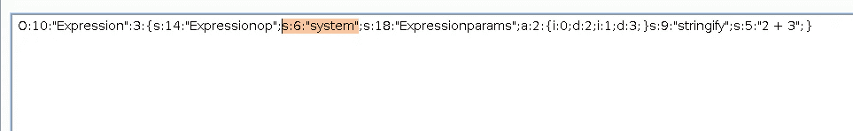

o:10:“Expression”:3:{ s:14:“Expression op”； **s:6:《系统》**；s:18:“expression params”；a:2:{ I:0；d:2；I:1；d:3；} s:9:“stringify”；s:5:“2+3”；}

请记住，我们需要将字符串的长度从 **3** 更新为 **6** 。因为我们函数名的长度是 **6** ( **系统**)。

学生 3:“总和”

学生 6:“系统”

**然后用 BASE64 再次编码**

让我们用新的有效载荷发送请求。

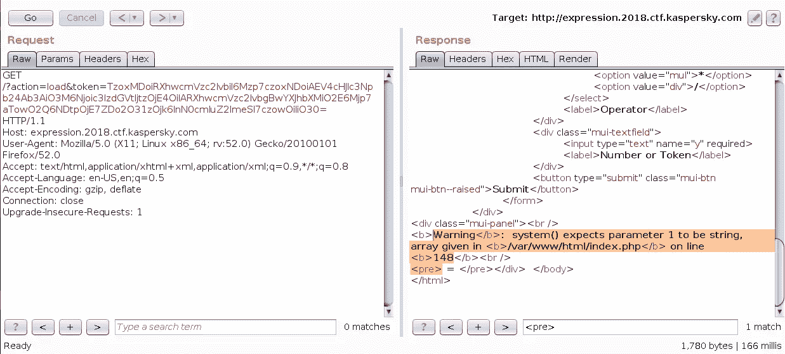

酷！！我们是对的，我们可以在这个序列化的对象中传递任何 PHP 函数，唯一剩下的就是以正确的格式给出参数。sum 有数组作为参数，我们需要 string 作为我们的**系统**函数的参数。

我替换了**a:2:{ I:0；d:2；I:1；d:3；}** (数组)

随着

**s:2:"ls"** (字符串)

让我们试着运行 **LS** 命令。

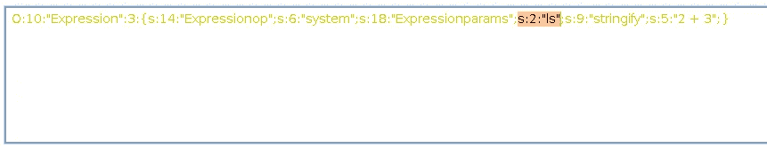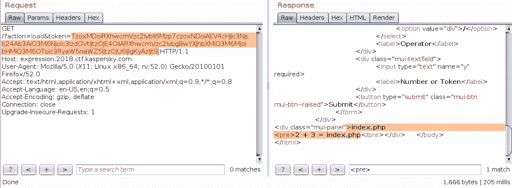

答对了。！

我们面前的最后一项任务是找到旗子，这并不太难。

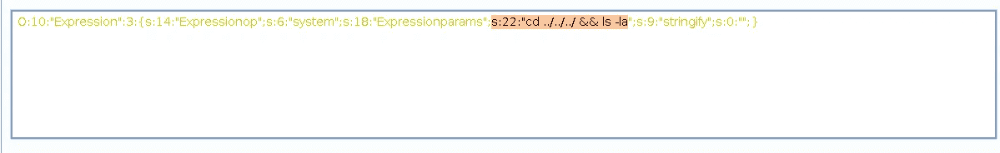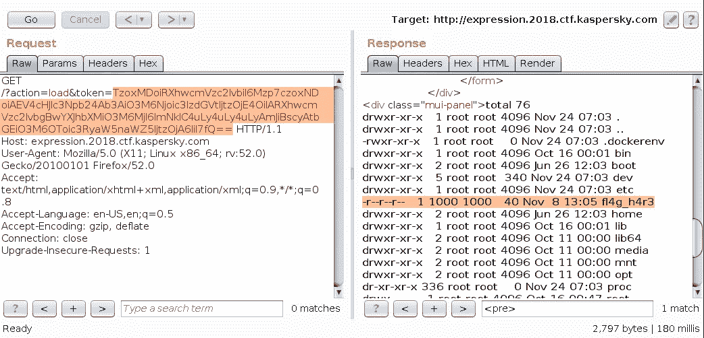

让我们打开 **fl4g_h4r3** 文件。

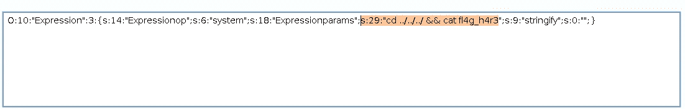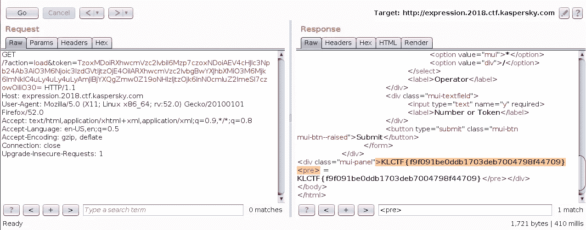

最后我们拿到了旗子。感谢阅读。

#分享伤疤

让我们在推特上连线