# 卷曲书写工具盒

> 原文：<https://infosecwriteups.com/curling-write-up-hackthebox-5fa9491b6239?source=collection_archive---------0----------------------->

这是一篇关于 Hack The Box 平台上最近退役的卷发器的文章。如果你还不知道，Hack The Box 是一个网站，你可以通过侵入一系列不同的机器来进一步提高你的网络安全知识。

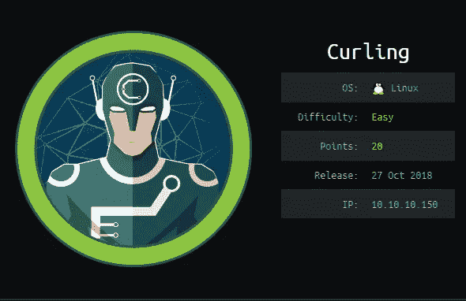

Curling 的名字可能是由创建者给出的，因为它使用 curl 对本地文件发出 GET 请求。Curling 是一个使用 Joomla 的博客网站，Joomla 是一个免费的开源内容管理系统(CMS)。这个盒子非常有趣和简单，不需要很多枚举，也不太像 CTF。我们从

*nmap -sC -sV 10.10.10.150*

```
Nmap scan report for 10.10.10.150
Host is up (0.20s latency).
Not shown: 998 closed ports
PORT   STATE SERVICE VERSION
22/tcp open  ssh     OpenSSH 7.6p1 Ubuntu 4 (Ubuntu Linux; protocol 2.0)
| ssh-hostkey: 
|   2048 8a:d1:69:b4:90:20:3e:a7:b6:54:01:eb:68:30:3a:ca (RSA)
|   256 9f:0b:c2:b2:0b:ad:8f:a1:4e:0b:f6:33:79:ef:fb:43 (ECDSA)
|_  256 c1:2a:35:44:30:0c:5b:56:6a:3f:a5:cc:64:66:d9:a9 (ED25519)
80/tcp open  http    Apache httpd 2.4.29 ((Ubuntu))
|_http-generator: Joomla! - Open Source Content Management
|_http-server-header: Apache/2.4.29 (Ubuntu)
|_http-title: Home
Service Info: OS: Linux; CPE: cpe:/o:linux:linux_kernel
```

端口 80 是开放的，在浏览器中查看网站会将我们带到冰壶网站。有 3 篇博文和一个登录表单。由于我们到目前为止没有任何凭证，我们可以尝试一些通用的用户名和密码组合，这并不能让我们避免走进死胡同，我们枚举目录。

网页看起来像这样，我们可以在 2018 年冰壶的第一个帖子下面看到一件有趣的事情！博客帖子。我们有一个似乎是用户名的帖子==> **FLORIS**

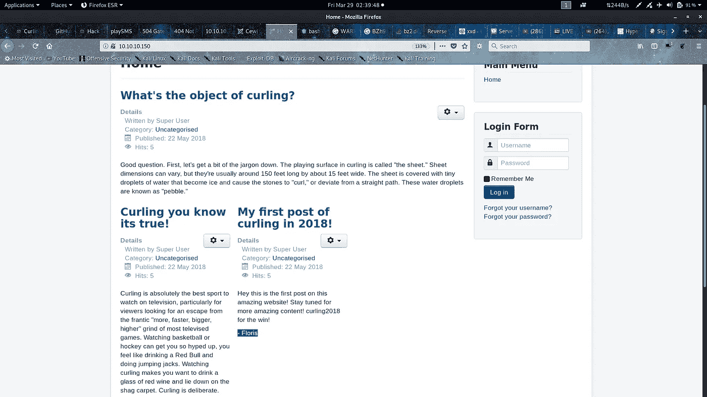

从我们枚举目录的结果中，我们看到有/administrator 页面。

在进入那个页面之前，我们看到了 10.10.10.150 的源页面，希望从中找到一些东西。

唉！！！我们在这一页的末尾有一个秘密。

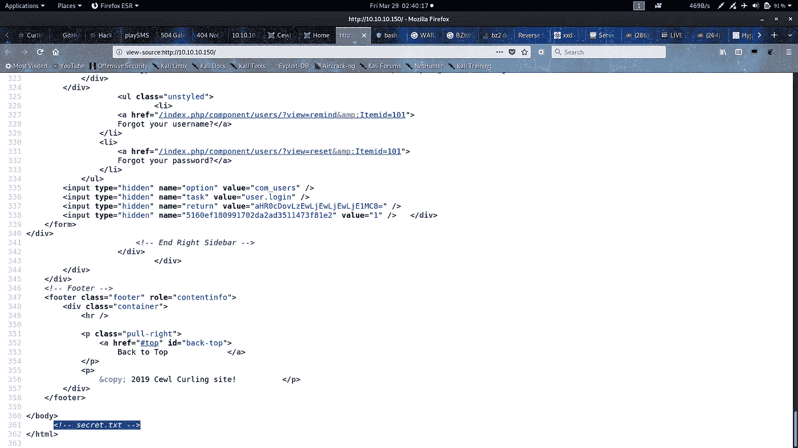

转到 10.10.10.150/secret.txt，我们看到了一个 base64 编码的字符串解码，它给出了 **Curling2018！。**现在我们有了一对凭据，可以在/administrator 页面上尝试使用。

使用芙罗莉丝作为用户名和 Curling2018！作为密码，我们成功进入管理控制面板。

有很多事情试图让我们的代码执行，并得到一个外壳许多方式导致一个兔子洞。我尝试的第一件事是去/media，并试图通过在 Burpsuite 中将它重命名为 something.php.png 来上传一个包含 php 代码的 png，这给出了一个错误"*你试图上传不安全的文件*"你可以在 Ippsec 的爆米花 [**视频**](https://www.youtube.com/watch?v=NMGsnPSm8iw) 中检查这个方法。我尝试的下一件事是在 Install Extensions 下，我安装了一个简单的文件上传扩展，这是我从这个[](https://extensions.joomla.org/extension/simple-file-upload/)****站点找到的，在更改了所有规则后，我尝试上传一个 php 脚本，让我上传一个 php 脚本，但又是一个死胡同，一些内部 Joomla 函数阻止了任何类型的 php 脚本上传。****

****然后经过一点谷歌和研究，我发现模板可以用 php 编写，并可以执行。因此，在模板/样式下，我将 beez3 设为默认，在模板部分，我找到了网站使用的所有 php 脚本，它们都是可编辑的！！！！****

****我从 [**git-hub**](https://github.com/pentestmonkey/php-reverse-shell) 抓取了 php-reverse-shell 脚本。粘贴在 index.php 改变了 ip 参数放在我的 ip 和我的终端我监听端口 1234。我保存了 php 文件。****

****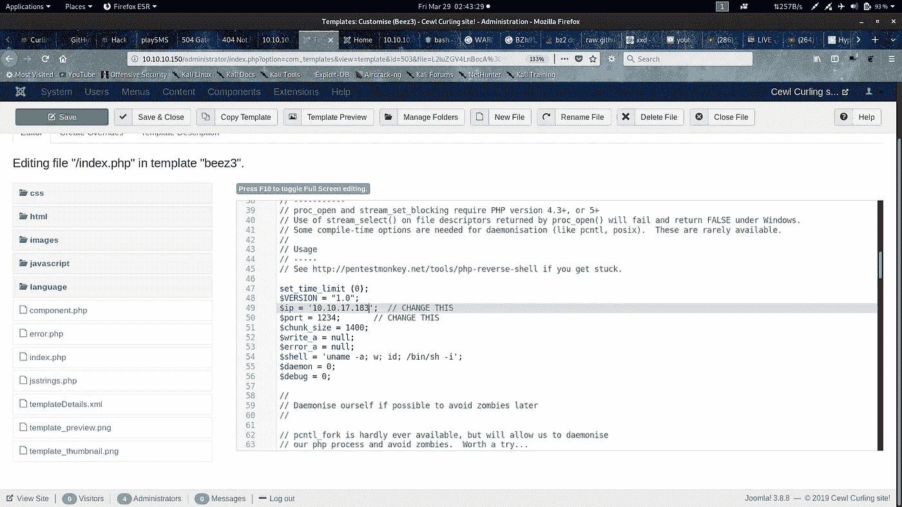****

****我通过访问[http://10 . 10 . 10 . 150/index . PHP](http://10.10.10.150/index.php)来执行这个脚本，然后我立刻通过 netcat 在我的终端上有了一个 shell，这仍然是一个基本的反向 shell。****

****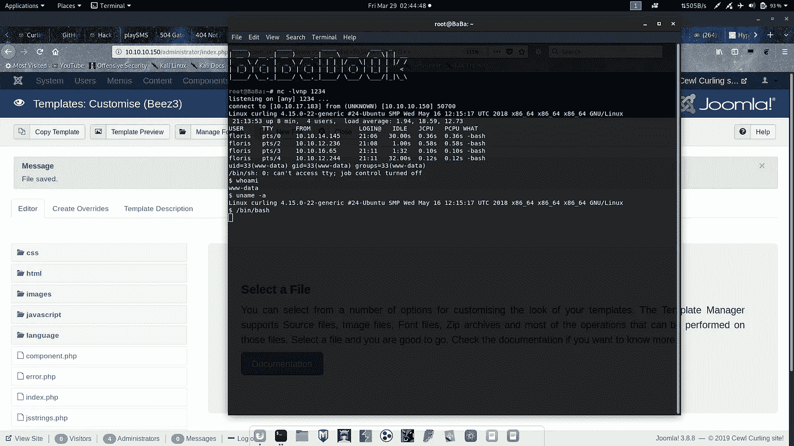****

****因为这不是一个完全成熟的 shell，我仍然是 www-data，我不能读取 user.txt，但是在/home/floris 中，我找到了 1 个目录管理区和 2 个名为 password_backup 和 user.txt 的文件，在这些文件上运行 cat 给了我这个****

****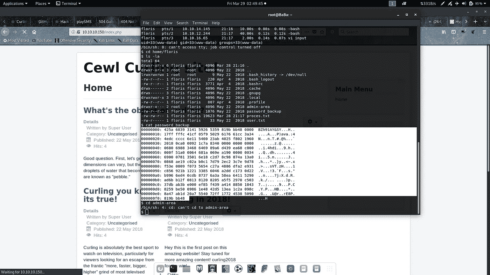****

****我将十六进制转储复制到我的机器上，初始字节看起来很相似，它们是 bzip2 压缩的。所以我想这一定是一个简单的获得密码的解压挑战。我对这个文件做了如下的反复解压:(更多[点击](https://www.akashtrehan.com/writeups/OverTheWire/Bandit/level12/))****

****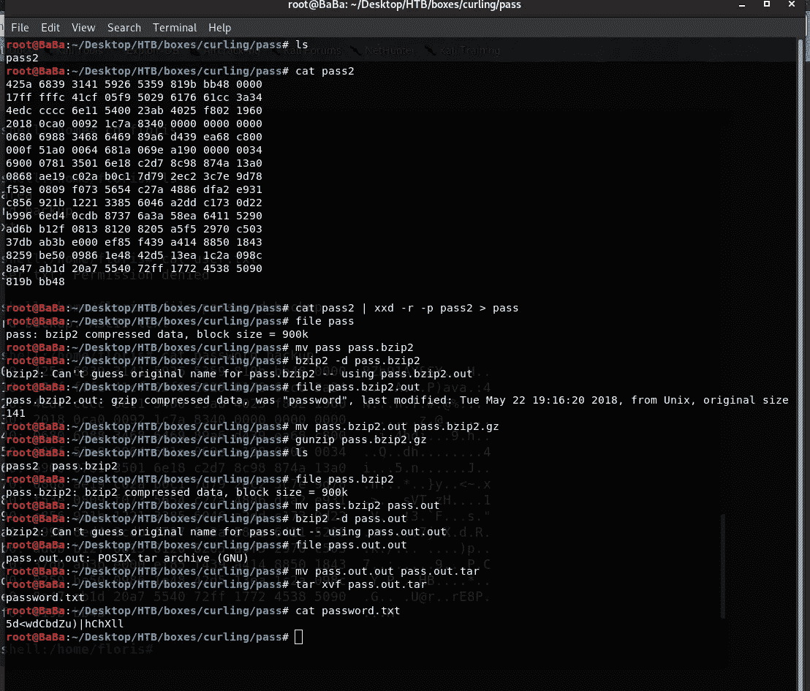****

****最后我们有了 password.txt，它给了我们密码 **5d < wdCbdZu)|hChXll** 使用 floris 作为用户名，我们可以成功地使用 ssh 进入机器，并可以获得用户标志。****

****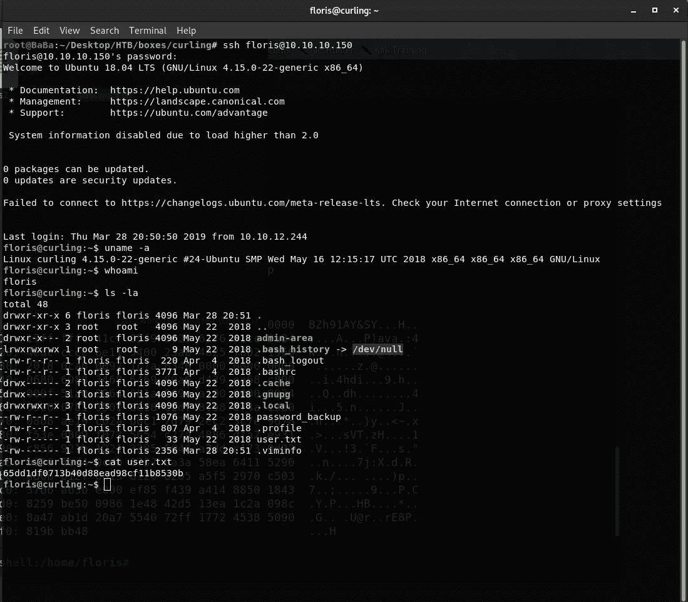****

****现在，在根目录下，我们在/home/floris 中有一个管理区目录。这个管理区包含 2 个文件输入和报告，文件内容是:****

****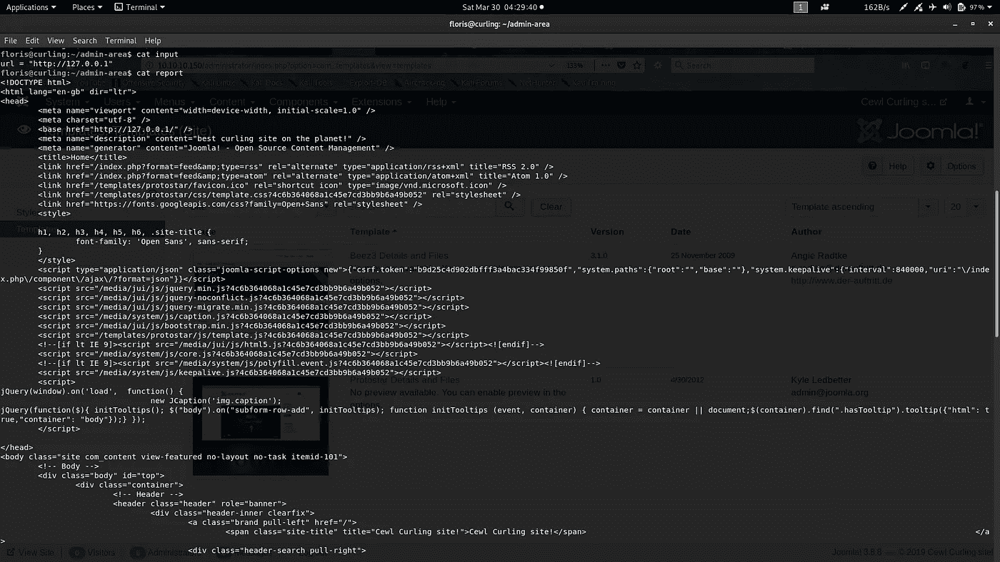****

****这看起来像是输入是对某个过程的输入，而报告是执行和显示某个过程的结果。为了正确了解这个过程，我在输入 url 中输入了我的 ip 和一个端口，并使用 netcat 监听那个端口。****

****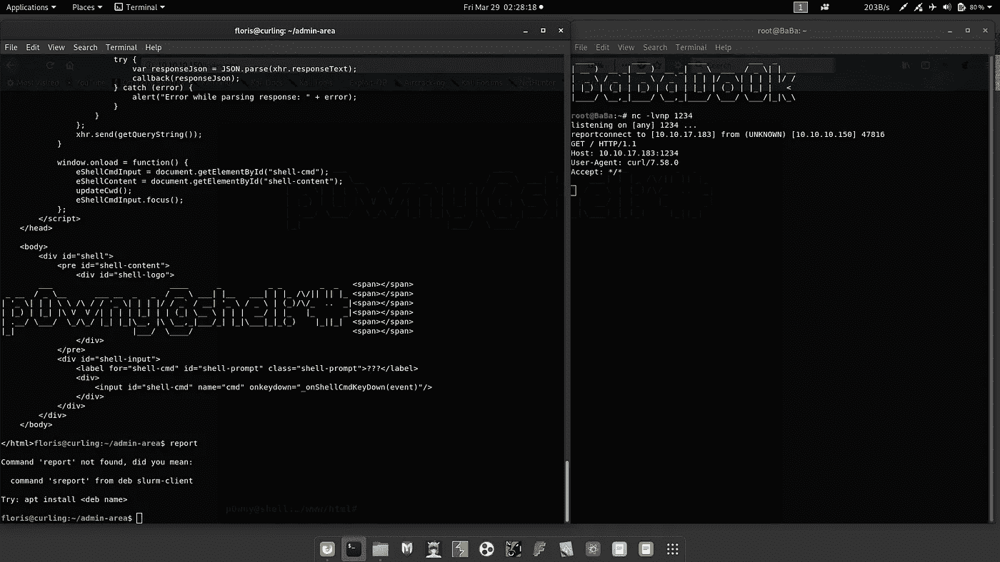****

****在我的终端中，我可以看到 user-Agent 为 **curl/7.58.0** ，所以 curl 正在执行这个 GET 请求。我看到 curl 是用 floris 特权运行的(ps -elf| grep curl ),在阅读了 curl 手册页和一些 googling 搜索之后，我得出结论，curl 也可以获得本地文件。我在我的机器上作为根组中的本地用户使用如下命令进行了尝试****

```
**curl file:///etc/shadow**
```

****我甚至可以通过运行 curl 而不是 root 来成功地得到结果。所以在我的小实验之后，我将输入文件编辑为***URL = " file:///root/root . txt "***，当我看到报告文件的内容时，我正盯着根标志。扎根！！！！****

****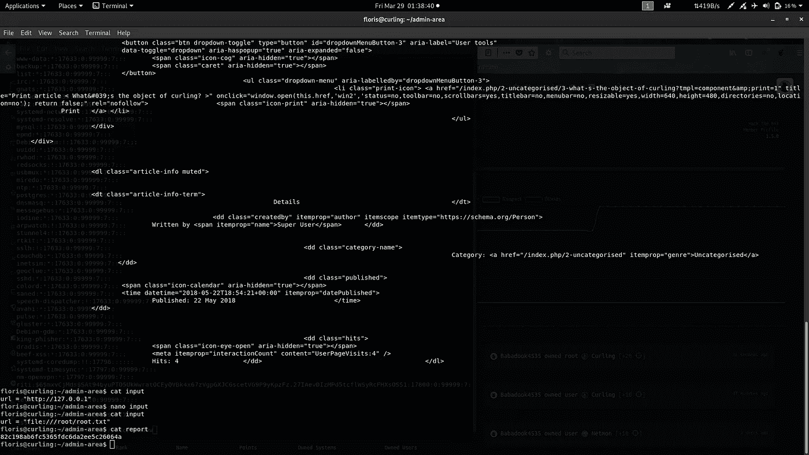****

****根标志****

****如果你找到了一种无需输入或报告文件就能直接获得根 shell 的方法，请在下面的评论中与我分享。我知道我本来可以把 url 替换成“file:///etc/shadow”，抢到 root 密码。如果还有其他方法，请告诉我。****

****如果你喜欢这个内容，请鼓掌…****

*****关注* [*Infosec 报道*](https://medium.com/bugbountywriteup) *获取更多此类精彩报道。*****

****[](https://medium.com/bugbountywriteup) [## 信息安全报道

### 收集了世界上最好的黑客的文章，主题从 bug 奖金和 CTF 到 vulnhub…

medium.com](https://medium.com/bugbountywriteup)****